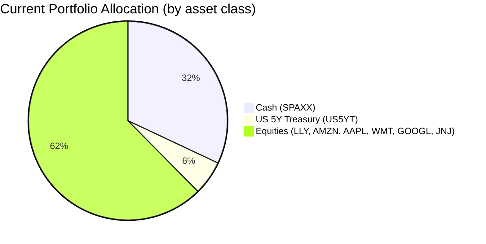
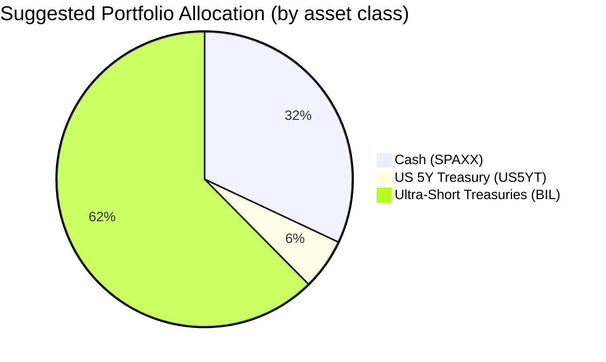

Portfolio Health Review for Emma Thompson
=========================================

# Summary
Your current portfolio is heavily weighted toward individual US large-cap equities (62.4%), which introduces significant single-stock risk and volatility—a mismatch with your capital preservation objective and low risk tolerance (Rating 1). The strength is a substantial cash buffer (32%) providing liquidity. Recommended action: sell all equity holdings and deploy the proceeds into ultra-short Treasury ETFs (BIL) to align the entire portfolio with risk‑level‑1 assets. Expected outcome: near‑complete principal stability, predictable yield (~4.6% p.a.), and elimination of equity market drawdown risk while maintaining adequate liquidity.

# Potential Client Needs

| Potential Needs | Investment Horizon | Remark |
| :--- | :--- | :--- |
| Capital preservation (primary) | Immediate to ongoing | Risk Rating 1 mandates minimal volatility; current equity exposure is incompatible. |
| Retirement income / distribution | Ongoing (lifetime) | Portfolio must generate steady, low‑risk cash flow to supplement pension. |
| Legacy / estate transfer | >25 years | Long term, the capital base should be preserved in real terms; low risk is acceptable for this horizon given the certainty of transfer. |

# Suggested Portfolio

| Asset | Current Market Value | Suggested Market Value | Current % | Suggested % | Change | Remark |
| :--- | :--- | :--- | :--- | :--- | :--- | :--- |
| Fidelity Government Cash Reserves (SPAXX) | $992,000 | $992,000 | 32.0% | 32.0% | 0% | Maintain 12‑month liquidity buffer |
| US 5‑Year Treasury Yield (US5YT=RR) | $173,260 | $173,260 | 5.6% | 5.6% | 0% | Hold; low‑risk fixed income position |
| Eli Lilly and Company (LLY) | $109,319 | $0 | 3.5% | 0% | -3.5% | Sell – single‑stock risk; move to risk‑1 asset |
| Amazon.com Inc. (AMZN) | $237,202 | $0 | 7.7% | 0% | -7.7% | Sell |
| Apple Inc. (AAPL) | $301,143 | $0 | 9.7% | 0% | -9.7% | Sell |
| Walmart Inc. (WMT) | $365,084 | $0 | 11.8% | 0% | -11.8% | Sell |
| Alphabet Inc. (GOOGL) | $429,025 | $0 | 13.8% | 0% | -13.8% | Sell |
| Johnson & Johnson (JNJ) | $492,967 | $0 | 15.9% | 0% | -15.9% | Sell |
| **SPDR Bloomberg 1‑3 Month T‑Bill ETF (BIL)** | $0 | $1,934,740 | 0% | 62.4% | +62.4% | New holding: ultra‑short Treasuries, risk rating 1, daily liquidity |
| **Total** | **$3,100,000** | **$3,100,000** | **100%** | **100%** | **0%** | |

### Pros and Cons of Suggested Portfolio

**Pros:**
- **Full alignment with risk tolerance:** Every holding is risk rating 1 (lowest), meeting the client’s capital preservation mandate.
- **Elimination of single‑stock risk:** All individual equity positions removed, removing concentration in US mega‑caps and sector exposure.
- **Stable predictable income:** BIL and SPAXX yield ~4.6% p.a. (based on 5‑year CAGR), providing steady cash flow.
- **High liquidity:** Both SPAXX (T+2) and BIL (daily traded) ensure the 12‑month emergency buffer is easily accessible.

**Cons:**
- **Lower expected return vs. current portfolio:** Equity holdings historically returned 10–15% p.a., whereas the suggested portfolio yields ~4.6%. This is justified by the client’s risk rating 1 and need for certainty.
- **Inflation erosion risk:** Over long horizons, ultra‑short yields may lag inflation; however, capital preservation takes priority over growth.
- **Opportunity cost in strong equity rallies:** In a bull market, the portfolio will underperform equity‑heavy alternatives.

### Alternative Suggested Products to Consider

| Product | Ticker | Risk Rating | Expected Return (5y CAGR) | Justification |
| :--- | :--- | :--- | :--- | :--- |
| iShares 0-3 Month Treasury Bond ETF | SGOV | 1 | 4.68% | Same risk profile as BIL; slightly higher yield and also daily liquidity. |
| iShares 0–1 Year Treasury Bond ETF | SHV | 1 | 4.60% | Alternative ultra‑short treasury ETF; provides similar safety and yield. |

# Scenario Analysis

Assumptions for expected returns are based on historical 5‑year CAGR from the product catalog (default) and adjusted per market outlook where noted.

### Normal Market Condition
- Equities (current portfolio): 10% annual return (consensus equity market outlook for 24‑month horizon).
- Cash (SPAXX): 3.56% (5‑year CAGR).
- US 5‑Year Treasury (US5YT): 4.0% (approximate current yield).
- Ultra‑short Treasuries (BIL): 4.60% (5‑year CAGR).

| Product | % Return | Current Holding $ | Current Return $ | Suggested Holding $ | Suggested Return $ |
| :--- | :--- | :--- | :--- | :--- | :--- |
| SPAXX | 3.56% | 992,000 | 35,315 | 992,000 | 35,315 |
| US5YT | 4.00% | 173,260 | 6,930 | 173,260 | 6,930 |
| LLY | 10.00% | 109,319 | 10,932 | 0 | 0 |
| AMZN | 10.00% | 237,202 | 23,720 | 0 | 0 |
| AAPL | 10.00% | 301,143 | 30,114 | 0 | 0 |
| WMT | 10.00% | 365,084 | 36,508 | 0 | 0 |
| GOOGL | 10.00% | 429,025 | 42,903 | 0 | 0 |
| JNJ | 10.00% | 492,967 | 49,297 | 0 | 0 |
| BIL | 4.60% | 0 | 0 | 1,934,740 | 88,998 |
| **Total** | | **3,100,000** | **235,719** | **3,100,000** | **131,243** |

- Annual return of current portfolio vs suggested: **7.60% vs 4.23%**
- Incremental benefit: current portfolio yields $104,476 more per year in normal conditions, but at substantially higher risk.

### Bullish / Upside Market Condition (Equities +20%)
- Equities rise 20%; bonds and cash unchanged.

| Product | % Return | Current Return $ | Suggested Return $ |
| :--- | :--- | :--- | :--- |
| SPAXX | 3.56% | 35,315 | 35,315 |
| US5YT | 4.00% | 6,930 | 6,930 |
| LLY | 20.00% | 21,864 | 0 |
| AMZN | 20.00% | 47,440 | 0 |
| AAPL | 20.00% | 60,229 | 0 |
| WMT | 20.00% | 73,017 | 0 |
| GOOGL | 20.00% | 85,805 | 0 |
| JNJ | 20.00% | 98,593 | 0 |
| BIL | 4.60% | 0 | 88,998 |
| **Total** | | **429,193** | **131,243** |

- Current portfolio outperforms by $297,950, but with full exposure to a 20% equity drawdown risk.

### Bearish / Downside Market Condition (Equity Crash -20% as in COVID‑19)
- Equities decline 20%; bonds and cash unchanged (flight to safety supports Treasuries).

| Product | % Return | Current Return $ | Suggested Return $ |
| :--- | :--- | :--- | :--- |
| SPAXX | 3.56% | 35,315 | 35,315 |
| US5YT | 4.00% | 6,930 | 6,930 |
| LLY | -20.00% | -21,864 | 0 |
| AMZN | -20.00% | -47,440 | 0 |
| AAPL | -20.00% | -60,229 | 0 |
| WMT | -20.00% | -73,017 | 0 |
| GOOGL | -20.00% | -85,805 | 0 |
| JNJ | -20.00% | -98,593 | 0 |
| BIL | 4.60% | 0 | 88,998 |
| **Total** | | **-344,703** | **131,243** |

- In a severe equity downturn, the current portfolio would lose $344,703 (‑11.1%), while the suggested portfolio remains positive (+$131,243). This demonstrates the core benefit: **capital preservation in adverse markets**.

# Risk Disclosure
- **Past performance does not guarantee future returns.** Historical returns used in scenarios are for illustration only.
- **Projected returns are estimates, not promises.** Actual returns may differ materially.
- **Structured products have risk of principal loss.** This proposal does not include structured products. All suggested products are simple, daily‑liquidity instruments.
- **Inflation risk:** Ultra‑short Treasury yields may not keep pace with inflation over extended periods.
- **Reinvestment risk:** If interest rates decline, future yields may be lower than current levels.

# References
- Product Catalog: “selected_etf.csv” and “demo-market-1Jun26.csv” (Source: Planbot Internal Data)
- Client Profile: “4_demographics.md”, “4_holdings.csv”, “4_profile.md” (Source: Planbot Internal Data)
- Market Outlook: “asset_classes_outlook.md” and “macro_outlook.md” (Source: Planbot Shared)
- Product Overview: “Overview of product catalog.md” (Source: Planbot Shared)
- Web references: Not applicable – no external web searches were performed.
