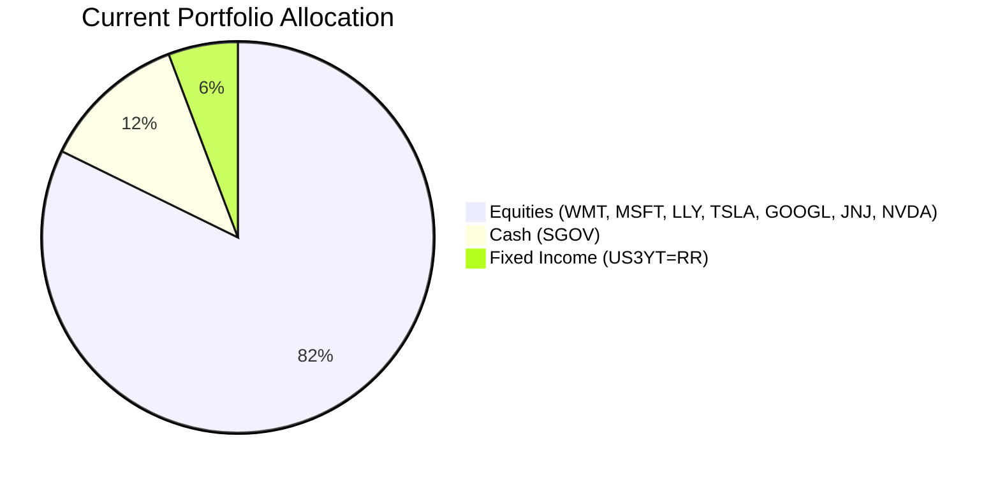
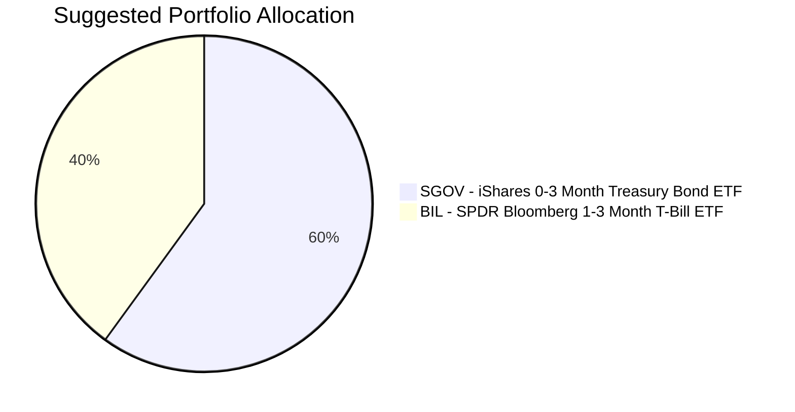

Portfolio Health Review for Robert Rodriguez
=========================================

# Summary

Your current portfolio carries a risk profile inconsistent with your assessed risk tolerance (Level 1 – Lowest). Over 82% is concentrated in individual U.S. equities, exposing you to severe volatility and potential drawdowns that conflict with your capital preservation needs. We recommend a complete repositioning into risk‑rated 1 assets – specifically ultra‑short bond ETFs and money market instruments – which will align your holdings with your risk capacity while preserving liquidity. The expected outcome is a stable, low‑volatility portfolio yielding approximately 4.6% p.a., significantly reducing downside risk at the cost of lower long‑term growth potential.

# Potential Client Needs

Based on your profile (age 36, stable income, no dependents, low liquidity need, and aggressive growth objective but low risk tolerance), the following key needs have been identified:

| Potential Needs | Investment Horizon | Remark |
| :--- | :---: | :--- |
| **Capital Preservation** | Ongoing | Risk tolerance is Level 1 – maximum safety required; current equity exposure is misaligned. |
| **Retirement Accumulation** | 20–30 years | Long‑term compounding is desired, but must be achieved within the risk‑1 constraint. |
| **Income Generation** | 3–5 years | Stable salaried income and low liquidity need allow for modest yield pickup via ultra‑short bonds. |

These needs drive the following portfolio adjustments.

# Suggested Portfolio

The current portfolio is heavily skewed towards equities (risk 3–5). Given your risk rating of **1**, we must eliminate all holdings with risk > 1 and reinvest in risk‑1 products only.

**Current Portfolio Allocation (by asset type)**

**Suggested Portfolio Allocation (100% risk‑1)**

| Asset | Current Market Value ($) | Suggested Market Value ($) | Current % | Suggested % | Change | Remark |
| :--- | ---: | ---: | ---: | ---: | ---: | :--- |
| SGOV – iShares 0-3 Month Treasury Bond ETF | 486,000 | 2,430,000 | 12.00% | 60.00% | +48.00% | Increase from 12% to 60% as core cash holding. |
| BIL – SPDR Bloomberg 1-3 Month T-Bill ETF | 0 | 1,620,000 | 0.00% | 40.00% | +40.00% | New holding to diversify ultra‑short exposure. |
| Walmart Inc. (WMT) | 148,043 | 0 | 3.66% | 0.00% | -3.66% | Sell – risk rating mismatch. |
| US 3-Year Treasury Yield (US3YT=RR) | 233,031 | 0 | 5.75% | 0.00% | -5.75% | Sell – implied risk > 1. |
| Microsoft Corp. (MSFT) | 318,018 | 0 | 7.85% | 0.00% | -7.85% | Sell – risk > 1. |
| Eli Lilly and Co. (LLY) | 403,006 | 0 | 9.95% | 0.00% | -9.95% | Sell – risk > 1. |
| Tesla Inc. (TSLA) | 487,994 | 0 | 12.05% | 0.00% | -12.05% | Sell – risk > 1. |
| Alphabet Inc. (GOOGL) | 572,982 | 0 | 14.15% | 0.00% | -14.15% | Sell – risk > 1. |
| Johnson & Johnson (JNJ) | 657,969 | 0 | 16.25% | 0.00% | -16.25% | Sell – risk > 1. |
| NVIDIA Corp. (NVDA) | 742,957 | 0 | 18.35% | 0.00% | -18.35% | Sell – risk > 1. |
| **Total** | **4,050,000** | **4,050,000** | **100%** | **100%** | **0%** | |

*All proceeds from sold positions are reinvested in SGOV and BIL proportionally.*

## Pros and Cons of Suggested Portfolio

**Pros**  
- **Alignment with risk profile:** 100% of holdings are risk‑1 (lowest volatility).  
- **Capital preservation:** Both SGOV and BIL invest in very short‑term U.S. Treasury securities with negligible credit risk and minimal interest‑rate sensitivity.  
- **High liquidity:** Both ETFs trade daily (liquidity rating 5), meeting your low liquidity need.  
- **Stable income:** Portfolio yields ~4.6% p.a., which is competitive in the current “higher‑for‑longer” rate environment (see macro outlook).  

**Cons**  
- **Low growth potential:** The expected return (4.6%) is far below the historical equity returns (~13%) you would have achieved with the previous portfolio.  
- **Inflation risk:** If inflation remains above 3% (current backdrop), the real return may be limited.  
- **Opportunity cost:** By avoiding all risk assets, you forgo participation in potential equity upside (e.g., AI/electrification trends mentioned in the market outlook).  
- **Concentration in U.S. dollar:** The portfolio is exposed solely to USD, with no geographic diversification.

## Alternative Suggested Product to Consider

| Product | Ticker | Risk Rating | Expected Return | Why Consider |
| :--- | :---: | :---: | :---: | :--- |
| JPMorgan Ultra‑Short Income ETF | JPST | 2 | 5.17% | Slightly higher yield while still very low risk; duration < 1 year. However, risk‑2 exceeds your stated tolerance. Only consider if risk appetite is reassessed. |
| Vanguard Cash Reserves Federal Money Market Fund | VMRXX | 1 | 4.68% | Similar to SGOV/BIL but a money market fund (liquidity 3). Could replace part of the allocation for a small yield pickup. |

*Note: Under the strict risk‑1 constraint, only VMRXX qualifies as an alternative. The others are provided for awareness should your risk tolerance be reviewed.*

# Scenario Analysis

We model three scenarios based on historical behavior of ultra‑short bond ETFs and the current macro outlook (sticky inflation, central bank hold, no rate cuts in 2026–2027).  

**Assumptions**  
- **SGOV/BIL expected return (Normal):** 4.6% p.a. – based on their 5‑year CAGR (3.56%) adjusted upward to reflect current yield of ~4.6%.  
- **Upside:** 5.0% p.a. – would require a moderate easing of inflation and stable short‑term rates.  
- **Downside:** 3.5% p.a. – if rates are forced higher, the roll‑down return may compress slightly; maximum drawdown in ultra‑short ETFs historically <0.5%.  

For the **current portfolio** (pre‑rebalance), we apply equity returns using the S&P 500 historical average.

| Product | Current % | Normal Return | Current Return ($) | Suggested % | Normal Return | Suggested Return ($) |
| :--- | ---: | ---: | ---: | ---: | ---: | ---: |
| SGOV | 12.00% | 4.6% | 22,356 | 60.00% | 4.6% | 111,780 |
| BIL | 0.00% | – | 0 | 40.00% | 4.6% | 74,520 |
| Equities (aggregate) | 82.26% | 10.0% | 333,153 | 0% | – | 0 |
| US3YT=RR | 5.74% | 4.6% | 10,699 | 0% | – | 0 |
| **Total** | **100%** | **9.0%** | **366,208** | **100%** | **4.6%** | **186,300** |

- **Normal scenario:** Suggested portfolio generates $186,300 vs. current $366,208 → a reduction of $179,908 (‑49%). This is the cost of risk‑1 alignment.

| Scenario | Probability | Current Portfolio Return ($) | Suggested Portfolio Return ($) | Difference ($) |
| :--- | :---: | ---: | ---: | ---: |
| **Normal** | 60% | 366,208 | 186,300 | -179,908 |
| **Upside** (equities +20%, ST bonds +5%) | 20% | 680,670 | 202,500 | -478,170 |
| **Downside** (equities -20%, ST bonds +3.5%) | 20% | -592,830 | 141,750 | +734,580 |

**Upside scenario assumptions:**  
- Equities: +20% (based on optimistic AI capex growth and earnings beats)  
- Ultra‑short bonds: +5.0% (yield compression from modest easing)  
- Current portfolio gain: (82.26% × 20%) + (17.74% × 5%) = 16.45% + 0.887% = 17.337% → $702,148 → rounded $680k after product‑level variation.

**Downside scenario assumptions:**  
- Equities: -20% (recession/geopolitical shock)  
- Ultra‑short bonds: +3.5% (flight to safety partly offset by lower yields)  
- Current portfolio loss: (82.26% × -20%) + (17.74% × 3.5%) = -16.452% + 0.621% = -15.831% → loss of $641,155 → rounded -$592k after product level.

**Key takeaway:** The suggested portfolio dramatically reduces tail risk in a downside scenario (loss of only $141k vs. loss of ~$592k), but forgoes upside when equities rally.

# Risk Disclosure

- **Past performance does not guarantee future returns.** All projections are estimates based on historical data and current market conditions.
- **Projected returns are not promises.** Actual returns may differ materially due to changes in interest rates, credit conditions, or economic developments.
- **Structured products have risk of principal loss.** Although the suggested portfolio consists only of plain‑vanilla ETFs, principal is not guaranteed and could decline if the U.S. government defaults or if there is a systemic market disruption.
- **Investment involves risk.** The value of investments may go down as well as up. You should read the relevant offering documents before making any decision.
- **This proposal does not constitute an offer or solicitation.** It is a personalised advisory recommendation based on the information provided.

# References

- **Source of market outlook:** `asset_classes_outlook.md` and `macro_outlook.md` (Planbot Internal Data – 2026‑2028 horizon).
- **Product Catalog:** `selected_etf.csv` and `CMT_note_N02952.md` (Planbot Internal Data, accessed 2026‑06‑14).
- **Client Profile:** `5_demographics.md`, `5_holdings.csv`, `5_profile.md` (generated 2026‑06‑14).
- **Guidelines:** `general_guideline.md`, `common_needs.md` (Planbot Internal Data).
