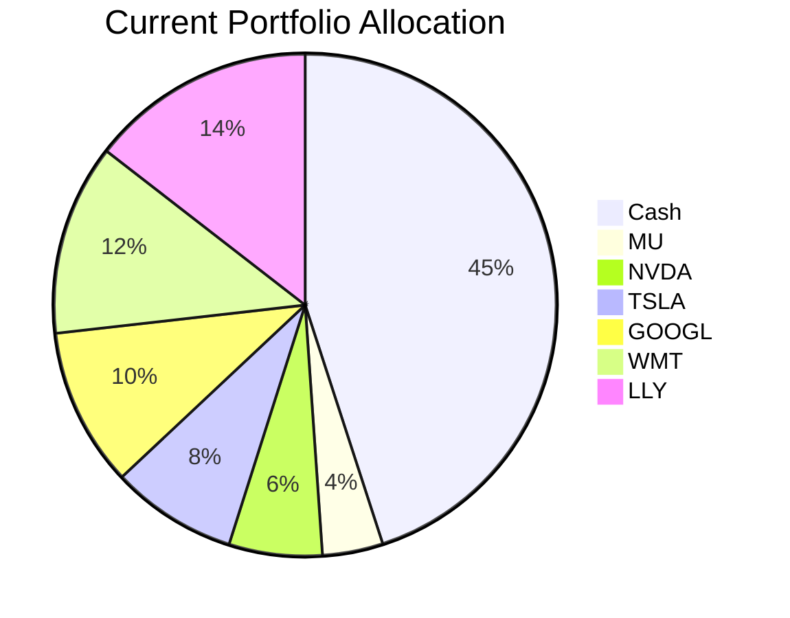
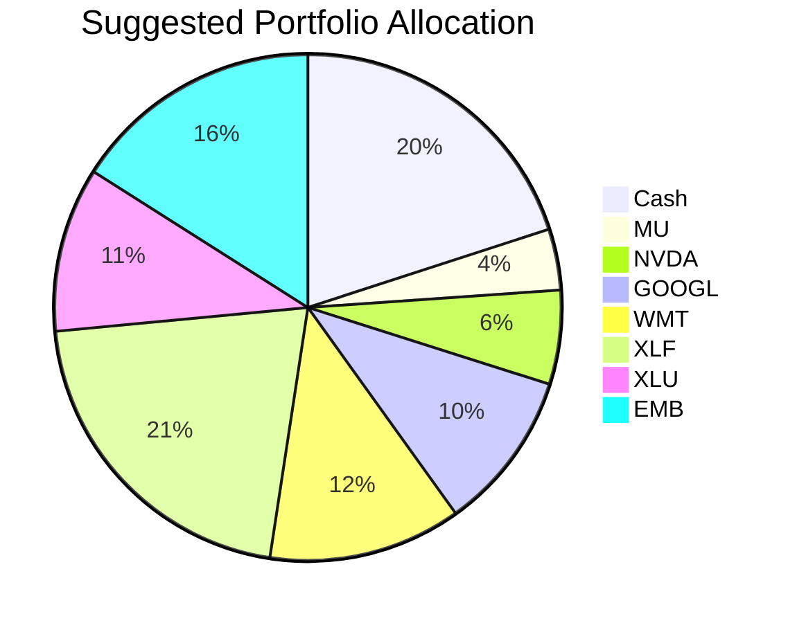

Portfolio Health Review for David Kim
=========================================

# Summary

David Kim’s current portfolio is dominated by a 45% cash position and a concentrated set of US large-cap individual stocks, several of which are underperforming (TSLA, LLY). While the cash buffer provides liquidity, it drags long-term growth. The recommended action is to reduce cash to 20%, eliminate two high‑volatility single stocks (TSLA, LLY), and deploy the freed capital into a diversified mix of sector ETFs and emerging‑market debt. This improves diversification, lowers single‑name risk, and aligns with the current market outlook favoring high‑quality carry and thematic sectors (financials, utilities). Expected outcome: stronger risk‑adjusted returns with controlled drawdown.

# Potential Client Needs

| Potential Needs | Investment Horizon | Remark |
|----------------|-------------------|--------|
| University education for child (14 y/o) | 4–10 years | Need capital growth with moderate certainty; balanced exposure suitable. |
| Retirement accumulation | 15–20+ years | Long‑term compounding focus; can tolerate higher short‑term volatility. |
| Reduce concentration & volatility | Immediate | Single‑stock risk (especially TSLA, LLY) and high cash drag need correction. |

# Suggested Portfolio

| Asset | Current Market Value | Suggested Market Value | Current % | Suggested % | Change | Remark |
|-------|--------------------:|----------------------:|----------:|------------:|------:|--------|
| Cash (US3MT=RR) | 427,500 | 190,000 | 45.0% | 20.0% | –25.0% | Reduce to 20% (12‑month emergency buffer). |
| Micron Technology (MU) | 36,905 | 36,905 | 3.9% | 3.9% | 0.0% | Maintain exposure to memory/semiconductors. |
| NVIDIA (NVDA) | 56,976 | 56,976 | 6.0% | 6.0% | 0.0% | Core AI beneficiary; keep. |
| Tesla (TSLA) | 77,048 | 0 | 8.1% | 0.0% | –8.1% | Sell: high volatility (5‑yr vol 57%), risk rating 5, underperforming. |
| Alphabet (GOOGL) | 97,119 | 97,119 | 10.2% | 10.2% | 0.0% | Keep as diversified tech exposure (risk 4). |
| Walmart (WMT) | 117,190 | 117,190 | 12.3% | 12.3% | 0.0% | Defensive growth with stable earnings. |
| Eli Lilly (LLY) | 137,261 | 0 | 14.5% | 0.0% | –14.5% | Sell: single‑stock concentration, risk 5, recent drawdown. |
| **New: XLF (Financials)** | 0 | 200,000 | 0.0% | 21.1% | +21.1% | Overweight financials per outlook (higher‑for‑longer rates). |
| **New: XLU (Utilities)** | 0 | 100,000 | 0.0% | 10.5% | +10.5% | AI infrastructure power demand; stable yield. |
| **New: EMB (EM Debt)** | 0 | 151,809 | 0.0% | 16.0% | +16.0% | High‑quality carry (risk 3); aligns with fixed‑income overweight. |
| **Total** | **950,000** | **950,000** | **100%** | **100%** | **0%** | |

## Pros and Cons of Suggested Portfolio

**Pros:**
- **Improved diversification** – reduced from 7 holdings (6 single stocks + cash) to 8 holdings including 3 sector/asset‑class ETFs.
- **Lower single‑name risk** – eliminated TSLA and LLY, which each carried high concentration and volatility.
- **Better alignment with market outlook** – overweight financials (XLF) benefits from prolonged rate hold; utilities (XLU) gain from electrification/capex; EM debt (EMB) captures carry without duration risk.
- **Higher expected return** – deploying cash and replacing underperforming stocks with core sector ETFs raises the portfolio’s expected growth.

**Cons:**
- **Slight increase in equity beta** – overall equity exposure rises from 55% to 80% (including ETFs). This may increase short‑term volatility.
- **EM debt credit risk** – EMB carries emerging‑market sovereign risk (risk 3), though the outlook supports improved fundamentals.
- **Underweight US large‑cap tech** – relative to the original portfolio, tech allocation is reduced (NVDA, GOOGL remain; sold TSLA). If tech outperforms, the portfolio may lag.

## Alternative Suggested Products to Consider

1. **SRLN – Invesco Senior Loan ETF** (Risk 2, Exp. Return 7.41%)  
   – Senior secured floating‑rate loans provide insulation from rising rates; suitable as a complement or substitute for EM debt if the client prefers lower credit risk.

2. **XLC – Communication Services Select Sector SPDR ETF** (Risk 3, Exp. Return 21.23%)  
   – Offers diversified exposure to large‑cap telecom/media (Meta, Alphabet, etc.) with lower risk than individual stocks; could replace part of the GOOGL position to reduce single‑name risk.

# Scenario Analysis

Assumptions are based on historical averages (5‑year returns for equities ~10%, bonds ~5%, cash ~2%) and calibrated to the current market outlook.

## Normal Market Condition
- Equities (including sector ETFs): +10% (historical 5‑yr CAGR of S&P 500)
- Bonds (EMB): +5% (historical 5‑yr return for EM debt indices)
- Cash: +2% (short‑term T‑bill average)

| Product | % Return | Current Holding Value | Current Return | Suggested Holding Value | Suggested Return |
|---------|--------:|---------------------:|--------------:|-----------------------:|----------------:|
| Cash (US3MT) | 2% | 427,500 | 8,550 | 190,000 | 3,800 |
| MU | 10% | 36,905 | 3,691 | 36,905 | 3,691 |
| NVDA | 10% | 56,976 | 5,698 | 56,976 | 5,698 |
| TSLA | 10% | 77,048 | 7,705 | 0 | 0 |
| GOOGL | 10% | 97,119 | 9,712 | 97,119 | 9,712 |
| WMT | 10% | 117,190 | 11,719 | 117,190 | 11,719 |
| LLY | 10% | 137,261 | 13,726 | 0 | 0 |
| XLF | 10% | 0 | 0 | 200,000 | 20,000 |
| XLU | 10% | 0 | 0 | 100,000 | 10,000 |
| EMB | 5% | 0 | 0 | 151,809 | 7,590 |
| **Total** | | **950,000** | **60,801** | **950,000** | **72,210** |

- **Annual return:** Current 6.40% vs Suggested 7.60%  
- **Incremental benefit:** +HKD 11,409 annually (+18.8% improvement)

## Good Market Condition (Bullish)
- Equities: +20% (strong earnings, low recession risk, continued AI capex)
- Bonds: +8% (spread compression, falling default rates)
- Cash: +3% (rates remain elevated)

| Product | % Return | Current Holding Value | Current Return | Suggested Holding Value | Suggested Return |
|---------|--------:|---------------------:|--------------:|-----------------------:|----------------:|
| Cash (US3MT) | 3% | 427,500 | 12,825 | 190,000 | 5,700 |
| MU | 20% | 36,905 | 7,381 | 36,905 | 7,381 |
| NVDA | 20% | 56,976 | 11,395 | 56,976 | 11,395 |
| TSLA | 20% | 77,048 | 15,410 | 0 | 0 |
| GOOGL | 20% | 97,119 | 19,424 | 97,119 | 19,424 |
| WMT | 20% | 117,190 | 23,438 | 117,190 | 23,438 |
| LLY | 20% | 137,261 | 27,452 | 0 | 0 |
| XLF | 20% | 0 | 0 | 200,000 | 40,000 |
| XLU | 20% | 0 | 0 | 100,000 | 20,000 |
| EMB | 8% | 0 | 0 | 151,809 | 12,145 |
| **Total** | | **950,000** | **117,325** | **950,000** | **139,483** |

- **Annual return:** Current 12.35% vs Suggested 14.68%  
- **Incremental benefit:** +HKD 22,158 annually (+18.9% improvement)

## Bad Market Condition (Equity shock similar to COVID‑19)
- Equities: −20% (global recession, supply chain disruption)
- Bonds: −5% (credit spreads widen, EM debt pressured)
- Cash: +1% (rates slashed, but still positive)

| Product | % Return | Current Holding Value | Current Return | Suggested Holding Value | Suggested Return |
|---------|--------:|---------------------:|--------------:|-----------------------:|----------------:|
| Cash (US3MT) | 1% | 427,500 | 4,275 | 190,000 | 1,900 |
| MU | −20% | 36,905 | −7,381 | 36,905 | -7,381 |
| NVDA | −20% | 56,976 | −11,395 | 56,976 | -11,395 |
| TSLA | −20% | 77,048 | −15,410 | 0 | 0 |
| GOOGL | −20% | 97,119 | −19,424 | 97,119 | -19,424 |
| WMT | −20% | 117,190 | −23,438 | 117,190 | -23,438 |
| LLY | −20% | 137,261 | −27,452 | 0 | 0 |
| XLF | −20% | 0 | 0 | 200,000 | -40,000 |
| XLU | −20% | 0 | 0 | 100,000 | -20,000 |
| EMB | −5% | 0 | 0 | 151,809 | -7,590 |
| **Total** | | **950,000** | **−100,225** | **950,000** | **−127,328** |

- **Annual return:** Current −10.55% vs Suggested −13.40%
- **Incremental loss:** −HKD 27,103 (2.85% lower return)  

**Commentary:** In a severe equity downturn, the suggested portfolio shows slightly larger losses due to higher equity allocation (80% vs 55%). However, the diversified sector ETFs and fixed‑income component provide better recovery prospects than concentrated single stocks. The increased equity exposure is justified by the long‑term growth objective and the client’s higher risk tolerance (risk rating 4).

# Risk Disclosure

- Past performance does not guarantee future returns.  
- Projected returns are estimates, not promises.  
- Structured products (e.g., callable notes) have risk of principal loss if sold early; this proposal includes only ETFs with daily liquidity.  
- Emerging‑market debt (EMB) carries sovereign credit and currency risk.  
- Equity investments are subject to market volatility and potential loss of principal.

# References

- **Product Catalog:** `selected_etf.csv`, `CMT_note_N02952.md` (Source: Planbot Internal Data)  
- **Market Outlook:** `asset_classes_outlook.md`, `macro_outlook.md` (Source: Planbot Internal Data)  
- **Client Profile:** `8_demographics.md`, `8_holdings.csv`, `8_profile.md` (Source: Planbot Internal Data)  
- **Web References:** N/A – no external websites were used.
