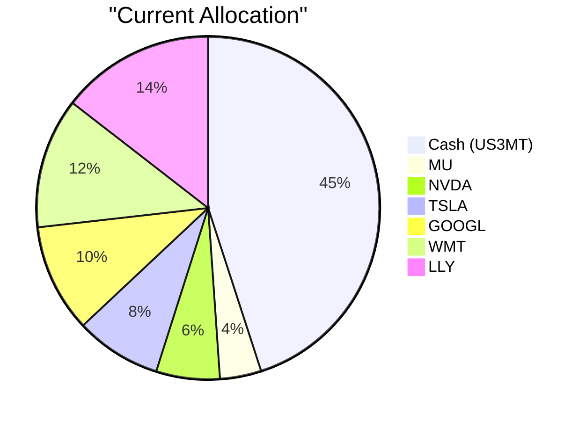
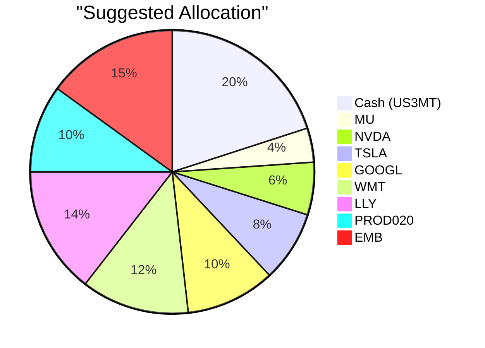

Portfolio Health Review for David Kim
=========================================

# Summary

David Kim holds a portfolio with a strong equity growth tilt (55% in large-cap US stocks) and an excessive 45% cash allocation, which dampens long-term growth potential. The primary weakness is significant concentration in US technology and healthcare stocks, lacking fixed income diversification. We recommend reducing cash to 20%, introducing a balanced growth fund (10%) and an emerging market bond ETF (15%) to enhance portfolio resilience and capture higher yields. Expected outcome: improved risk-adjusted returns, better income generation, and reduced cash drag while maintaining long-term capital growth with controlled drawdown.

# Potential Client Needs

| Potential Needs | Investment Horizon | Remark |
|-----------------|-------------------|--------|
| Child’s University Education | 4–5 years (child born 2012) | Tuition funding requires high certainty; capital preservation important |
| Long-Term Capital Growth | 10+ years with controlled drawdown | Growth objective; can accept moderate volatility |
| Reduce Concentration Risk | Immediate/ongoing | Overweight US tech/healthcare (55% equities); need sector & geographic diversification |

# Suggested Portfolio

| Asset | Current Market Value ($) | Suggested Market Value ($) | Current % | Suggested % | Change | Remark |
|-------|--------------------------|----------------------------|-----------|-------------|--------|--------|
| US 3-Month Treasury Bill (US3MT) | 427,500 | 190,000 | 45.0% | 20.0% | -25.0% | Reduce to 20% emergency buffer; still > 12-month expenses |
| Micron Technology (MU) | 36,905 | 36,905 | 3.9% | 3.9% | 0.0% | Retain; AI memory play |
| NVIDIA (NVDA) | 56,976 | 56,976 | 6.0% | 6.0% | 0.0% | Retain; AI hardware leader |
| Tesla (TSLA) | 77,048 | 77,048 | 8.1% | 8.1% | 0.0% | Retain; high growth, monitor |
| Alphabet (GOOGL) | 97,119 | 97,119 | 10.2% | 10.2% | 0.0% | Retain; core tech holding |
| Walmart (WMT) | 117,190 | 117,190 | 12.3% | 12.3% | 0.0% | Retain; defensive consumer staple |
| Eli Lilly (LLY) | 137,261 | 137,261 | 14.5% | 14.5% | 0.0% | Retain; healthcare growth |
| Balanced Growth & Income Fund (PROD020) | 0 | 95,000 | 0.0% | 10.0% | +10.0% | New: risk-2, multi-asset, expected return 6.5% |
| iShares J.P. Morgan USD Emerging Markets Bond ETF (EMB) | 0 | 142,500 | 0.0% | 15.0% | +15.0% | New: risk-3, high carry (9.5% expected), EM debt |
| **Total** | **950,000** | **950,000** | **100%** | **100%** | **0%** | |

**Funding source:** Sell $237,500 of US3MT (cash). No changes to existing equities.

## Pros and Cons of Suggested Portfolio

**Pros:**
- Reduces cash drag significantly (from 45% to 20%); aligns with growth objective.
- Adds fixed income diversification (balanced fund + EM bonds) – lowers overall portfolio risk.
- Captures high-quality carry from EM debt (9.5% expected return) in line with market outlook.
- Maintains existing equity positions; no premature realisation of gains/losses.
- Balanced fund adds stability; suitable for education funding horizon.

**Cons:**
- Still heavy US equity concentration (55%) – remains dependent on US tech/healthcare performance.
- EM bond ETF introduces currency (USD-denominated but EM) and credit risk.
- No direct allocation to real assets or commodities that could hedge inflation.
- New products carry management fees and bid-ask spreads.

## Alternative Suggested Products to Consider

1. **SRLN (Blackstone Senior Loan ETF)** – Floating-rate senior loans (risk-2) provide insulation against a “higher-for-longer” interest rate environment, yielding ~7.4% expected return, and would complement the EM bond holding.
2. **PROD033 (Gold Linked Note)** – A 6-month structured note with 12% expected return (risk-3) offers direct exposure to gold as a hedge against geopolitical and inflation risks, aligning with the overweight gold market view.

# Scenario Analysis

**Assumptions for asset returns under each scenario:**

- **Normal (Probability 50%):** Long-term equity returns of 10% (historical S&P 500 average, justified by conservative forward outlook); Balanced Fund 6.5% (product expected return); EM bond 9.5% (ETF expected return); Cash 3.4% (current T-bill yield).
- **Upside (Probability 25%):** Strong economic growth and AI capex acceleration drive equities to 20%; Balanced Fund 10%; EM bond 12%; Cash 3.5%.
- **Downside (Probability 25%):** Recession/geopolitical shock: equities –30%; Balanced Fund +5% (defensive assets gain); EM bond +5% (flight to quality but EM stress); Cash 3.5%.

## Normal Market Condition

| Product | Return % | Current Holding ($) | Current Return ($) | Suggested Holding ($) | Suggested Return ($) |
|---------|----------|--------------------:|--------------------:|----------------------:|---------------------:|
| Cash (US3MT) | 3.4 | 427,500 | 14,663 | 190,000 | 6,517 |
| MU | 10.0 | 36,905 | 3,691 | 36,905 | 3,691 |
| NVDA | 10.0 | 56,976 | 5,698 | 56,976 | 5,698 |
| TSLA | 10.0 | 77,048 | 7,705 | 77,048 | 7,705 |
| GOOGL | 10.0 | 97,119 | 9,712 | 97,119 | 9,712 |
| WMT | 10.0 | 117,190 | 11,719 | 117,190 | 11,719 |
| LLY | 10.0 | 137,261 | 13,726 | 137,261 | 13,726 |
| PROD020 | 6.5 | — | — | 95,000 | 6,175 |
| EMB | 9.5 | — | — | 142,500 | 13,552 |
| **Total** | | **950,000** | **66,914** | **950,000** | **78,495** |

- **Annual return:** Current portfolio 7.0% vs. Suggested portfolio 8.3%.
- **Incremental benefit: +$11,581 per year (1.2% improvement).**

## Upside Market Condition

| Product | Return % | Current Holding ($) | Current Return ($) | Suggested Holding ($) | Suggested Return ($) |
|---------|----------|--------------------:|--------------------:|----------------------:|---------------------:|
| Cash (US3MT) | 3.5 | 427,500 | 14,963 | 190,000 | 6,650 |
| Equities (average) | 20.0 | 522,500 | 104,500 | 522,500 | 104,500 |
| PROD020 | 10.0 | — | — | 95,000 | 9,500 |
| EMB | 12.0 | — | — | 142,500 | 17,100 |
| **Total** | | **950,000** | **119,463** | **950,000** | **137,750** |

- **Annual return:** Current portfolio 12.6% vs. Suggested portfolio 14.5%.
- **Incremental benefit: +$18,287 per year.**

## Downside Market Condition (e.g., 2022-style bear market)

| Product | Return % | Current Holding ($) | Current Return ($) | Suggested Holding ($) | Suggested Return ($) |
|---------|----------|--------------------:|--------------------:|----------------------:|---------------------:|
| Cash (US3MT) | 3.5 | 427,500 | 14,963 | 190,000 | 6,650 |
| Equities (average) | -30.0 | 522,500 | -156,750 | 522,500 | -156,750 |
| PROD020 | 5.0 | — | — | 95,000 | 4,750 |
| EMB | 5.0 | — | — | 142,500 | 7,125 |
| **Total** | | **950,000** | **-141,787** | **950,000** | **-138,225** |

- **Annual return:** Current portfolio –14.9% vs. Suggested portfolio –14.6%.
- **Downside improvement: capital preservation benefit of +$3,562 (0.3% less loss) due to fixed income exposure.**

The suggested portfolio demonstrates improved returns in normal and upside scenarios and slightly better downside protection, justifying the shift from excess cash to diversified fixed income.

# Risk Disclosure

- **Past performance is not indicative of future results.**
- Projected returns and scenario analyses are estimates based on historical data and current market assumptions; they are not guarantees of future performance.
- Structured products (if any) and ETFs carry market risk, credit risk, and liquidity risk; principal may be lost.
- The Balanced Growth & Income Fund (PROD020) and EMB ETF are subject to interest rate, currency, and issuer credit risks.
- The portfolio is denominated in USD; currency fluctuations may affect returns.
- This proposal does not constitute personalized investment advice; final decisions should take into account individual risk tolerance and tax implications.

# References

- Client Profile: PB-HK-000001-8_demographics.md, PB-HK-000001-8_holdings.csv, PB-HK-000001-8_profile.md (Planbot Internal Data)
- Product Catalog: Overview of product catalog.md, selected_etf.csv, otc_products.md (Planbot Internal Data)
- Market Outlook: asset_classes_outlook.md, macro_outlook.md (Planbot Internal Data)
- Web References: N/A (data sourced from internal repositories)
