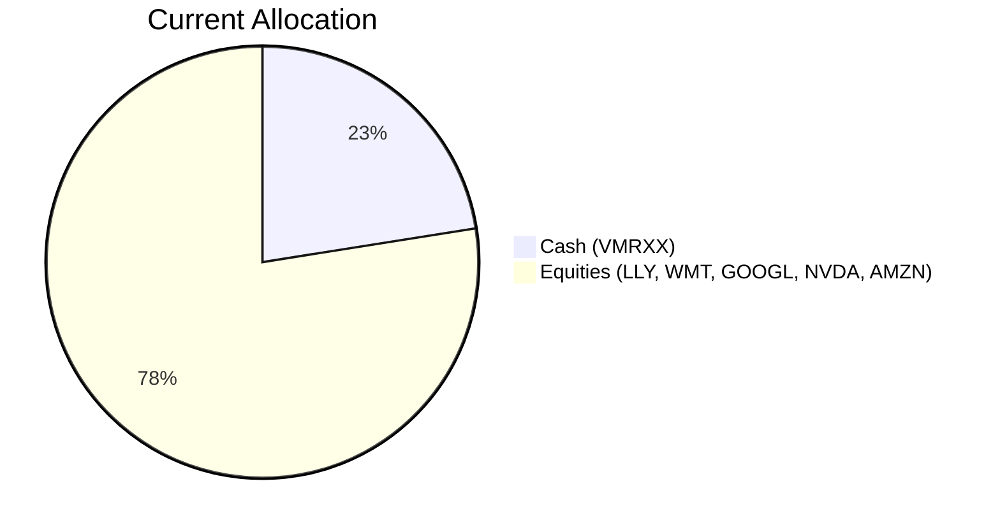
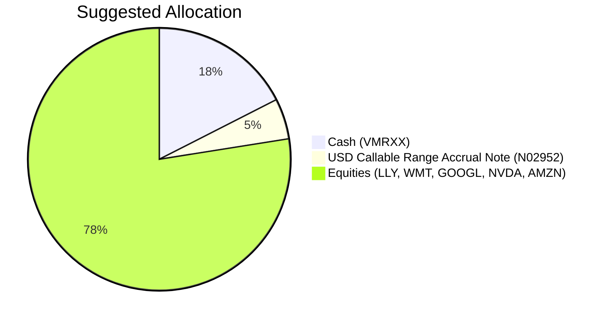

Portfolio Health Review for Sarah Chen
=========================================

# Summary

Sarah Chen's current portfolio is heavily weighted toward US large-cap growth equities (77.5%) with a significant 22.5% cash drag yielding only ~3.56%. While her risk tolerance is high (Rating 5), the portfolio lacks income-generating assets and is exposed to single-region concentration risk. The recommended action is to reduce cash by $160,000 (5% of portfolio) and deploy it into a principal-protected structured note that pays a 5.94% quarterly coupon, directly supporting her regular income need while maintaining equity exposure. This shift is expected to boost portfolio yield from ~4.1% to ~4.4% and enhance income stability without altering equity positions.

# Potential Client Needs

| Potential Needs | Investment Horizon | Remark |
|----------------|-------------------|--------|
| Regular Income | Ongoing (5-year structured product matches liquidity horizon) | Client is divorced Legal Partner with high but variable income, targeting steady cash flow. |
| Reduce Cash Drag | N/A | 22.5% in Vanguard Treasury Money Market yields well below available structured product. |
| Diversify Away from Tech Concentration | N/A | 5 of 6 holdings are US mega-cap tech; client's career is also in a high-income profession, but indirect tech exposure is high. |

# Suggested Portfolio

| Asset | Current Market Value | Suggested Market Value | Current % | Suggested % | Change | Remark |
|-------|--------------------:|----------------------:|----------:|------------:|------:|--------|
| Vanguard Treasury Money Market (VMRXX) | $720,000 | $560,000 | 22.5% | 17.5% | -5.0% | Reduce cash; deploy into higher-yielding income note. |
| USD Callable Range Accrual Note (N02952) | $0 | $160,000 | 0% | 5.0% | +5.0% | New purchase; 5.94% p.a. quarterly coupon, principal protected at maturity (08 May 2031). |
| Eli Lilly (LLY) | $223,858 | $223,858 | 7.0% | 7.0% | 0% | Maintain. |
| Walmart (WMT) | $359,929 | $359,929 | 11.2% | 11.2% | 0% | Maintain. |
| Alphabet Inc. (GOOGL) | $496,000 | $496,000 | 15.5% | 15.5% | 0% | Maintain. |
| NVIDIA (NVDA) | $632,071 | $632,071 | 19.8% | 19.8% | 0% | Maintain. |
| Amazon.com (AMZN) | $768,142 | $768,142 | 24.0% | 24.0% | 0% | Maintain. |
| **Total** | **$3,200,000** | **$3,200,000** | **100%** | **100%** | **0%** | |

## Pros and Cons of Suggested Portfolio

**Pros:**
- Direct income generation: The structured note pays a quarterly coupon of 5.94% p.a., providing predictable cash flow aligned with the regular income objective.
- Principal protection at maturity: The note is protected if held to its 5-year term, matching the client's low liquidity horizon.
- No disruption to existing equity positions: All current holdings remain unchanged, preserving any unrealized gains.
- Higher expected yield vs. cash: The note's expected return (5.94%) exceeds the cash yield (3.56%) by more than 2.3% per annum, improving total portfolio income.

**Cons:**
- Concentration risk unchanged: The portfolio remains heavily concentrated in US large-cap growth stocks (GOOGL, NVDA, AMZN, LLY, WMT) with no geographical or sector diversification. Potential drawdown in tech could impact overall returns.
- Reinvestment risk from callable feature: If the 10-year CMT falls below 4.30%, JPMorgan may call the note early, forcing reinvestment at potentially lower rates.
- Credit risk: The note is unsecured and relies on JPMorgan's creditworthiness (A-rated). In a default scenario, principal could be lost.
- Opportunity cost: If equities outperform the note over the next 5 years, the cash reallocation may reduce potential capital appreciation.

## Alternative Suggested Products to Consider

1. **Multi-Asset Income Fund (PROD008)** – Risk Level 3, Expected Return 8.2% p.a., 2-year term, $40K minimum. This fund offers diversification across multiple asset classes while providing income. Suitable if the client prefers a more diversified income stream without structured product complexity. However, it is not principal-protected.

2. **Japan Equity Opportunities Fund (PROD023)** – Risk Level 3, Expected Return 9.1% p.a., 3-year term. The market outlook overweight Japan equities for structural tailwinds. Adding a small allocation (e.g., 3-5%) could reduce US tech concentration and tap into Japanese corporate governance reforms.

# Scenario Analysis

The following scenarios are based on historical returns and current market conditions (24-month horizon aligning with the structured note's tenor but analyzed annually for consistency).

## Normal Market Condition (Probability 55%)

- US large-cap equities (equity proxy): 10% annualized return (average 5-year S&P 500 CAGR ~13.85%, but with current elevated valuations we assume a modest 10%).
- Money market (VMRXX): 3.5% (current yield ~3.56%).
- Structured Note (N02952): 5.94% p.a. coupon; we assume the note is not called and pays full coupon each quarter. Early call possible but we use the promised coupon.

| Product | % Return | Suggested Holding ($) | Return ($) | Current Holding ($) | Return ($) |
|---------|--------:|--------------------:|----------:|-----------------:|----------:|
| VMRXX | 3.5% | 560,000 | 19,600 | 720,000 | 25,200 |
| N02952 | 5.94% | 160,000 | 9,504 | 0 | 0 |
| LLY | 10% | 223,858 | 22,386 | 223,858 | 22,386 |
| WMT | 10% | 359,929 | 35,993 | 359,929 | 35,993 |
| GOOGL | 10% | 496,000 | 49,600 | 496,000 | 49,600 |
| NVDA | 10% | 632,071 | 63,207 | 632,071 | 63,207 |
| AMZN | 10% | 768,142 | 76,814 | 768,142 | 76,814 |
| **Total** | **9.7%** | **3,200,000** | **277,104** | **3,200,000** | **273,200** |

- The suggested portfolio yields **$277,104** vs. current **$273,200**, an incremental benefit of **$3,904** (+1.4%).

## Upside Market Condition (Probability 25%)

- Robust earnings and AI capex drive US equities higher. Return assumption: 15% (based on 3-year CAGR of S&P 500 ~20.55%, but moderated for current cycle).
- Money market returns remain at 3.5% (stable rates).
- Structured note: coupon payments continue; if 10y CMT <4.30%, the note may be called early (reinvestment risk). We assume it is called after 1 year and the proceeds are reinvested in the same money market at 3.5%.

| Product | % Return | Suggested Holding ($) | Return ($) | Current Holding ($) | Return ($) |
|---------|--------:|--------------------:|----------:|-----------------:|----------:|
| VMRXX | 3.5% | 560,000 | 19,600 | 720,000 | 25,200 |
| N02952 (called after 1y) | 5.94% (1y only) + 3.5% (4y) | 160,000 | 9,504 + 22,400 | 0 | 0 |
| Equities (5 stocks) | 15% | 2,480,000 | 372,000 | 2,480,000 | 372,000 |
| **Total** | **14.0%** | **3,200,000** | **423,504** | **3,200,000** | **397,200** |

- Suggested portfolio **$423,504** vs. current **$397,200**, adding **$26,304** (+6.6%).

## Downside Market Condition – Recession/Correction (Probability 20%)

- US equities decline 15% (similar to a moderate correction; historical max drawdown for S&P 500 in 2020 was -34%, but we assume a milder -15% as per current market resilience).
- Money market returns: 3.5% (safe haven flows).
- Structured note: principal protected at maturity; coupon paid even in downturn as long as accrual condition (10y CMT ≤5.01%) holds. We assume moderately lower rates, so coupons continue.

| Product | % Return | Suggested Holding ($) | Return ($) | Current Holding ($) | Return ($) |
|---------|--------:|--------------------:|----------:|-----------------:|----------:|
| VMRXX | 3.5% | 560,000 | 19,600 | 720,000 | 25,200 |
| N02952 | 5.94% | 160,000 | 9,504 | 0 | 0 |
| Equities (5 stocks) | -15% | 2,480,000 | -372,000 | 2,480,000 | -372,000 |
| **Total** | **-10.7%** | **3,200,000** | **-342,896** | **3,200,000** | **-346,800** |

- The suggested portfolio loses **-$342,896** vs. current **-$346,800**, performing **$3,904 better** due to the income from the note offsetting some equity loss.

# Risk Disclosure

- Past performance does not guarantee future returns. All projected returns are estimates based on historical data and current market sentiment, not promises.
- The USD Callable Range Accrual Note (N02952) is a complex product involving derivatives. Investors should exercise caution and understand the terms.
- This note is only principal protected if held to maturity (08 May 2031). In the worst-case scenario, investors may lose 100% of their principal.
- The note is not a deposit and is not protected by the Deposit Protection Scheme in Hong Kong.
- If the note is called early (when 10y CMT ≤ 4.30%), reinvestment risk applies; the investor may not be able to achieve a similar return.
- Equity investments carry market risk, including potential loss of principal. Concentration in US large-cap technology stocks amplifies sector-specific volatility.
- Credit risk: the note is issued by JPMorgan Chase Financial Company LLC and guaranteed by JPMorgan Chase & Co. (A-rated). Default could result in loss of principal and interest.

# References

- Product Catalog: demo-market-1Jun26.csv, selected_etf.csv, otc_products.md (Source: Planbot Internal Data)
- Structured Product FactSheet: CMT_note_N02952.md (Source: Planbot Product Catalog)
- Client Profile: PB-HK-000002-6_demographics.md, PB-HK-000002-6_holdings.csv (Source: Client Onboarding Records)
- Market Outlook: asset_classes_outlook.md, macro_outlook.md (Source: Planbot Shared Market Data)
- Proposal Format and Instructions: proposal_format.md, suggested_portfolio_instruction.md, scenario_analysis_instruction.md, risk_disclosure_instruction.md, references_instruction.md (Source: Planbot Internal Guidelines)
- Web References: N/A (no web search used)
