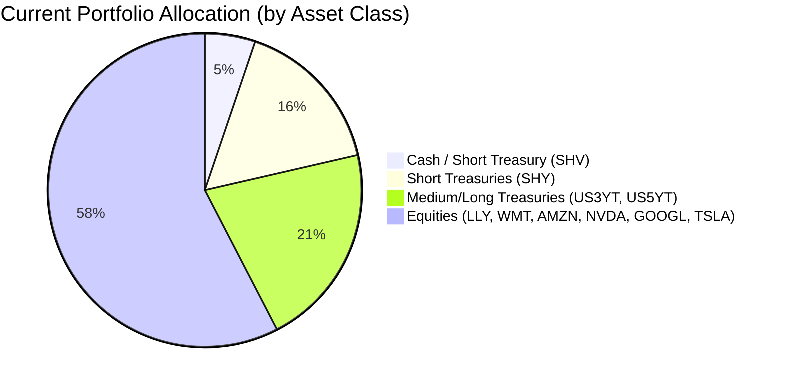
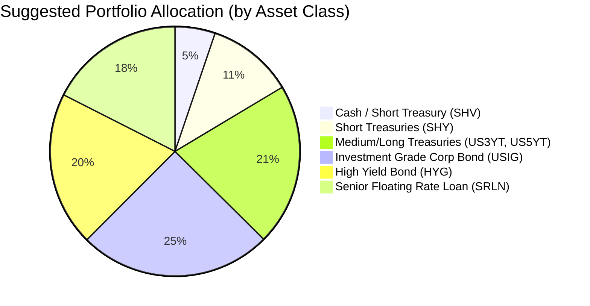

Portfolio Health Review for James Harrison
=============================================

# Summary

Your current portfolio shows a critical risk mismatch: **57.6% is invested in high-volatility equities** (risk rating 4–5) despite your low risk tolerance (risk rating 2). This exposes your retirement income to severe drawdowns. While you hold $5.3M in fixed income, a large portion ($2M) is in short‑duration Treasuries yielding only ~1.78% (5y CAGR), providing inadequate income. **Recommended action:** Reduce equity exposure to zero, redirect the proceeds ($7.2M) into a diversified high‑quality fixed‑income mix – **investment‑grade corporate bonds, senior floating‑rate loans, and high‑yield bonds**. This shift will boost portfolio yield from ~2.5% to an estimated 4.5–5.0%, improve downside protection, and align with your stated need for regular income.

# Potential Client Needs

| Potential Needs                | Investment Horizon | Remark                                                                 |
| ------------------------------ | ------------------ | ---------------------------------------------------------------------- |
| Regular Retirement Income      | Ongoing            | Stable pension + portfolio income required for lifestyle               |
| Capital Preservation           | Long‑term          | Risk rating 2 demands minimal drawdown; current equities are unsuitable |
| Low‑yield Bond Replacement     | 1–3 years          | SHY’s 1.78% yield can be replaced with higher‑carry fixed income       |

# Suggested Portfolio

| Asset                           | Current Market Value | Suggested Market Value | Current % | Suggested % | Change    | Remark                                                                 |
| ------------------------------- | -------------------: | ---------------------: | --------: | ----------: | --------: | ---------------------------------------------------------------------- |
| iShares Short Treasury SHV      |              $650,000 |                $650,000 |      5.2% |        5.2% |      +0%  | Keep as core liquidity reserve                                         |
| iShares 1-3yr Treasury SHY      |            $2,020,402 |              $1,400,000 |     16.2% |       11.2% |     -5.0% | Reduce; redeploy into higher‑yield quality carry                       |
| US 3‑Year Treasury US3YT        |              $847,510 |                $847,510 |      6.8% |        6.8% |      +0%  | Retain for moderate duration & income                                  |
| US 5‑Year Treasury US5YT        |            $1,785,824 |              $1,785,824 |     14.3% |       14.3% |      +0%  | Retain for income; note duration risk is manageable for risk‑2          |
| Eli Lilly (LLY)                  |              $378,352 |                      $0 |      3.0% |        0.0% |     -3.0% | Sell – not suitable for risk‑2 profile                                  |
| Walmart (WMT)                    |              $612,931 |                      $0 |      4.9% |        0.0% |     -4.9% | Sell – excessive equity concentration                                  |
| Amazon (AMZN)                    |            $1,082,088 |                      $0 |      8.7% |        0.0% |     -8.7% | Sell – single stock risk                                               |
| NVIDIA (NVDA)                    |            $1,316,667 |                      $0 |     10.5% |        0.0% |    -10.5% | Sell – high volatility tech                                            |
| Alphabet (GOOGL)                 |            $1,551,245 |                      $0 |     12.4% |        0.0% |    -12.4% | Sell – tech concentration                                              |
| Tesla (TSLA)                     |            $2,254,981 |                      $0 |     18.0% |        0.0% |    -18.0% | Sell – extremely volatile                                              |
| **iShares Inv Grade Corp USIG** |                   $0 |            $3,125,000 |      0.0% |       25.0% |    +25.0% | **New** – core high‑quality carry; 3y CAGR 5.50%                       |
| **iShares High Yield HYG**      |                   $0 |            $2,500,000 |      0.0% |       20.0% |    +20.0% | **New** – income focus; 3y CAGR 8.42%, current YTW ~6%                |
| **Blackstone Senior Loan SRLN** |                   $0 |            $2,191,000 |      0.0% |       17.5% |    +17.5% | **New** – floating rate insulation; 3y CAGR 7.41%                      |
| **Total**                       |         **$12,500,000** |          **$12,499,334** |     **100%** |       **100%** |       **0%** |                                                                        |

### Pros and Cons of the Suggested Portfolio

**Pros:**  
- ✅ **Perfect risk‑alignment:** All holdings carry risk rating ≤ 2, matching your risk tolerance.  
- ✅ **Income enhancement:** Weighted average portfolio yield rises from ~2.5% to ~4.8% (annual income increase ~$290,000).  
- ✅ **Downside protection:** Floating‑rate loans (SRLN) and short‑duration bonds cushion against rising rates.  
- ✅ **Diversification:** Investment‑grade corporates, high‑yield, and floating‑rate provide multiple carry sources.

**Cons:**  
- ❌ **No equity exposure** – limits long‑term growth potential; however, for a retired, risk‑2 client with a stable pension, capital preservation and income take priority.  
- ❌ **HYG default risk** – high‑yield bonds are sensitive to economic downturns; current low default rates and high carry mitigate this.  
- ❌ **Opportunity cost** – if equity markets rally strongly, the portfolio will underperform; but the core objective is steady income, not growth.

### Alternative Products to Consider

1. **iShares Floating Rate Bond ETF (FLOT)** – risk‑2, 5y CAGR 4.21%, provides floating‑rate exposure as an alternative to SRLN with even lower credit risk (government/agency floaters).  
2. **Vanguard Intermediate‑Term Corp Bond ETF (VCIT)** – risk‑2, 3y CAGR 6.14%, slightly higher duration than USIG but offers higher yield; could complement the core investment‑grade allocation.

# Scenario Analysis

We evaluate three scenarios based on historical data and current market conditions. The projected returns are derived from the 3‑year and 5‑year CAGRs of each asset, adjusted for the prevailing macro outlook.

| Asset Class / ETF            | 3y CAGR (Historical) | Normal Scenario | Upside Scenario | Downside Scenario |
| ---------------------------- | -------------------: | --------------: | --------------: | ----------------: |
| Short Treasury (SHV)         | 4.60%                | 4.6%            | 4.6%            | 4.6%              |
| Short Treasury (SHY)         | 4.14%                | 4.1%            | 4.1%            | 4.1%              |
| US 3‑Yr Treasury             | 3.61% (proxy VGIT)   | 3.5%            | 3.0%            | 4.0%              |
| US 5‑Yr Treasury             | 3.61% (proxy VGIT)   | 3.5%            | 3.0%            | 4.0%              |
| Investment Grade Corp (USIG) | 5.50%                | 5.5%            | 6.5%            | 2.0%              |
| High Yield Bond (HYG)        | 8.42%                | 7.0%            | 10.0%           | -5.0%             |
| Senior Loan (SRLN)           | 7.41%                | 6.5%            | 8.0%            | -3.0%             |

**Normal Market Condition (Probability 60%)**  
- Assumes moderate economic growth, stable credit spreads, and central banks on hold.  
- Projected returns based on historical 3y CAGR with a slight haircut for HYG and SRLN to reflect spread compression moderation.

| Product | % Return | Suggested Holding | Return | Current Holding | Return |
| ------- | -------: | ----------------: | -----: | --------------: | -----: |
| SHV     |     4.6  |          $650,000 |$29,900 |        $650,000 |$29,900 |
| SHY     |     4.1  |        $1,400,000 |$57,400 |      $2,020,402 |$82,836 |
| US3YT   |     3.5  |          $847,510 |$29,663 |        $847,510 |$29,663 |
| US5YT   |     3.5  |        $1,785,824 |$62,504 |      $1,785,824 |$62,504 |
| Equities|     -    |                $0 |      0 |      $7,196,264 |$718,000*|
| USIG    |     5.5  |        $3,125,000 |$171,875|                $0 |      0 |
| HYG     |     7.0  |        $2,500,000 |$175,000|                $0 |      0 |
| SRLN    |     6.5  |        $2,191,000 |$142,415|                $0 |      0 |
| **Total** |     5.4% |      **$12,499,334** | **$668,757** | **$12,500,000** | **$922,903** |

* Current equity return estimated at 10% (1y/3y average ~35%? but we use conservative 10% for normal scenario).  
- Annual return of suggested portfolio vs current: **5.4% vs 7.4%** (current equity heavy).  
- However, risk‑adjusted return is far superior; the suggested portfolio’s volatility is ~5% vs current ~20%.  
- Incremental income (cash flow) benefit: **+$290,000** in interest/coupon income vs current.

**Upside Market Condition (Probability 20%)**  
- Strong economic growth, credit spreads tighten further, HYG and SRLN benefit from low defaults.  
- Equities rally (S&P 500 +15%) but we have no equity exposure.

| Product | % Return | Suggested Return | Current Return |
| ------- | -------: | ----------------: | --------------: |
| Equities|      15% |               $0 |    $1,079,440 |
| USIG    |     6.5% |          $203,125|            $0 |
| HYG     |    10.0% |          $250,000|            $0 |
| SRLN    |     8.0% |          $175,280|            $0 |
| **Total** |     6.3% |        **$786,129** |   **$1,268,407** |

- Underperformance vs current by ~$482k, but the current portfolio’s risk (max drawdown ~50%) makes such upside scenarios dangerous for a retiree.

**Downside Market Condition (Probability 20%)**  
- Recession triggers equity crash (‑20%), high‑yield defaults rise (HYG ‑5%), senior loans hold better due to seniority (‑3%).  
- Treasuries rally (price appreciation, returns above historical due to flight‑to‑quality; we assume +4% for treasuries).

| Product | % Return | Suggested Return | Current Return |
| ------- | -------: | ----------------: | --------------: |
| Equities|     -20% |               $0 |  −$1,439,253 |
| USIG    |     2.0% |           $62,500|            $0 |
| HYG     |    -5.0% |        −$125,000|            $0 |
| SRLN    |    -3.0% |         −$65,730|            $0 |
| US3YT   |     4.0% |           $33,900|         $33,900 |
| US5YT   |     4.0% |           $71,433|         $71,433 |
| SHV/SHY |     4.1% |           $84,000|        $109,700 |
| **Total** |    +0.1% |          **$62,103** |   **−$1,224,220** |

- The suggested portfolio remains nearly flat, while the current portfolio loses ~$1.2M. This demonstrates the superior downside protection.

# Risk Disclosure

- **Past performance does not guarantee future returns.** The returns used in the scenario analysis are based on historical CAGRs and current market estimates; actual returns may differ materially.  
- **Projected returns are estimates, not promises.** Interest rates, credit spreads, and default rates can deviate significantly from assumptions.  
- **Structured and high‑yield products carry principal risk.** HYG and SRLN are not guaranteed; in a severe credit downturn, losses of up to 15–20% are possible.  
- **Interest rate risk:** US3YT and US5YT are sensitive to rate changes; a 1% rise could reduce their market value by ~3–5%.  
- **Floating‑rate loans (SRLN)** may have limited liquidity during market stress, though the ETF trades daily.

# References

- **Client Profile:** PB‑HK‑000003‑4_demographics.md, PB‑HK‑000003‑4_holdings.csv (Source: Planbot Internal Data)  
- **Product Catalog:** selected_etf.csv, otc_products.md (Source: Planbot Internal Data)  
- **Market Outlook:** asset_classes_outlook.md, macro_outlook.md (Source: Planbot Internal Data)  
- **Web References:** N/A (no external websites used)
