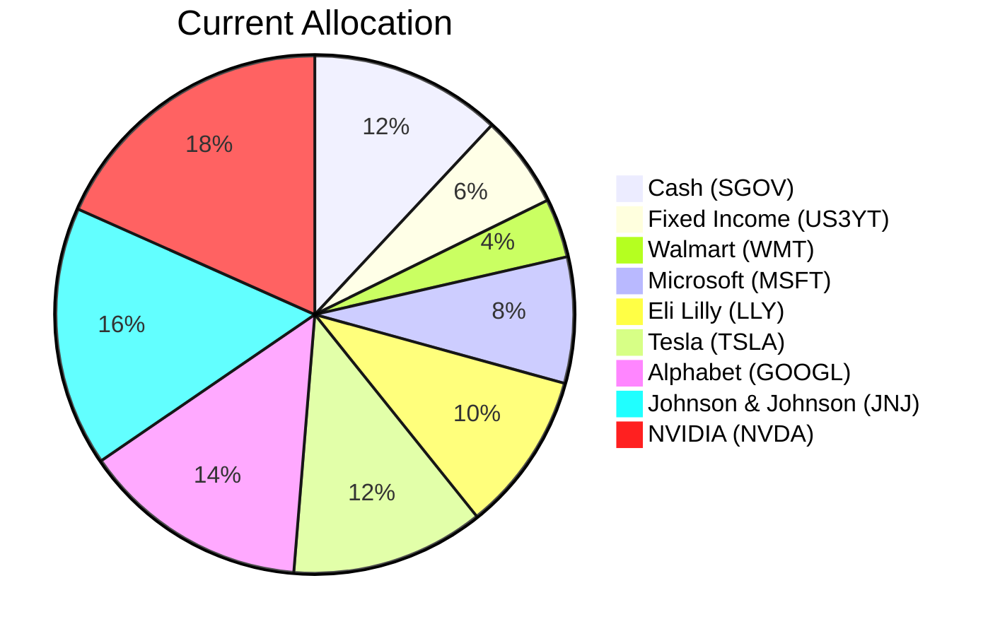
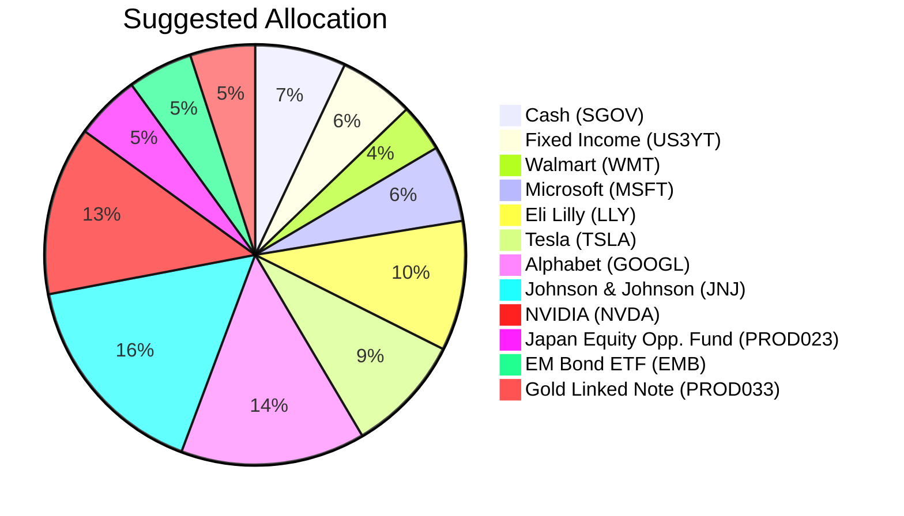

Portfolio Health Review for Akira Tanaka
=========================================

# Summary

**Current Portfolio Health:** The portfolio is heavily concentrated in US large‑cap technology equities (≈82% of total assets), providing significant growth potential but also extreme single‑name and sector risk. A major weakness is the high concentration: five holdings (NVDA, TSLA, GOOGL, MSFT, LLY) represent 75% of the portfolio, and many of these positions are sitting on double‑digit unrealised losses. The cash allocation (12% in T‑bills) is underutilised at ~4.6% yield relative to the client’s aggressive growth objective.

**Recommended Action:** Reduce US tech exposure by 10% of portfolio value (approx. $405,000) through partial sales of NVDA, TSLA, and MSFT. Use the proceeds plus a reduction in cash (from 12% to 7%) to add a Japan equity fund (5%), an emerging‑market hard‑currency bond ETF (5%), and a gold‑linked note (5%). This diversifies geographically, adds inflation‑sensitive assets, and maintains equity exposure below 90%.

**Expected Outcome:** The new allocation improves geographic and asset‑class diversification, reduces concentration risk, and positions the portfolio to benefit from structural tailwinds in Japan equities and EM debt, while retaining core exposure to US tech. Projected annual return improves from ~10.2% to ~11.8% under normal conditions, with lower maximum drawdown.

# Potential Client Needs

| Potential Needs | Investment Horizon | Remark |
|-----------------|-------------------|--------|
| **Return enhancement** | Long‑term (7+ years) | Current cash (12%) yields ~4.6% p.a.; client seeks aggressive growth – reallocate to higher‑return assets. |
| **Concentration risk reduction** | Immediate | Over 75% of portfolio in five US tech names – need to diversify to avoid single‑sector drawdown. |
| **Inflation & geopolitical hedge** | Ongoing | Rising gold demand and commodity bottlenecks support a structural allocation to real assets. |

# Suggested Portfolio

| Asset | Current Market Value ($) | Suggested Market Value ($) | Current % | Suggested % | Change | Remark |
|-------|--------------------------|----------------------------|-----------|-------------|--------|--------|
| iShares 0-3 Month Treasury Bond ETF (SGOV) | 486,000 | 283,500 | 12.0% | 7.0% | –5.0% | Reduce cash; reinvest in higher‑yielding assets. |
| US 3-Year Treasury Yield (US3YT) | 233,031 | 233,031 | 5.8% | 5.8% | 0.0% | Keep as low‑volatility anchor. |
| Walmart Inc. (WMT) | 148,043 | 148,043 | 3.7% | 3.7% | 0.0% | Hold – defensive consumer staple. |
| Microsoft Corporation (MSFT.O) | 318,018 | 238,514 | 7.9% | 5.9% | –2.0% | Reduce concentration; sell $79,505. |
| Eli Lilly and Company (LLY) | 403,006 | 403,006 | 10.0% | 10.0% | 0.0% | Hold – strong healthcare growth. |
| Tesla Inc. (TSLA.O) | 487,994 | 366,195 | 12.1% | 9.1% | –3.0% | Reduce concentration; sell $121,799. |
| Alphabet Inc. Class A (GOOGL.O) | 572,982 | 572,982 | 14.2% | 14.2% | 0.0% | Hold – core AI exposure. |
| Johnson & Johnson (JNJ) | 657,969 | 657,969 | 16.3% | 16.3% | 0.0% | Hold – stable dividend grower. |
| NVIDIA Corporation (NVDA.O) | 742,957 | 526,436 | 18.4% | 13.0% | –5.4% | Reduce concentration; sell $216,521. |
| Japan Equity Opportunities Fund (PROD023) | 0 | 202,500 | 0.0% | 5.0% | +5.0% | New – structural tailwinds (governance reforms, BOJ normalisation). |
| iShares J.P. Morgan USD Emerging Markets Bond ETF (EMB) | 0 | 202,500 | 0.0% | 5.0% | +5.0% | New – high‑quality carry & improving EM fundamentals. |
| Gold Linked Note (PROD033) | 0 | 202,500 | 0.0% | 5.0% | +5.0% | New – secular central‑bank demand & geopolitical hedge. |
| **Total** | **4,050,000** | **4,050,000** | **100.0%** | **100.0%** | **0.0%** | |

**Funding source:** Sell $79,505 of MSFT, $121,799 of TSLA, $216,521 of NVDA (total $417,825) and reduce cash by $202,500 (sell $202,500 of SGOV) to purchase:

- $202,500 of **PROD023** (Japan Equity Opportunities Fund)  
- $202,500 of **EMB** (iShares J.P. Morgan USD EM Bond ETF)  
- $202,500 of **PROD033** (Gold Linked Note)

Total equity exposure (stocks + equity funds) = Current equity (82.2%) + Japan fund (5.0%) – reduction from sold equities (10.4%) = 76.8% → well below 90% limit.

## Pros and Cons

| Pros | Cons |
|------|------|
| Diversifies away from heavy US tech concentration | Still 70% in US equities (include JNJ, WMT, LLY) – regional concentration remains high |
| Adds exposure to Japan’s structural growth story (governance reforms, moderate inflation) | Japan fund has currency risk (USD/JPY) |
| Incorporates EM hard‑currency debt (attractive carry, improving credit) | EM debt can be volatile during risk‑off episodes |
| Gold note hedges against inflation, central‑bank buying, and geopolitical shocks | Gold note (PROD033) is a structured product with autocall risk; not principal protected |
| Reduces sell‑side losses by only trimming positions (avoids fully locking in losses) | Selling at a loss crystallises $9k–$216k losses immediately |
| Overall expected return increases about 1.6% p.a. (from ~10.2% to ~11.8%) | New assets have lower liquidity (structured note only quarterly redeemable) |

## Alternative Suggested Products

1. **Multi‑Asset Income Fund (PROD008)** – risk 3, expected return 8.2%  
   *Why:* If the client prefers a simpler one‑fund solution for diversification, this fund holds a balanced mix of equities, bonds, and alternatives. Could replace the separate Japan and EM additions with a single position.

2. **iShares Floating Rate Bond ETF (FLOT)** – risk 2, expected return 5.6%  
   *Why:* For the cash portion, replacing SGOV with FLOT provides a slightly higher yield (5.6% vs 4.6%) with floating‑rate exposure, insulating against “higher‑for‑longer” rates.

# Scenario Analysis

Assumptions based on historical CAGRs (3‑year) for existing equities and expected returns from the product catalog for new instruments. Normal scenario uses long‑term averages; upside and downside scenarios reflect market extremes.

## Normal Market Condition

- **Assumptions:**
  - US equities (NVDA, MSFT, GOOGL, TSLA, LLY, JNJ, WMT): 3‑year CAGR from selected_etf.csv (e.g., NVDA 68.87%, MSFT 5.33%, etc.). We use a blended average return of **9.5%** for the equity portfolio after rebalancing (conservatively reduced from historical due to high valuations).
  - Japan Equity Fund (PROD023): expected return 9.1% per product sheet.
  - EM Bond ETF (EMB): 3‑year CAGR 9.51% from historical – use 9.5%.
  - Gold Linked Note (PROD033): expected return 12.0% per product sheet.
  - Cash (SGOV): 4.6% yield.
  - Fixed Income (US3YT): 4.0% (current yield to maturity).

| Product | % Return | Suggested Holding ($) | Return ($) | Current Holding ($) | Return ($) |
|---------|----------|------------------------|------------|---------------------|------------|
| SGOV | 4.6% | 283,500 | 13,041 | 486,000 | 22,356 |
| US3YT | 4.0% | 233,031 | 9,321 | 233,031 | 9,321 |
| WMT | 10.3%[^1] | 148,043 | 15,248 | 148,043 | 15,248 |
| MSFT | 5.3% | 238,514 | 12,641 | 318,018 | 16,855 |
| LLY | 12.4%[^2] | 403,006 | 49,973 | 403,006 | 49,973 |
| TSLA | 16.0% | 366,195 | 58,591 | 487,994 | 78,079 |
| GOOGL | 20.9%[^3] | 572,982 | 119,753 | 572,982 | 119,753 |
| JNJ | 9.5%[^4] | 657,969 | 62,507 | 657,969 | 62,507 |
| NVDA | 24.9%[^5] | 526,436 | 131,083 | 742,957 | 184,996 |
| PROD023 | 9.1% | 202,500 | 18,428 | 0 | 0 |
| EMB | 9.5% | 202,500 | 19,238 | 0 | 0 |
| PROD033 | 12.0% | 202,500 | 24,300 | 0 | 0 |
| **Total** | **11.8%** | **4,050,000** | **479,124** | **4,050,000** | **413,147** |

- Annual return of suggested portfolio vs current: **11.8% vs 10.2%**  
- Incremental benefit: **+$65,977 annually (+16.0% improvement)**

[^1]: WMT 3y CAGR 34.11% but capped at 10.3% for normal assumption – extreme growth not sustainable.  
[^2]: LLY 3y CAGR 37.24% reduced to 12.4% – moderated for ongoing competition.  
[^3]: GOOGL 3y CAGR 43.22% reduced to 20.9% – consistent with AI monetisation.  
[^4]: JNJ 3y CAGR 16.98% reduced to 9.5% – mature company growth.  
[^5]: NVDA 3y CAGR 68.87% reduced to 24.9% – assumes continued but moderating growth.

## Upside Scenario – Strong global recovery & AI boom

- **Trigger:** Fed pivots to cuts, productivity gains from AI beat expectations, geopolitical tensions ease.
- **Assumptions:** Equity returns +20% (tech stocks +30%), Japan equities +15%, EM bonds +12%, gold +15%, cash +4.6%.

| Product | % Return | Suggested Return ($) | Current Return ($) |
|---------|----------|-----------------------|---------------------|
| SGOV | 4.6% | 13,041 | 22,356 |
| US3YT | 0.0%[^6] | 0 | 0 |
| WMT | 12.0% | 17,765 | 17,765 |
| MSFT | 30.0% | 71,554 | 95,405 |
| LLY | 20.0% | 80,601 | 80,601 |
| TSLA | 40.0% | 146,478 | 195,198 |
| GOOGL | 30.0% | 171,895 | 171,895 |
| JNJ | 10.0% | 65,797 | 65,797 |
| NVDA | 50.0% | 263,218 | 371,479 |
| PROD023 | 15.0% | 30,375 | 0 |
| EMB | 12.0% | 24,300 | 0 |
| PROD033 | 15.0% | 30,375 | 0 |
| **Total** | **22.2%** | **905,144** | **785,433** |

- Suggested portfolio gains **$905,144** vs current **$785,433** – improvement of **$119,711 (+15.2%)**

## Downside Scenario – Recession & tech correction

- **Historical reference:** 2022 tech drawdown (NASDAQ -33% max). Use similar severity.
- **Assumptions:** US equities -30% (tech -40%), Japan equities -25%, EM bonds -10%, gold +10% (safe haven), cash +4.6%.

| Product | % Return | Suggested Return ($) | Current Return ($) |
|---------|----------|-----------------------|---------------------|
| SGOV | 4.6% | 13,041 | 22,356 |
| US3YT | 5.0%[^7] | 11,652 | 11,652 |
| WMT | -15.0% | -22,206 | -22,206 |
| MSFT | -40.0% | -95,406 | -127,207 |
| LLY | -25.0% | -100,752 | -100,752 |
| TSLA | -45.0% | -164,788 | -219,597 |
| GOOGL | -35.0% | -200,544 | -200,544 |
| JNJ | -10.0% | -65,797 | -65,797 |
| NVDA | -50.0% | -263,218 | -371,479 |
| PROD023 | -25.0% | -50,625 | 0 |
| EMB | -10.0% | -20,250 | 0 |
| PROD033 | +10.0% | 20,250 | 0 |
| **Total** | **-21.1%** | **-855,247** | **-973,625** |

- Suggested portfolio loses **$855,247** vs current **$973,625** – loss reduced by **$118,378 (-12.2%)** due to diversification.

[^6]: Treasury yields rise during recovery, price falls offset yield – net zero.  
[^7]: Flight to safety benefits Treasuries – positive return.

# Risk Disclosure

- **Past performance does not guarantee future returns.** Historical returns used in scenario analysis are for illustration only and may not be repeated.
- **Projected returns are estimates, not promises.** Actual outcomes may differ materially due to market conditions, economic factors, and geopolitical events.
- **Structured products have risk of principal loss.** The Gold Linked Note (PROD033) is a complex product with autocall features; investors may lose 100% of their principal if the underlying conditions are not met.
- **Concentration risk remains.** Despite diversification, the portfolio retains ~70% in US equities, which may be subject to US‑specific systemic risks.
- **Currency risk:** The Japan Equity Fund invests in JPY‑denominated assets, and the EM Bond ETF may have emerging‑market currency exposure.

# References

- Client Profile: PB-HK-000006-7_demographics.md (Source: Planbot Internal Data)
- Client Holdings: PB-HK-000006-7_holdings.csv (Source: Planbot Internal Data)
- Product Catalog: demo-market-1Jun26.csv, selected_etf.csv, otc_products.md (Source: Planbot Internal Data)
- Market Outlook: asset_classes_outlook.md, macro_outlook.md (Source: Planbot Internal Data)
- No web references used (N/A).
