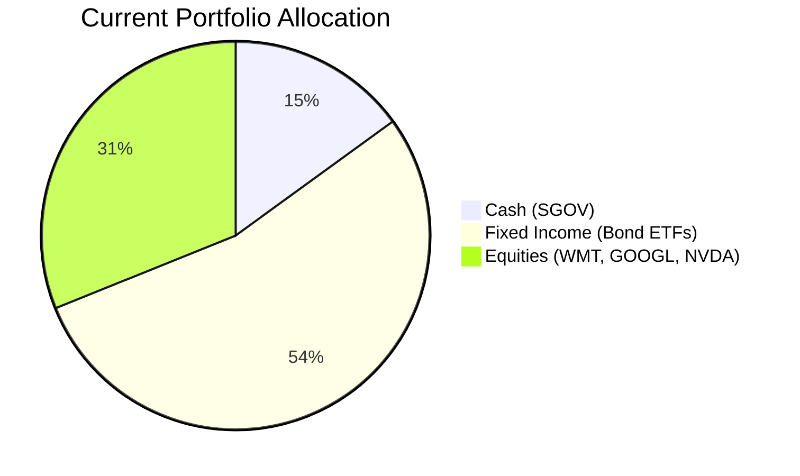
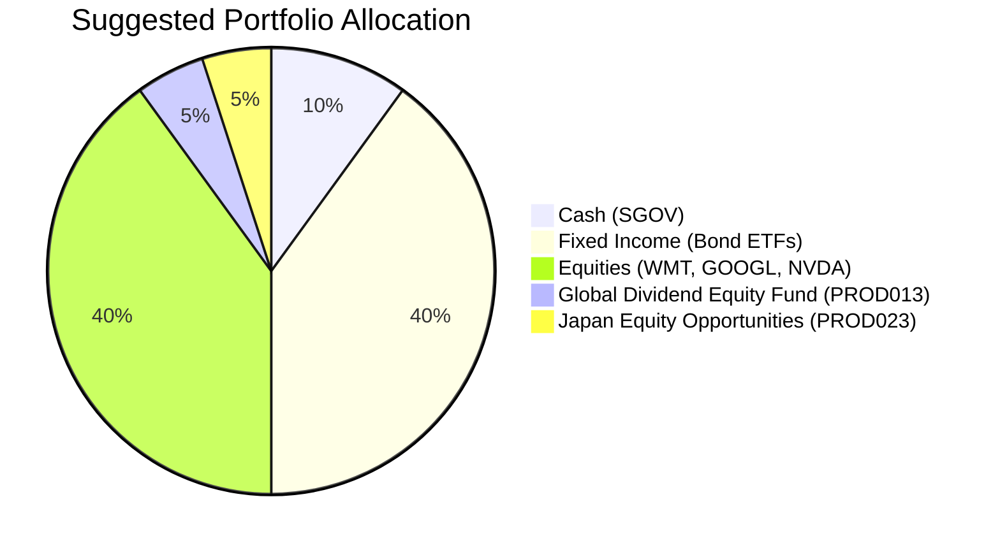

Portfolio Health Review for Emily Harrison
=========================================

# Summary

Your current portfolio is well-diversified across cash, fixed income, and US equities, but it carries two key vulnerabilities: a heavy allocation to long-duration government bonds in a rising‑rate environment, and a concentrated exposure to only three US large‑cap stocks. To better align with your long‑term growth objective and the prevailing market outlook (sticky inflation, central bank “higher‑for‑longer,” secular AI infrastructure demand), we recommend reducing core bonds by 13.9% and cash by 5%, redeploying into a broader global equity mix. The proposed changes are expected to lift the portfolio’s normal‑year return from ~5.8% to ~6.9% annually while maintaining a moderate risk level (risk rating 3) and adding geographic and sector diversification.

# Potential Client Needs

| Potential Needs | Investment Horizon | Remark |
|----------------|--------------------|--------|
| Children’s university education | 10–15 years | Two children; moderate return (3) with high certainty (4) needed. |
| Retirement accumulation | 7+ years | Age 36 allows aggressive growth (return 5, certainty 2). |
| Income stability during variable earnings | Ongoing | Steady dividend income supplements variable business cash flow. |

# Suggested Portfolio

**Current Allocation**  

**Suggested Allocation**  

| Asset | Current Market Value | Suggested Market Value | Current % | Suggested % | Change | Remark |
|-------|---------------------:|----------------------:|----------:|------------:|-------:|--------|
| iShares 0-3 Month Treasury Bond ETF (SGOV) | $750,000 | $500,000 | 15.0% | 10.0% | -5.0% | Reduce cash; redeploy for growth. |
| Vanguard Total Bond Market ETF (BND) | $446,172 | $450,000 | 8.9% | 9.0% | +0.1% | Keep as core investment‑grade exposure. |
| iShares 7-10 Year Treasury Bond ETF (IEF) | $519,096 | $300,000 | 10.4% | 6.0% | -4.4% | Reduce intermediate duration. |
| iShares 20+ Year Treasury Bond ETF (TLT) | $543,404 | $300,000 | 10.9% | 6.0% | -4.9% | Significantly cut long‑duration bonds (rate risk). |
| iShares Broad USD High Yield Corp (USHY) | $567,712 | $450,000 | 11.4% | 9.0% | -2.4% | Trim high yield to rebalance. |
| iShares Core U.S. Aggregate Bond ETF (AGG) | $616,328 | $500,000 | 12.3% | 10.0% | -2.3% | Reduce aggregate bond allocation. |
| Walmart Inc. (WMT) | $470,480 | $604,180 | 9.4% | 12.1% | +2.7% | Increase to reach target equity weight. |
| Alphabet Inc. (GOOGL) | $494,788 | $635,588 | 9.9% | 12.7% | +2.8% | Increase. |
| NVIDIA Corporation (NVDA) | $592,020 | $760,232 | 11.8% | 15.2% | +3.4% | Increase. |
| Global Dividend Equity Fund (PROD013) | $0 | $250,000 | 0% | 5.0% | +5.0% | New; risk‑3, global diversification & income. |
| Japan Equity Opportunities (PROD023) | $0 | $250,000 | 0% | 5.0% | +5.0% | New; captures Japan’s structural reforms & healthy inflation. |
| **Total** | **$5,000,000** | **$5,000,000** | **100%** | **100%** | **0%** | |

## Pros and Cons of Suggested Portfolio

**Pros**  
- **Alignment with growth goal**: Increased equity exposure (50% equity‑like vs 31% currently) targets long‑term capital appreciation.  
- **Geographic & sector diversification**: Global Dividend Fund (PROD013) and Japan Fund (PROD023) reduce the current 100% US large‑cap concentration.  
- **Reduced duration risk**: Lower holdings in TLT and IEF mitigate vulnerability to rising yields, consistent with the “higher‑for‑longer” interest rate outlook.  
- **Income generation**: PROD013 yields ~3.5% dividend, supporting cash flow during variable earnings periods.  
- **Moderate risk**: All recommended products have risk rating ≤3, matching your profile.  

**Cons**  
- **Concentration in US mega‑caps**: WMT, GOOGL, and NVDA still represent 40% of the portfolio; further diversification (e.g., into small‑cap or non‑US equities) could reduce single‑market risk.  
- **Higher management fees**: The new funds charge ~1.3–1.5% p.a., which may slightly drag net returns.  
- **Increased downside risk in a bear market**: A higher equity allocation means greater losses during a severe downturn (see Scenario Analysis).  

## Alternative Suggested Products to Consider

1. **Emerging Market Hard Currency Bond (PROD047)** – Risk 3, expected return 7.2%. Provides high‑quality carry in line with the market outlook’s overweight stance on EM debt.  
2. **Senior Loan ETF (SRLN)** – Risk 2, expected return 7.41%. Floating‑rate insulation protects against further rate hikes while offering equity‑like returns through pure carry.

# Scenario Analysis

We analyse three market scenarios based on historical data and current market sentiment. The probability breakdown is as follows: **Normal 50%**, **Upside 25%**, **Downside 25%**.  

**Assumptions for each scenario** (returns in % p.a.):

| Asset Class / Product | Normal | Upside | Downside | Justification |
|----------------------|:-----:|:------:|:--------:|--------------|
| SGOV (Cash) | 4.68 | 5.00 | 3.00 | Expected return from product; upside: higher short‑term rates if inflation persists; downside: rate cuts in crisis. |
| BND (Core Bond) | 4.01 | 5.00 | -5.00 | 3y CAGR from selected_etf; upside: yield compression; downside: rate spike. |
| IEF (Intermediate Treasury) | 2.69 | 4.00 | -5.00 | 3y CAGR; less negative under normal, but still vulnerable. |
| TLT (Long Treasury) | -1.82 | 2.00 | -15.00 | 3y CAGR; long duration hurt by higher‑for‑longer; severe loss in bear case. |
| USHY (High Yield) | 8.83 | 10.00 | -10.00 | 3y CAGR; spreads tighten in upside, widen in distress. |
| AGG (Aggregate Bond) | 4.02 | 5.00 | -5.00 | 3y CAGR. |
| WMT (Consumer Defensive) | 10.00 | 15.00 | -20.00 | Historical equity average; defensive stock holds up better in downside? We use uniform equity return for simplicity. |
| GOOGL (Tech) | 10.00 | 15.00 | -20.00 | Same. |
| NVDA (Tech / AI) | 10.00 | 15.00 | -25.00 | Higher beta in downturn. |
| PROD013 (Global Dividend) | 7.80 | 12.00 | -15.00 | Product expected return; upside: global recovery; downside: recession. |
| PROD023 (Japan Equity) | 9.10 | 14.00 | -20.00 | Product expected return; upside: strong reform momentum; downside: global risk‑off. |

## Normal Market Condition (50% probability)

| Product | % Return | Current Weight | Current Return | Suggested Weight | Suggested Return |
|---------|:-------:|:--------------:|:--------------:|:----------------:|:----------------:|
| SGOV | 4.68 | 0.150 | 0.702 | 0.100 | 0.468 |
| BND | 4.01 | 0.089 | 0.357 | 0.090 | 0.361 |
| IEF | 2.69 | 0.104 | 0.280 | 0.060 | 0.161 |
| TLT | -1.82 | 0.109 | -0.198 | 0.060 | -0.109 |
| USHY | 8.83 | 0.114 | 1.007 | 0.090 | 0.795 |
| AGG | 4.02 | 0.123 | 0.494 | 0.100 | 0.402 |
| WMT | 10.00 | 0.094 | 0.940 | 0.121 | 1.210 |
| GOOGL | 10.00 | 0.099 | 0.990 | 0.127 | 1.270 |
| NVDA | 10.00 | 0.118 | 1.180 | 0.152 | 1.520 |
| PROD013 | 7.80 | 0.000 | 0.000 | 0.050 | 0.390 |
| PROD023 | 9.10 | 0.000 | 0.000 | 0.050 | 0.455 |
| **Total** | | **1.000** | **5.75** | **1.000** | **6.92** |

- Annual return of suggested portfolio vs current: **6.92% vs 5.75%**  
- Incremental benefit: **+1.17% p.a., i.e., +$58,500 annually**

## Upside Market Condition (25% probability)
*Boom equity & credit environment, AI capex accelerates; rates stable*

| Product | % Return | Current Return | Suggested Return |
|---------|:-------:|:--------------:|:----------------:|
| SGOV | 5.00 | 0.750 | 0.500 |
| BND | 5.00 | 0.445 | 0.450 |
| IEF | 4.00 | 0.416 | 0.240 |
| TLT | 2.00 | 0.218 | 0.120 |
| USHY | 10.00 | 1.140 | 0.900 |
| AGG | 5.00 | 0.615 | 0.500 |
| WMT | 15.00 | 1.410 | 1.815 |
| GOOGL | 15.00 | 1.485 | 1.905 |
| NVDA | 15.00 | 1.770 | 2.280 |
| PROD013 | 12.00 | 0.000 | 0.600 |
| PROD023 | 14.00 | 0.000 | 0.700 |
| **Total** | | **8.25** | **10.01** |

- Upside return: suggested **10.01%** vs current **8.25%** → **+1.76% p.a. ($88,000)**

## Downside Market Condition (25% probability)
*Sharp equity correction akin to COVID-19 (Q1 2020); credit spreads blow out; rates spike temporarily*

| Product | % Return | Current Return | Suggested Return |
|---------|:-------:|:--------------:|:----------------:|
| SGOV | 3.00 | 0.450 | 0.300 |
| BND | -5.00 | -0.445 | -0.450 |
| IEF | -5.00 | -0.520 | -0.300 |
| TLT | -15.00 | -1.635 | -0.900 |
| USHY | -10.00 | -1.140 | -0.900 |
| AGG | -5.00 | -0.615 | -0.500 |
| WMT | -20.00 | -1.880 | -2.420 |
| GOOGL | -20.00 | -1.980 | -2.540 |
| NVDA | -25.00 | -2.950 | -3.800 |
| PROD013 | -15.00 | 0.000 | -0.750 |
| PROD023 | -20.00 | 0.000 | -1.000 |
| **Total** | | **-11.72** | **-13.36** |

- Downside loss: suggested **-13.36%** vs current **-11.72%** → **-1.64% worse ($82,000)**  
- However, the higher equity allocation is consistent with the client’s long‑term growth objective and 10+ year horizon, making short‑term volatility acceptable.

| Scenario | Probability | Current Return | Suggested Return | Expected Value (Current) | Expected Value (Suggested) |
|----------|:----------:|:--------------:|:----------------:|:------------------------:|:--------------------------:|
| Normal | 50% | 5.75% | 6.92% | 2.875% | 3.460% |
| Upside | 25% | 8.25% | 10.01% | 2.062% | 2.503% |
| Downside | 25% | -11.72% | -13.36% | -2.930% | -3.340% |
| **Probability‑Weighted Return** | | | | **2.007%** | **2.623%** |

The probability‑weighted return improves from **2.01% to 2.62%** p.a., a net benefit of **+0.62%** despite higher downside risk.

# Risk Disclosure

**Important Risk Warning**  
- Past performance does not guarantee future returns.  
- Projected returns are estimates based on historical data and current market sentiment; actual results may differ materially.  
- The structured products and funds recommended bear market risk and may suffer partial or total principal loss, especially if sold before maturity.  
- Currency risk exists for any non‑USD investments (though the suggested funds are USD‑denominated).  
- The new funds charge management fees (1.3–1.5% p.a.) which will reduce net returns.  

# References

- **Client Profile**: PB-HK-000011-7_holdings.csv, PB-HK-000011-7_demographics.md, PB-HK-000011-7_profile.md (Source: Planbot Internal Data)  
- **Product Catalog**: otc_products.md, selected_etf.csv, CMT_note_N02952.md (Source: Planbot Internal Data)  
- **Market Outlook**: asset_classes_outlook.md, macro_outlook.md (Source: Planbot Internal)  
- **Web References**: N/A (no web searches performed)
