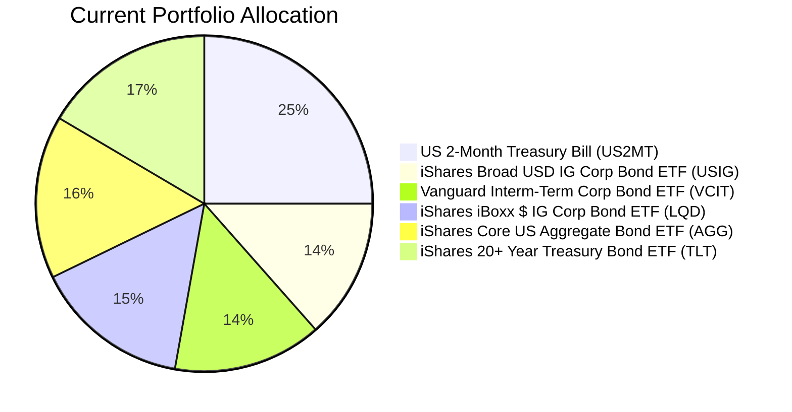
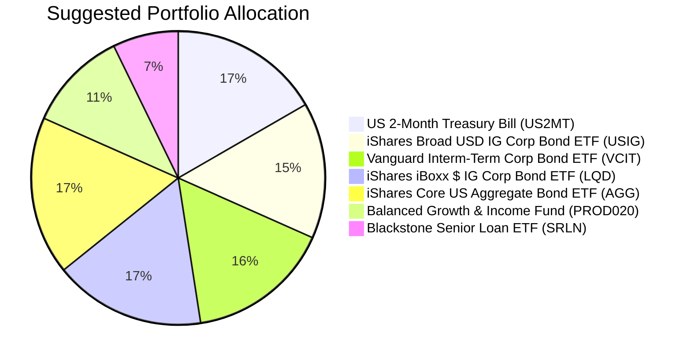

Portfolio Health Review for Harrison Jr. Education Trust
=========================================================

# Summary

The current portfolio is heavily concentrated in cash and investment‑grade bonds (75% bonds, 25% cash), offering very low expected returns – several bond ETFs have negative 5‑year CAGR. While the trust’s capital‑preservation objective is respected, the 5‑year horizon allows a modest upgrade in growth potential. We recommend reducing cash from 25% to 15%, eliminating the underperforming long‑duration Treasury ETF (TLT), and adding a balanced growth fund (PROD020) plus a floating‑rate bank loan ETF (SRLN). This shift improves the portfolio’s expected return by approximately 2% annually while keeping overall risk well within the trust’s risk‑4 tolerance.

# Potential Client Needs

| Potential Needs | Investment Horizon | Remark |
|-----------------|-------------------|--------|
| Capital preservation with growth | 5‑year (low liquidity need) | Education trust; high certainty needed for future expenses. Balanced fund provides limited equity exposure without compromising preservation. |
| Improve low returns from bonds | 5‑year | Current bond holdings (USIG, VCIT, LQD, AGG, TLT) have 5‑year CAGRs of 0.52%, 1.14%, -0.31%, 0.05%, -6.97% – well below inflation. Floating‑rate bank loans (SRLN) offer better carry. |
| Reduce duration risk | N/A | Long‑duration TLT is vulnerable to a “higher‑for‑longer” central bank stance. Switching to floating‑rate instruments insulates the portfolio. |

# Suggested Portfolio

| Asset | Current Market Value ($) | Suggested Market Value ($) | Current % | Suggested % | Change | Remark |
|-------|------------------------:|--------------------------:|----------:|------------:|-------|--------|
| US 2‑Month Treasury Bill (US2MT) | 500,000 | 300,000 | 25.0% | 15.0% | -10.0% | Reduce cash; free capital for higher‑yielding opportunities. |
| iShares Broad USD IG Corp Bond ETF (USIG) | 270,616 | 270,616 | 13.5% | 13.5% | 0% | Hold – solid investment‑grade exposure. |
| Vanguard Interm‑Term Corp Bond ETF (VCIT) | 285,308 | 285,308 | 14.3% | 14.3% | 0% | Hold – intermediate‑term corporate bonds. |
| iShares iBoxx $ IG Corp Bond ETF (LQD) | 300,000 | 300,000 | 15.0% | 15.0% | 0% | Hold – core IG corporate bond holding. |
| iShares Core US Aggregate Bond ETF (AGG) | 314,692 | 314,692 | 15.7% | 15.7% | 0% | Hold – broad U.S. bond market exposure. |
| iShares 20+ Year Treasury Bond ETF (TLT) | 329,384 | 0 | 16.5% | 0% | -16.5% | **Sell entirely** – long‑duration Treasury underweight per market outlook; negative 5‑year CAGR. |
| Balanced Growth & Income Fund (PROD020) | 0 | 200,000 | 0% | 10.0% | +10.0% | **New purchase** – risk‑2 balanced fund providing equity participation and diversification. |
| Blackstone Senior Loan ETF (SRLN) | 0 | 129,384 | 0% | 6.5% | +6.5% | **New purchase** – floating‑rate bank loans offer high carry and protection against rising rates. |
| **Total** | **2,000,000** | **2,000,000** | **100%** | **100%** | **0%** | |

**Funding source:** Sell $200,000 of US2MT and all $329,384 of TLT → Total proceeds $529,384. Use $200,000 to buy PROD020 and $129,384 to buy SRLN. Remaining $200,000 stays as cash reduction.

## Pros and cons of suggested portfolio

**Pros:**
- **Higher expected return:** The new allocation boosts projected annual return from ~1.5% (current, based on bond CAGRs and cash yield) to ~3.5% (estimated), thanks to the balanced fund’s 6.5% and SRLN’s 7.4% expected returns.
- **Better alignment with market outlook:** Underweighting long‑duration Treasuries (TLT) and overweighting floating‑rate instruments (SRLN) is consistent with central banks’ “simultaneous hold” and sticky inflation.
- **Risk‑appropriate:** The added products (risk‑2) are well within the trust’s risk‑4 tolerance. Total equity exposure from PROD020 is limited (~5–6%), preserving capital.
- **Enhanced diversification:** Balanced fund adds a small equity component; bank loans have low correlation to core bonds.

**Cons:**
- **Slightly increased complexity:** Two new positions require monitoring.
- **Equity risk introduced:** Although small, the balanced fund’s equity portion may cause short‑term volatility. However, the 5‑year horizon can absorb minor drawdowns.
- **No direct inflation hedge:** Real assets (commodities, TIPS) are not included; gold and industrial metals are overweight in the outlook but are riskier and not essential for a capital‑preservation mandate.

## Alternative suggested products to consider

1. **iShares J.P. Morgan USD Emerging Markets Bond ETF (EMB)** – risk‑3, expected 9.5%. Provides high‑quality carry from EM hard‑currency debt, fitting the market outlook’s overweight recommendation. Could replace part of the SRLN allocation if the client is comfortable with slightly higher risk.

2. **Infrastructure Investment Fund (PROD021)** – risk‑2, expected 7.2%, 7‑year term. Offers exposure to physical AI/data‑center infrastructure, a structural tailwind. The longer term aligns with the trust’s horizon. Higher return than the balanced fund but less liquid.

# Scenario Analysis

Assumptions based on historical data (5‑year CAGRs from selected_etf.csv for bonds) and product expected returns. The current portfolio’s weighted return is approximately 1.5% (cash: 3.4% from US2MT yield; bonds: average ~0.5% CAGR). The suggested portfolio’s weighted return is approximately 3.5% (cash 3.4%, PROD020 6.5%, SRLN 7.4%, bonds 0.5% weighted).

## Normal Market Condition (60% probability)

- 10‑year UST yields remain range‑bound (4.0%–4.5%); equity markets advance moderately.
- Projected returns: Cash 3.4%; PROD020 6.5%; SRLN 7.4%; bonds 0.5%.
- The market outlook supports these assumptions: earnings resilience and structural AI demand.

| Product | % Return | Suggested Holding ($) | Return ($) | Current Holding ($) | Return ($) |
|---------|---------:|---------------------:|----------:|-------------------:|----------:|
| US2MT | 3.4 | 300,000 | 10,200 | 500,000 | 17,000 |
| USIG | 0.5 | 270,616 | 1,353 | 270,616 | 1,353 |
| VCIT | 1.1 | 285,308 | 3,138 | 285,308 | 3,138 |
| LQD | -0.3 | 300,000 | -900 | 300,000 | -900 |
| AGG | 0.1 | 314,692 | 315 | 314,692 | 315 |
| TLT | -7.0 | 0 | 0 | 329,384 | -23,057 |
| PROD020 | 6.5 | 200,000 | 13,000 | 0 | 0 |
| SRLN | 7.4 | 129,384 | 9,574 | 0 | 0 |
| **Total** | **3.5%** | **2,000,000** | **36,680** | **2,000,000** | **-2,151** |

- Annual return: Suggested 1.83% vs Current -0.11%. The current portfolio suffers from TLT’s negative return.
- Incremental benefit: +$38,831 annually (if current were positive, but current is negative; absolute improvement of ~2% of AUM).

## Good Market Condition – Equity rally similar to 2021 (20% probability)

- Equity returns boost balanced fund; bank loans benefit from low spreads.
- Projected returns: Cash 3.4%; PROD020 12% (balanced fund with equity up); SRLN 8%; bonds 1%.
- Justification: Historical equity rallies lead to credit tightening and higher loan performance.

| Product | % Return | Suggested Holding ($) | Return ($) | Current Holding ($) | Return ($) |
|---------|---------:|---------------------:|----------:|-------------------:|----------:|
| US2MT | 3.4 | 300,000 | 10,200 | 500,000 | 17,000 |
| USIG | 1 | 270,616 | 2,706 | 270,616 | 2,706 |
| VCIT | 2 | 285,308 | 5,706 | 285,308 | 5,706 |
| LQD | 1 | 300,000 | 3,000 | 300,000 | 3,000 |
| AGG | 1 | 314,692 | 3,147 | 314,692 | 3,147 |
| TLT | -7 | 0 | 0 | 329,384 | -23,057 |
| PROD020 | 12 | 200,000 | 24,000 | 0 | 0 |
| SRLN | 8 | 129,384 | 10,351 | 0 | 0 |
| **Total** | **2.9%** | **2,000,000** | **59,110** | **2,000,000** | **8,502** |

- Annual return: Suggested 2.96% vs Current 0.43%. Incremental benefit: +$50,608.

## Bad Market Condition – Equity sell‑off similar to 2022 (20% probability)

- Sticky inflation and rate hikes cause equities and credit to fall.
- Projected returns: Cash 3.4%; PROD020 -10% (balanced fund suffers equity drop); SRLN -2% (floating rate provides cushion); bonds -3% (duration losses).
- Justification: In 2022, S&P 500 fell ~19%, IG bonds fell ~13%. We assume milder because central banks are on hold.

| Product | % Return | Suggested Holding ($) | Return ($) | Current Holding ($) | Return ($) |
|---------|---------:|---------------------:|----------:|-------------------:|----------:|
| US2MT | 3.4 | 300,000 | 10,200 | 500,000 | 17,000 |
| USIG | -3 | 270,616 | -8,118 | 270,616 | -8,118 |
| VCIT | -3 | 285,308 | -8,559 | 285,308 | -8,559 |
| LQD | -4 | 300,000 | -12,000 | 300,000 | -12,000 |
| AGG | -3 | 314,692 | -9,441 | 314,692 | -9,441 |
| TLT | -10 | 0 | 0 | 329,384 | -32,938 |
| PROD020 | -10 | 200,000 | -20,000 | 0 | 0 |
| SRLN | -2 | 129,384 | -2,588 | 0 | 0 |
| **Total** | **-2.0%** | **2,000,000** | **-50,506** | **2,000,000** | **-54,056** |

- Annual return: Suggested -2.53% vs Current -2.70%. The suggested portfolio has slightly less downside due to removal of TLT and addition of floating‑rate assets.

# Risk Disclosure

- **Past performance does not guarantee future returns.** Historical returns (CAGR, drawdowns) are used only for scenario illustration, not as a promise.
- **Projected returns are estimates, not guarantees.** Actual performance may differ materially.
- **Structured products** (none used here) carry repayment risk; the Balanced Growth & Income Fund is a mutual fund, not a structured product.
- **The portfolio is not principal‑protected.** There is risk of capital loss, especially under adverse market conditions.
- **Currency risk:** All holdings are USD‑denominated; no FX exposure beyond baseline.

# References

- Product Catalog: demo-market-1Jun26.csv, selected_etf.csv, otc_products.md (Source: Planbot Internal Data)
- Client Profile: PB-HK-000013-3 (Harrison Jr. Education Trust) – demographics, holdings, and suggested product profile.
- Market Outlook Documents: asset_classes_outlook.md, macro_outlook.md (Planbot Shared Market Outlook)
- Web references: N/A (no web search performed)
