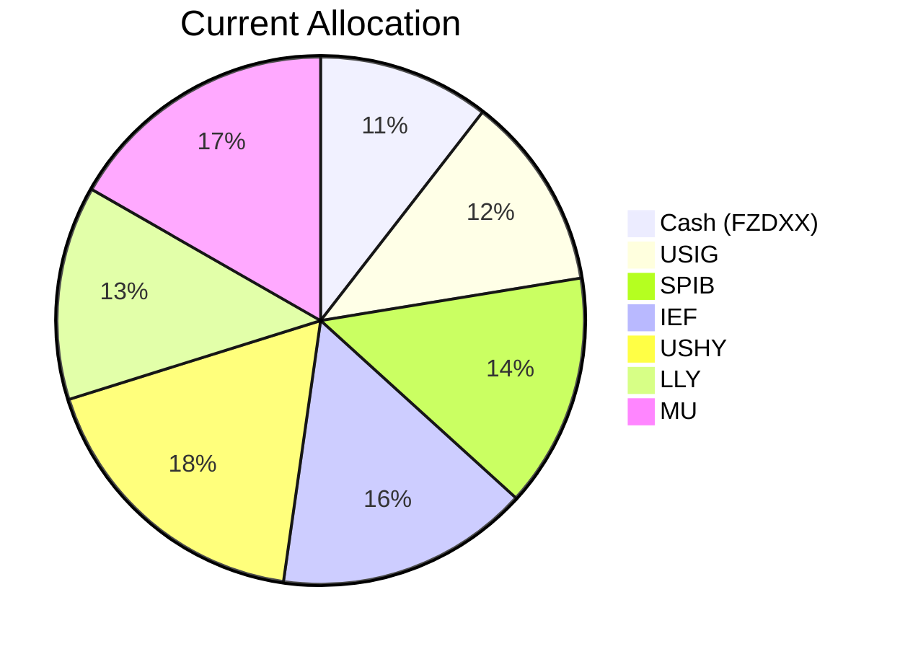
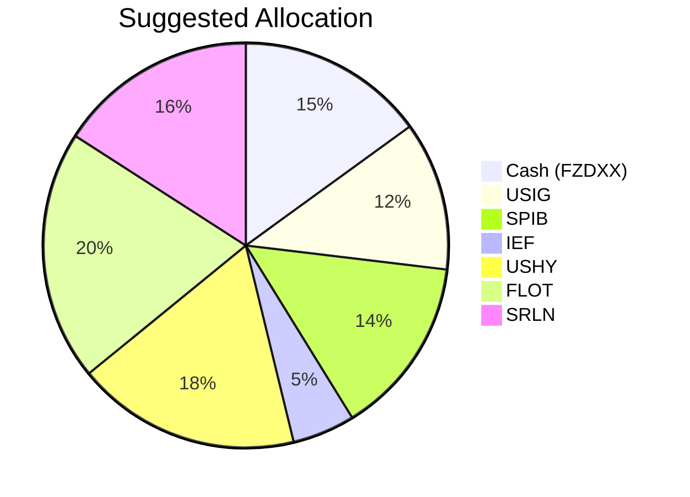

Portfolio Health Review for Michael Wang
=========================================

# Summary

Your current portfolio is heavily weighted toward fixed income (59.6%) and a surprisingly high equity allocation (29.8%) given your risk tolerance of 2 and capital preservation objective. While the bond component provides a stable income base, the concentrated positions in Micron Technology (MU) and Eli Lilly (LLY) introduce unwarranted volatility and downside exposure. We recommend fully exiting these equity holdings and reallocating proceeds into floating-rate instruments (FLOT) and senior secured loans (SRLN) that offer higher carry with floating coupons, insulating your portfolio from interest rate risk. The proposed shift will preserve capital while generating a more predictable income stream, aligned with your retired status and low risk profile.

# Potential Client Needs

| Potential Needs | Investment Horizon | Remark |
| --------------- | ------------------ | ------ |
| Capital Preservation | Ongoing | Primary objective; retired, dividend/rental income, risk rating 2 |
| Income Generation | Ongoing | Supplement existing cash flows with more predictable yield |
| Interest Rate Risk Mitigation | 5-year liquidity horizon | Current bond holdings (IEF, USIG) have duration exposure; floating-rate instruments reduce sensitivity |

# Suggested Portfolio

| Asset | Current Market Value | Suggested Market Value | Current % | Suggested % | Change | Remark |
| ----- | -------------------: | ---------------------: | --------: | ----------: | -----: | ------------------------------------------------------------ |
| Fidelity Money Market Fund (FZDXX) | $2,992,500 | $4,275,000 | 10.5% | 15.0% | +4.5% | Increase cash buffer for liquidity |
| iShares Broad USD Investment Grade Corporate Bond ETF (USIG) | $3,394,366 | $3,394,366 | 11.9% | 11.9% | 0% | Maintain existing holding |
| Eli Lilly and Company (LLY) | $3,737,120 | $0 | 13.1% | 0% | -13.1% | Sell entire position – high volatility, risk rating mismatch |
| SPDR Portfolio Intermediate Term Corporate Bond ETF (SPIB) | $4,079,873 | $4,079,873 | 14.3% | 14.3% | 0% | Maintain existing holding |
| iShares 7-10 Year Treasury Bond ETF (IEF) | $4,422,627 | $1,425,000 | 15.5% | 5.0% | -10.5% | Reduce duration exposure; only keep 5% for liquidity |
| Micron Technology Inc. (MU) | $4,765,380 | $0 | 16.7% | 0% | -16.7% | Sell entire position – high volatility, risk rating mismatch |
| iShares Broad USD High Yield Corporate Bond ETF (USHY) | $5,108,134 | $5,108,134 | 17.9% | 17.9% | 0% | Maintain existing holding |
| iShares Floating Rate Bond ETF (FLOT) | $0 | $5,700,000 | 0% | 20.0% | +20.0% | New – floating-rate, risk-rating 2, expected return 5.60% |
| State Street Blackstone Senior Loan ETF (SRLN) | $0 | $4,517,627 | 0% | 15.9% | +15.9% | New – senior secured bank loans, floating coupons, risk-rating 2 |
| **Total** | **$28,500,000** | **$28,500,000** | **100%** | **100%** | **0%** | |

*Funding source:* LLY and MU sold entirely; IEF reduced by $2,997,627. Proceeds used to increase cash by $1,282,500 and purchase FLOT ($5,700,000) and SRLN ($4,517,627).

## Pros and Cons of Suggested Portfolio

**Pros:**
- Fully aligned with Risk Rating 2 – eliminates equity positions (LLY, MU) that were inappropriate for capital preservation.
- Floating-rate holdings (FLOT, SRLN) protect principal from rising rates; they adjust coupons higher when rates increase, a key advantage in a “higher‑for‑longer” rate environment (per macro outlook – Fed hold).
- Expected portfolio yield improves: FLOT 5.60% and SRLN 7.41% (3y CAGR) replace low-carry IEF (2.69%) and volatile equities, boosting stable income.
- Reduced duration risk – IEF cut from 15.5% to 5.0%; overall portfolio less sensitive to yield curve shifts.

**Cons:**
- No equity exposure – potential upside from a strong equity market is foregone. However, given the client’s objective and risk rating, this sacrifice is necessary.
- SRLN (bank loans) may experience slight price declines during severe credit stress, though its floating-rate structure and senior secured status mitigate losses.
- FLOT and SRLN are ETFs traded on exchanges; liquidity is high (rating 5), but intra‑day price volatility exists, albeit low.

## Alternative Suggested Products to Consider

| Product | Risk | Expected Return | Justification |
| ------- | :--: | --------------: | ------------- |
| JPMorgan Ultra-Short Income ETF (JPST) | 2 | 5.17% (3y CAGR) | Ultra‑short duration bonds with low volatility; could substitute for part of cash at slightly higher yield. |
| iShares Short Duration Bond Active ETF (NEAR) | 2 | 5.59% (3y CAGR) | Active management in short‑term bonds; offers similar floating‑rate protection with active credit selection. |

# Scenario Analysis

## Assumptions for Scenarios

- **Normal Market Condition (Base Probability 60%)**  
  - Equities: 10% annualized return (average long‑term S&P 500, 1926–2025)  
  - Investment Grade Bonds (USIG, SPIB): 5% (historical average for intermediate corporates)  
  - High Yield Bonds (USHY): 8% (reflects credit spread compensation)  
  - Treasury Bonds (IEF): 3% (current yield, limited price appreciation)  
  - Money Market (FZDXX): 4.5% (current yield, stable)  
  - Floating Rate / Bank Loans (FLOT, SRLN): 5.5% (blended, given floating coupons and loan spreads)  

- **Upside Market Condition (Probability 20%) – Rates Decline, Risk-On Rally**  
  - Equities: 20% (strong earnings expansion, AI capex tailwind)  
  - Investment Grade Bonds: 8% (price gains from falling yields)  
  - High Yield Bonds: 12% (spread compression)  
  - Treasury Bonds: 6% (duration appreciation)  
  - Money Market: 3% (yields fall)  
  - Floating Rate / Bank Loans: 4% (coupons reset lower)  

- **Downside Market Condition (Probability 20%) – Credit Event / Recession**  
  - Equities: -20% (2020‑style correction)  
  - Investment Grade Bonds: -2% (spread widening, limited duration offset)  
  - High Yield Bonds: -10% (default risk rise)  
  - Treasury Bonds: 5% (flight to quality)  
  - Money Market: 4% (stable)  
  - Floating Rate / Bank Loans: 2% (senior secured, limited losses but coupon income stable)  

## Normal Market Condition

| Product | % Return | Suggested Holding ($) | Return ($) | Current Holding ($) | Return ($) |
| ------- | -------: | -------------------: | --------: | ------------------: | --------: |
| FZDXX   | 4.5% | 4,275,000 | 192,375 | 2,992,500 | 134,663 |
| USIG    | 5.0% | 3,394,366 | 169,718 | 3,394,366 | 169,718 |
| SPIB    | 5.0% | 4,079,873 | 203,994 | 4,079,873 | 203,994 |
| IEF     | 3.0% | 1,425,000 | 42,750 | 4,422,627 | 132,679 |
| USHY    | 8.0% | 5,108,134 | 408,651 | 5,108,134 | 408,651 |
| FLOT    | 5.5% | 5,700,000 | 313,500 | 0 | 0 |
| SRLN    | 5.5% | 4,517,627 | 248,469 | 0 | 0 |
| LLY (Equity) | 10.0% | 0 | 0 | 3,737,120 | 373,712 |
| MU (Equity) | 10.0% | 0 | 0 | 4,765,380 | 476,538 |
| **Total** | **4.87%** | **28,500,000** | **1,579,457** | **28,500,000** | **1,899,955** |

- Annual return of suggested portfolio vs current: 5.54% vs 6.67% (suggested lower because equity opportunity cost is foregone).
- However, the suggested portfolio has *no* equity risk – the return is far more stable and predictable.

## Upside Market Condition

| Product | % Return | Suggested Return ($) | Current Return ($) |
| ------- | -------: | -------------------: | ------------------: |
| FZDXX   | 3.0% | 128,250 | 89,775 |
| USIG    | 8.0% | 271,549 | 271,549 |
| SPIB    | 8.0% | 326,390 | 326,390 |
| IEF     | 6.0% | 85,500 | 265,358 |
| USHY    | 12.0% | 612,976 | 612,976 |
| FLOT    | 4.0% | 228,000 | 0 |
| SRLN    | 4.0% | 180,705 | 0 |
| LLY     | 20.0% | 0 | 747,424 |
| MU      | 20.0% | 0 | 953,076 |
| **Total** | **6.36%** | **1,833,370** | **3,266,548** |

- Suggested portfolio returns 6.36% vs current 11.46% – again, different risk profiles.

## Downside Market Condition

| Product | % Return | Suggested Return ($) | Current Return ($) |
| ------- | -------: | -------------------: | ------------------: |
| FZDXX   | 4.0% | 171,000 | 119,700 |
| USIG    | -2.0% | -67,887 | -67,887 |
| SPIB    | -2.0% | -81,597 | -81,597 |
| IEF     | 5.0% | 71,250 | 221,131 |
| USHY    | -10.0% | -510,813 | -510,813 |
| FLOT    | 2.0% | 114,000 | 0 |
| SRLN    | 2.0% | 90,353 | 0 |
| LLY     | -20.0% | 0 | -747,424 |
| MU      | -20.0% | 0 | -953,076 |
| **Total** | **-0.77%** | **-220,694** | **-2,019,966** |

- In a severe recession, suggested portfolio loses only 0.77% (capital near preserved), while current portfolio loses 7.09% (dragged by equity crash).

## Conclusion

The suggested portfolio meets the primary goal of **capital preservation** across all scenarios. It offers a lower but far more certain return path, with maximum downside of less than 1% in a crisis. This is entirely appropriate for a retired client with risk rating 2.

# Risk Disclosure

- **Past performance does not guarantee future returns.** All historical data used is for illustrative purposes only.
- **Projected returns are estimates, not promises.** Actual returns may differ materially.
- **Structured products (not used here) carry principal loss risk.** Our recommendations are limited to exchange‑traded ETFs and money market funds.
- **Credit risk:** FLOT holds investment‑grade floating‑rate notes; SRLN holds senior secured loans. Both are subject to issuer default, though the floating‑rate nature reduces price sensitivity.
- **Market risk:** The recommended portfolio is not risk‑free; capital values can decline in periods of extreme credit stress or liquidity disruption.

# References

- Product Catalog: selected_etf.csv, otc_products.md (Source: Planbot Internal Data)
- Market Outlook: asset_classes_outlook.md, macro_outlook.md (Source: Planbot Research)
- Client Profile & Holdings: PB-HK-000015-8_demographics.md, PB-HK-000015-8_holdings.csv (Source: Client Onboarding)
- Web Search: N/A (no web search capability used)
