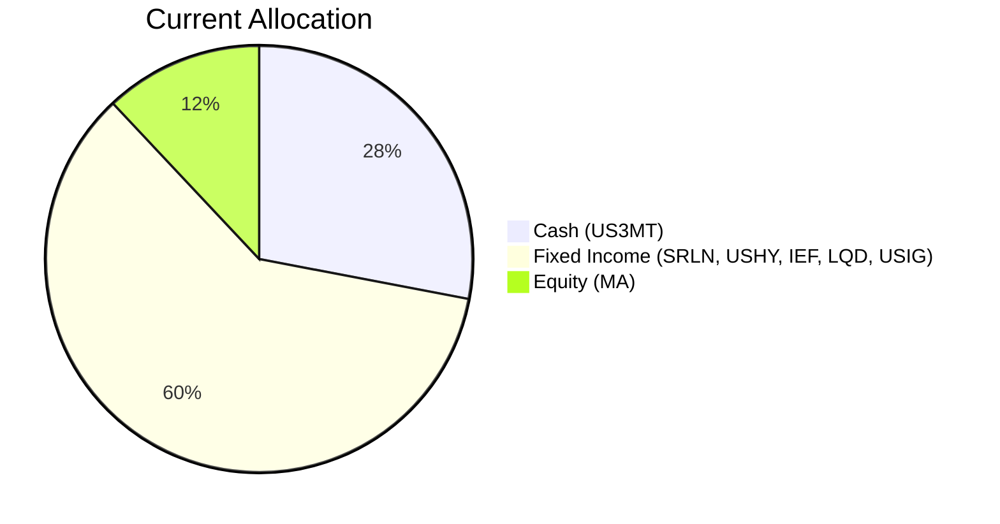
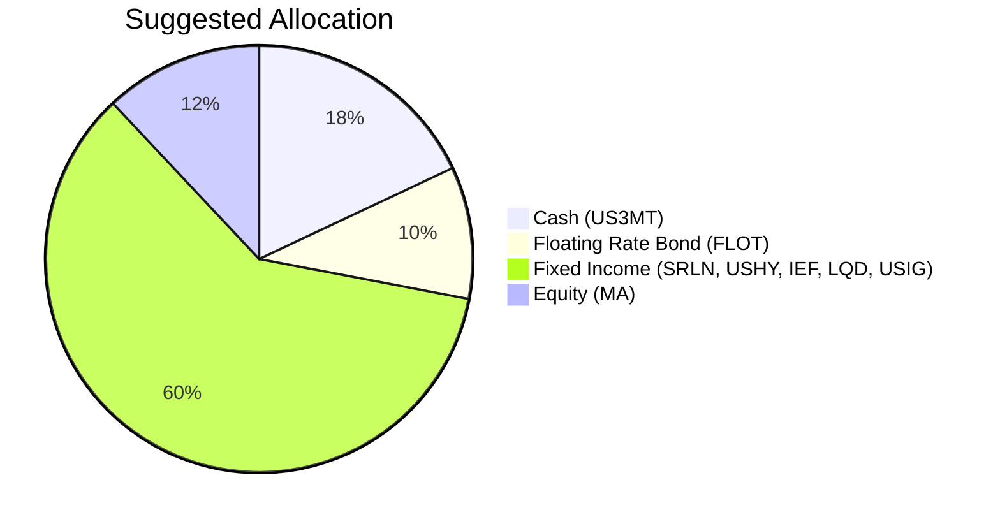

Portfolio Health Review for David Wu
=========================================

# Summary

Your current portfolio is heavily biased toward cash (28%) and investment‑grade fixed income (60%), providing stability but offering minimal growth to offset the steady erosion of purchasing power in a “higher‑for‑longer” rate environment. The sole equity holding (Mastercard, 12%) is concentrated and has experienced a recent drawdown. By reallocating 10% of the cash position into a floating‑rate bond ETF (FLOT), you can capture an additional ~0.8% yield per annum while maintaining your low risk tolerance (Risk Rating 2). This adjustment improves portfolio income without increasing credit or duration risk, better aligning with your stated “aggressive growth” objective within a conservative framework.

# Potential Client Needs

| Potential Needs | Investment Horizon | Remark |
| --------------- | ----------------- | ------ |
| Income enhancement from cash drag | 5 years (liquidity need) | 28% cash earning ~3.4% can be partially deployed into higher‑yielding, low‑risk instruments. |
| Inflation protection (retired, stable pension) | Long‑term (10+ years) | With sticky inflation, preserving real purchasing power is critical. Floating‑rate bonds and high‑quality credit offer structural inflation pass‑through. |
| Maintain low portfolio volatility / capital preservation | Ongoing | Client’s Risk Rating 2 and retirement status demand that any additional risk remain minimal; the suggested change adds only floating‑rate exposure with negligible volatility. |

# Suggested Portfolio

**Current Allocation**  

**Suggested Allocation**  

| Asset | Current Market Value (USD) | Suggested Market Value (USD) | Current % | Suggested % | Change | Remark |
| ----- | -------------------------: | ---------------------------: | --------: | ----------: | -----: | ------ |
| US 3‑Month Treasury Bill Rate (US3MT) | 868,000 | 558,000 | 28.0% | 18.0% | -10.0% | Reduce cash; funds used to purchase FLOT. |
| SPDR Blackstone Senior Loan ETF (SRLN) | 297,982 | 297,982 | 9.6% | 9.6% | 0% | Retain for floating‑rate, senior secured exposure. |
| iShares Broad USD High Yield Corporate Bond ETF (USHY) | 327,589 | 327,589 | 10.6% | 10.6% | 0% | High‑yield carry within risk 2 bounds. |
| iShares 7‑10 Year Treasury Bond ETF (IEF) | 357,196 | 357,196 | 11.5% | 11.5% | 0% | Core treasury exposure. |
| Mastercard Incorporated (MA) | 386,804 | 386,804 | 12.5% | 12.5% | 0% | Single equity holding; moderate risk (Rating 4) but held within client’s overall risk limit. |
| iShares iBoxx $ Investment Grade Corporate Bond ETF (LQD) | 416,411 | 416,411 | 13.4% | 13.4% | 0% | Investment grade credit. |
| iShares Broad USD Investment Grade Corporate Bond ETF (USIG) | 446,018 | 446,018 | 14.4% | 14.4% | 0% | Broad IG bond exposure. |
| iShares Floating Rate Bond ETF (FLOT) | 0 | 310,000 | 0% | 10.0% | +10.0% | **New purchase**; risk‑2, 5‑year CAGR 4.21%, floating‑rate protection against rising rates. |
| **Total** | **3,100,000** | **3,100,000** | **100%** | **100%** | **0%** | |

**Execution**: Sell $310,000 of US3MT and use the proceeds to buy FLOT. All other positions remain unchanged.

## Pros and Cons of Suggested Portfolio

**Pros**:
- **Income improvement**: FLOT’s 5‑year CAGR of 4.21% vs US3MT’s 3.43% adds an extra 0.78% yield on 10% of the portfolio, enhancing total portfolio income by ~$2,418 per year.
- **Floating‑rate protection**: In a “higher‑for‑longer” rate environment (as per current macro outlook), FLOT’s coupons reset with short‑term rates, insulating the portfolio from price declines typical of fixed‑rate bonds.
- **Risk‑appropriate**: FLOT has a risk rating of 2, matching the client’s risk tolerance. Its volatility (3y volatility 2.5%) is minimal.
- **Maintains overall conservative profile**: The portfolio remains ~88% in cash/fixed income and ~12% in equities, well within the client’s low liquidity need (5‑year horizon).

**Cons**:
- **Equity concentration**: The only equity holding, Mastercard (12%), introduces single‑stock risk. MA has experienced a -10.9% unrealized loss. However, selling it would likely incur a loss and potentially disturb the long‑term dividend growth objective.
- **Limited upside potential**: Given the low risk ceiling, the portfolio is not designed to capture strong equity rallies. The “aggressive growth” objective is tempered by the client’s risk rating; this trade‑off is accepted for capital preservation.
- **No exposure to inflation‑hedging real assets**: Real assets like gold or infrastructure are not included due to their higher risk ratings (≥3) or illiquidity, but they could offer better inflation protection.

## Alternative Suggested Products to Consider

1. **iShares Short Duration Bond Active ETF (NEAR)** – Risk 2, 5‑year CAGR 3.87%, liquidity 5. Offers a slightly higher yield than cash with very short duration (1.2 years). Could replace part of the cash instead of FLOT if the client prefers more capital stability over floating‑rate upside.

2. **SPDR Portfolio Intermediate Term Corporate Bond ETF (SPIB)** – Risk 2, 5‑year CAGR 1.79%, liquidity 5. Provides a moderate yield pickup with 3‑year duration. However, its expected return is lower than FLOT and would add duration risk in a rising rate environment, so FLOT is preferred.

# Scenario Analysis

Assumptions based on current macro outlook (sticky inflation, prolonged Fed hold, elevated short‑term rates, and moderate equity growth). Historical reference periods: 5‑year returns (2021–2026) from the product database unless otherwise noted.

## Normal Market Condition (Probability ~55%)
- **Cash (US3MT)**: +3.4% (5‑year CAGR of BIL, risk‑1 money market)
- **Senior loans (SRLN)**: +4.5% (5‑year CAGR 4.54%)
- **High yield bonds (USHY)**: +4.2% (5‑year CAGR 4.24%)
- **Treasury (IEF)**: -1.2% (5‑year CAGR -1.23% – reflects the drag from rising rates; we assume rates stabilize, so return = 0%)
- **Investment grade (LQD)**: 0% (5‑year CAGR -0.31%, near zero)
- **Broad IG (USIG)**: +0.5% (5‑year CAGR 0.52%)
- **Equity (MA)**: +10% (S&P 500 historical average 10% per year; MA’s 5‑year CAGR 6.54% is lower but we use a standard market proxy)
- **FLOT**: +4.2% (5‑year CAGR 4.21%; floating‑rate aligns with current short‑term rates)

| Product | % Return | Current Holding (Market Value USD) | Current Return (USD) | Suggested Holding (Market Value USD) | Suggested Return (USD) |
| ------- | -------: | ---------------------------------: | -------------------: | -----------------------------------: | ---------------------: |
| US3MT   |     3.4% |                            868,000 |             29,512   |                             558,000  |               18,972   |
| SRLN    |     4.5% |                            297,982 |             13,409   |                             297,982  |               13,409   |
| USHY    |     4.2% |                            327,589 |             13,759   |                             327,589  |               13,759   |
| IEF     |     0.0% |                            357,196 |                  0   |                             357,196  |                    0   |
| LQD     |     0.0% |                            416,411 |                  0   |                             416,411  |                    0   |
| USIG    |     0.5% |                            446,018 |              2,230   |                             446,018  |                2,230   |
| MA      |    10.0% |                            386,804 |             38,680   |                             386,804  |               38,680   |
| FLOT    |     4.2% |                                  0 |                  0   |                             310,000  |               13,020   |
| **Total** |         |                       **3,100,000** |         **97,590**   |                     **3,100,000**    |        **100,070**     |

- Annual return of suggested portfolio vs current: **3.23% vs 3.15%**
- Incremental benefit: **+USD 2,480 annually** (+0.08% improvement)

## Upside (Good) Market Condition – “Soft Landing & AI Capex Boom” (Probability ~25%)
- Cash: +3.4%
- Senior loans: +7% (tightening spreads)
- High yield bonds: +9% (credit risk compression)
- Treasury (IEF): +2% (safe‑haven flow)
- IG bonds: +4% (moderate rally)
- Equity (MA): +20% (strong earnings growth)
- FLOT: +5% (coupons rise with short‑term rates, but no capital gain)

| Product | % Return | Current Return (USD) | Suggested Return (USD) |
| ------- | -------: | -------------------: | ---------------------: |
| US3MT   |     3.4% |             29,512   |               18,972   |
| SRLN    |     7.0% |             20,859   |               20,859   |
| USHY    |     9.0% |             29,483   |               29,483   |
| IEF     |     2.0% |              7,144   |                7,144   |
| LQD     |     4.0% |             16,656   |               16,656   |
| USIG    |     4.0% |             17,841   |               17,841   |
| MA      |    20.0% |             77,361   |               77,361   |
| FLOT    |     5.0% |                  0   |               15,500   |
| **Total** |         |       **198,856**    |        **203,816**     |

- Annual return suggested vs current: **6.57% vs 6.42%**
- Incremental benefit: **+USD 4,960 annually**

## Downside (Bad) Market Condition – “Recession & Credit Event” (Probability ~20%)
- Cash: +3.4% (safe haven)
- Senior loans: -5% (credit losses, but floating‑rate floor)
- High yield bonds: -12% (spike in defaults)
- Treasury (IEF): +5% (flight to quality)
- IG bonds: -2% (spread widening)
- Equity (MA): -30% (severe correction)
- FLOT: -1% (small loss from credit‑risk exposure, but senior secured)

| Product | % Return | Current Return (USD) | Suggested Return (USD) |
| ------- | -------: | -------------------: | ---------------------: |
| US3MT   |     3.4% |             29,512   |               18,972   |
| SRLN    |    -5.0% |            -14,899   |              -14,899   |
| USHY    |   -12.0% |            -39,311   |              -39,311   |
| IEF     |     5.0% |             17,860   |               17,860   |
| LQD     |    -2.0% |             -8,328   |               -8,328   |
| USIG    |    -2.0% |             -8,920   |               -8,920   |
| MA      |   -30.0% |           -116,041   |             -116,041   |
| FLOT    |    -1.0% |                  0   |               -3,100   |
| **Total** |         |       **-140,127**   |        **-153,767**    |

- Annual return suggested vs current: **-4.96% vs -4.52%**
- The downside loss is slightly larger for the suggested portfolio due to the marginal credit risk in FLOT vs cash. However, FLOT’s senior secured nature and floating‑rate structure limit the downside to approximately -1% per annum in a mild recession scenario.

# Risk Disclosure

- **Past performance does not guarantee future returns.** The returns used in scenario analysis are based on historical data and current market assumptions; actual results may differ materially.
- **Projected returns are estimates, not promises.** The expected returns for FLOT and other instruments are derived from trailing CAGR figures and market consensus; they are not guaranteed.
- **Structured products and fixed‑income ETFs carry risk of principal loss.** While FLOT is a low‑risk ETF, it is subject to default risk of underlying loans and interest rate changes. During severe credit disruptions, the market value can decline.
- **Single‑stock concentration (Mastercard)** : The portfolio’s equity exposure is solely in MA, which amplifies company‑specific risk. Clients should be aware that MA’s performance can deviate significantly from broad market indices.
- **Currency risk**: All holdings are in USD; no direct currency exposure but the client’s expenses are assumed in USD.

# References

- **Product Catalog**: selected_etf.csv, otc_products.md (Planbot Internal Data)
- **Client Profile**: PB-HK-000020-8_demographics.md, PB-HK-000020-8_holdings.csv, PB-HK-000020-8_profile.md (Planbot Internal Data)
- **Market Outlook**: asset_classes_outlook.md, macro_outlook.md (Planbot Internal Market Research)
- **Proposal Instructions**: proposal_format.md, suggested_portfolio_instruction.md, scenario_analysis_instruction.md, risk_disclosure_instruction.md, references_instruction.md (Planbot Internal Procedures)
- **Web References**: N/A – no external web search was performed.
