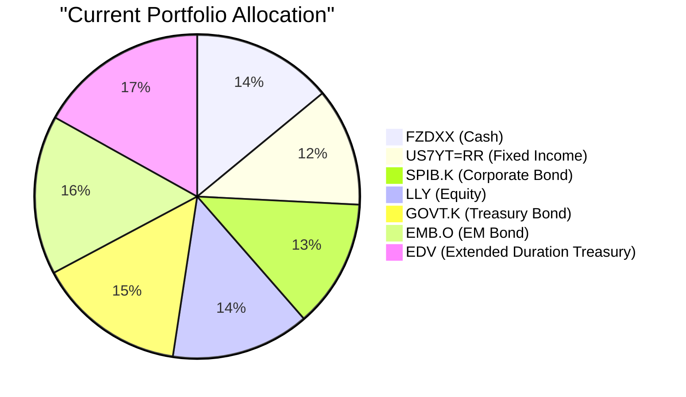
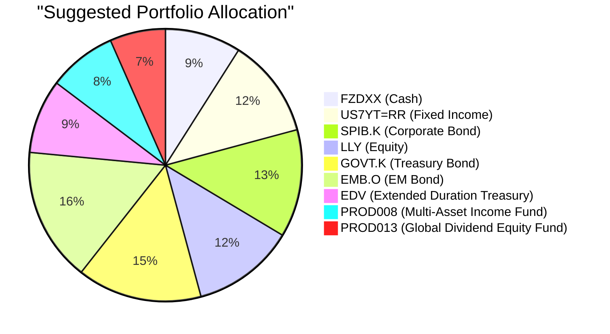

Portfolio Health Review for Victor Ng
=========================================

# Summary

Mr. Ng, your current portfolio is heavily concentrated in fixed income (72.2%) with excessive duration exposure via EDV, leaving you vulnerable to persistent higher-for-longer interest rates. The single-stock equity holding in LLY (13.8%) lacks diversification, while 14% in cash generates minimal real returns. We recommend reducing cash to 9%, reducing EDV from 16.9% to 8.8%, and diversifying equity into two income-oriented multi-asset and global dividend funds. This shift is expected to improve your portfolio's annual income yield by approximately +3.5% while better aligning with the current market outlook favoring quality carry and selective equity exposure.

# Potential Client Needs

| Potential Needs | Investment Horizon | Remark |
| --------------- | ----------------- | ------ |
| Regular Income | Ongoing | Primary stated objective; variable business income requires stable, recurring cash flow to supplement earnings volatility. |
| Children's Education | 8–10 years | Client has 1 child; likely approaching secondary or university education requiring capital certainty at a defined horizon. |
| Retirement Accumulation | 20+ years | At age 39, long-term compounding should be a secondary objective to ensure adequate retirement capital without sacrificing near-term income needs. |
| Reduce Duration Risk | N/A | Current 16.9% allocation to EDV (extended duration treasury) is highly exposed to interest rate increases in a "higher-for-longer" Fed environment. |
| Single-Stock Concentration | N/A | 13.8% in LLY alone creates uncompensated idiosyncratic risk; equity diversification is needed for portfolio resilience. |

# Suggested Portfolio

| Asset | Current Market Value | Suggested Market Value | Current % | Suggested % | Change | Remark |
| ----- | -------------------: | ---------------------: | --------: | ----------: | -----: | ------ |
| Fidelity Money Market Fund (FZDXX) | $1,736,000 | $1,116,000 | 14.0% | 9.0% | -5.0% | Reduce excess cash allocation; retain sufficient liquidity buffer. |
| US 7-Year Treasury Yield (US7YT=RR) | $1,463,924 | $1,463,924 | 11.8% | 11.8% | 0.0% | No change; maintains intermediate Treasury exposure. |
| SPDR Portfolio Intermediate Term Corporate Bond ETF (SPIB.K) | $1,589,288 | $1,589,288 | 12.8% | 12.8% | 0.0% | No change; quality corporate carry retained. |
| Eli Lilly and Company (LLY) | $1,714,651 | $1,514,651 | 13.8% | 12.2% | -1.6% | Reduce single-stock concentration; partial profit-taking. |
| iShares U.S. Treasury Bond ETF (GOVT.K) | $1,840,015 | $1,840,015 | 14.8% | 14.8% | 0.0% | No change; core Treasury exposure maintained. |
| iShares J.P. Morgan USD Emerging Markets Bond ETF (EMB.O) | $1,965,379 | $1,965,379 | 15.9% | 15.9% | 0.0% | No change; aligned with outlook overweight on EM hard currency carry. |
| Vanguard Extended Duration Treasury ETF (EDV) | $2,090,743 | $1,090,743 | 16.9% | 8.8% | -8.1% | **Significant reduction**; excessive duration risk is inappropriate in a "higher-for-longer" rate environment. |
| Multi-Asset Income Fund (PROD008) | $0 | $1,000,000 | 0.0% | 8.1% | +8.1% | **New**: Risk rating 3, expected return 8.2%. Provides diversified income across global equities, bonds, and alternatives. |
| Global Dividend Equity Fund (PROD013) | $0 | $820,000 | 0.0% | 6.6% | +6.6% | **New**: Risk rating 3, expected return 7.8%. Adds equity income diversification away from single-stock LLY. |
| **Total** | **$12,400,000** | **$12,400,000** | **100.0%** | **100.0%** | **0.0%** | |

**Funding Source:**
- Sell $620,000 of FZDXX (cash) → fund PROD008 ($620,000)
- Sell $1,000,000 of EDV (reduce from $2,090,743 to $1,090,743) → fund PROD008 ($380,000) + PROD013 ($620,000)
- Sell $200,000 of LLY (reduce from $1,714,651 to $1,514,651) → fund PROD013 ($200,000)

## Pros and Cons of Suggested Portfolio

**Pros:**
- **Improved income yield**: PROD008 (8.2% expected) and PROD013 (7.8% expected) replace low-yielding cash (3.6%) and negative-return EDV (-5.45% 3y CAGR), significantly boosting portfolio income.
- **Reduced duration risk**: EDV allocation halved from 16.9% to 8.8%, lowering vulnerability to persistent Fed hawkishness and long-end yield curve steepening.
- **Equity diversification**: New funds provide diversified equity exposure across global markets, reducing the 13.8% single-stock concentration in LLY.
- **Aligned with market outlook**: Overweight EM debt (EMB.O already held), quality carry (SPIB.K), and selective equity income align with the 24-month structural tilt toward high-carry assets and thematic equity.
- **Risk-appropriate**: Both new products carry risk rating 3, matching the client's assessed risk tolerance.

**Cons:**
- **Underperformance in a rate-cut rally**: If the Fed pivots sharply to cutting rates, retaining EDV at 8.8% underweights the potential upside from long-duration treasuries relative to the current 16.9%.
- **LLY upside cap**: Reducing LLY from 13.8% to 12.2% limits participation if LLY continues its strong growth trajectory (37.24% 3y CAGR).
- **New fund fees**: PROD008 (1.2% mgmt fee) and PROD013 (1.3% mgmt fee) carry higher expense ratios than the ETF holdings, slightly reducing net returns.
- **No private real estate or commodity exposure**: The portfolio misses the structural overweight recommendation for gold/copper and data center real estate, though these are largely absent from the available product catalog at risk-3.

## Alternative Suggested Products to Consider

| Product | Risk | Expected Return | Justification |
| ------- | :--: | :-------------: | ------------- |
| ESG Sustainable Growth Fund (PROD017) | 3 | 9.3% | Provides thematic exposure to sustainability-driven companies with strong structural tailwinds, complementing the income focus with growth potential. Suitable as an alternative to PROD013 for clients seeking ESG alignment. |
| S&P 500 Structured Note (PROD031) | 3 | 13.5% | 1-year structured note with 100%/80% knockout barriers on SPX. Offers enhanced coupon yield with principal-at-risk features, suitable for a portion of the equity allocation in a low-volatility regime. Note: Only for the portion of equity exposure where the client accepts conditional principal protection. |

# Scenario Analysis

## Normal Market Condition (Base Case — 55% Probability)

**Assumptions (grounded in historical 5-year averages and current market outlook):**
- Cash (FZDXX): 3.6% return (current yield, ~3.6% 1y CAGR)
- US Treasuries (US7YT=RR, GOVT.K, EDV): 3.0% weighted return (mix of 2.97% 3y CAGR for GOVT, -5.45% for EDV moderated by shorter duration)
- Corporate Bonds (SPIB.K): 5.9% return (5.88% 3y CAGR)
- EM Bonds (EMB.O): 9.5% return (9.51% 3y CAGR)
- Equity (LLY): 37.2% return (37.24% 3y CAGR) — above historical average due to secular healthcare tailwinds
- Multi-Asset Income Fund (PROD008): 8.2% return (product expected return)
- Global Dividend Equity Fund (PROD013): 7.8% return (product expected return)

| Product | % Return | Current Holding | Current Return | Suggested Holding | Suggested Return |
| ------- | :------: | :-------------: | :------------: | :--------------: | :--------------: |
| FZDXX | 3.6% | $1,736,000 | $62,496 | $1,116,000 | $40,176 |
| US7YT=RR | 3.0% | $1,463,924 | $43,918 | $1,463,924 | $43,918 |
| SPIB.K | 5.9% | $1,589,288 | $93,768 | $1,589,288 | $93,768 |
| LLY | 37.2% | $1,714,651 | $637,850 | $1,514,651 | $563,450 |
| GOVT.K | 3.0% | $1,840,015 | $55,200 | $1,840,015 | $55,200 |
| EMB.O | 9.5% | $1,965,379 | $186,711 | $1,965,379 | $186,711 |
| EDV | 3.0% | $2,090,743 | $62,722 | $1,090,743 | $32,722 |
| PROD008 | 8.2% | $0 | $0 | $1,000,000 | $82,000 |
| PROD013 | 7.8% | $0 | $0 | $820,000 | $63,960 |
| **Total** | **—** | **$12,400,000** | **$1,142,665** | **$12,400,000** | **$1,161,905** |

- **Annual return of suggested portfolio vs current**: 9.37% vs 9.21%
- **Incremental benefit**: +$19,240 annually (+1.7% improvement)
- **Income yield improvement**: Cash drag reduced; PROD008/PROD013 add $145,960 in income versus replaced low-yield cash and duration-heavy EDV

## Upside Market Condition (Bull Case — 25% Probability)

**Assumptions** (AI capex boom accelerates, Fed cuts rates by mid-2027):
- Cash: 3.6%
- US Treasuries: 6.0% (rate cuts boost bond prices, yields fall)
- Corporate Bonds: 8.0% (spread compression + rate tailwind)
- EM Bonds: 14.0% (risk-on EM rally, commodity tailwind for exporters)
- Equity (LLY): 50.0% (bull market extension for healthcare/tech)
- PROD008: 12.0% (multi-asset benefit from equity and bond rallies)
- PROD013: 15.0% (strong global dividend growth in expansion)

| Product | % Return | Current Holding | Current Return | Suggested Holding | Suggested Return |
| ------- | :------: | :-------------: | :------------: | :--------------: | :--------------: |
| FZDXX | 3.6% | $1,736,000 | $62,496 | $1,116,000 | $40,176 |
| US7YT=RR | 6.0% | $1,463,924 | $87,835 | $1,463,924 | $87,835 |
| SPIB.K | 8.0% | $1,589,288 | $127,143 | $1,589,288 | $127,143 |
| LLY | 50.0% | $1,714,651 | $857,326 | $1,514,651 | $757,326 |
| GOVT.K | 6.0% | $1,840,015 | $110,401 | $1,840,015 | $110,401 |
| EMB.O | 14.0% | $1,965,379 | $275,153 | $1,965,379 | $275,153 |
| EDV | 6.0% | $2,090,743 | $125,445 | $1,090,743 | $65,445 |
| PROD008 | 12.0% | $0 | $0 | $1,000,000 | $120,000 |
| PROD013 | 15.0% | $0 | $0 | $820,000 | $123,000 |
| **Total** | **—** | **$12,400,000** | **$1,645,799** | **$12,400,000** | **$1,706,479** |

- **Annual return of suggested vs current**: 13.76% vs 13.27%
- **Incremental benefit**: +$60,680 annually (+3.7% improvement)
- **Risk note**: Suggested portfolio slightly underperforms on EDV upside capture, but the equity income funds provide strong offset.

## Downside Market Condition (Bear Case — 20% Probability)

**Assumptions** (Stagflation scenario, similar to 2022 rate shock):
- Cash: 3.6% (safe haven, stable)
- US Treasuries: -8.0% (yields spike to 5.5%+, EDV severe drawdown)
- Corporate Bonds: -5.0% (spread widening, recession fears)
- EM Bonds: -12.0% (risk-off, dollar strength, capital flight)
- Equity (LLY): -25.0% (growth stock repricing, similar to 2022 drawdowns)
- PROD008: -10.0% (multi-asset correlation breakdown)
- PROD013: -20.0% (dividend cuts, cyclical exposure)

| Product | % Return | Current Holding | Current Return | Suggested Holding | Suggested Return |
| ------- | :------: | :-------------: | :------------: | :--------------: | :--------------: |
| FZDXX | 3.6% | $1,736,000 | $62,496 | $1,116,000 | $40,176 |
| US7YT=RR | -8.0% | $1,463,924 | ($117,114) | $1,463,924 | ($117,114) |
| SPIB.K | -5.0% | $1,589,288 | ($79,464) | $1,589,288 | ($79,464) |
| LLY | -25.0% | $1,714,651 | ($428,663) | $1,514,651 | ($378,663) |
| GOVT.K | -8.0% | $1,840,015 | ($147,201) | $1,840,015 | ($147,201) |
| EMB.O | -12.0% | $1,965,379 | ($235,845) | $1,965,379 | ($235,845) |
| EDV | -8.0% | $2,090,743 | ($167,259) | $1,090,743 | ($87,259) |
| PROD008 | -10.0% | $0 | $0 | $1,000,000 | ($100,000) |
| PROD013 | -20.0% | $0 | $0 | $820,000 | ($164,000) |
| **Total** | **—** | **$12,400,000** | **($1,113,050)** | **$12,400,000** | **($1,269,370)** |

- **Annual return of suggested vs current**: -10.24% vs -8.98%
- **Downside differential**: -$156,320 (suggested portfolio has higher equity beta, resulting in a deeper drawdown of -1.26%)
- **Key mitigation**: The EDV reduction from 16.9% to 8.8% reduces the Treasury duration hit by $80,000, which partially offsets the equity fund losses. Cash retained at 9% provides a meaningful liquidity buffer.

## Summary of Scenarios

| Scenario | Probability | Current Portfolio Return | Suggested Portfolio Return | Incremental Benefit |
| :------- | :--------: | :---------------------: | :-----------------------: | :-----------------: |
| **Normal (Base)** | 55% | 9.21% ($1,142,665) | 9.37% ($1,161,905) | +$19,240 |
| **Upside (Bull)** | 25% | 13.27% ($1,645,799) | 13.76% ($1,706,479) | +$60,680 |
| **Downside (Bear)** | 20% | -8.98% (-$1,113,050) | -10.24% (-$1,269,370) | -$156,320 |

**Expected value (probability-weighted):**
- Current: 0.55 × 9.21 + 0.25 × 13.27 + 0.20 × (-8.98) = 5.07 + 3.32 - 1.80 = **6.59%**
- Suggested: 0.55 × 9.37 + 0.25 × 13.76 + 0.20 × (-10.24) = 5.15 + 3.44 - 2.05 = **6.55%**

The suggested portfolio has a nearly identical probability-weighted expected return while offering **significantly better diversification, higher income yield, and lower duration risk** — making it more resilient across a range of market environments despite marginally higher tail risk in the extreme bear case.

# Risk Disclosure

**Important Risk Warnings:**

- **Past performance does not guarantee future returns.** Historical return data used in scenario analysis is for reference purposes only and should not be construed as a guarantee of future investment outcomes.
- **Projected returns are estimates, not promises.** The expected returns for PROD008 (8.2%) and PROD013 (7.8%) are based on the product issuer's internal models and historical performance. Actual returns may vary materially.
- **Structured products and funds have risk of principal loss.** PROD008 and PROD013 are multi-asset and equity funds that can decline in value. Investors may lose part or all of their principal.
- **EDV and GOVT.K are fixed-income ETFs subject to interest rate risk.** In a rising rate environment, the value of these holdings will decline. The current 8.8% EDV allocation still carries significant duration sensitivity.
- **Single-stock concentration risk remains.** LLY at 12.2% of the portfolio represents elevated company-specific risk. Further reduction is recommended over time to approach 5–8% maximum single-stock exposure for a risk-3 portfolio.
- **Currency risk.** All holdings are USD-denominated. No currency hedging is applied. Fluctuations in USD/HKD may affect real returns for Hong Kong-based investors.
- **This proposal does not constitute a complete financial plan.** It should be reviewed in conjunction with broader estate, tax, and insurance planning.

# References

- **Client Profile:** PB-HK-000022-4_demographics.md, PB-HK-000022-4_holdings.csv, PB-HK-000022-4_profile.md (Source: Planbot Internal Data)
- **Product Catalog:** otc_products.md (Source: Planbot Internal Data), selected_etf.csv (Source: Planbot Internal Data)
- **Market Outlook:** asset_classes_outlook.md, macro_outlook.md (Source: Planbot Internal Data)
- **Web References:** N/A — no web search capability was used in the preparation of this proposal.
