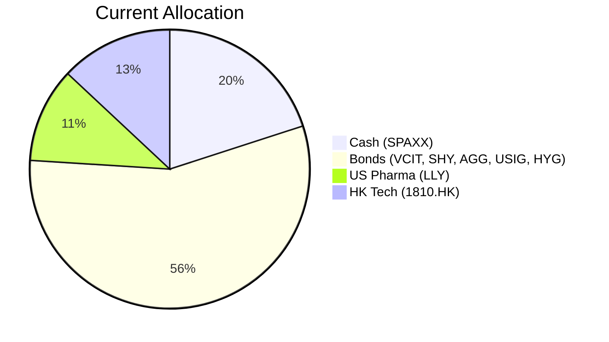
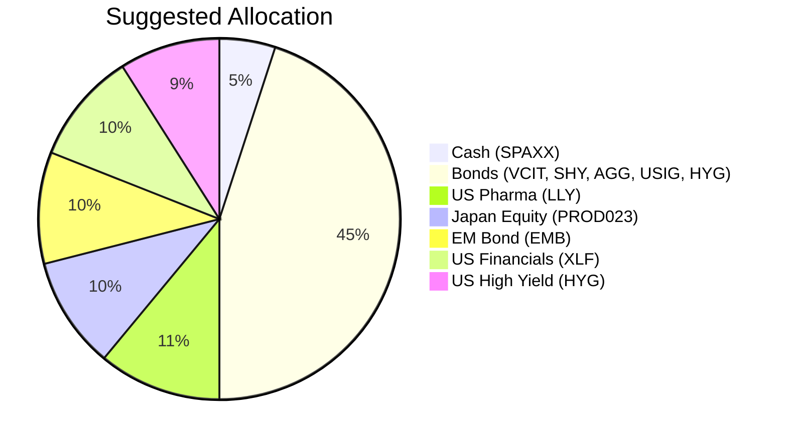

Portfolio Health Review for Rachel Ho
=========================================

# Summary
Rachel Ho's portfolio is built on a sturdy foundation of high-quality bonds, which provides a reliable income stream and stability. However, a 20% cash holding (SPAXX) is generating a drag on returns, and a significant 13% concentrated position in Xiaomi (1810.HK) carries substantial single-stock risk and a -19.8% unrealized loss. To align her holdings with her stated long-term capital growth objective at a Risk Rating of 4, we recommend reducing the cash allocation, divesting 1810.HK, and rotating these funds into diversified thematic growth drivers. This restructuring is expected to improve the portfolio's total return potential by approximately +2.9% annually in a normal market scenario, while maintaining a robust income floor.

# Potential Client Needs
Based on Rachel’s profile (CFO, Age 47, Divorced, No children, Low 5-year liquidity need), the following investment objectives are identified to drive the recommendation:

| Potential Needs | Investment Horizon | Return (1-5) | Certainty (1-5) | Remark |
| :--- | :--- | :--- | :--- | :--- |
| Retirement (Accumulation) | Long-term (10+ years) | 5 | 2 | Focus on compounding growth to build retirement wealth; can tolerate short-term volatility. |
| Portfolio Efficiency Enhancement | Medium-term | 4 | 3 | Reduce cash drag (20% in 3.6% yield) and concentration risk (18% in LLY & 1810.HK). |
| Inflation & Real Asset Exposure | Long-term | 4 | 2 | Add geographic and sector diversification through EM debt and thematic equity. |

# Suggested Portfolio

| Asset | Current Market Value | Suggested Market Value | Current % | Suggested % | Change | Remark |
| :--- | ---: | ---: | ---: | ---: | ---: | :--- |
| Fidelity Government Cash Reserves (SPAXX) | $560,000 | $140,000 | 20.0% | 5.0% | -15.0% | Reduce cash drag; retain only a tactical liquidity buffer. |
| Vanguard Interm-Term Corp Bond ETF (VCIT) | $254,736 | $254,736 | 9.1% | 9.1% | 0% | Keep as a core IG holding. |
| iShares 1-3 Year Treasury Bond ETF (SHY) | $276,491 | $186,491 | 9.9% | 6.7% | -3.2% | Reduce short-duration treasury overweight. |
| iShares Core US Aggregate Bond ETF (AGG) | $320,000 | $200,000 | 11.4% | 7.1% | -4.3% | Reduce core bond exposure. |
| iShares Broad USD Investment Grade Corp Bond ETF (USIG) | $341,754 | $494,754 | 12.2% | 17.7% | +5.5% | Increase allocation to IG corporate credit. |
| iShares iBoxx $ High Yield Corp Bond ETF (HYG) | $385,263 | $385,263 | 13.8% | 13.8% | 0% | Maintain high-yield carry position. |
| Eli Lilly and Company (LLY) | $298,245 | $298,245 | 10.6% | 10.6% | 0% | Core US pharma holding; strong dividend growth. |
| Xiaomi Corporation (1810.HK) | $363,508 | $0 | 13.0% | 0% | -13.0% | **Sell entire position.** High single-name concentration & geo-risk; harvest loss. |
| Japan Equity Opportunities Fund (PROD023) | $0 | $280,000 | 0% | 10.0% | +10.0% | **New.** Structural governance reforms & healthy inflation in Japan. |
| iShares USD Emerging Markets Bond ETF (EMB) | $0 | $280,000 | 0% | 10.0% | +10.0% | **New.** High-quality carry backed by solid EM corporate fundamentals. |
| Financial Select Sector SPDR ETF (XLF) | $0 | $280,000 | 0% | 10.0% | +10.0% | **New.** Beneficiary of steepening yield curve & higher-for-longer rates. |
| **Total** | **$2,799,997** | **$2,799,489** | **100%** | **100%** | **0%** | |

## Pros and Cons of Suggested Portfolio

**Pros:**
- **Enhanced Growth Potential:** Shifts capital from non-productive cash (3.6% yield) and a structurally challenged single stock (1810.HK) into diversified growth drivers (Japan Financials, EM Debt), raising the projected total return from ~3.8% to ~6.7% annually in a normal market.
- **Improved Diversification:** Reduces geographic concentration in Hong Kong/US ADR and sector concentration in Tech, introducing exposure to Japan equities and Emerging Market debt.
- **Macro Alignment:** Positions the portfolio for a "higher-for-longer" interest rate environment (XLF, floating-rate EMB) and secular structural tailwinds (Japan corporate reforms, EM industrialization).

**Cons:**
- **Higher Equity Beta:** The total equity-like exposure increases from ~23% to ~40%, making the portfolio more sensitive to a broad equity market correction.
- **Currency Risk:** The new allocations to PROD023 (JPY) and EMB (EM currencies vs USD) introduce foreign exchange volatility that was previously minimal.
- **Credit Spread Risk:** The increased weight in Corporate bonds (USIG) and High Yield (HYG) may underperform during a sharp credit cycle deterioration.

## Alternative Products to Consider
- **SRLN (Invesco Senior Loan ETF):** Risk 2. A floating-rate bank loan ETF that provides insulation against the "higher-for-longer" rate scenario while offering an expected return of ~7.4%. Suitable for a portion of the fixed-income sleeve to reduce duration risk.
- **PROD010 (Real Estate Investment Trust):** Risk 3. An alternative real asset investment focused on logistics and digital infrastructure (data centers), tying directly to the AI infrastructure capex boom. Expected return of ~9.5%.

# Scenario Analysis
The following scenarios are based on the current macro outlook (June 2026) and historical asset class performance. The assumptions below are used to project outcomes.

## Normal Market Condition
*Assumption:* Central banks maintain a "simultaneous hold." Global growth stabilizes at trend (2.5-3%). Corporate earnings remain resilient. Inflation stays sticky around 3%.

| Product | % Return | Suggested Return ($) | Current Return ($) |
| :--- | ---: | ---: | ---: |
| SPAXX | 3.6% | 5,040 | 20,160 |
| VCIT | 4.0% | 10,189 | 10,189 |
| SHY | 3.0% | 5,595 | 8,295 |
| AGG | 3.5% | 7,000 | 11,200 |
| USIG | 4.0% | 19,790 | 13,670 |
| HYG | 5.8% | 22,345 | 22,345 |
| LLY | 10.0% | 29,825 | 29,825 |
| 1810.HK | 0.0% | 0 | 0 |
| PROD023 | 9.0% | 25,200 | 0 |
| EMB | 9.5% | 26,600 | 0 |
| XLF | 10.0% | 28,000 | 0 |
| **Total** | **6.7%** | **$179,584** | **$115,684** |

- **Annual Return:** Suggested Portfolio 6.7% vs Current Portfolio 4.1%
- **Incremental Benefit:** +$63,900 annually (+55% improvement)

## Good Market Condition (Equity-Led Rally / Soft Landing)
*Assumption:* AI capex ($1.1T forecast by 2027) drives productivity gains. Central banks pivot to cautious easing. Global equities rally +20%, risk assets outperform.

| Product | % Return | Suggested Return ($) | Current Return ($) |
| :--- | ---: | ---: | ---: |
| SPAXX | 3.6% | 5,040 | 20,160 |
| VCIT | 5.0% | 12,737 | 12,737 |
| SHY | 4.0% | 7,460 | 11,060 |
| AGG | 4.5% | 9,000 | 14,400 |
| USIG | 5.0% | 24,738 | 17,088 |
| HYG | 10.0% | 38,526 | 38,526 |
| LLY | 20.0% | 59,649 | 59,649 |
| 1810.HK | 5.0% | 0 | 18,175 |
| PROD023 | 18.0% | 50,400 | 0 |
| EMB | 15.0% | 42,000 | 0 |
| XLF | 20.0% | 56,000 | 0 |
| **Total** | **9.7%** | **$271,550** | **$191,795** |

- **Annual Return:** Suggested Portfolio 9.7% vs Current Portfolio 6.8%
- **Incremental Benefit:** +$79,755 annually (+42% improvement)

## Bad Market Condition (Stagflation / Geopolitical Spike)
*Assumption:* Strait of Hormuz disruption pushes oil to $120+. Core PCE surges, forcing central banks to hold rates higher. Corporate earnings contract, credit spreads widen significantly. Equities fall -20%, high yield drops -15%.

| Product | % Return | Suggested Return ($) | Current Return ($) |
| :--- | ---: | ---: | ---: |
| SPAXX | 3.6% | 5,040 | 20,160 |
| VCIT | 2.0% | 5,095 | 5,095 |
| SHY | 1.0% | 1,865 | 2,765 |
| AGG | 1.5% | 3,000 | 4,800 |
| USIG | 2.0% | 9,895 | 6,835 |
| HYG | -15.0% | -57,789 | -57,789 |
| LLY | -15.0% | -44,736 | -44,736 |
| 1810.HK | -20.0% | 0 | -72,702 |
| PROD023 | -20.0% | -56,000 | 0 |
| EMB | -5.0% | -14,000 | 0 |
| XLF | -15.0% | -42,000 | 0 |
| **Total** | **-5.2%** | **-$145,630** | **-$135,572** |

- **Annual Return:** Suggested Portfolio -5.2% vs Current Portfolio -4.8%
- **Incremental Risk:** Downside capture is moderately higher ($10k additional loss), justified by the significantly higher upside participation and the divestment of the severely underperforming 1810.HK position.

# Risk Disclosure
- **Past performance does not guarantee future returns.** The projected returns in the scenario analysis are estimates based on historical data and current market sentiment, not promises.
- **Capital at Risk:** The value of investments and the income derived from them can go down as well as up.
- **Structured Products & Derivatives:** The suggested portfolio includes products that may be complex and involve a high degree of risk, including potential total loss of principal.
- **Currency Risk:** Investments in EMB and PROD023 involve exposure to foreign currencies, which can fluctuate and affect returns.
- **Concentration Risk:** Suggestions are based on the provided holdings and catalog; market conditions may change rapidly, and diversification should be reviewed periodically.

# References
- **Product Catalog:** demo-market-quotes.csv, selected_etf.csv, otc_products.md (Source: Planbot Internal Data)
- **Market Outlook:** asset_classes_outlook.md, macro_outlook.md (Source: Planbot Market Research)
- **Client Profile:** PB-HK-000023-2_demographics.md, PB-HK-000023-2_holdings.csv (Source: Client Onboarding Data)
- **Web References:** N/A (All references sourced from internal database provided)
