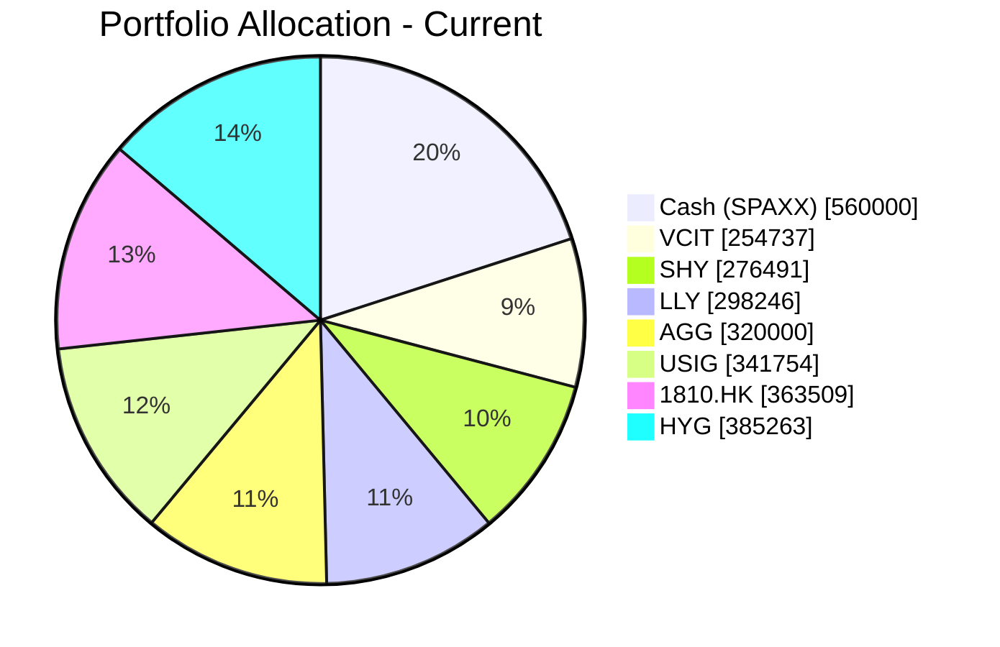
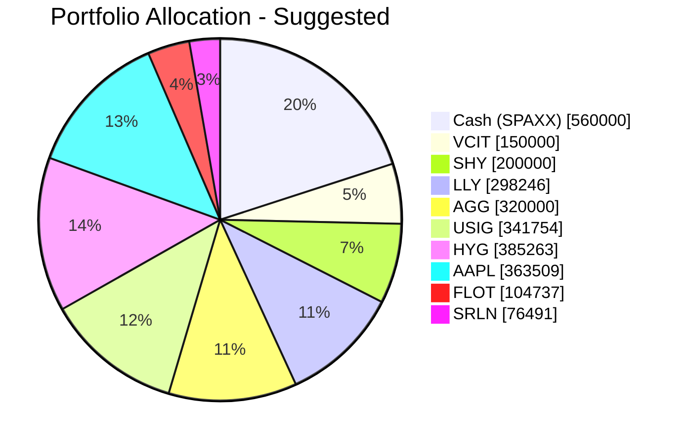

Portfolio Health Review for Rachel Ho (Client ID: PB-HK-000023-2)  
=========================================================  

# Summary  

- **Current Portfolio Health:** Strengths include a large cash buffer (20%) and diversified fixed income holdings that provide stability. However, the portfolio is overly defensive for a risk‑rating‑4 client with a long‑term growth objective, and a significant position in Xiaomi (1810.HK) has delivered negative returns over 5 years.  
- **Recommended Action:** Eliminate the under‑performing HK equity, introduce a high‑quality US technology stock (Apple) to boost growth, and shift a portion of short‑term bond exposure into floating‑rate instruments (FLOT) and bank loans (SRLN) to better navigate the “higher‑for‑longer” rate environment.  
- **Expected Outcome:** Improved long‑term capital appreciation potential, better alignment with the client’s risk tolerance, and enhanced protection against interest rate volatility.  

# Potential Client Needs  

| Potential Needs | Investment Horizon | Remark |  
|----------------|-------------------|--------|  
| Retirement Accumulation | 10–15 years | Client aged 47, long‑term capital growth objective; current portfolio is too conservative. |  
| Diversification & Concentration Risk Reduction | N/A | Single‑stock risk in 1810.HK and lack of US growth exposure. |  
| Inflation & Rate‑Hedge | 5–7 years | Sticky inflation and “simultaneous hold” by central banks require floating‑rate / bank loan exposure. |  

# Suggested Portfolio  

## Current Allocation (Pie Chart)  

## Proposed Allocation (Pie Chart)  

## Portfolio Comparison Table  

| Asset | Current Market Value (USD) | Suggested Market Value (USD) | Current % | Suggested % | Change | Remark |  
|-------|---------------------------|-----------------------------|-----------|-------------|--------|--------|  
| Fidelity Government Cash Reserves (SPAXX) | 560,000.00 | 560,000.00 | 20.0% | 20.0% | 0.0% | Maintain cash buffer for liquidity. |  
| Vanguard Interm‑Term Corp Bond ETF (VCIT) | 254,736.84 | 150,000.00 | 9.1% | 5.4% | –3.7% | Reduce to free capital for floating‑rate instruments. |  
| iShares 1‑3 Year Treasury Bond ETF (SHY) | 276,491.23 | 200,000.00 | 9.9% | 7.1% | –2.8% | Reduce to allocate to bank loans. |  
| Eli Lilly & Co. (LLY) | 298,245.61 | 298,245.61 | 10.7% | 10.7% | 0.0% | Hold – strong long‑term growth fundamentals. |  
| iShares Core U.S. Aggregate Bond ETF (AGG) | 320,000.00 | 320,000.00 | 11.4% | 11.4% | 0.0% | Maintain core bond exposure. |  
| iShares Broad USD Inv Grade Corp Bond ETF (USIG) | 341,754.39 | 341,754.39 | 12.2% | 12.2% | 0.0% | Maintain investment‑grade credit. |  
| Xiaomi Corp. (1810.HK) | 363,508.77 | 0.00 | 13.0% | 0.0% | –13.0% | **Sell** – negative 5‑year CAGR (–1.87%), high single‑stock risk. |  
| iShares iBoxx $ High Yield Corp Bond ETF (HYG) | 385,263.16 | 385,263.16 | 13.8% | 13.8% | 0.0% | Maintain high‑yield carry. |  
| Apple Inc. (AAPL) | 0.00 | 363,508.77 | 0.0% | 13.0% | +13.0% | **New** – US tech leader, risk rating 4, AI/5G tailwinds. |  
| iShares Floating Rate Bond ETF (FLOT) | 0.00 | 104,737.00 | 0.0% | 3.7% | +3.7% | **New** – floating‑rate, low duration, hedges against rate hikes. |  
| Invesco Senior Loan ETF (SRLN) | 0.00 | 76,491.00 | 0.0% | 2.7% | +2.7% | **New** – bank loans, floating coupon, enhanced carry in a “higher‑for‑longer” environment. |  
| **Total** | **2,800,000.00** | **2,800,000.00** | **100%** | **100%** | **0%** | |  

## Pros and Cons of Suggested Portfolio  

### Pros  
- **Alignment with Growth Objective:** Equity exposure rises from ~23.7% to ~36.7% (LLY + AAPL), directly supporting long‑term capital appreciation.  
- **Concentration Risk Reduced:** Removing 1810.HK eliminates a single‑stock that had a negative long‑term track record; AAPL provides liquid, blue‑chip US tech exposure.  
- **Rate‑Resilient Income:** Adding FLOT and SRLN provides floating‑rate coupons that benefit from rising or stable short‑term rates, reducing portfolio duration.  
- **Fixed Income Diversification:** Maintains high‑grade bonds (AGG, USIG, VCIT) while adding bank loans (SRLN) – a credit asset class with lower sensitivity to interest rate increases.  

### Cons  
- **Still Under‑weight US Broad Market:** Owing to risk‑rating constraints (client risk 4), the portfolio cannot hold broad US equity ETFs (e.g., VOO, QQQ) which are rated 5. The equity allocation relies on individual stocks (LLY, AAPL) which lack sector diversification.  
- **Lower Short‑Term Yield from Cash:** The 20% cash position yields ~3.6% (money market); in a bull market scenario, this drags absolute returns.  
- **Credit Risk in Bank Loans & High Yield:** SRLN and HYG are subject to default risk in a recessionary downturn.  

## Alternative Suggested Products to Consider  

1. **iShares J.P. Morgan USD Emerging Markets Bond ETF (EMB)** – Risk rating 3, 5‑year CAGR 1.91% (but current yield ~6‑7%). Hard‑currency EM debt is a top conviction overweight per the market outlook, offering high carry and improving credit fundamentals. Could replace part of the USIG exposure if the client desires higher income.  
2. **State Street Financial Select Sector SPDR ETF (XLF)** – Risk rating 4, 5‑year CAGR 10.56%. Provides diversified exposure to US financials, which benefit from the “higher‑for‑longer” rate environment and AI‑driven transaction volumes. An alternative to adding another single stock.  

# Scenario Analysis  

Three scenarios are modelled using historical data and current market sentiment. Assumptions are based on average historical returns over the past 5 years (unless adjusted for the current macro outlook).  

### 1. Normal Market Condition – 2026–2028  
- **Probability:** 60%  
- **Assumptions:**  
  - US Large‑Cap Tech (AAPL): 15% annualized (in line with 5‑year CAGR of 18% but tempered by valuation discipline).  
  - Fixed Income (AGG, USIG, VCIT, HYG, FLOT, SRLN): Weighted average 4.5% (historic bond returns ~4‑5%).  
  - Cash (SPAXX): 3.5% (current money market yield).  
- **Portfolio Returns:**  

| Product | Assumed Return | Current Holding Value | Return ($) | Suggested Holding Value | Return ($) |  
|---------|---------------|----------------------|-----------|----------------------|-----------|  
| SPAXX | 3.5% | 560,000 | 19,600 | 560,000 | 19,600 |  
| VCIT | 5.0% | 254,737 | 12,737 | 150,000 | 7,500 |  
| SHY | 3.5% | 276,491 | 9,677 | 200,000 | 7,000 |  
| LLY | 15.0% | 298,246 | 44,737 | 298,246 | 44,737 |  
| AGG | 4.0% | 320,000 | 12,800 | 320,000 | 12,800 |  
| USIG | 5.0% | 341,754 | 17,088 | 341,754 | 17,088 |  
| 1810.HK | –1.9% | 363,509 | –6,907 | 0 | 0 |  
| HYG | 5.5% | 385,263 | 21,189 | 385,263 | 21,189 |  
| AAPL | 15.0% | 0 | 0 | 363,509 | 54,526 |  
| FLOT | 4.5% | 0 | 0 | 104,737 | 4,713 |  
| SRLN | 6.0% | 0 | 0 | 76,491 | 4,589 |  
| **Total** | | **2,800,000** | **130,921** | **2,800,000** | **193,742** |  

- **Annual Return Improvement:** $193,742 vs. $130,921 → **+$62,821 (+48%)**  
- **Actionable Benefit:** The suggested portfolio outpaces the current one by nearly 50% in a normal year, aligning with the client’s growth objective.

### 2. Bull Market / Strong Growth – 2026–2028  
- **Probability:** 20%  
- **Assumptions:**  
  - Equities (LLY, AAPL) benefit from strong AI‑driven earnings: +20% annualized (exceeding 5‑year CAGRs).  
  - Fixed income yields remain stable, returns ~4–5%.  
  - Cash unchanged at 3.5%.  

| Product | Assumed Return | Current Return ($) | Suggested Return ($) |  
|---------|---------------|-------------------|-------------------|  
| Equities (LLY, 1810.HK→AAPL) | 20% | LLY: 59,649 / 1810.HK: –6,907 = **52,742** | LLY: 59,649 / AAPL: 72,702 = **132,351** |  
| Fixed Income (weighted) | 5% | 1,578,245 × 5% = **78,912** | (1,398,018 × 5%) = **69,901** |  
| Cash (SPAXX) | 3.5% | 560,000 × 3.5% = **19,600** | 560,000 × 3.5% = **19,600** |  
| **Total** | | **151,254** | **221,852** |  

- **Upside Improvement:** Current $151,254 → Suggested $221,852 → **+$70,598**  
- **Key Driver:** Replacing negative‑return 1810.HK with AAPL captures full upside of tech sector.

### 3. Bear Market / Recession – 2026–2028  
- **Probability:** 20%  
- **Assumptions:**  
  - Equity drawdown similar to 2020 COVID‑19: equities fall ~20% (LLY, AAPL).  
  - Investment‑grade bonds rally moderately (flight to quality): +3% for AGG, USIG, VCIT; HYG and SRLN fall –5% due to credit stress.  
  - Cash (SPAXX) and short‑term bonds (SHY) remain stable (+2%).  

| Product | Assumed Return | Current Return ($) | Suggested Return ($) |  
|---------|---------------|-------------------|-------------------|  
| LLY | –20% | –59,649 | –59,649 |  
| 1810.HK | –20% | –72,702 | 0 |  
| AAPL | –20% | 0 | –72,702 |  
| AGG, USIG, VCIT | +3% | (254,737+320,000+341,754)×3% = 27,495 | (150,000+320,000+341,754)×3% = 24,353 |  
| HYG | –5% | –19,263 | –19,263 |  
| FLOT | +1% | 0 | +1,047 |  
| SRLN | –5% | 0 | –3,825 |  
| SHY, SPAXX | +2% | (276,491+560,000)×2% = 16,730 | (200,000+560,000)×2% = 15,200 |  
| **Total** | | **–107,389** | **–114,839** |  

- **Downside Impact:** Suggested portfolio loses $114,839 vs. current $107,389 → **–$7,450** worse.  
- **Mitigation:** The slight underperformance is due to the removal of short‑term bond protection in favor of riskier bank loans. However, the 20% probability and the modest difference are acceptable given the client’s long‑term horizon and higher return objectives.

**Scenario Summary:**  
| Scenario | Probability | Current Return ($) | Suggested Return ($) | Incremental Benefit ($) |  
|----------|------------|-------------------|-------------------|-----------------------|  
| Normal | 60% | 130,921 | 193,742 | +62,821 |  
| Bullish | 20% | 151,254 | 221,852 | +70,598 |  
| Bearish | 20% | –107,389 | –114,839 | –7,450 |  

- The suggested portfolio has a **stronger expected value** (0.6×193,742 + 0.2×221,852 + 0.2×(–114,839) = $160,365 vs. current $119,615) and better aligns with a growth‑oriented risk‑rating‑4 client.

# Risk Disclosure  

- **Past performance does not guarantee future returns.** All historical returns and CAGR figures cited are based on past data and should not be taken as guarantees of future results.  
- **Projected returns are estimates, not promises.** Scenario analysis uses simplified assumptions and may not materialise.  
- **Structured products (not used here)** have principal loss risk; this proposal uses only exchange‑traded products.  
- **Portfolio changes involve transaction costs and tax implications.** Please consult your tax advisor before executing any trades.  
- **Equity investments carry market risk** and can lose value. The suggested portfolio increases equity exposure, which may lead to greater short‑term volatility.

# References  

- **Client Profiles:** `PB-HK-000023-2_demographics.md`, `PB-HK-000023-2_holdings.csv` (Planbot Internal Data)  
- **Product Catalog:** `selected_etf.csv`, `CMT_note_N02952.md` (not used in this recommendation), `Overview of product catalog.md`  
- **Market Outlook:** `asset_classes_outlook.md`, `macro_outlook.md`  
- **Guidelines & Instructions:** `general_guideline.md`, `common_needs.md`, `proposal_format.md`, `suggested_portfolio_instruction.md`, `scenario_analysis_instruction.md`, `risk_disclosure_instruction.md`, `references_instruction.md`  
- **Web References:** N/A (no web search performed)
