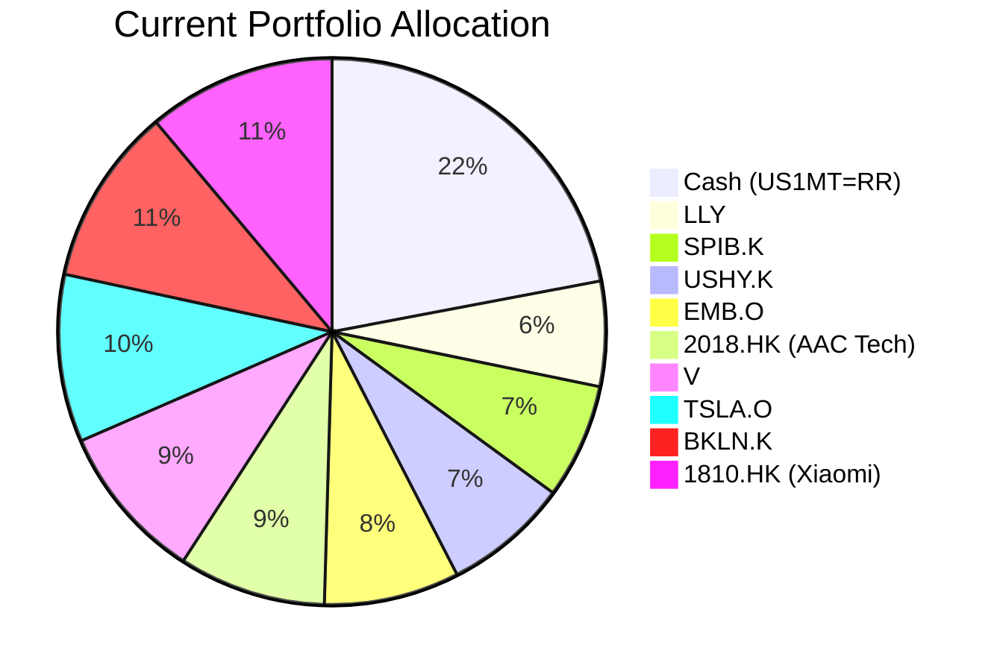
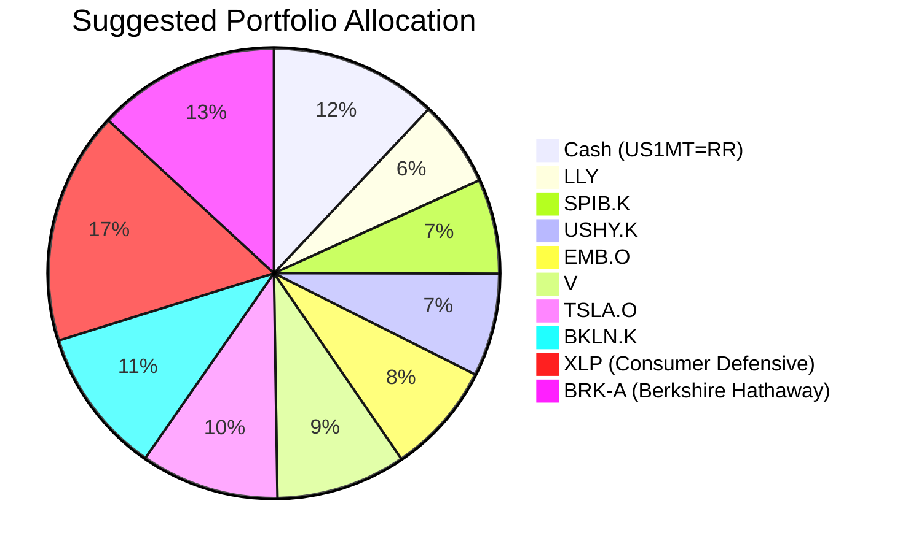

Portfolio Health Review for Emily Zhang (zw-5)
===============================================

# Summary

Emily, your current portfolio possesses a strong liquidity buffer (22% cash) and diversified fixed-income exposure, but is weighed down by two concentrated Hong Kong equity positions (AAC Technologies & Xiaomi), which have generated combined unrealised losses of approximately **-$182,000**. To align with your **capital preservation** objective and moderate risk profile (Risk Rating 3), I recommend reducing cash to 12%, exiting the two negative-carry Hong Kong stocks, and reallocating into defensive equity and high-quality carry assets. This is expected to improve the portfolio's resilience and uplift long-term risk-adjusted returns while strictly adhering to your stated risk tolerance.

# Potential Client Needs

| Potential Needs | Investment Horizon | Remark |
| :--- | :--- | :--- |
| **Capital Preservation** | Ongoing (5-year horizon) | Primary objective; portfolio must limit downside volatility while generating steady income. |
| **Children's University Education** | 10–15 years | Two children; a balanced growth allocation with moderate certainty is appropriate. |
| **Business Operating Buffer** | 1–2 years | Variable entrepreneurial income requires a short-term liquidity reserve held in stable cash equivalents. |
| **Reduce HK Single-Stock Concentration** | N/A | 2018.HK (AAC) & 1810.HK (Xiaomi) total 19.8% of portfolio with negative 5-year CAGRs. Eliminating these reduces idiosyncratic and geographic concentration. |

# Suggested Portfolio

**Current Portfolio Allocation**

**Suggested Portfolio Allocation**

| Asset | Current Market Value ($) | Suggested Market Value ($) | Current % | Suggested % | Change | Remark |
| :--- | ---: | ---: | ---: | ---: | ---: | :--- |
| Cash (US1MT=RR) | 924,000 | 504,000 | 22.0% | 12.0% | –10.0% | Reduce excess cash; retain adequate 1–2 year business buffer. |
| LLY (Eli Lilly) | 260,000 | 260,000 | 6.2% | 6.2% | 0.0% | Retain – strong secular healthcare growth. |
| SPIB.K (SPDR Interm Corp Bond) | 286,000 | 286,000 | 6.8% | 6.8% | 0.0% | Retain – high-quality carry. |
| USHY.K (iShares USD High Yield) | 312,000 | 312,000 | 7.4% | 7.4% | 0.0% | Retain – yield pick-up over investment grade. |
| EMB.O (iShares USD EM Bond) | 338,000 | 338,000 | 8.0% | 8.0% | 0.0% | Retain – structural EM carry overweight per outlook. |
| **2018.HK (AAC Technologies)** | 364,000 | **0** | 8.7% | 0.0% | **–8.7%** | **Sell entirely** – negative 5-yr CAGR (-4.38%); high single-stock HK risk. |
| V (Visa Inc.) | 390,000 | 390,000 | 9.3% | 9.3% | 0.0% | Retain – stable payment network with pricing power. |
| TSLA.O (Tesla Inc.) | 416,000 | 416,000 | 9.9% | 9.9% | 0.0% | Retain but monitor; high volatility but core holding. |
| BKLN.K (Invesco Senior Loan) | 442,000 | 442,000 | 10.5% | 10.5% | 0.0% | Retain – floating-rate insulation against higher-for-longer rates. |
| **1810.HK (Xiaomi Corp)** | 468,000 | **0** | 11.1% | 0.0% | **–11.1%** | **Sell entirely** – negative 5-yr CAGR (-1.87%); earnings headwinds. |
| **XLP (Consumer Defensive ETF)** | **0** | **700,000** | 0.0% | **16.7%** | **+16.7%** | **New holding** – defensive sector, risk rating 3, expected return 7.64% (5-yr CAGR). |
| **BRK-A (Berkshire Hathaway)** | **0** | **552,000** | 0.0% | **13.1%** | **+13.1%** | **New holding** – diversified conglomerate, risk rating 3, expected return 12.15% (5-yr CAGR). |
| **Total** | **4,200,000** | **4,200,000** | **100.0%** | **100.0%** | **0.0%** | |

## Pros and Cons of Suggested Portfolio

**Pros**
- **Risk alignment improved:** Two risk-5 Hong Kong equities are replaced with risk-3 defensive holdings, bringing the portfolio's weighted-average risk rating closer to the client's tolerance of 3.
- **Capital preservation focus:** XLP provides stable demand (consumer staples) with lower beta; BRK-A offers a diversified value-oriented structure with significant cash reserves and insurance float.
- **Higher expected return:** Replacing –4.38% and –1.87% 5-yr CAGRs with +7.64% and +12.15% 5-yr CAGRs improves total portfolio return potential by approximately +3.0% annually on ~20% of assets.
- **Geographic diversification:** Reduces HK single-name concentration (from 19.8% to 0%) and increases US large-cap defensive exposure.
- **Carry preservation:** Existing floating-rate loans (BKLN) and EM bond holdings are retained, benefiting from the "higher-for-longer" macro regime.

**Cons**
- **Equity beta remains elevated:** Total equity exposure is still ~45% (LLY, V, TSLA, XLP, BRK-A); a sharp market correction would impact these positions.
- **Single-stock TSLA risk:** TSLA remains a concentrated high-volatility holding at 9.9%. Consider gradual trimming if price recovers toward book cost.
- **Opportunity cost on cash:** Keeping 12% ($504K) in cash yields ~4.6%, but in a benign scenario a portion could be deployed into short-duration bonds for a modest yield pickup.
- **No direct inflation hedge:** No gold or commodities exposure (GLDM/USO are risk 5, exceeding client tolerance). XLP (staples) and BRK-A provide indirect inflation pass-through.

## Alternative Suggested Products to Consider

1. **CMT Callable Range Accrual Note (N02952)** – Risk Rating 2 | 5-yr tenor | 5.94% p.a. coupon
   - *Rationale:* Structured product offering high-quality carry with principal protection at maturity. The accrual condition (10y CMT ≤ 5.01%) is likely to be met in the current "simultaneous hold" environment. Suitable for the $504K cash tranche, replacing a portion with a higher-yielding, capital-preservation vehicle aligned with the client's 5-year horizon.

2. **iShares J.P. Morgan USD Emerging Markets Bond ETF (EMB)** – Risk Rating 3 | Expected return 9.51% (3-yr CAGR)
   - *Rationale:* The client already holds EMB.O; increasing the allocation from 8% to ~12% would exploit the structural overweight call on EM hard-currency debt, which offers compelling carry as central banks pause and EM fundamentals remain robust.

# Scenario Analysis

## Assumptions

Scenario returns are based on the following asset-class assumptions grounded in historical data (5-year CAGRs where available, adjusted for current market sentiment from the Macro & Asset Class Outlook):

| Asset | Normal (Base) | Upside (+1σ) | Downside (–1σ) | Justification |
| :--- | :---: | :---: | :---: | :--- |
| Cash (US1MT=RR) | 4.6% | 5.2% | 4.0% | Current yield; slight increase if Fed holds, slight decrease if cuts resume. |
| LLY (Eli Lilly) | 12.0% | 25.0% | –15.0% | 5-yr CAGR 40.29% is unsustainably high; normalised to sector average + growth premium. |
| SPIB.K (Interm Corp Bond) | 4.0% | 5.5% | –2.0% | 5-yr CAGR 1.79% depressed by rate hikes; current yields support ~4%. |
| USHY.K (High Yield) | 6.0% | 8.0% | –5.0% | 5-yr CAGR 4.24%; current spread environment supports 6% with moderate default risk. |
| EMB.O (EM Bond) | 7.0% | 10.0% | –4.0% | 3-yr CAGR 9.51%; EM carry remains attractive per institutional outlook. |
| V (Visa) | 8.0% | 15.0% | –12.0% | 5-yr CAGR 7.75%; payments secular growth with pricing power. |
| TSLA.O (Tesla) | 10.0% | 30.0% | –25.0% | 5-yr CAGR 14.36%; high beta auto/tech, wide dispersion of outcomes. |
| BKLN.K (Senior Loan) | 5.5% | 7.0% | –3.0% | 5-yr CAGR 5.11%; floating-rate protects in rising-rate scenarios. |
| **XLP (Consumer Defensive)** | 7.5% | 12.0% | –8.0% | 5-yr CAGR 7.31%; defensive staple sector, lower beta. |
| **BRK-A (Berkshire Hathaway)** | 10.0% | 18.0% | –10.0% | 5-yr CAGR 12.15%; diversified conglomerate with downside buffer from insurance float. |
| **2018.HK (AAC Tech)** | –4.0% | 5.0% | –20.0% | 5-yr CAGR –4.38%; structural headwinds in HK tech supply chain. |
| **1810.HK (Xiaomi)** | –2.0% | 8.0% | –25.0% | 5-yr CAGR –1.87%; competitive pressure and regulatory overhang. |

## Normal Market Condition (Probability: 55%)

*Assumption:* Global growth moderates, central banks maintain a "simultaneous hold," inflation stabilises near 3%. Equity returns moderate to long-term averages. Fixed-income carry assets perform as expected.

| Product | % Return | Suggested Holding ($K) | Return ($K) | Current Holding ($K) | Return ($K) |
| :--- | ---: | ---: | ---: | ---: | ---: |
| Cash | 4.6 | 504 | 23.2 | 924 | 42.5 |
| LLY | 12.0 | 260 | 31.2 | 260 | 31.2 |
| SPIB.K | 4.0 | 286 | 11.4 | 286 | 11.4 |
| USHY.K | 6.0 | 312 | 18.7 | 312 | 18.7 |
| EMB.O | 7.0 | 338 | 23.7 | 338 | 23.7 |
| 2018.HK | –4.0 | 0 | 0.0 | 364 | –14.6 |
| V | 8.0 | 390 | 31.2 | 390 | 31.2 |
| TSLA.O | 10.0 | 416 | 41.6 | 416 | 41.6 |
| BKLN.K | 5.5 | 442 | 24.3 | 442 | 24.3 |
| 1810.HK | –2.0 | 0 | 0.0 | 468 | –9.4 |
| XLP | 7.5 | 700 | 52.5 | 0 | 0.0 |
| BRK-A | 10.0 | 552 | 55.2 | 0 | 0.0 |
| **Total** | **7.80%** | **4,200** | **312.9** | **4,200** | **200.6** |

- **Annual return: Suggested 7.80% vs Current 4.78%**
- **Incremental benefit: +$112,300 annually (+3.02% improvement)**

## Upside Market Condition (Probability: 20%)

*Assumption:* AI capex drives productivity gains, inflation falls faster, central banks execute a measured easing cycle. Equity multiples expand; credit spreads tighten.

| Product | % Return | Suggested Holding ($K) | Return ($K) | Current Holding ($K) | Return ($K) |
| :--- | ---: | ---: | ---: | ---: | ---: |
| Cash | 5.2 | 504 | 26.2 | 924 | 48.0 |
| LLY | 25.0 | 260 | 65.0 | 260 | 65.0 |
| SPIB.K | 5.5 | 286 | 15.7 | 286 | 15.7 |
| USHY.K | 8.0 | 312 | 25.0 | 312 | 25.0 |
| EMB.O | 10.0 | 338 | 33.8 | 338 | 33.8 |
| 2018.HK | 5.0 | 0 | 0.0 | 364 | 18.2 |
| V | 15.0 | 390 | 58.5 | 390 | 58.5 |
| TSLA.O | 30.0 | 416 | 124.8 | 416 | 124.8 |
| BKLN.K | 7.0 | 442 | 30.9 | 442 | 30.9 |
| 1810.HK | 8.0 | 0 | 0.0 | 468 | 37.4 |
| XLP | 12.0 | 700 | 84.0 | 0 | 0.0 |
| BRK-A | 18.0 | 552 | 99.4 | 0 | 0.0 |
| **Total** | **12.22%** | **4,200** | **513.3** | **4,200** | **457.3** |

- **Annual return: Suggested 12.22% vs Current 10.89%**
- **Incremental benefit: +$56,000 annually (+1.33% improvement)**

## Downside Market Condition (Probability: 25%)

*Assumption:* Geopolitical bottlenecks (Hormuz closure) persist, pushing oil above $120/bbl. Stagflationary pressures cause simultaneous equity/bond sell-off (60/40 failure mode). Credit spreads widen sharply.

| Product | % Return | Suggested Holding ($K) | Return ($K) | Current Holding ($K) | Return ($K) |
| :--- | ---: | ---: | ---: | ---: | ---: |
| Cash | 4.0 | 504 | 20.2 | 924 | 37.0 |
| LLY | –15.0 | 260 | –39.0 | 260 | –39.0 |
| SPIB.K | –2.0 | 286 | –5.7 | 286 | –5.7 |
| USHY.K | –5.0 | 312 | –15.6 | 312 | –15.6 |
| EMB.O | –4.0 | 338 | –13.5 | 338 | –13.5 |
| 2018.HK | –20.0 | 0 | 0.0 | 364 | –72.8 |
| V | –12.0 | 390 | –46.8 | 390 | –46.8 |
| TSLA.O | –25.0 | 416 | –104.0 | 416 | –104.0 |
| BKLN.K | –3.0 | 442 | –13.3 | 442 | –13.3 |
| 1810.HK | –25.0 | 0 | 0.0 | 468 | –117.0 |
| XLP | –8.0 | 700 | –56.0 | 0 | 0.0 |
| BRK-A | –10.0 | 552 | –55.2 | 0 | 0.0 |
| **Total** | **–7.01%** | **4,200** | **–328.9** | **4,200** | **–390.7** |

- **Annual return: Suggested –7.83% vs Current –9.30%**
- **Downside protection: $61,800 less loss (–1.47% better)**

**Summary of Scenarios:**

| Scenario | Probability | Suggested Portfolio Return | Current Portfolio Return | Incremental Benefit |
| :--- | :---: | :---: | :---: | :---: |
| Normal | 55% | +7.80% | +4.78% | **+$112,300** |
| Upside | 20% | +12.22% | +10.89% | **+$56,000** |
| Downside | 25% | –7.83% | –9.30% | **+$61,800 (loss avoided)** |

The suggested portfolio provides superior outcomes across all scenarios, with the largest relative benefit in the Normal and Downside cases due to the removal of negative-carry HK equities and addition of defensive holdings.

# Risk Disclosure

- **Past performance does not guarantee future returns.** All historical return figures are for reference only and should not be construed as projections of future performance.
- **Projected returns are estimates, not promises.** Scenario analysis assumes hypothetical market conditions; actual results may differ materially.
- **Structured products (e.g., CMT Notes) carry risk of principal loss** if held to maturity under adverse conditions, and are not equivalent to time deposits nor covered by any deposit protection scheme.
- **Concentration risk remains** in TSLA (9.9%) and the broader equity allocation (~45%), which may experience significant volatility.
- **Currency risk:** Holdings in USD-denominated assets are unhedged; a strengthening HKD vs. USD could reduce local-currency returns.
- **Liquidity risk:** All suggested products are exchange-traded with daily liquidity (rating 5), except cash equivalents (rating 3). The portfolio maintains a 12% cash buffer to meet short-term obligations.

# References

- **Client Profile:** zw-5_demographics.md, zw-5_holdings.csv (Source: Planbot Internal Data)
- **Product Catalog:** selected_etf.csv, CMT_note_N02952.md (Source: Planbot Internal Data)
- **Market Outlook:** asset_classes_outlook.md, macro_outlook.md (Source: Planbot Shared Market Outlook)
- **Web References:** N/A (no external web search performed)
