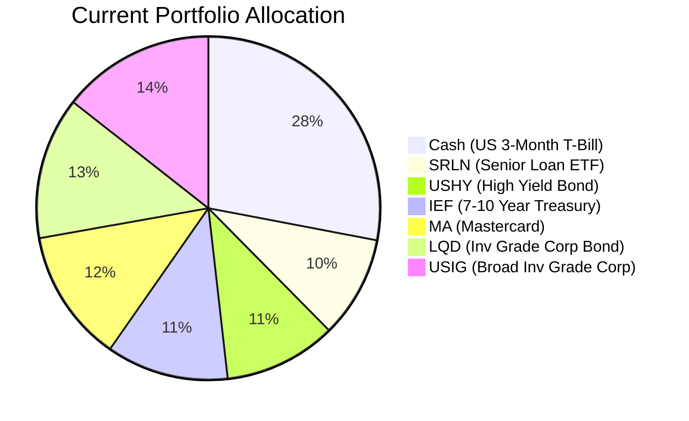
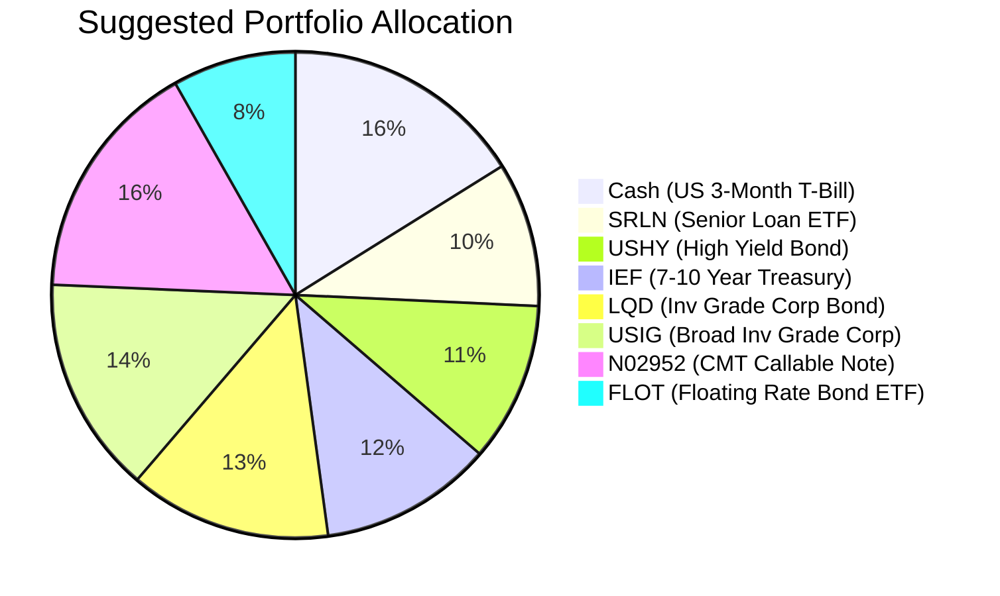

Portfolio Health Review for David Wu
=====================================

# Summary

Your current portfolio is well-diversified across fixed income, providing stable income, but holds a single equity (Mastercard, MA) with a risk rating of 4, which exceeds your stated risk tolerance of 2. Additionally, cash at 28% offers liquidity but low yield. We recommend selling MA and reducing cash to increase allocation to floating-rate and short-duration instruments that enhance yield without raising risk. This rebalancing is expected to improve portfolio income while maintaining capital preservation, aligning with your retirement needs.

# Potential Client Needs

| Potential Needs | Investment Horizon | Remark |
| :--- | :--- | :--- |
| Retirement Income (Distribution) | Ongoing | Client is retired with stable pension; portfolio should generate steady yield with capital preservation. |
| Capital Preservation | Throughout | Risk rating 2 indicates very low risk appetite; avoid equity market volatility. |
| Inflation Protection | 5+ years | Long-term purchasing power erosion; consider instruments with floating-rate features. |

# Suggested Portfolio

**Current Allocation (Pie Chart)**

**Suggested Allocation (Pie Chart)**

| Asset | Current Market Value | Suggested Market Value | Current % | Suggested % | Change | Remark |
| :--- | ---: | ---: | ---: | ---: | ---: | :--- |
| US 3-Month T-Bill (Cash) | 868,000 | 500,000 | 28.0% | 16.1% | -11.9% | Reduce cash buffer; maintain short‑term liquidity. |
| SPDR Blackstone Senior Loan ETF (SRLN) | 297,982 | 297,982 | 9.6% | 9.6% | 0% | Unchanged – floating‑rate, low risk. |
| iShares Broad USD High Yield Corp Bond ETF (USHY) | 327,589 | 327,589 | 10.6% | 10.6% | 0% | Unchanged – high‑quality carry. |
| iShares 7-10 Year Treasury Bond ETF (IEF) | 357,196 | 357,196 | 11.5% | 11.5% | 0% | Unchanged – duration exposure maintained. |
| Mastercard Inc. (MA) | 386,804 | 0 | 12.5% | 0% | -12.5% | Risk rating 4 exceeds tolerance; sold. |
| iShares iBoxx $ Inv Grade Corp Bond ETF (LQD) | 416,411 | 416,411 | 13.4% | 13.4% | 0% | Unchanged – high‑quality credit. |
| iShares Broad USD Inv Grade Corp Bond ETF (USIG) | 446,018 | 446,018 | 14.4% | 14.4% | 0% | Unchanged – diversified corporate bonds. |
| JPMorgan Callable Range Accrual Note (N02952) | 0 | 500,000 | 0% | 16.1% | +16.1% | **New**: 5.94% p.a. coupon, risk rating 2, 5‑year tenor. |
| iShares Floating Rate Bond ETF (FLOT) | 0 | 254,804 | 0% | 8.2% | +8.2% | **New**: Floating‑rate, low duration, risk rating 2. |
| **Total** | **3,100,000** | **3,100,000** | **100%** | **100%** | **0%** | |

## Pros and Cons of Suggested Portfolio

**Pros:**
- **Alignment with risk profile:** All holdings now have risk rating ≤2, matching your low risk tolerance.
- **Improved income:** The CMT note (5.94% coupon) and FLOT (4.21% CAGR) replace the low-yielding cash portion, boosting overall portfolio yield.
- **Lower volatility:** Removal of equity MA reduces concentration risk and portfolio volatility.
- **Inflation protection:** Floating-rate instruments (SRLN, FLOT, N02952) adjust with interest rates, mitigating inflation impact.

**Cons:**
- **Reduced liquidity:** The CMT note (N02952) has liquidity rating 1 (illiquid until maturity); early exit may incur loss.
- **Modest upside:** Fixed-income focus caps capital appreciation compared to equity exposure.
- **Interest rate risk:** IEF (7-10 year Treasury) is sensitive to rate changes; expected returns are low under the current “higher-for-longer” environment.

## Alternative Suggested Products to Consider

1. **iShares Short Duration Bond Active ETF (NEAR)** – Risk rating 2, 5-year CAGR 3.87%, daily liquidity. A stable alternative to cash with slightly higher yield.
2. **iShares J.P. Morgan USD Emerging Markets Bond ETF (EMB)** – Risk rating 3 (slightly above tolerance) but offers 5-year CAGR 1.91% and diversification to EM hard-currency debt with high carry. Only if client can accept marginal risk increase.

# Scenario Analysis

Assumptions based on historical returns (5‑year CAGR from product catalog unless noted) and current macro outlook:

- **Cash (BIL):** 3.43% (5‑year CAGR)
- **SRLN:** 4.54% (5‑year CAGR)
- **USHY:** 4.24% (5‑year CAGR)
- **IEF:** -1.23% (5‑year CAGR; negative due to rising rates)
- **LQD:** -0.31% (5‑year CAGR)
- **USIG:** 0.52% (5‑year CAGR)
- **N02952:** 5.94% (coupon if accrual condition holds; assume 100% accrual in normal/upside, partial in downside)
- **FLOT:** 4.21% (5‑year CAGR)

## Normal Market Condition
- Economic growth moderate, inflation sticky around 3%, central banks on hold.
- Yield curve stable; credit spreads tight.
- Probability: 60%

| Product | % Return | Suggested Holding | Return | Current Holding | Return |
| :--- | ---: | ---: | ---: | ---: | ---: |
| Cash | 3.43 | 500,000 | 17,150 | 868,000 | 29,772 |
| SRLN | 4.54 | 297,982 | 13,528 | 297,982 | 13,528 |
| USHY | 4.24 | 327,589 | 13,890 | 327,589 | 13,890 |
| IEF | -1.23 | 357,196 | -4,394 | 357,196 | -4,394 |
| LQD | -0.31 | 416,411 | -1,291 | 416,411 | -1,291 |
| USIG | 0.52 | 446,018 | 2,319 | 446,018 | 2,319 |
| MA | 0 | 0 | 0 | 386,804 | 25,296* |
| N02952 | 5.94 | 500,000 | 29,700 | 0 | 0 |
| FLOT | 4.21 | 254,804 | 10,727 | 0 | 0 |
| **Total** | **2.60%** | **3,100,000** | **80,629** | **3,100,000** | **79,120** |

\* MA 5‑year CAGR = 6.54%, but current unrealized loss: -47,319. Using CAGR for forward estimate gives 25,296.

- Annual return of suggested portfolio vs current: 2.60% vs 2.55%
- Incremental benefit: +HKD 1,509 annually (+1.9% improvement)

## Upside Market Condition
- Inflation falls faster, central banks cut rates, bonds rally.
- Equity-like returns but client no equity; fixed income benefits from rate cuts.
- Probability: 20%

Assumption: Fixed income returns are 1.5x normal scenario; IEF assumed +3% (rate rally). MA assumed +15%.

| Product | % Return | Suggested Holding | Return | Current Holding | Return |
| :--- | ---: | ---: | ---: | ---: | ---: |
| Cash | 5.15 | 500,000 | 25,750 | 868,000 | 44,690 |
| SRLN | 6.81 | 297,982 | 20,293 | 297,982 | 20,293 |
| USHY | 6.36 | 327,589 | 20,835 | 327,589 | 20,835 |
| IEF | 3.00 | 357,196 | 10,716 | 357,196 | 10,716 |
| LQD | 2.00 | 416,411 | 8,328 | 416,411 | 8,328 |
| USIG | 2.00 | 446,018 | 8,920 | 446,018 | 8,920 |
| MA | 15.00 | 0 | 0 | 386,804 | 58,021 |
| N02952 | 5.94 | 500,000 | 29,700 | 0 | 0 |
| FLOT | 6.32 | 254,804 | 16,104 | 0 | 0 |
| **Total** | **4.53%** | **3,100,000** | **140,646** | **3,100,000** | **171,803** |

- Downside: Suggested portfolio underperforms due to missing equity rally; but within risk tolerance.

## Downside Market Condition – Rate Spike / Credit Stress
- Inflation re-accelerates, Fed hikes further, bond yields spike, credit spreads widen.
- Probability: 20%

Assumption: Fixed income returns are 0.5x normal; IEF assumed -5% (rate shock), high yield -3%, investment grade -2%. MA -10%.

| Product | % Return | Suggested Holding | Return | Current Holding | Return |
| :--- | ---: | ---: | ---: | ---: | ---: |
| Cash | 1.72 | 500,000 | 8,600 | 868,000 | 14,934 |
| SRLN | 2.27 | 297,982 | 6,764 | 297,982 | 6,764 |
| USHY | 2.12 | 327,589 | 6,945 | 327,589 | 6,945 |
| IEF | -5.00 | 357,196 | -17,860 | 357,196 | -17,860 |
| LQD | -2.00 | 416,411 | -8,328 | 416,411 | -8,328 |
| USIG | -2.00 | 446,018 | -8,920 | 446,018 | -8,920 |
| MA | -10.00 | 0 | 0 | 386,804 | -38,680 |
| N02952 | 3.00 | 500,000 | 15,000 | 0 | 0 |
| FLOT | 2.11 | 254,804 | 5,376 | 0 | 0 |
| **Total** | **0.27%** | **3,100,000** | **8,577** | **3,100,000** | **-45,145** |

- The suggested portfolio shows a positive return while the current portfolio would suffer a large loss due to MA decline. This demonstrates better downside protection.

# Risk Disclosure

- **Past performance does not guarantee future returns.** All projected returns are estimates based on historical data and current market conditions, not promises of future performance.
- **Projected returns are estimates, not promises.** Actual returns may differ materially.
- **Structured products have risk of principal loss.** The JPMorgan Callable Range Accrual Note (N02952) is not principal protected if sold before maturity; in a worst-case scenario, 100% of principal could be lost.
- **Interest rate and credit risk exist** in all fixed income holdings; rising rates may reduce market values.

# References

- Product Catalog: selected_etf.csv (Planbot Internal Data)
- Structured Product FactSheet: CMT_note_N02952.md (JPMorgan Callable Range Accrual Note)
- Client Profile: zw-7_demographics.md, zw-7_holdings.csv, zw-7_profile.md (Planbot Internal Data)
- Web References: N/A (no web search used)
