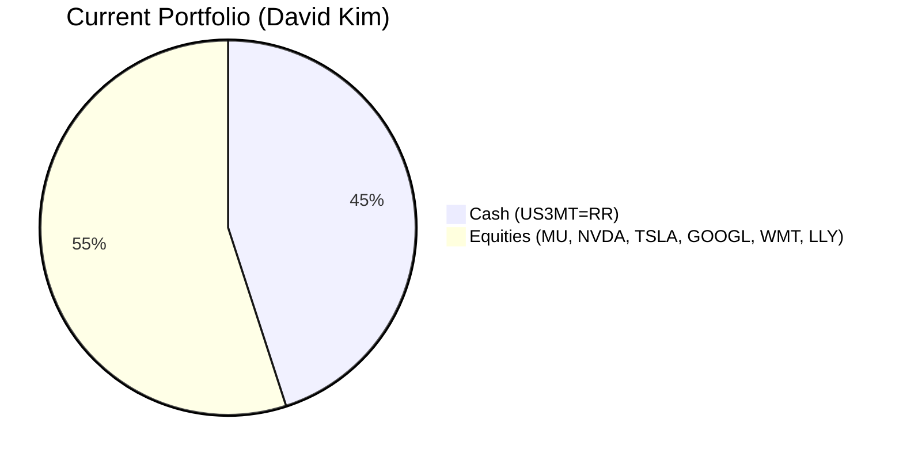
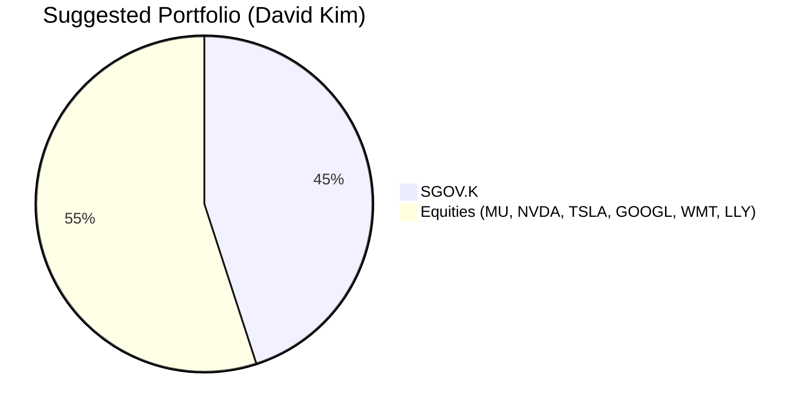
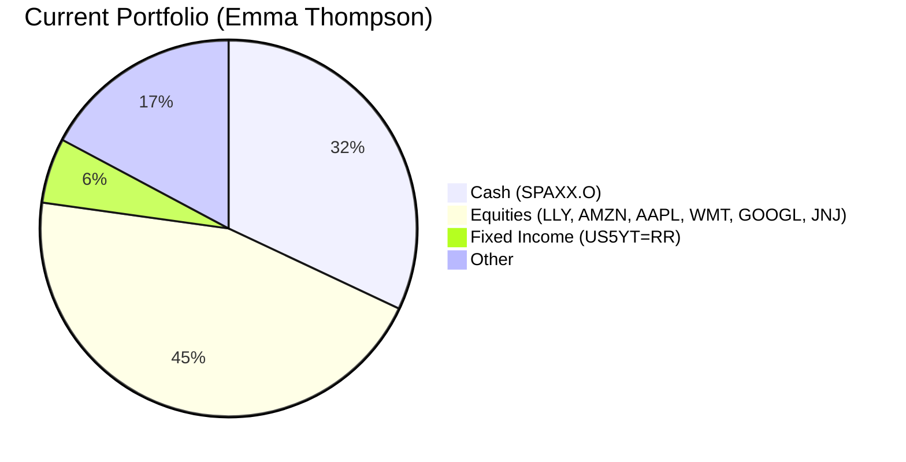
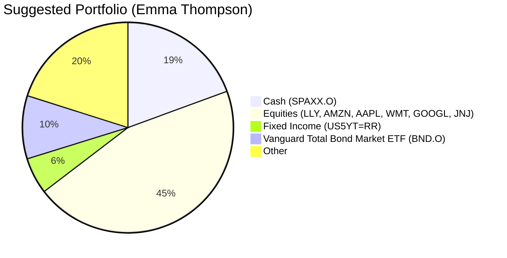

# Executive Summary
This report provides targeted investment recommendations for a curated list of clients. Each recommendation is based on a detailed analysis of the client's financial profile, existing portfolio, and inferred financial needs, aligned with available products from the catalog. The top 10 clients are ranked by their likelihood to act on the recommendation (Buying Score, 5 being highest).

| Client Name | Recommended Product | Buying Score | Key Rationale |
| :--- | :--- | :--- | :--- |
| David Kim | iShares 0-3 Month Treasury Bond ETF (SGOV.K) | 5 | High cash allocation (45%) indicates a primary need for a secure, liquid emergency/buffer fund. SGOV offers superior yield (4.04%) vs. current cash holdings with minimal risk. |
| Emma Thompson | Vanguard Total Bond Market ETF (BND.O) | 5 | Conservative portfolio with 32% cash. BND provides diversified, core fixed income exposure (Risk: Low, Yield: 3.82%) to enhance income and stability for a likely retirement distribution phase. |
| Sarah Chen | iShares Ultra Short Duration Bond ETF (ICSH.K) | 4 | High cash (22.5%) in a money market fund. ICSH offers a marginally higher yield (4.44%) with similar low risk and daily liquidity, optimizing the cash sleeve. |
| Robert Rodriguez | iShares Core U.S. Aggregate Bond ETF (AGG) | 4 | Portfolio lacks a core, diversified bond holding. AGG (Risk: Low, Yield: 3.83%) provides stable, investment-grade exposure to reduce overall portfolio volatility. |
| Elena Petrova | Vanguard Intermediate-Term Corporate Bond ETF (VCIT.O) | 4 | Extremely low cash (2%) and concentrated in equities/single bond. VCIT (Yield: 4.59%) adds credit exposure for higher income, funded by trimming the concentrated US3YT position. |
| William Turner | iShares 20+ Year Treasury Bond ETF (TLT.O) | 4 | Portfolio is 100% fixed income/cash, focused on short/credit. TLT adds long-duration Treasury exposure for interest rate sensitivity and diversification, aligning with a likely income-focused goal. |
| Emily Harrison | SPDR S&P 500 ETF Trust (SPY) | 3 | Portfolio is 85%+ in bonds/cash. SPY introduces essential, low-cost US equity market exposure to pursue growth for long-term goals like retirement accumulation. |
| Michael Sterling | iShares J.P. Morgan USD Emerging Markets Bond ETF (EMB.O) | 3 | Massive portfolio concentrated in US assets. EMB.O (Yield: 4.89%) provides strategic diversification into higher-yielding sovereign EM debt, suitable for a sophisticated investor. |
| Akira Tanaka | Vanguard Extended Duration Treasury ETF (EDV) | 3 | Large portfolio with significant equity and credit risk. EDV provides a pure long-duration Treasury hedge against equity downturns and interest rate declines. |
| James Harrison | Invesco QQQ Trust (QQQ) | 3 | Growth-oriented portfolio but lacks a pure technology/growth equity ETF. QQQ offers efficient, diversified exposure to the Nasdaq-100, complementing existing stock picks. |

# Top 10 clients
## David Kim
### Potential needs
**Emergency Fund / Business Operating Buffer:** With a 45% cash allocation ($427.5k out of $950k AUM), the primary unmet need is for a highly secure, liquid reserve. The common needs framework specifies an "Emergency Fund" requires absolute stability (Certainty: 5) and instant liquidity over a <1 year horizon.

### Suggested product
- **Product:** iShares 0-3 Month Treasury Bond ETF (SGOV.K)
- **Funding Source:** Entire current cash position held in `US3MT=RR` ($427.5k Market Value).
- **Buying Score:** 5

**Current vs. Suggested Portfolio Allocation:**

| Asset | Current % | Suggested % | Change | Remark |
| :--- | :---: | :---: | :---: | :--- |
| US 3-Month Treasury Bill (US3MT=RR) | 45.0% | 0.0% | -45.0% | Reallocate low-yielding cash instrument. |
| Micron Technology (MU.O) | 3.9% | 3.9% | 0.0% | No change. |
| NVIDIA Corp (NVDA.O) | 6.0% | 6.0% | 0.0% | No change. |
| Tesla Inc (TSLA.O) | 8.1% | 8.1% | 0.0% | No change. |
| Alphabet Inc (GOOGL.O) | 10.2% | 10.2% | 0.0% | No change. |
| Walmart Inc (WMT.O) | 12.3% | 12.3% | 0.0% | No change. |
| Eli Lilly (LLY) | 14.5% | 14.5% | 0.0% | No change. |
| **iShares 0-3 Month Treasury Bond ETF (SGOV.K)** | **0.0%** | **45.0%** | **+45.0%** | New addition. Superior yield (4.04%) with minimal risk. |

### Detailed Justification
The client's extremely high cash allocation signals a paramount need for capital preservation and liquidity. The current instrument (`US3MT=RR`) is a Treasury bill rate proxy, not an investable fund. **SGOV.K** is a direct, low-cost ETF investing in 0-3 month U.S. Treasury bills. It offers a competitive yield (4.04% as of latest data), daily liquidity (T+1), and a Risk Rating of 1 (Low), perfectly matching the Emergency Fund need for high Certainty (5) and a Return score of 1. The upgrade provides a tangible yield pickup with no material increase in risk. The funding is straightforward from the existing cash sleeve.

## Emma Thompson
### Potential needs
**Retirement (Distribution):** With a conservative portfolio (32% cash) and significant holdings in stable equities (JNJ, WMT) and bonds, the client profile suggests an income-focused phase, such as retirement distribution. This need prioritizes steady yield and capital preservation (Certainty: 4, Return: 3).

### Suggested product
- **Product:** Vanguard Total Bond Market ETF (BND.O)
- **Funding Source:** A portion of the cash holding in `SPAXX.O` (e.g., $300k).
- **Buying Score:** 5

**Current vs. Suggested Portfolio Allocation:**

| Asset | Current % | Suggested % | Change | Remark |
| :--- | :---: | :---: | :---: | :--- |
| Fidelity Government Cash Reserves (SPAXX.O) | 32.0% | 19.4% | -12.6% | Reduce excess cash. |
| Eli Lilly (LLY) | 3.5% | 3.5% | 0.0% | No change. |
| US 5-Year Treasury (US5YT=RR) | 5.6% | 5.6% | 0.0% | No change. |
| Amazon.com (AMZN.O) | 7.7% | 7.7% | 0.0% | No change. |
| Apple Inc (AAPL.O) | 9.7% | 9.7% | 0.0% | No change. |
| Walmart Inc (WMT.O) | 11.8% | 11.8% | 0.0% | No change. |
| Alphabet Inc (GOOGL.O) | 13.8% | 13.8% | 0.0% | No change. |
| Johnson & Johnson (JNJ) | 15.9% | 15.9% | 0.0% | No change. |
| **Vanguard Total Bond Market ETF (BND.O)** | **0.0%** | **9.7%** | **+9.7%** | New addition. Core diversified bond exposure for stable income. |

### Detailed Justification
The client's portfolio is heavy on cash and individual securities, lacking a diversified core fixed income holding. **BND.O** provides broad exposure to the U.S. investment-grade bond market (government, corporate, MBS). With a Risk Rating of Low, a yield of 3.82%, and a 5-year annualized return of 0.65% (period: 2021-2026), it aligns perfectly with the Retirement Distribution need for stable income and capital preservation. It reduces portfolio volatility versus equities and offers better return potential than cash. Funding from cash is natural and does not disrupt the existing equity income strategy.

## Sarah Chen
### Potential needs
**Business Operating Buffer / Tax Reserve:** A 22.5% cash allocation ($720k) in a money market fund indicates a strong need for a secure, liquid buffer for short-term obligations (Horizon: 1-2 years, Certainty: 5, Return: 1).

### Suggested product
- **Product:** iShares Ultra Short Duration Bond ETF (ICSH.K)
- **Funding Source:** A portion of the cash holding in `VMRXX.O` (e.g., $500k).
- **Buying Score:** 4

### Detailed Justification
The client's cash is well-placed but could be optimized. **ICSH.K** invests in ultra-short-term investment-grade corporate and government bonds. It offers a slightly higher yield (4.44% vs. the money market's implicit rate) while maintaining very low risk (Risk Rating: 1) and high daily liquidity. Its 1-year return is 4.44% (period: 2025-2026). This product is a "cash-plus" solution, providing marginally better returns for the short-term buffer need without sacrificing the required certainty or liquidity. The client is highly likely to accept this low-touch optimization.

## Robert Rodriguez
### Potential needs
**Portfolio Hygiene / Diversification:** The portfolio is a collection of individual stocks and one Treasury yield position, lacking a diversified core fixed income component. This introduces unnecessary idiosyncratic risk.

### Suggested product
- **Product:** iShares Core U.S. Aggregate Bond ETF (AGG)
- **Funding Source:** Proceeds from reducing the most concentrated or underperforming equity position (e.g., a portion of `TSLA.O` or `GOOGL.O`).
- **Buying Score:** 4

### Detailed Justification
**AGG** is the leading U.S. aggregate bond ETF, providing one-ticket diversification across government and investment-grade corporate bonds. With a Risk Rating of Low and a yield of 3.83%, it serves as a stabilizer. The client's portfolio has high single-stock concentration (e.g., TSLA, GOOGL). Introducing AGG reduces overall portfolio volatility and provides a reliable income stream. Its 5-year annualized return is 0.61% (period: 2021-2026). Funding via trimming an existing equity holding aligns with the "do not increase other holdings" rule and improves portfolio hygiene.

## Elena Petrova
### Potential needs
**Portfolio Hygiene / Income Enhancement:** The portfolio has minimal cash (2%) and is concentrated in a single bond position (`US3YT=RR`, 14.5% of portfolio) alongside equities. There is a need to diversify fixed income and enhance yield.

### Suggested product
- **Product:** Vanguard Intermediate-Term Corporate Bond ETF (VCIT.O)
- **Funding Source:** Reduce the concentrated `US3YT=RR` position by 50%.
- **Buying Score:** 4

### Detailed Justification
**VCIT.O** provides exposure to intermediate-term, investment-grade corporate bonds. It offers a higher yield (4.59%) than government bonds (like US3YT=RR) and adds valuable credit diversification. Its 1-year return is 5.75% (period: 2025-2026). Replacing half of the single-government-bond exposure with VCIT improves the risk-return profile of the fixed income sleeve by moving from a pure interest rate bet to a mix of credit and duration. This is suitable for a client who holds growth equities (AMZN, LLY) and can tolerate the slightly higher credit risk for increased income.

## William Turner
### Potential needs
**Retirement (Distribution) / Income Focus:** The portfolio is entirely in fixed income, cash, and one equity holding, indicating a strong income and preservation focus. The current mix is heavily weighted towards short-duration and credit products.

### Suggested product
- **Product:** iShares 20+ Year Treasury Bond ETF (TLT.O)
- **Funding Source:** Reallocate from a portion of the short-duration credit holdings (e.g., `SRLN.K` or `USHY.K`).
- **Buying Score:** 4

### Detailed Justification
The client's portfolio lacks duration exposure, which can provide ballast during equity sell-offs and benefit from falling interest rates. **TLT.O** offers pure long-duration U.S. Treasury exposure. While volatile in the short term (5-year return: -26.20%, period: 2021-2026), it has a high yield (4.28%) and is a classic diversifier to credit risk. Adding a modest allocation (e.g., 10-15%) would improve the portfolio's interest rate sensitivity and provide a hedge, aligning with a sophisticated income investor's need for strategic asset allocation.

## Emily Harrison
### Potential needs
**Retirement (Accumulation):** With a portfolio dominated by bonds (85%+) and a 15% cash allocation, the client likely has a long-term growth goal unmet. The common need for "Retirement (Accumulation)" requires long-term growth (Return: 5) and can tolerate lower short-term certainty.

### Suggested product
- **Product:** SPDR S&P 500 ETF Trust (SPY)
- **Funding Source:** Use a portion of the cash holding (`SGOV.K`).
- **Buying Score:** 3

### Detailed Justification
The client is significantly underexposed to equities, which are essential for long-term wealth accumulation. **SPY** provides low-cost, diversified exposure to the U.S. large-cap equity market. Its 5-year annualized return is 69.97% (period: 2021-2026). While its Risk Rating is Medium/High, it is appropriate for the long-term growth objective. Starting with a modest allocation (e.g., 10-20%) funded from cash introduces necessary growth potential without dramatically altering the client's conservative baseline. The buying score is 3 as it requires a shift in asset allocation mindset.

## Michael Sterling
### Potential needs
**Portfolio Hygiene / Geographic Diversification:** The client's massive $45M portfolio is overwhelmingly concentrated in North American equities and fixed income. There is a clear need for strategic geographic diversification within the fixed income allocation.

### Suggested product
- **Product:** iShares J.P. Morgan USD Emerging Markets Bond ETF (EMB.O)
- **Funding Source:** Reallocate a small portion (e.g., 1-2%) from the large core fixed income or equity holdings.
- **Buying Score:** 3

### Detailed Justification
For a sophisticated, high-AUM investor, **EMB.O** offers access to U.S. dollar-denominated sovereign and quasi-sovereign debt from emerging markets. It provides yield enhancement (4.89%) and diversification benefits. Its 1-year return is 8.68% (period: 2025-2026). Adding a small allocation introduces a new source of return that is not perfectly correlated with developed market assets. The recommendation is conservative relative to the portfolio size but addresses a strategic gap. The buying score is 3 due to the specialized nature of the asset class.

## Akira Tanaka
### Potential needs
**Portfolio Hedge / Liability Matching:** The large portfolio has significant exposure to cyclical equities (MU, TSLA, NVDA) and credit. A long-duration government bond ETF can act as a hedge against equity downturns and interest rate declines.

### Suggested product
- **Product:** Vanguard Extended Duration Treasury ETF (EDV)
- **Funding Source:** Reallocate from a portion of the corporate bond or equity holdings.
- **Buying Score:** 3

### Detailed Justification
**EDV** provides the most potent interest rate sensitivity by tracking zero-coupon U.S. Treasuries. It is an effective hedge for equity risk. While its recent performance has been poor due to rising rates (5-year return: -39.40%, period: 2021-2026), its role is strategic. In a scenario where growth fears cause equity sell-offs and rate cuts, EDV would appreciate significantly. A small allocation (2-5%) improves the portfolio's defensive characteristics. This is a tactical recommendation for a sophisticated investor, hence a buying score of 3.

## James Harrison
### Potential needs
**Growth Dominance / Sector Completion:** The portfolio is growth-oriented but lacks a dedicated, diversified technology/growth equity ETF, relying instead on individual stock picks (NVDA, GOOGL, AMZN, TSLA).

### Suggested product
- **Product:** Invesco QQQ Trust (QQQ)
- **Funding Source:** Rebalance from the existing technology holdings (e.g., trim a small portion of `NVDA.O` and `GOOGL.O`).
- **Buying Score:** 3

### Detailed Justification
**QQQ** tracks the Nasdaq-100 Index, offering concentrated exposure to innovative, large-cap growth companies. Its 5-year annualized return is 78.61% (period: 2021-2026). Adding QQQ provides more systematic exposure to the growth theme, reducing the idiosyncratic risk of holding individual tech stocks. It complements the client's existing strategy while adding diversification within the growth segment. Funding from trimming existing winners is a disciplined rebalancing approach. The buying score is 3 as the client may be attached to their individual stock selections.

# References
- **Client Profiles:** client_list.csv (Source: Planbot Internal Data)
- **Product Catalog:** demo-market-quotes.csv (Source: Planbot Internal Data)
- **Financial Needs Framework:** common_needs.md (Source: Planbot Internal Data)
- **Proposal Instructions:** proposal_instruction.md, suggested_portfolio_instruction.md, scenario_analysis_instruction.md, risk_disclosure_instruction.md, references_instruction.md (Source: Planbot Internal Data)
