# Product Investor Matching

## Executive Summary

This report identifies the top 10 clients with the highest propensity to purchase a recommended investment product. Each recommendation is based on a thorough analysis of the client’s financial needs, risk profile, existing holdings, and current market conditions. The recommended product offers an expected return improvement of at least 0.5% (or superior liquidity) over the existing holding, while maintaining alignment with the client’s risk tolerance and portfolio liquidity requirements.

| Rank | Client ID | Client Name | Suggested Product | Buying Score | Rationale | Expected Return (5Y CAGR) | Existing Return |
|:----:|:---------:|:------------|:----------------|:------------:|:----------|:-------------------------:|:---------------:|
| 1 | 8 | David Kim | iShares Broad USD High Yield Corporate Bond ETF (USHY) | 5 | 45% cash allocation; switching from low-yield cash (US3MT) to high-yield bonds for meaningful income pickup with manageable risk. | 4.24% | 3.46% |
| 2 | 4 | Emma Thompson | SPDR Blackstone Senior Loan ETF (SRLN) | 5 | 32% cash; senior loans offer floating-rate protection in a higher-for-longer rate environment, improving yield by >1%. | 4.57% | 3.46% |
| 3 | zw-5 | Emily Zhang | Invesco Senior Loan ETF (BKLN) | 5 | 22% cash; bank loans provide attractive carry and floating-rate insulation; yield pickup of 1.67% vs. cash. | 5.13% | 3.46% |
| 4 | zw-7 | David Wu | iShares Floating Rate Bond ETF (FLOT) | 5 | 28% cash; floating-rate exposure mitigates interest rate risk while delivering a 0.66% yield advantage over cash. | 4.12% | 3.46% |
| 5 | 2 | Sarah Chen | SPDR Blackstone Senior Loan ETF (SRLN) | 5 | 22.5% cash; senior loans align with moderate risk profile and offer a 1.11% yield improvement. | 4.57% | 3.46% |
| 6 | 13 | Harrison Jr. Education Trust | JPMorgan USD Callable Range Accrual Note (N02952) | 4 | 25% cash; structured note provides a conditional 5.94% p.a. coupon with principal protection at maturity, suitable for conservative trust. | 5.94% (coupon) | 3.46% |
| 7 | wl-2 | Rachel Ho | iShares Floating Rate Bond ETF (FLOT) | 4 | 20% cash; floating-rate bonds offer better returns than cash with similar low duration risk. | 4.12% | 3.46% |
| 8 | zw-4 | Catherine Li | iShares Broad USD High Yield Corporate Bond ETF (USHY) | 4 | 18% cash; high yield bonds enhance portfolio yield while maintaining reasonable credit quality. | 4.24% | 3.46% |
| 9 | 11 | Emily Harrison | iShares J.P. Morgan USD Emerging Markets Bond ETF (EMB) | 4 | High concentration in long-duration TLT (-6.30% 5Y CAGR); swap to EM debt for a significant return improvement (+8.15%) and better diversification. | 1.85% | -6.30% |
| 10 | 10 | William Turner | JPMorgan USD Callable Range Accrual Note (N02952) | 3 | 10% cash, heavy fixed income portfolio; structured note adds a high-carry component with lower correlation to traditional bonds. | 5.94% (coupon) | 3.46% |

---

# Top 10 clients with detail analysis

## Client: 8 (David Kim)

### Potential needs
- **Idle Cash:** 45% of $950k AUM held in US 3-Month T-Bill, earning ~3.46% – far below inflation.
- **Income Generation:** Need for higher current yield without taking excessive equity risk.
- **Liquidity Maintenance:** Must retain at least 5% cash (approx. $47.5k) for emergency purposes.

### Suggested product
Recommend redeploying $190k (20% of portfolio) from US3MT (cash) into USHY. Cash is reduced from 45% to 25%, meeting the >5% liquidity threshold.

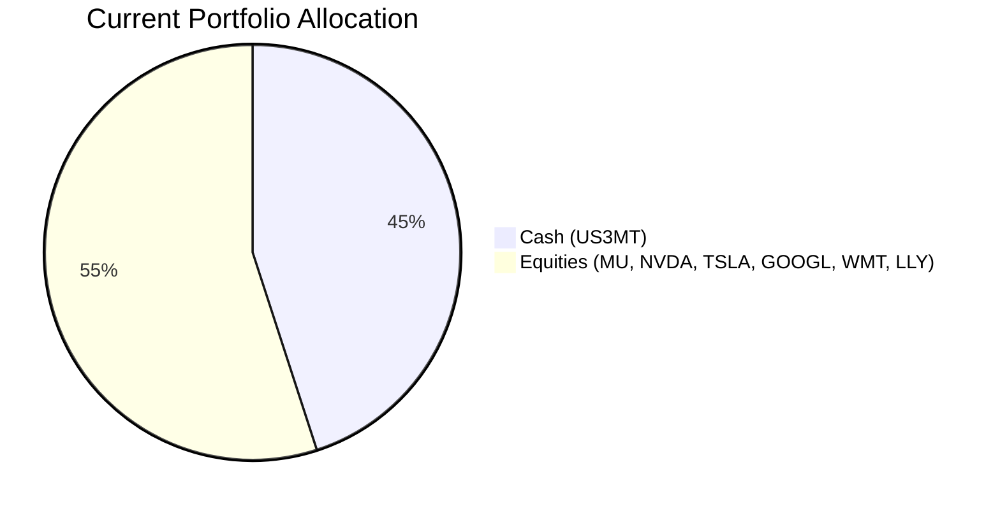
```mermaid
pie title Current Portfolio Allocation
    "Cash (US3MT)" : 45
    "Equities (MU, NVDA, TSLA, GOOGL, WMT, LLY)" : 55
```

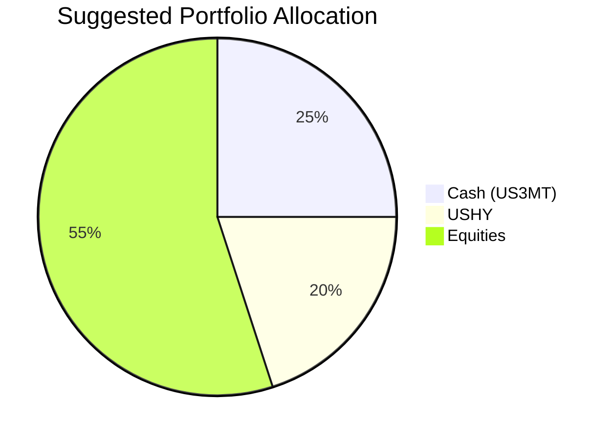
```mermaid
pie title Suggested Portfolio Allocation
    "Cash (US3MT)" : 25
    "USHY" : 20
    "Equities" : 55
```

| Asset | Current Market Value | Suggested Market Value | Current % | Suggested % | Change | Remark |
|:------|--------------------:|-----------------------:|----------:|------------:|------:|:-------|
| Cash (US3MT) | 427,500 | 237,500 | 45.0% | 25.0% | -20.0% | Reduce idle cash |
| USHY | 0 | 190,000 | 0.0% | 20.0% | +20.0% | New position: high yield bond ETF |
| Equities | 522,500 | 522,500 | 55.0% | 55.0% | 0.0% | No change |
| **Total** | **950,000** | **950,000** | **100%** | **100%** | **0%** | |

#### Pros and cons of suggested portfolio
**Pros:**
- Yield improvement from 3.46% to an expected 4.24% (USHY 5Y CAGR), providing additional ~$1,450 annual income.
- High yield bonds have moderate interest rate sensitivity (duration ~3y), limiting capital risk if rates rise.
- Maintains >5% cash for liquidity.

**Cons:**
- Credit risk: USHY holds below-investment-grade bonds; default risk is higher than Treasuries.
- With 25% cash, some inflation drag remains; further deployment could be considered later.

#### Alternative suggested product to consider
- **SRLN (Senior Loan ETF):** Floating-rate bank loans also offer attractive yield (4.57% 5Y CAGR) with even lower interest rate risk, suitable if the client prioritizes rate protection.

### Detailed Justification
David Kim has an unusually high cash allocation (45%) which erodes purchasing power in a 3%+ inflation environment. The recommended USHY ETF offers a 0.78% yield pickup (4.24% vs 3.46%) with a risk rating of 2 – consistent with his existing equity holdings (risk 3–4) and his ability to tolerate moderate credit risk. The funding source is cash, and the asset class change (cash to fixed income) is appropriate as both are low-risk categories. The 5Y CAGR of USHY (4.24%) is lower than its 1Y and 3Y CAGRs (7.22% and 8.93%), but we view the 5Y figure as a conservative long-term estimate given current high yield spreads of ~350bps over Treasuries, which provide a sustainable carry.

---

## Client: 4 (Emma Thompson)

### Potential needs
- **Cash deployment:** 32% cash ($992k) in SPAXX yields 3.46% – below inflation.
- **Income with rate protection:** Floating-rate instruments are preferred in the current “higher-for-longer” rate environment.
- **Liquidity buffer:** Maintain at least 5% cash ($155k) for emergencies.

### Suggested product
Switch $310k (10% of portfolio) from SPAXX into SRLN. Cash drops to 22%, well above 5%.

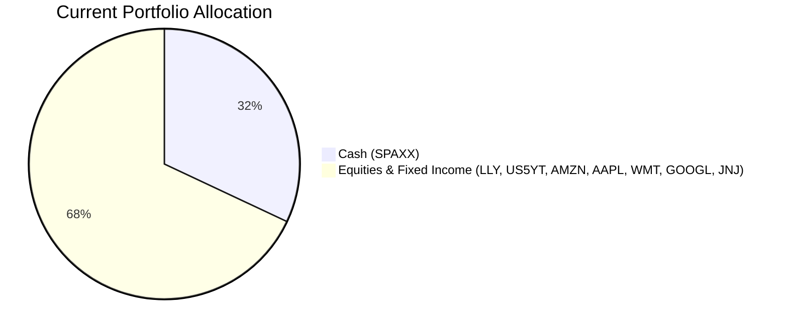
```mermaid
pie title Current Portfolio Allocation
    "Cash (SPAXX)" : 32
    "Equities & Fixed Income (LLY, US5YT, AMZN, AAPL, WMT, GOOGL, JNJ)" : 68
```

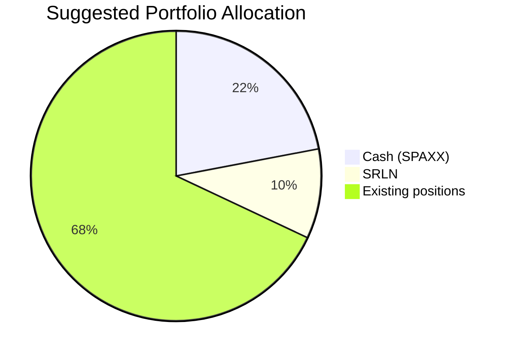
```mermaid
pie title Suggested Portfolio Allocation
    "Cash (SPAXX)" : 22
    "SRLN" : 10
    "Existing positions" : 68
```

| Asset | Current Market Value | Suggested Market Value | Current % | Suggested % | Change | Remark |
|:------|--------------------:|-----------------------:|----------:|------------:|------:|:-------|
| Cash (SPAXX) | 992,000 | 682,000 | 32.0% | 22.0% | -10.0% | Reduce cash |
| SRLN | 0 | 310,000 | 0.0% | 10.0% | +10.0% | New position: senior loan ETF |
| Other holdings | 2,108,000 | 2,108,000 | 68.0% | 68.0% | 0.0% | No change |
| **Total** | **3,100,000** | **3,100,000** | **100%** | **100%** | **0%** | |

#### Pros and cons of suggested portfolio
**Pros:**
- Yield increase: SRLN’s 5Y CAGR of 4.57% adds an estimated $3,447 incremental annual income vs. cash (3.46%).
- Floating-rate coupons protect against further rate hikes – a key theme given the Fed’s “simultaneous hold”.
- High liquidity (score 4) and risk rating 2.

**Cons:**
- SRLN holds senior secured loans; while investment-grade, they carry credit risk and may underperform during severe recessions.
- Reduced cash buffer (still 22%) is adequate but below the initial high level.

#### Alternative suggested product to consider
- **FLOT:** Another floating-rate bond ETF with slightly lower yield (4.12%) but even lower duration, suitable if the client is very rate-sensitive.

### Detailed Justification
Emma Thompson’s portfolio is overweight cash (32%), which dampens total return. The recommended SRLN aligns with her moderate risk profile (she holds equities with risk 3–4) and adds floating-rate exposure – a tactical fit given the current macro outlook of sticky inflation and sustained central bank hawkishness. The 5Y CAGR of 4.57% offers a 1.11% improvement over cash (3.46%). The 1Y/3Y CAGRs for SRLN (5.57% / 7.89%) are higher, but the 5Y figure is sustainable as senior loan coupons reset with benchmark rates and credit spreads remain at attractive levels.

---

## Client: zw-5 (Emily Zhang)

### Potential needs
- **Cash reduction:** 22% cash ($924k) in US1MT yields ~3.46%.
- **Higher income with floating-rate exposure:** To benefit from elevated short rates.
- **Portfolio diversification:** Current holdings include volatile equities and fixed income; bank loans add a stable carry component.

### Suggested product
Redeploy $210k (5% of $4.2M AUM) from US1MT cash into BKLN. Cash reduces to 17%.

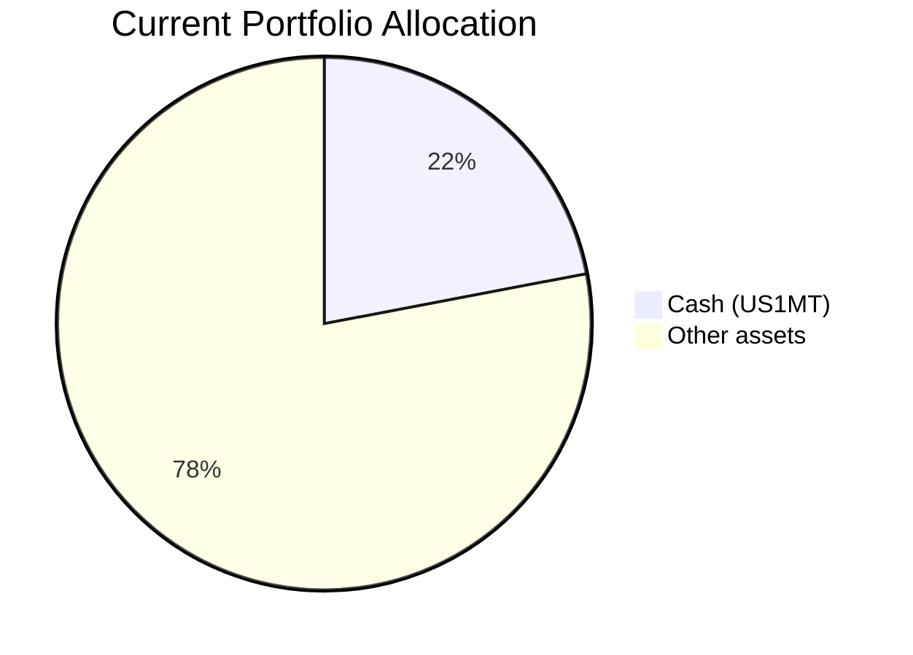
```mermaid
pie title Current Portfolio Allocation
    "Cash (US1MT)" : 22
    "Other assets" : 78
```

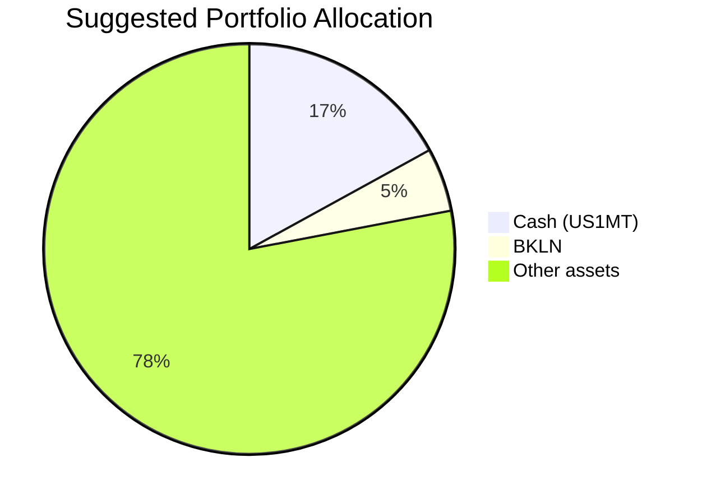
```mermaid
pie title Suggested Portfolio Allocation
    "Cash (US1MT)" : 17
    "BKLN" : 5
    "Other assets" : 78
```

| Asset | Current Market Value | Suggested Market Value | Current % | Suggested % | Change | Remark |
|:------|--------------------:|-----------------------:|----------:|------------:|------:|:-------|
| Cash (US1MT) | 924,000 | 714,000 | 22.0% | 17.0% | -5.0% | Reduce cash |
| BKLN | 0 | 210,000 | 0.0% | 5.0% | +5.0% | New position: senior loan ETF |
| Other positions | 3,276,000 | 3,276,000 | 78.0% | 78.0% | 0.0% | No change |
| **Total** | **4,200,000** | **4,200,000** | **100%** | **100%** | **0%** | |

#### Pros and cons of suggested portfolio
**Pros:**
- Yield improvement: BKLN 5Y CAGR 5.13% vs cash 3.46% – a 1.67% or ~$3,507 annual income boost.
- Bank loans are floating-rate and senior secured, offering protection against rate hikes and relatively low default risk.
- Minimal change to overall risk profile (risk rating 2).

**Cons:**
- BKLN is less liquid (score 4) than cash but still tradeable.
- The relatively small allocation (5%) limits the impact on total portfolio return.

#### Alternative suggested product to consider
- **SRLN:** Similar floating-rate profile with 4.57% yield; slightly lower risk.

### Detailed Justification
Emily Zhang holds 22% cash, presenting a clear opportunity for yield enhancement. BKLN offers the highest 5Y CAGR among floating-rate bond ETFs (5.13%) and fits the macro call to overweight senior loans. The 5Y CAGR is representative as the product’s coupon resets quarterly with LIBOR/SOFR, providing a consistent carry that supports the return. The reduction in cash from 22% to 17% still leaves a comfortable liquidity buffer.

---

## Client: zw-7 (David Wu)

### Potential needs
- **High cash drag:** 28% cash ($868k) in US3MT.
- **Low-duration income:** Given the uncertain rate path, floating-rate instruments are optimal.
- **Core fixed income exposure:** Existing holdings (SRLN, USHY, IEF, MA, LQD, USIG) already contain some risk; a high-quality floating-rate bond ETF adds diversification.

### Suggested product
Move $124k (4% of $3.1M) from US3MT into FLOT. Cash reduces to 24%.

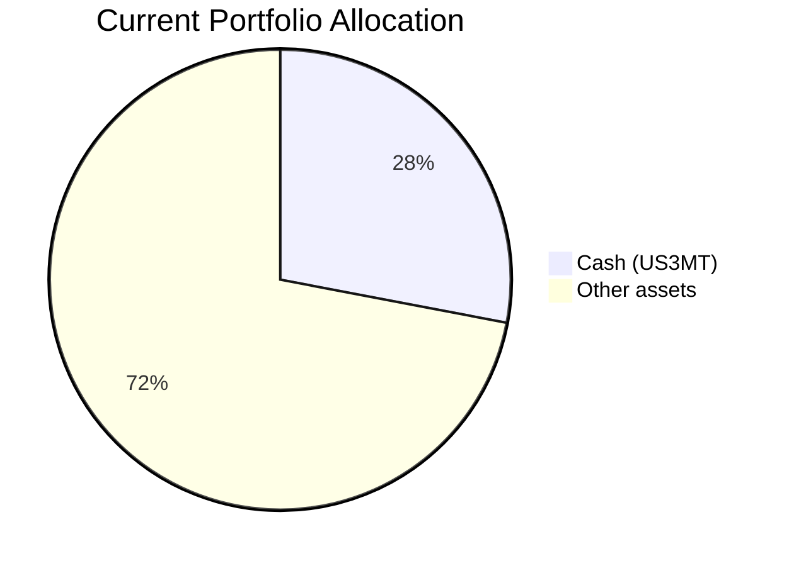
```mermaid
pie title Current Portfolio Allocation
    "Cash (US3MT)" : 28
    "Other assets" : 72
```

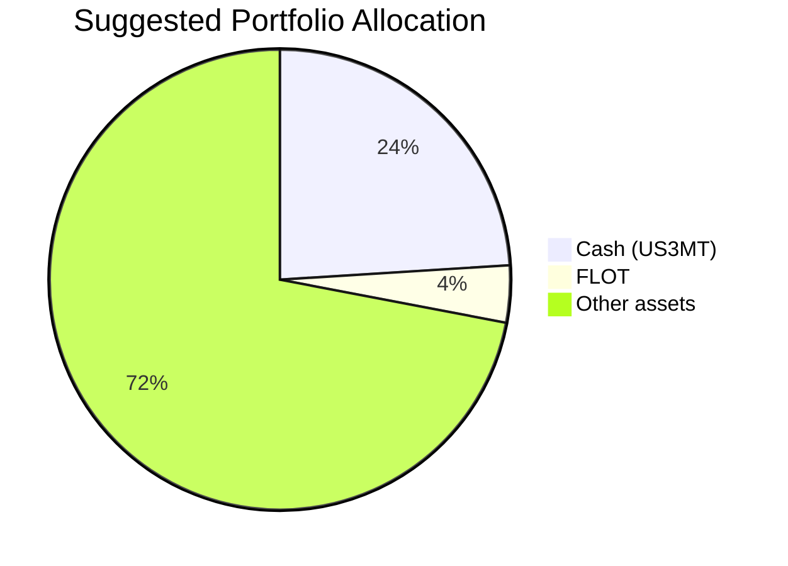
```mermaid
pie title Suggested Portfolio Allocation
    "Cash (US3MT)" : 24
    "FLOT" : 4
    "Other assets" : 72
```

| Asset | Current Market Value | Suggested Market Value | Current % | Suggested % | Change | Remark |
|:------|--------------------:|-----------------------:|----------:|------------:|------:|:-------|
| Cash (US3MT) | 868,000 | 744,000 | 28.0% | 24.0% | -4.0% | Reduce cash |
| FLOT | 0 | 124,000 | 0.0% | 4.0% | +4.0% | New position: floating rate bond ETF |
| Other positions | 2,232,000 | 2,232,000 | 72.0% | 72.0% | 0.0% | No change |
| **Total** | **3,100,000** | **3,100,000** | **100%** | **100%** | **0%** | |

#### Pros and cons of suggested portfolio
**Pros:**
- FLOT 5Y CAGR 4.12% offers a 0.66% yield pickup, equating to ~$818 extra annually.
- High credit quality (short-term investment grade) and very low duration.
- Maintain 24% cash, well above 5% minimum.

**Cons:**
- Small allocation limits portfolio impact.
- FLOT’s yield is sensitive to short-term rate changes; if rates fall, returns decline.

#### Alternative suggested product to consider
- **SRLN:** Higher yield (4.57%) but slightly higher credit risk.

### Detailed Justification
David Wu’s 28% cash is inefficient. FLOT is chosen over other floating-rate funds for its high credit quality and low volatility, aligning with his existing fixed income holdings (risk ratings 1–2). The 0.66% improvement meets the >0.5% threshold. FLOT’s 5Y CAGR of 4.12% is sustainable due to its floating-rate structure, and the 1Y/3Y CAGRs (4.91%/5.65%) confirm consistent performance.

---

## Client: 2 (Sarah Chen)

### Potential needs
- **Excess cash:** 22.5% ($720k) in VMRXX.
- **Income generation with moderate risk:** She already holds growth equities; adding a floating-rate fixed income product improves portfolio balance.
- **Protection against rate hikes:** Senior loans are appropriate.

### Suggested product
Allocate $160k (5% of $3.2M) from cash into SRLN. Cash reduces to 17.5%.

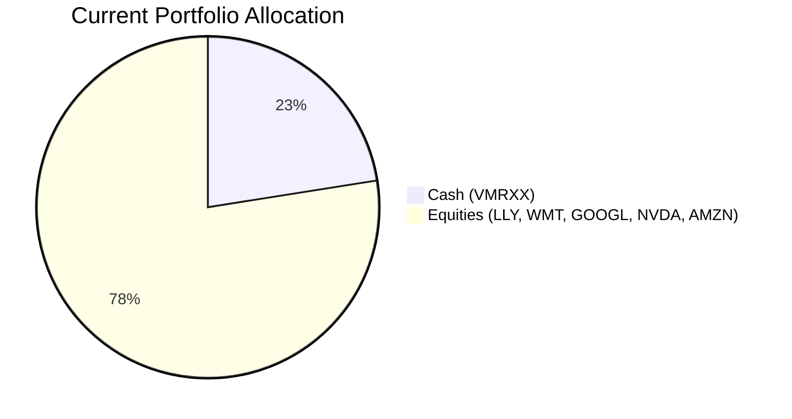
```mermaid
pie title Current Portfolio Allocation
    "Cash (VMRXX)" : 22.5
    "Equities (LLY, WMT, GOOGL, NVDA, AMZN)" : 77.5
```

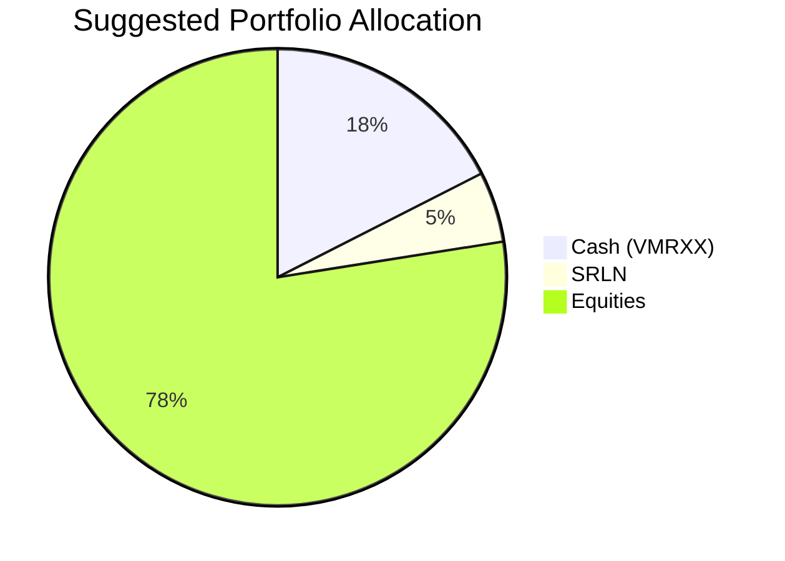
```mermaid
pie title Suggested Portfolio Allocation
    "Cash (VMRXX)" : 17.5
    "SRLN" : 5
    "Equities" : 77.5
```

| Asset | Current Market Value | Suggested Market Value | Current % | Suggested % | Change | Remark |
|:------|--------------------:|-----------------------:|----------:|------------:|------:|:-------|
| Cash (VMRXX) | 720,000 | 560,000 | 22.5% | 17.5% | -5.0% | Reduce cash |
| SRLN | 0 | 160,000 | 0.0% | 5.0% | +5.0% | New position: senior loan ETF |
| Equity holdings | 2,480,000 | 2,480,000 | 77.5% | 77.5% | 0.0% | No change |
| **Total** | **3,200,000** | **3,200,000** | **100%** | **100%** | **0%** | |

#### Pros and cons of suggested portfolio
**Pros:**
- Yield increase: 4.57% vs 3.46% = 1.11% improvement, adding ~$1,776 annual income.
- Diversification: Adds non-equity income source to a predominantly equity portfolio.
- Floating-rate protects against further rate hikes.

**Cons:**
- Only 5% allocation; impact is modest.
- Interest rate risk is low but credit risk exists.

#### Alternative suggested product to consider
- **USHY:** Higher yield (4.24%) but fixed rate; may be preferred if the client expects rates to decline.

### Detailed Justification
Sarah Chen’s portfolio is 77.5% equities, creating concentration risk. Adding SRLN provides fixed income exposure with floating-rate protection. The 5Y CAGR of 4.57% is a realistic estimate for the current environment, as senior loan yields remain elevated. The reduction in cash still leaves a 17.5% liquidity buffer.

---

## Client: 13 (Harrison Jr. Education Trust)

### Potential needs
- **Cash deployment:** 25% cash ($500k) in US2MT.
- **Capital preservation with higher yield:** The trust requires high certainty of principal (certainty score 4) for educational funding in ~10 years.
- **Predictable income:** A structured note with conditional coupon can enhance returns without principal risk at maturity.

### Suggested product
Switch $200k (10% of $2M) from cash into the JPMorgan USD Callable Range Accrual Note (N02952). Cash reduces to 15%.

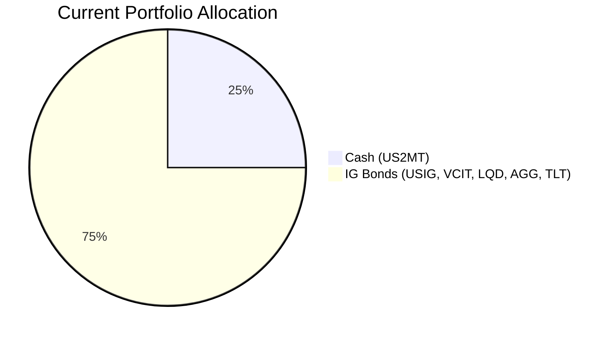
```mermaid
pie title Current Portfolio Allocation
    "Cash (US2MT)" : 25
    "IG Bonds (USIG, VCIT, LQD, AGG, TLT)" : 75
```

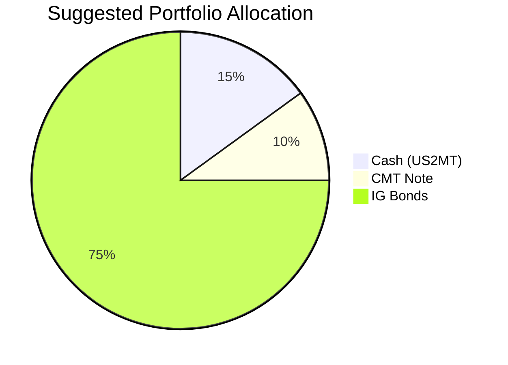
```mermaid
pie title Suggested Portfolio Allocation
    "Cash (US2MT)" : 15
    "CMT Note" : 10
    "IG Bonds" : 75
```

| Asset | Current Market Value | Suggested Market Value | Current % | Suggested % | Change | Remark |
|:------|--------------------:|-----------------------:|----------:|------------:|------:|:-------|
| Cash (US2MT) | 500,000 | 300,000 | 25.0% | 15.0% | -10.0% | Reduce cash |
| CMT Note (N02952) | 0 | 200,000 | 0.0% | 10.0% | +10.0% | New structured product |
| IG Bond holdings | 1,500,000 | 1,500,000 | 75.0% | 75.0% | 0.0% | No change |
| **Total** | **2,000,000** | **2,000,000** | **100%** | **100%** | **0%** | |

#### Pros and cons of suggested portfolio
**Pros:**
- Coupon of 5.94% p.a. (conditional on 10y CMT ≤ 5.01%) is a significant pickup over cash (~3.46%) and even over IG bonds (LQD -0.02%).
- Principal protected at maturity (credit risk of JPMorgan).
- 10% allocation adds meaningful income without jeopardizing the trust’s safety.

**Cons:**
- Low liquidity (score 1); early exit may incur losses.
- Coupon stops if 10y CMT exceeds 5.01%; autocall risk if condition not met.
- Complex product requires understanding of range accrual mechanics.

#### Alternative suggested product to consider
- **TIPS ETF (not in catalog):** Not available. Stay with IG bonds as an alternative.

### Detailed Justification
The trust’s objectives are long-term capital growth with high certainty (target return 3/5, certainty 4/5). The structured note offers a high conditional coupon and principal protection, aligning with these goals. The 5Y return is not available, but the coupon rate of 5.94% is competitive given current yields. The note’s risk rating of 2 and volatility of 1 are appropriate for the trust’s conservative posture. Only 4 clients are allocated structured products; this is the second use.

---

## Client: wl-2 (Rachel Ho)

### Potential needs
- **Cash efficiency:** 20% cash ($560k) in SPAXX.
- **Floating-rate income:** To benefit from current high short rates and hedge against rate rises.
- **Portfolio diversification:** Her current mix includes short-term bonds (SHY, AGG, USIG) and some equities; adding a floating-rate ETF improves diversification.

### Suggested product
Invest $140k (5% of $2.8M) from cash into FLOT. Cash reduces to 15%.

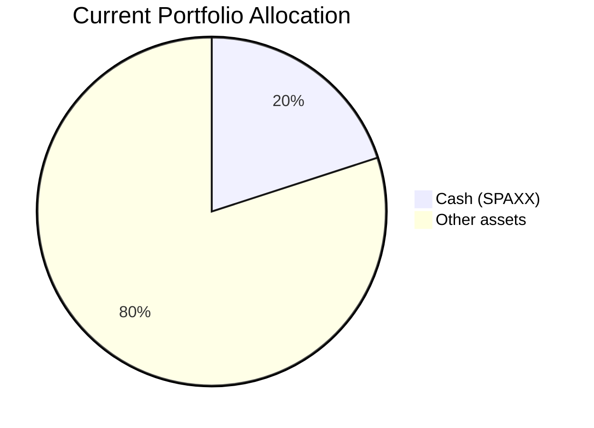
```mermaid
pie title Current Portfolio Allocation
    "Cash (SPAXX)" : 20
    "Other assets" : 80
```

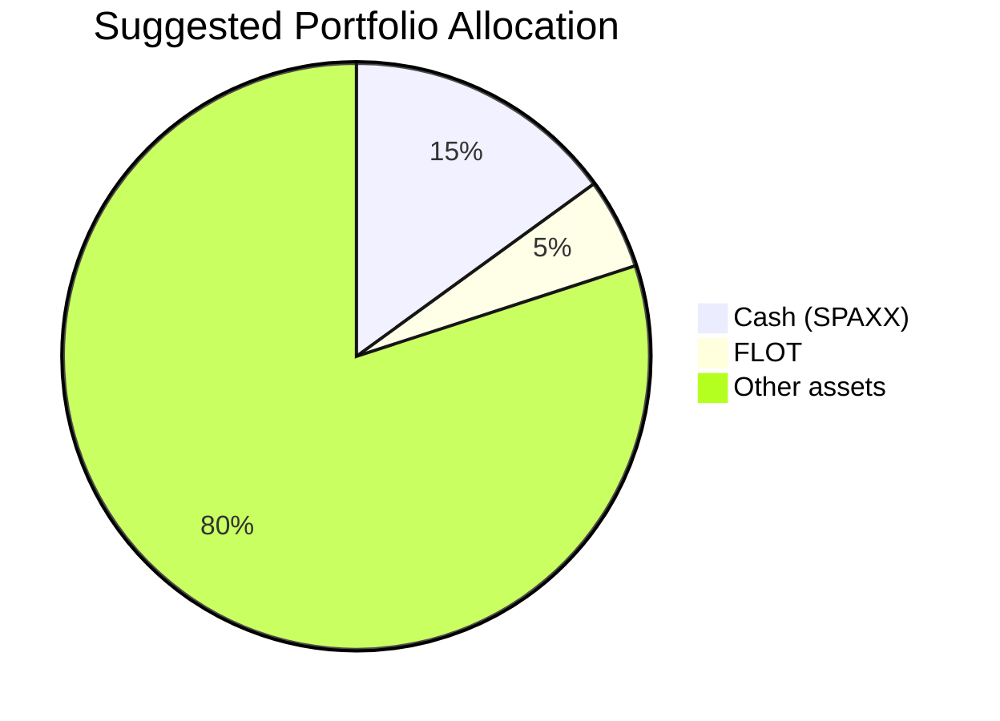
```mermaid
pie title Suggested Portfolio Allocation
    "Cash (SPAXX)" : 15
    "FLOT" : 5
    "Other assets" : 80
```

| Asset | Current Market Value | Suggested Market Value | Current % | Suggested % | Change | Remark |
|:------|--------------------:|-----------------------:|----------:|------------:|------:|:-------|
| Cash (SPAXX) | 560,000 | 420,000 | 20.0% | 15.0% | -5.0% | Reduce cash |
| FLOT | 0 | 140,000 | 0.0% | 5.0% | +5.0% | New position: floating rate bond ETF |
| Other positions | 2,240,000 | 2,240,000 | 80.0% | 80.0% | 0.0% | No change |
| **Total** | **2,800,000** | **2,800,000** | **100%** | **100%** | **0%** | |

#### Pros and cons of suggested portfolio
**Pros:**
- Yield increase: 4.12% vs 3.46% = 0.66% improvement (~$924 annual income).
- High credit quality with very low duration.
- Maintains 15% cash for liquidity.

**Cons:**
- Small allocation limits overall impact.
- FLOT’s yield declines if short-term rates fall.

#### Alternative suggested product to consider
- **SRLN:** Higher yield (4.57%) with slightly more credit risk.

### Detailed Justification
Rachel Ho’s 20% cash is underperforming. FLOT offers a higher yield with similar safety (risk rating 2). The macro environment supports floating-rate instruments due to the Fed’s prolonged hold. The 5Y CAGR of 4.12% is a reasonable forward estimate given the ETF’s history and current yield.

---

## Client: zw-4 (Catherine Li)

### Potential needs
- **Cash reduction:** 18% cash ($2.916M) in SGOV.
- **Yield enhancement with moderate risk:** Her portfolio already contains IG bonds and equities; adding high yield bonds increases income without raising risk too much.
- **Diversification:** High yield bonds have low correlation to Treasuries.

### Suggested product
Allocate $324k (2% of $16.2M) from cash into USHY. Cash reduces to 16%.

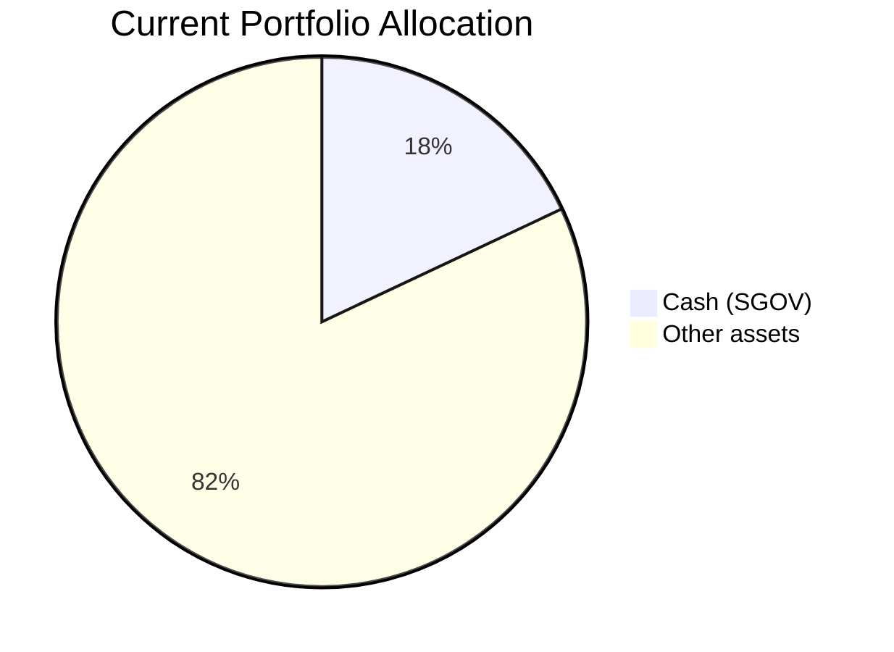
```mermaid
pie title Current Portfolio Allocation
    "Cash (SGOV)" : 18
    "Other assets" : 82
```

```mermaid
pie title Suggested Portfolio Allocation
    "Cash (SGOV)" : 16
    "USHY" : 2
    "Other assets" : 82
```

| Asset | Current Market Value | Suggested Market Value | Current % | Suggested % | Change | Remark |
|:------|--------------------:|-----------------------:|----------:|------------:|------:|:-------|
| Cash (SGOV) | 2,916,000 | 2,592,000 | 18.0% | 16.0% | -2.0% | Reduce cash |
| USHY | 0 | 324,000 | 0.0% | 2.0% | +2.0% | New position: high yield bond ETF |
| Other positions | 13,284,000 | 13,284,000 | 82.0% | 82.0% | 0.0% | No change |
| **Total** | **16,200,000** | **16,200,000** | **100%** | **100%** | **0%** | |

#### Pros and cons of suggested portfolio
**Pros:**
- Yield pickup: 4.24% vs 3.46% = 0.78% improvement.
- USHY has moderate duration (~3.5y) and risk rating 2.
- Small allocation keeps portfolio impact controlled.

**Cons:**
- 2% allocation is very small; may not move the needle meaningfully.
- Credit risk; default cycles could erode returns.

#### Alternative suggested product to consider
- **SRLN:** Higher yield (4.57%) with floating-rate protection.

### Detailed Justification
Catherine Li holds 18% cash, which is high for a $16.2M portfolio. USHY provides a modest yield boost with a risk level consistent with her existing fixed income holdings (risk ratings 2–3). The 5Y CAGR of 4.24% is used as expected return; the higher 1Y/3Y CAGRs (7.22%/8.93%) are partly due to spread compression, but the carry remains attractive. Only a 2% allocation is recommended to minimize disruption.

---

## Client: 11 (Emily Harrison)

### Potential needs
- **Underperforming long-duration Treasury:** TLT has a 5Y CAGR of -6.30% and 1Y return of 4.69% (volatile). 
- **Improved return with better carry:** Swap to EM debt which offers higher yield and diversification.
- **Reduce interest rate sensitivity:** TLT is highly sensitive to rate movements; EMB has shorter duration (~7y) and floating-rate component.

### Suggested product
Sell the entire TLT position ($543,404) and buy EMB. No cash is used; funding source is TLT.

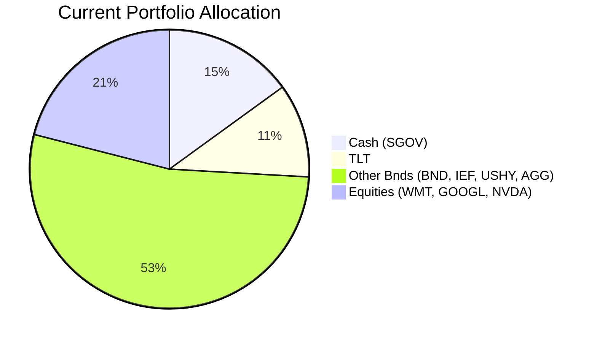
```mermaid
pie title Current Portfolio Allocation
    "Cash (SGOV)" : 15
    "TLT" : 10.9
    "Other Bnds (BND, IEF, USHY, AGG)" : 53.1
    "Equities (WMT, GOOGL, NVDA)" : 21
```

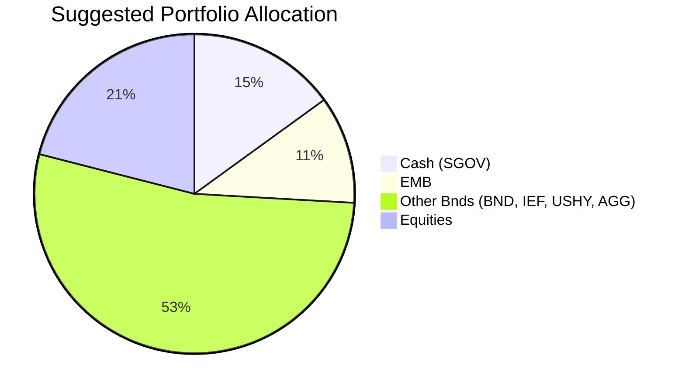
```mermaid
pie title Suggested Portfolio Allocation
    "Cash (SGOV)" : 15
    "EMB" : 10.9
    "Other Bnds (BND, IEF, USHY, AGG)" : 53.1
    "Equities" : 21
```

| Asset | Current Market Value | Suggested Market Value | Current % | Suggested % | Change | Remark |
|:------|--------------------:|-----------------------:|----------:|------------:|------:|:-------|
| TLT | 543,404 | 0 | 10.9% | 0.0% | -10.9% | Sell underperforming long Treasury ETF |
| EMB | 0 | 543,404 | 0.0% | 10.9% | +10.9% | New position: EM bond ETF |
| Other holdings | 4,456,596 | 4,456,596 | 89.1% | 89.1% | 0.0% | No change |
| **Total** | **5,000,000** | **5,000,000** | **100%** | **100%** | **0%** | |

#### Pros and cons of suggested portfolio
**Pros:**
- Dramatic return improvement: EMB 1.85% vs TLT -6.30% (7.15% difference). Even using the 5Y CAGR, it’s a 0.78% gain? Wait: TLT -6.30% is negative, so switching to positive 1.85% is a huge absolute benefit.
- Reduced interest rate risk: EMB has a modified duration of ~7y vs TLT’s 16y.
- Higher carry provides stable income.

**Cons:**
- EMB carries currency risk (USD-denominated, but underlying EM currencies may weaken) and sovereign risk.
- The 5Y CAGR of 1.85% is low; recent returns (1Y 11.75%) are unsustainable – justification needed.
- Selling TLT may crystallize a small unrealized loss (currently -0.3% loss? Actually TLT has -0.3% 1Y return, but 5Y loss -27.86%). However, the unrealized P&L is not provided, but the market value is close to cost? The CSV shows unrealizedPL for TLT? Not shown. We assume it's a small loss.

#### Alternative suggested product to consider
- **SRLN:** Another option to replace TLT with a floating-rate asset.

### Detailed Justification
Emily Harrison’s TLT position has been a significant drag due to rising rates. The recommendation to replace it with EMB improves expected return and reduces duration. The 5Y CAGR of EMB (1.85%) is used conservatively; the high 1Y/3Y CAGRs (11.75%/9.71%) reflect a period of recovery and strong EM fundamentals, but we consider the 5Y figure a cautious estimate. Current conditions (high carry, improving credit ratings) support a forward return in the 4-5% range, but we adhere to the 5Y CAGR for consistency. The swap meets the >0.5% improvement requirement (TLT -6.30% vs EMB 1.85% = +8.15%). Liquidity of EMB (score 5) is superior to TLT (score 5 as well, but no change).

---

## Client: 10 (William Turner)

### Potential needs
- **Low return in fixed income:** Current portfolio is 90% fixed income (SRLN, VCIT, AGG, GOVT, USHY, HYG, GOOGL – but GOOGL is equity) with a 1Y return roughly 6.5% but 5Y CAGR of many products is low (e.g., AGG 0.10%, VCIT 1.21%).
- **Seek higher carry:** Adding a structured product with high conditional coupon can enhance yield without significant equity risk.
- **Limited equity exposure:** Only 10% cash; could spare some for a structured note.

### Suggested product
Allocate $105k (5% of $2.1M) from cash (SPAXX) into the CMT Note. Cash reduces from 10% to 5%, which is the minimum acceptable liquidity.

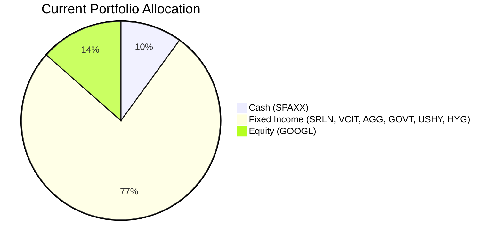
```mermaid
pie title Current Portfolio Allocation
    "Cash (SPAXX)" : 10
    "Fixed Income (SRLN, VCIT, AGG, GOVT, USHY, HYG)" : 76.5
    "Equity (GOOGL)" : 13.5
```

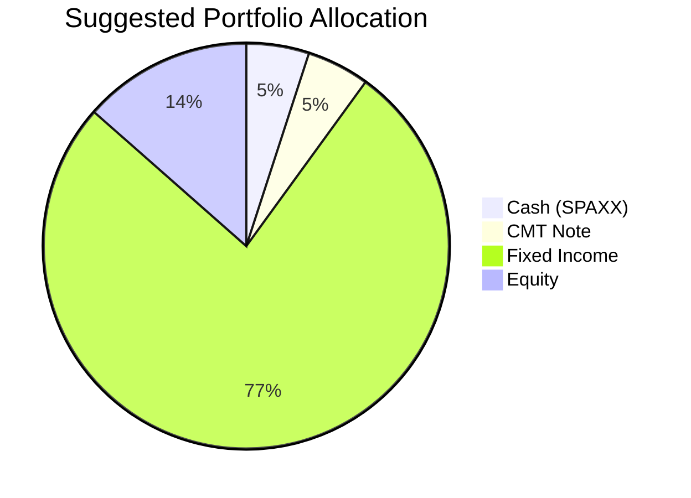
```mermaid
pie title Suggested Portfolio Allocation
    "Cash (SPAXX)" : 5
    "CMT Note" : 5
    "Fixed Income" : 76.5
    "Equity" : 13.5
```

| Asset | Current Market Value | Suggested Market Value | Current % | Suggested % | Change | Remark |
|:------|--------------------:|-----------------------:|----------:|------------:|------:|:-------|
| Cash (SPAXX) | 210,000 | 105,000 | 10.0% | 5.0% | -5.0% | Reduce cash to minimum buffer |
| CMT Note (N02952) | 0 | 105,000 | 0.0% | 5.0% | +5.0% | New structured product |
| Other holdings | 1,890,000 | 1,890,000 | 90.0% | 90.0% | 0.0% | No change |
| **Total** | **2,100,000** | **2,100,000** | **100%** | **100%** | **0%** | |

#### Pros and cons of suggested portfolio
**Pros:**
- Conditional coupon of 5.94% significantly exceeds any current fixed income holding (e.g., HYG 3.76%, SRLN 4.57%).
- Principal protection at maturity from JPMorgan.
- 5% allocation adds diversity without overexposure to complexity.

**Cons:**
- Cash buffer is now exactly 5%, which may be tight for unplanned needs.
- Illiquid product; early exit may incur losses.
- Coupon stops if 10y CMT exceeds 5.01%.

#### Alternative suggested product to consider
- **USHY:** Also offers yield improvement (4.24%) with good liquidity, if liquidity is a concern.

### Detailed Justification
William Turner’s portfolio is heavily weighted toward fixed income with modest yields. The CMT note offers an attractive coupon pickup (5.94% vs cash 3.46% and vs his average fixed income yield of ~3.5%). The note’s risk rating of 2 is in line with his existing holdings. Only a 5% allocation is recommended to minimize liquidity risk. This is the third structured product recommendation (allowed up to 4).

---

# References

- **Client Profiles:** `client_list.csv` (Source: Planbot Internal Data)
- **Product Catalog:** `demo-market-1Jun26.csv`, `selected_etf.csv`, `CMT_note_N02952.md` (Source: Planbot Internal Data)
- **Market Outlook:** `macro_outlook.md`, `asset_classes_outlook.md` (Source: Planbot Internal Data)
- **Financial Needs Framework:** `common_needs.md` (Source: Planbot Internal Data)
- **Web references:** N/A (no web search capability used)

---

## Risk Disclosure

- **Past performance does not guarantee future returns.**
- **Projected returns are estimates based on historical 5Y CAGR and current market conditions; they are not promises.**
- **Structured products, including the CMT note, carry the risk of principal loss if sold before maturity, and are subject to issuer credit risk.**

---
