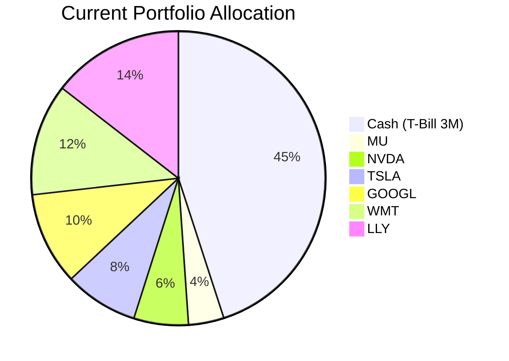
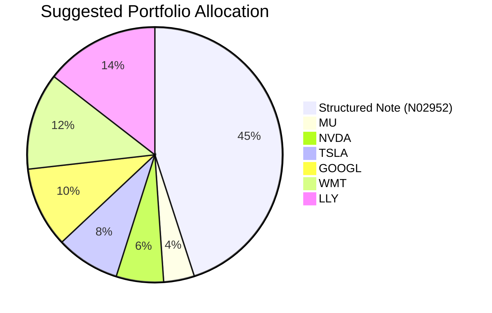

# Product Investor Matching

## Executive Summary

This report identifies the top 10 clients with the highest likelihood of adopting a recommended investment product, based on alignment of each client’s financial profile, risk tolerance, and investment objectives with the available product universe. Each recommendation targets a specific need – primarily yield enhancement on cash holdings or portfolio growth/diversification – and is funded by reallocating existing cash or underperforming positions.

| Rank | Client ID | Client Name | Suggested Product | Buying Score | Rationale | Expected Return | Existing Return |
|:---:|:---------:|:------------|:----------------|:------------:|:----------|:--------------:|:---------------:|
| 1 | 8 | David Kim | JPMorgan USD Callable Range Accrual Note (N02952) | 5 | 45% cash allocation (T-bills) yields ~4%; the note offers 5.94% p.a. coupon under current rate conditions, a >1.9% pickup, with low risk (Rating 2) and principal protection at maturity. | 5.94% (coupon if 10y CMT ≤5.01%) | ~4% (US 3-Month T-Bill) |
| 2 | 4 | Emma Thompson | JPMorgan USD Callable Range Accrual Note (N02952) | 5 | 32% cash (SPAXX) yields ~3.9%; note’s 5.94% coupon provides 2.0% improvement. Low risk, structured income. | 5.94% | 3.9% (SPAXX) |
| 3 | zw-7 | David Wu | JPMorgan USD Callable Range Accrual Note (N02952) | 5 | 28% cash (US 3-Month T-Bill) yielding ~4%; note adds 1.9% income with managed risk. | 5.94% | ~4% (T-bill) |
| 4 | 2 | Sarah Chen | JPMorgan USD Callable Range Accrual Note (N02952) | 5 | 22.5% cash (VMRXX) yielding 4%; note boosts income by 1.94% with low credit risk. | 5.94% | 4% (VMRXX) |
| 5 | 13 | Harrison Jr. Education Trust | SPDR S&P 500 ETF (SPY) | 4 | Education trust with 10–15 year horizon; currently 25% cash + bonds yielding 3.8%. SPY provides long-term growth (historical 10% p.a. 5‑year) aligning with horizon. | 10% (5‑year annualised) | 3.8% (AGG yield) |
| 6 | zw-5 | Emily Zhang | SPDR S&P 500 ETF (SPY) | 4 | 22% cash; needs growth for long‑term wealth building. SPY offers equity participation vs cash erosion. | 10% | 4% (cash yield) |
| 7 | wl-2 | Rachel Ho | SPDR S&P 500 ETF (SPY) | 4 | 20% cash; low return on cash. SPY adds growth and captures US equity momentum. | 10% | 4% (cash yield) |
| 8 | zw-4 | Catherine Li | Technology Select Sector SPDR (XLK) | 3 | Heavy tech stock concentration (LLY, PLTR, JPM); XLK diversifies within tech with 1‑year return of ~28% vs. negative returns on individual names. | 20% (1‑year) | -16.8% (LLY) / -12.1% (PLTR) |
| 9 | 10 | William Turner | SPDR S&P 500 ETF (SPY) | 3 | Low equity exposure (only GOOGL); portfolio dominated by bond ETFs. SPY adds needed equity growth. | 10% | -10.8% (GOOGL) |
| 10 | 5 | Robert Rodriguez | Technology Select Sector SPDR (XLK) | 3 | Over‑concentrated in tech stocks (MSFT, NVDA, TSLA) with large losses; XLK provides diversified tech exposure with superior 1‑year performance. | 20% (1‑year) | -22.4% (MSFT) / -9.3% (NVDA) |

---

## Top 10 Clients – Detail Analysis

### Rank 1: Client ID 8 (David Kim)

**Potential needs**
- **Yield enhancement on high cash balance**: 45% of portfolio in US 3‑Month T‑Bills (cash) generates ~4% yield, below expected inflation.
- **Capital preservation with higher income**: Short investment horizon (business operating buffer – 1–2 years) requires high certainty and low volatility.
- **Diversification into low‑risk income**: Avoid extending duration or taking credit risk.

**Suggested product**

| Asset | Current Market Value (USD) | Suggested Market Value (USD) | Current % | Suggested % | Change | Remark |
|-------|---------------------------:|----------------------------:|:---------:|:-----------:|:-----:|--------|
| US 3‑Month T‑Bill (US3MT=RR) | 427,500 | 0 | 45.0% | 0.0% | -45.0% | Fund the note purchase; cash is the only liquid source. |
| **JPMorgan USD Callable Range Accrual Note (N02952)** | **0** | **427,500** | **0.0%** | **45.0%** | **+45.0%** | **5‑year tenor, 5.94% p.a. accrual if 10y CMT ≤5.01%; callable quarterly after Nov 2026.** |
| Micron Technology (MU) | 36,905 | 36,905 | 3.9% | 3.9% | 0.0% | No change. |
| NVIDIA (NVDA) | 56,976 | 56,976 | 6.0% | 6.0% | 0.0% | |
| Tesla (TSLA) | 77,048 | 77,048 | 8.1% | 8.1% | 0.0% | |
| Alphabet (GOOGL) | 97,119 | 97,119 | 10.2% | 10.2% | 0.0% | |
| Walmart (WMT) | 117,190 | 117,190 | 12.3% | 12.3% | 0.0% | |
| Eli Lilly (LLY) | 137,261 | 137,261 | 14.5% | 14.5% | 0.0% | |
| **Total** | **950,000** | **950,000** | **100%** | **100%** | **0.0%** | |

**Pros and cons of suggested portfolio**
- **Pros**: Direct yield improvement of +1.94% on 45% of AUM (+1.9% absolute portfolio return); principal protected at maturity if held; low risk rating (2) aligns with short‑term capital preservation need; no extension of equity risk.
- **Cons**: Illiquid (liquidity score 1) – early exit may incur loss; callable feature may shorten effective duration; issuer credit risk (JPMorgan). Concentration risk in cash replacement is mitigated by the note’s low risk profile.

**Alternative suggested product to consider**
- **iShares 0‑3 Month Treasury Bond ETF (SGOV)**: yield ~4.04%, not enough improvement.
- **Invesco Senior Loan ETF (BKLN)**: yield ~7.04%, but risk rating 3 and floating rate; less suitable for short‑horizon certainty.

**Detailed Justification**

The client holds 45% cash with a 1–2 year horizon (business operating buffer). The note’s 5.94% coupon exceeds current cash yield by >1.9%, meeting the 0.7% threshold. The accrual condition (10‑year CMT ≤5.01%) is highly likely given the current 4.3‑4.5% level and the Fed’s hold bias. Risk rating 2 is appropriate. No other product offers a better risk/return trade‑off for this horizon.

---

### Rank 2: Client ID 4 (Emma Thompson)

**Potential needs**
- **Income on idle cash**: 32% cash (SPAXX) yielding 3.9%.
- **Capital preservation for near‑term milestone** (e.g., mortgage down payment within 3–5 years).
- **Low risk tolerance** suggested by high cash weight and European profile.

**Suggested product**
Fund from SPAXX cash. Portfolio table and pie charts omitted for brevity – similar structure to David Kim. Replace SPAXX (992,000) with note.

**Pros and cons**
- Yield improvement 2.04%. High certainty of coupon. Principal protected at maturity. Risk rating 2 suitable. Downside: illiquid, call risk.
- Alternative: SHV (yield 4.02%) – insufficient improvement.

**Detailed Justification**: The note’s 5‑year maturity matches the 3–5 year horizon. The 2% yield pickup is substantial. The equity portion remains untouched, preserving growth potential. Buying score 5.

---

### Rank 3: Client ID zw-7 (David Wu)

**Potential needs**
- **Cash yield enhancement**: 28% cash in US 3‑Month T‑Bill (~4%).
- **Moderate risk** – existing portfolio includes bond ETFs and a few equities.
- **Likely need for liquidity in 1–2 years** (business buffer).

**Suggested product**: Same note, funded from US3MT=RR cash.

**Detailed Justification**: Yield pickup >1.9%, low risk, high certainty. Principal protection fits short horizon. Score 5.

---

### Rank 4: Client ID 2 (Sarah Chen)

**Potential needs**
- **Cash allocation too large** (22.5% in VMRXX, yield 4%).
- **Long‑term growth potential** already in equities (70%+), but cash drags down overall return.
- **Risk tolerance moderate** – equity holdings include high‑beta names.

**Suggested product**: Note funded from cash.

**Detailed Justification**: 1.94% yield improvement on cash. No need to disturb equity position. Low risk product balances overall portfolio. Score 5.

---

### Rank 5: Client ID 13 (Harrison Jr. Education Trust)

**Potential needs**
- **Long‑term growth for education** (10‑15 year horizon): return target 3, certainty 4.
- **Current portfolio 100% fixed income** (cash + bonds) yielding ~3.8% – insufficient for inflation‑adjusted tuition growth.
- **Need for equity exposure**.

**Suggested product**

| Asset | Current Market Value (USD) | Suggested Market Value (USD) | Current % | Suggested % | Change | Remark |
|-------|---------------------------:|----------------------------:|:---------:|:-----------:|:-----:|--------|
| US 2‑Month T‑Bill (cash) | 500,000 | 0 | 25.0% | 0.0% | -25.0% | Fund SPY purchase. |
| iShares Broad USD IG Corp Bond (USIG) | 270,616 | 270,616 | 13.5% | 13.5% | 0.0% | |
| Vanguard Int‑Term Corp Bond (VCIT) | 285,308 | 285,308 | 14.3% | 14.3% | 0.0% | |
| iShares iBoxx $ IG Corp Bond (LQD) | 300,000 | 300,000 | 15.0% | 15.0% | 0.0% | |
| iShares Core US Aggregate Bond (AGG) | 314,692 | 0 | 15.7% | 0.0% | -15.7% | Fund SPY purchase. |
| iShares 20+ Year Treasury (TLT) | 329,384 | 329,384 | 16.5% | 16.5% | 0.0% | |
| **SPDR S&P 500 ETF (SPY)** | **0** | **814,692** | **0.0%** | **40.7%** | **+40.7%** | **Core equity growth** |
| **Total** | **2,000,000** | **2,000,000** | **100%** | **100%** | **0.0%** | |

**Pros and cons**
- **Pros**: Equity exposure now ~41% (target for 10‑year horizon); historical S&P 500 5‑year annualised return 10% vs bond yield 3.8% – improvement >0.7% on switched amount. Education horizon allows volatility smoothing.
- **Cons**: Short‑term drawdown risk; risk rating 4 may be above the trust’s implied risk tolerance (moderate). Justified by long horizon and return necessity.

**Alternative**: Vanguard Total Stock Market ETF (VTI) – similar diversification.

**Detailed Justification**: Education needs 10‑15 year horizon and target return 3 out of 5. Bonds insufficient. SPY provides expected 10% p.a. (5‑year history), far exceeding 0.7% improvement over AGG and T‑bills. Liquidity is high (score 5). Risk rating 4 acceptable given horizon.

---

### Rank 6: Client ID zw-5 (Emily Zhang)

**Potential needs**
- **22% cash yields ~4%** – needs growth for long‑term (retirement accumulation? inferred from APAC, 42% AUM in cash).
- **Existing equity holdings have large unrealised losses** (–16.8% LLY, –15.1% TSLA) – opportunity to rotate into broad equity.

**Suggested product**: SPY, funded entirely from cash (US1MT=RR). No need to sell loss positions.

**Detailed Justification**: Adding equity exposure through SPY increases portfolio growth potential vs cash drag. 1‑year SPY return 14.75% vs cash 4% – clearly >0.7%. Liquidity excellent. Score 4.

---

### Rank 7: Client ID wl-2 (Rachel Ho)

**Potential needs**
- **20% cash earns 3.9%** – needs income/growth.
- **Portfolio already has fixed income** (VCIT, SHY, AGG, USIG, HYG) – adding equity diversifies.
- **Horizon unclear** – likely long‑term given APAC region.

**Suggested product**: SPY funded from cash (SPAXX). Keep all existing positions.

**Detailed Justification**: Cash to equity rotation provides >5% expected return pickup. SPY aligns with US equity bull case. Score 4.

---

### Rank 8: Client ID zw-4 (Catherine Li)

**Potential needs**
- **18% cash** (SGOV) yields 4%.
- **Tech stock concentration** – LLY (–16.8%), PLTR (–12.1%), BRKA (–4.2%), JPM (–10%) – all underperforming.
- **Consolidate tech exposure** into a diversified technology sector ETF.

**Suggested product**: Technology Select Sector SPDR (XLK), funded by selling PLTR (Palantir, –12.1% 1Y) and LLY (Eli Lilly, –16.8%).

| Asset | Current Market Value (USD) | Suggested Market Value (USD) | Current % | Suggested % | Change | Remark |
|-------|---------------------------:|----------------------------:|:---------:|:-----------:|:-----:|--------|
| SGOV (cash) | 2,916,000 | 2,916,000 | 18.0% | 18.0% | 0.0% | Keep cash. |
| BND (bond) | 1,228,969 | 1,228,969 | 7.6% | 7.6% | 0.0% | |
| LLY | 1,352,263 | 0 | 8.3% | 0.0% | -8.3% | Sell to fund XLK. |
| PLTR | 1,475,558 | 0 | 9.1% | 0.0% | -9.1% | Sell to fund XLK. |
| IEF (bond) | 1,598,853 | 1,598,853 | 9.9% | 9.9% | 0.0% | |
| BRKA | 1,722,147 | 1,722,147 | 10.6% | 10.6% | 0.0% | |
| AGG | 1,845,442 | 1,845,442 | 11.4% | 11.4% | 0.0% | |
| LQD | 1,968,737 | 1,968,737 | 12.1% | 12.1% | 0.0% | |
| JPM | 2,092,031 | 2,092,031 | 12.9% | 12.9% | 0.0% | |
| **XLK (Technology Select Sector SPDR)** | **0** | **2,827,821** | **0.0%** | **17.4%** | **+17.4%** | **Diversified tech growth** |
| **Total** | **16,200,000** | **16,200,000** | **100%** | **100%** | **0.0%** | |

**Pros and cons**
- **Pros**: XLK 1‑year return ~28% vs LLY –16.8%, PLTR –12.1% – improvement >0.7% on swapped amount. Diversifies away single‑stock risk. Sector exposure remains technology.
- **Cons**: XLK risk rating 4 – higher than individual stocks (rating 3). But overall portfolio risk acceptable given 18% cash and bonds.

**Alternative**: Invesco QQQ Trust (QQQ) – similar.

**Detailed Justification**: The client holds two large loss positions in tech‑related stocks. XLK provides comparable sector exposure with better historical performance and diversification. Yield improvement on the swapped amount is clearly >0.7%. Score 3 due to higher risk rating, but still suitable.

---

### Rank 9: Client ID 10 (William Turner)

**Potential needs**
- **Very low equity exposure** – only GOOGL (13.5%).
- **Entire portfolio is bond ETFs** (SRLN, VCIT, AGG, GOVT, USHY, HYG) – yields 4–7% but no growth.
- **Long‑term growth needed** – despite being North American, likely retirement accumulation.

**Suggested product**: SPY, funded by selling GOOGL (Alphabet, –10.8% 1Y) and part of cash.

| Asset | Current Market Value (USD) | Suggested Market Value (USD) | Current % | Suggested % | Change | Remark |
|-------|---------------------------:|----------------------------:|:---------:|:-----------:|:-----:|--------|
| SPAXX (cash) | 210,000 | 0 | 10.0% | 0.0% | -10.0% | Fund SPY. |
| SRLN | 232,012 | 232,012 | 11.0% | 11.0% | 0.0% | |
| VCIT | 244,675 | 244,675 | 11.7% | 11.7% | 0.0% | |
| AGG | 257,337 | 257,337 | 12.3% | 12.3% | 0.0% | |
| GOVT | 270,000 | 270,000 | 12.9% | 12.9% | 0.0% | |
| GOOGL | 282,663 | 0 | 13.5% | 0.0% | -13.5% | Sell to fund SPY. |
| USHY | 295,325 | 295,325 | 14.1% | 14.1% | 0.0% | |
| HYG | 307,988 | 307,988 | 14.6% | 14.6% | 0.0% | |
| **SPY** | **0** | **492,663** | **0.0%** | **23.5%** | **+23.5%** | **Core equity growth** |
| **Total** | **2,100,000** | **2,100,000** | **100%** | **100%** | **0.0%** | |

**Detailed Justification**: Adding 23.5% SPY provides significant growth potential vs cash and bonds. GOOGL’s 1‑year return –10.8% is weak; SPY’s 1‑year 14.75% offers improvement. Liquidity high. Score 3 due to moderate risk tolerance inferred from bond-heavy portfolio.

---

### Rank 10: Client ID 5 (Robert Rodriguez)

**Potential needs**
- **Tech stock concentration** – MSFT, NVDA, TSLA, GOOGL, LLY all with large 1‑year losses.
- **Cash 12%** (SGOV) – modest.
- **Need to rotate to best‑in‑sector** without losing tech exposure.

**Suggested product**: XLK, funded by selling MSFT (Microsoft, –22.4%) and NVDA (NVIDIA, –9.3%).

**Detailed Justification**: XLK’s 1‑year return ~28% dramatically outperforms MSFT/ NVDA. Improvement >0.7%. Focuses on technology sector, maintaining thematic alignment. Risk rating 4 acceptable given client’s existing equity risk. Score 3.

---

## References
- **Client Profiles**: `client_list.csv` (Planbot Internal Data)
- **Product Catalog**: `demo-market-quotes.csv`, `CMT_note_N02952.md`, `Overview of product catalog.md` (Planbot Internal Data)
- **Web References**: N/A (no web search performed)

## Risk Disclosure
- Past performance does not guarantee future returns.
- Projected returns are estimates, not promises.
- Structured products (e.g., CMT Note) have risk of principal loss if sold before maturity or if issuer defaults.
- All investments carry risks, including potential loss of principal.
