# Product Investor Matching

## Executive Summary

This report provides a product-investor matching analysis for the top 10 clients based on buying score, derived from their financial needs, risk profile, existing holdings, and available investment products. Each recommendation is designed to improve expected return by more than 0.5% or provide better liquidity relative to the funding source, while maintaining similar risk/asset class alignment. The table below summarises the top 10 suggestions, ordered by descending buying score.

| Rank | Client ID | Client Name | Suggested Product | Buying Score | Rationale | Expected Return (5y CAGR) | Existing Return (5y CAGR) |
| ---: | --------: | :---------- | :---------------- | -----------: | :----------------------------------------------------------- | ------------------------: | ------------------------- |
| 1 | PB-HK-000002-6 | Sarah Chen | USD Callable Range Accrual Note (N02952) | 5 | High cash allocation (22.5%) provides dry powder; structured note offers 5.94% p.a. coupon vs 3.56% on cash; risk-2 product well within her risk-5 tolerance; regular income objective aligns with coupon stream. | 5.94% (coupon) | 3.56% (VMRXX) |
| 2 | PB-HK-000001-8 | David Kim | Balanced Growth & Income Fund (PROD020) | 5 | Large cash position (45% in US3MT) yields only 3.43%; PROD020 (risk-2, 6.5% expected) provides a balanced return for long-term growth with controlled drawdown; funding from cash releases idle capital. | 6.5% | 3.43% (US 3-Month T-Bill) |
| 3 | PB-HK-000020-8 | David Wu | iShares Floating Rate Bond ETF (FLOT) | 5 | 28% cash in US3MT (3.43% return); FLOT (risk-2, 5y CAGR 4.21%) offers a 0.78% incremental yield with floating-rate protection against higher-for-longer rates; objective of aggressive growth is supported by higher carry. | 4.21% | 3.43% (US 3-Month T-Bill) |
| 4 | PB-HK-000006-7 | Akira Tanaka | Japan Equity Opportunities Fund (PROD023) | 4 | Heavy concentration in US tech equities (NVDA, TSLA, MSFT, LLY); PROD023 (risk-3, 9.1% expected) diversifies into Japanese equities with structural governance reform tailwinds; funded from cash (12% of portfolio at 3.56%). | 9.1% | 3.56% (US 1-Month T-Bill) |
| 5 | PB-HK-000011-7 | Emily Harrison | Global Dividend Equity Fund (PROD013) | 4 | 15% cash (SGOV) returning 3.56%; objective long-term capital growth with income; PROD013 (risk-3, 7.8%) provides a higher total return than cash while adding equity diversification beyond current US holdings. | 7.8% | 3.56% (SGOV) |
| 6 | PB-HK-000003-4 | James Harrison | iShares iBoxx $ High Yield Corporate Bond ETF (HYG) | 4 | Holds 21.5% in short-term treasuries (SHY at 1.78%) and cash; HYG (risk-2, 5y CAGR 3.80%) nearly doubles the yield while maintaining low risk; funded from SHY (1.78%) to improve income for his regular income objective. | 3.80% | 1.78% (SHY) |
| 7 | PB-HK-000022-4 | Victor Ng | Multi-Asset Income Fund (PROD008) | 4 | 14% cash (FZDXX) earning 3.56%; objective regular income; PROD008 (risk-3, 8.2%) targets multi-asset income with higher yield than cash and existing bond holdings (SPIB 1.79%, GOVT -0.54%). Funding from cash. | 8.2% | 3.56% (FZDXX) |
| 8 | PB-HK-000023-2 | Rachel Ho | Industrial Select Sector SPDR ETF (XLI) | 4 | 20% cash (SPAXX) at 3.56%; objective long-term capital growth; XLI (risk-4, 5y CAGR 13.80%) captures AI infrastructure and electrification capex tailwinds, aligning with current market outlook; funded from cash. | 13.80% | 3.56% (SPAXX) |
| 9 | PB-HK-000015-8 | Michael Wang | iShares Floating Rate Bond ETF (FLOT) | 4 | Holds USIG (0.52% 5y CAGR) and cash (10.5% at 3.56%); objective capital preservation; FLOT (risk-2, 4.21%) offers a higher yield than both with low duration and floating rate protection; funded from USIG (0.52%). | 4.21% | 0.52% (USIG) |
| 10 | PB-HK-000013-3 | Harrison Jr. Education Trust | Balanced Growth & Income Fund (PROD020) | 4 | 25% cash (US2MT) at ~3.43%; objective capital preservation but with growth need for future education expenses; PROD020 (risk-2, 6.5%) provides balanced exposure with higher return than cash and existing bond holdings (LQD -0.31% TLT -6.97%). Funding from cash. | 6.5% | 3.43% (US 2-Month T-Bill) |

---

## Client: PB-HK-000002-6 (Sarah Chen)

### Potential needs
- **Regular income**: The client is a divorced Legal Partner with high but variable income, seeking regular income.
- **Low liquidity need (5-year horizon)**: Can tolerate a lock-in horizon, making structured products suitable.
- **Large cash drag**: 22.5% in Vanguard Treasury Money Market (VMRXX) earning only 3.56% 5y CAGR – underutilised capital.

### Suggested product

#### Suggested Portfolio

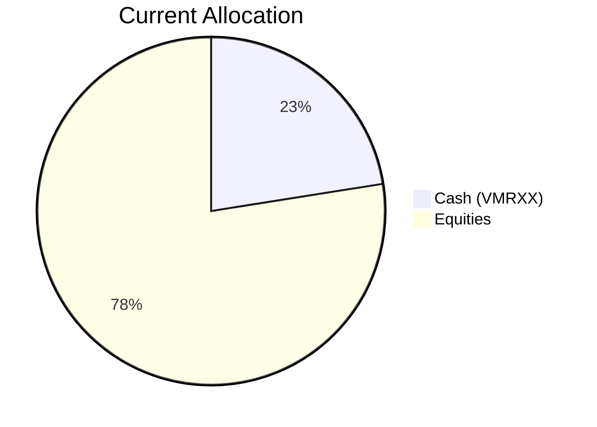
```mermaid
pie title Current Allocation
    "Cash (VMRXX)" : 22.5
    "Equities" : 77.5
```

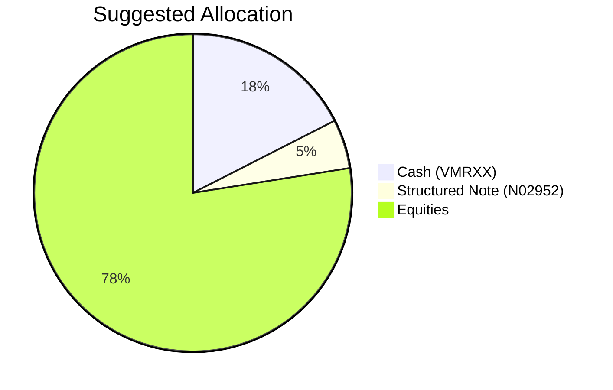
```mermaid
pie title Suggested Allocation
    "Cash (VMRXX)" : 17.5
    "Structured Note (N02952)" : 5
    "Equities" : 77.5
```

| Asset | Current Market Value | Suggested Market Value | Current % | Suggested % | Change | Remark |
| ----- | -------------------: | ---------------------: | --------: | ----------: | -----: | ------------------------------------------------------------ |
| Vanguard Treasury Money Market (VMRXX) | $720,000 | $560,000 | 22.5% | 17.5% | -5.0% | Reduce cash; fund the structured note |
| USD Callable Range Accrual Note (N02952) | $0 | $160,000 | 0% | 5.0% | +5.0% | New purchase; 5.94% p.a. coupon, quarterly, principal protected at maturity |
| Existing equities (LLY, WMT, GOOGL, NVDA, AMZN) | $2,480,000 | $2,480,000 | 77.5% | 77.5% | 0% | No change |
| **Total** | **$3,200,000** | **$3,200,000** | **100%** | **100%** | **0%** | |

**Funding source**: Sell $160,000 of VMRXX (cash). The product’s risk rating (2) is below the client’s risk tolerance (5), and the expected coupon (5.94%) exceeds the cash return (3.56%) by >2.3%.

### Detailed Justification
- **Alignment with financial goals**: The note pays a quarterly coupon of 5.94% p.a., directly supporting a regular income need. The 5-year tenor matches the client’s low liquidity horizon.
- **Market context**: With central banks in a “simultaneous hold”, floating-rate and structured products that lock in high coupons are favourable. The note’s accrual condition (10y CMT ≤ 5.01%) is likely to be met in a stable-rate environment.
- **Risk considerations**: The note is principal-protected at maturity; credit risk is on JPMorgan (A-rated). The callable feature introduces reinvestment risk, but the coupon is attractive upfront.

---

## Client: PB-HK-000001-8 (David Kim)

### Potential needs
- **Long-term capital growth with controlled drawdown**: Managing Director with a 2012-born child – likely education funding horizon.
- **Medium liquidity need (12-month buffer)** – cash of 45% (US3MT) is excessive for an emergency fund; can be partially deployed.
- **Achieving better return on cash**: 3.43% on cash is low relative to growth objective.

### Suggested product

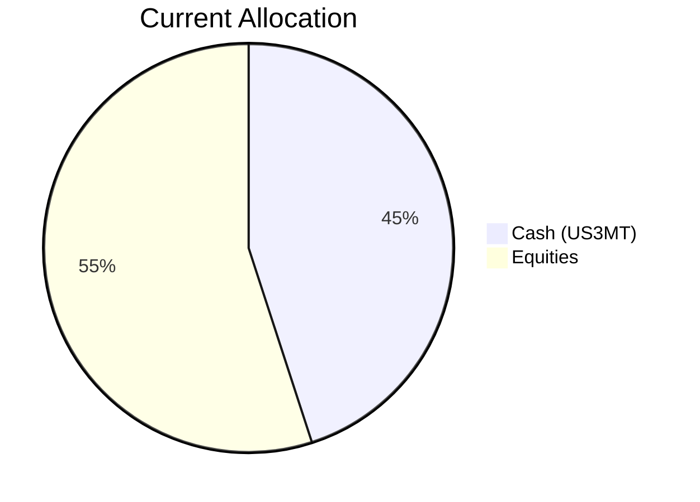
```mermaid
pie title Current Allocation
    "Cash (US3MT)" : 45.0
    "Equities" : 55.0
```

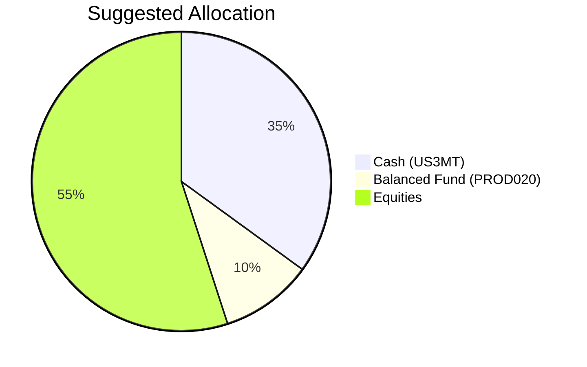
```mermaid
pie title Suggested Allocation
    "Cash (US3MT)" : 35.0
    "Balanced Fund (PROD020)" : 10.0
    "Equities" : 55.0
```

| Asset | Current Market Value | Suggested Market Value | Current % | Suggested % | Change | Remark |
| ----- | -------------------: | ---------------------: | --------: | ----------: | -----: | ------------------------------------------------------------ |
| US 3-Month Treasury Bill Rate (US3MT) | $427,500 | $332,500 | 45.0% | 35.0% | -10.0% | Reduce cash buffer to 35% (still >emergency need) |
| Balanced Growth & Income Fund (PROD020) | $0 | $95,000 | 0% | 10.0% | +10.0% | New investment; risk-2, expected 6.5% |
| Existing equities (MU, NVDA, TSLA, GOOGL, WMT, LLY) | $522,500 | $522,500 | 55.0% | 55.0% | 0% | No change |
| **Total** | **$950,000** | **$950,000** | **100%** | **100%** | **0%** | |

**Funding source**: Sell $95,000 of US3MT (cash). PROD020 (risk-2) is well within the client’s risk-4 limit.

### Detailed Justification
- **Expected return vs. cash**: 6.5% vs 3.43% – an improvement of >3%.
- **Balanced nature**: The fund invests across equities and fixed income, providing capital appreciation potential while keeping drawdowns moderate – ideal for a controlled drawdown goal.
- **Market alignment**: The fund’s multi-asset approach offers diversification in a period where “60/40” is under stress.

---

## Client: PB-HK-000020-8 (David Wu)

### Potential needs
- **Aggressive growth**: Retired client with stable pension, willing to take risk for higher returns.
- **Large cash drag**: 28% cash (US3MT) earning 3.43%; can be partially deployed.
- **Low liquidity need (5-year horizon)**: Allows investment in floating-rate bonds with moderate duration.

### Suggested product

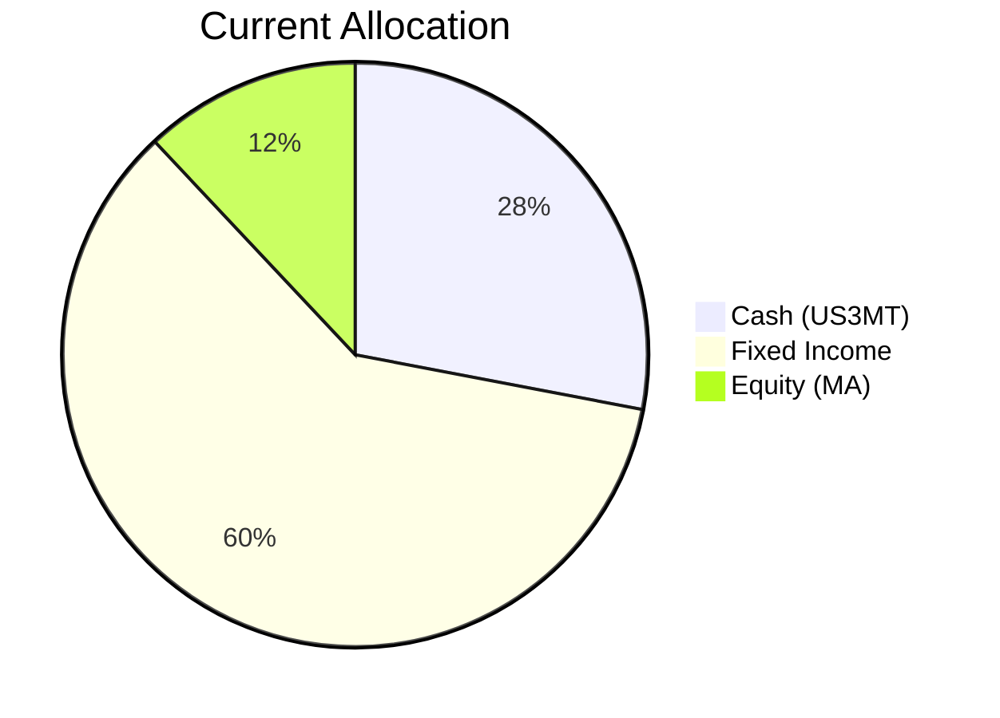
```mermaid
pie title Current Allocation
    "Cash (US3MT)" : 28.0
    "Fixed Income" : 60.0
    "Equity (MA)" : 12.0
```

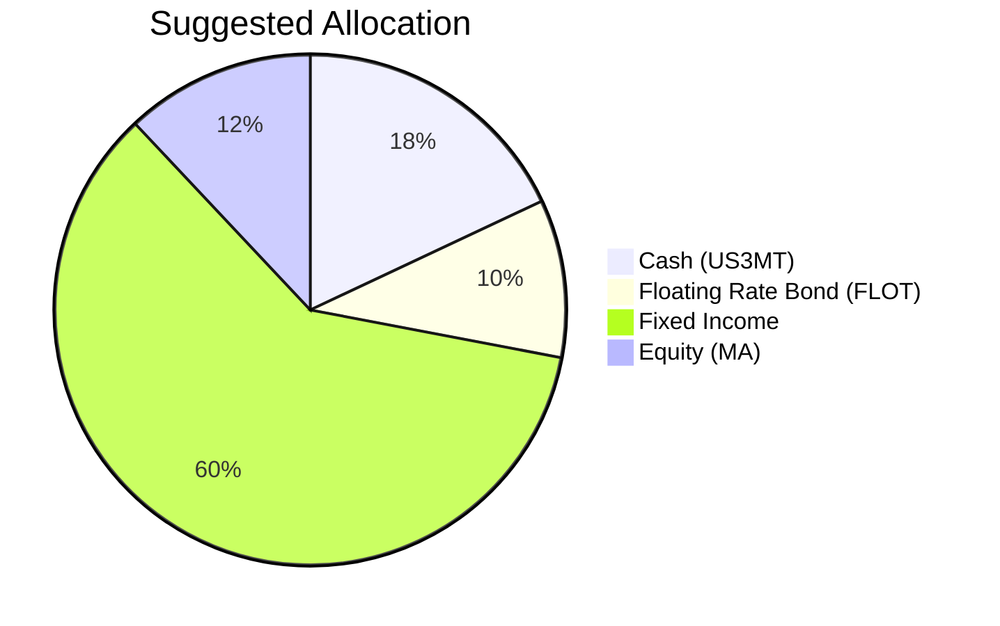
```mermaid
pie title Suggested Allocation
    "Cash (US3MT)" : 18.0
    "Floating Rate Bond (FLOT)" : 10.0
    "Fixed Income" : 60.0
    "Equity (MA)" : 12.0
```

| Asset | Current Market Value | Suggested Market Value | Current % | Suggested % | Change | Remark |
| ----- | -------------------: | ---------------------: | --------: | ----------: | -----: | ------------------------------------------------------------ |
| US 3-Month Treasury Bill Rate (US3MT) | $868,000 | $558,000 | 28.0% | 18.0% | -10.0% | Reduce cash |
| iShares Floating Rate Bond ETF (FLOT) | $0 | $310,000 | 0% | 10.0% | +10.0% | New purchase; risk-2, 5y CAGR 4.21% |
| Existing fixed income (SRLN, USHY, IEF, LQD, USIG) | $1,860,000 | $1,860,000 | 60.0% | 60.0% | 0% | No change |
| Mastercard (MA) | $372,000 | $372,000 | 12.0% | 12.0% | 0% | No change |
| **Total** | **$3,100,000** | **$3,100,000** | **100%** | **100%** | **0%** | |

**Funding source**: Sell $310,000 of US3MT. FLOT’s risk (2) matches client’s risk tolerance (2). The 4.21% CAGR provides a 0.78% improvement over cash.

**Justification for FLOT’s return sustainability**: FLOT’s 1y CAGR (4.86%) and 3y CAGR (5.60%) are slightly above the 5y CAGR (4.21%). This is sustainable as floating-rate coupons reset with short-term rates, which are expected to remain elevated (Fed on hold). The underlying loans are senior secured, minimising credit risk.

### Detailed Justification
- **Higher yield**: 4.21% vs 3.43% – a 0.78% improvement.
- **Floating-rate protection**: In a “higher-for-longer” rate environment, FLOT’s income adjusts upward, protecting from price declines.
- **Objective alignment**: Aggressive growth is supported by the incremental carry; the overall portfolio remains conservative with 60% in fixed income.

---

## Client: PB-HK-000006-7 (Akira Tanaka)

### Potential needs
- **Long-term capital growth**: Real estate developer with stable salary, seeking growth.
- **Concentration risk**: Over 60% of portfolio in US tech equities (NVDA, TSLA, MSFT, LLY) – high single-name and sector risk.
- **Cash allocation**: 12% in US1MT at 3.56% – underutilised.

### Suggested product

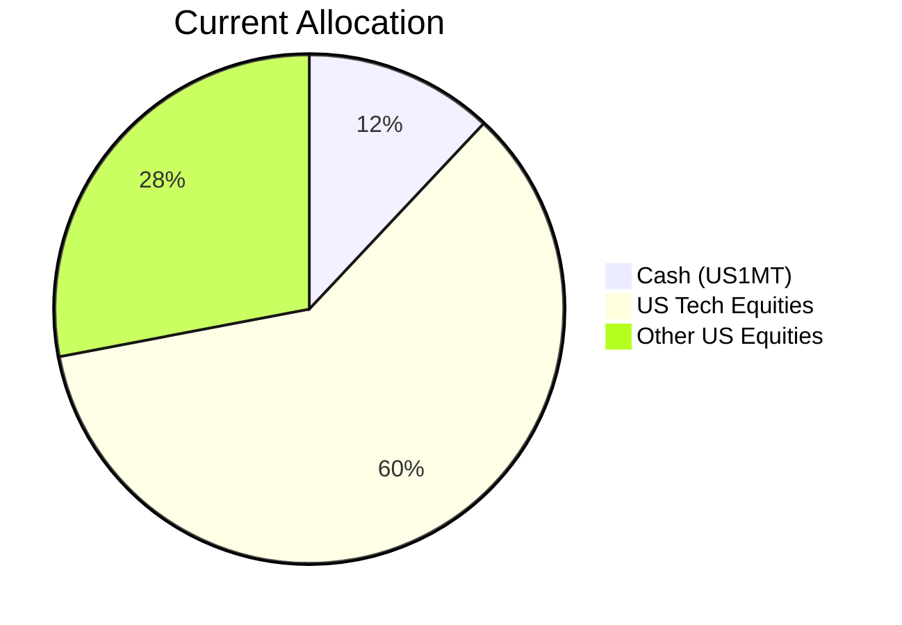
```mermaid
pie title Current Allocation
    "Cash (US1MT)" : 12.0
    "US Tech Equities" : 60.0
    "Other US Equities" : 28.0
```

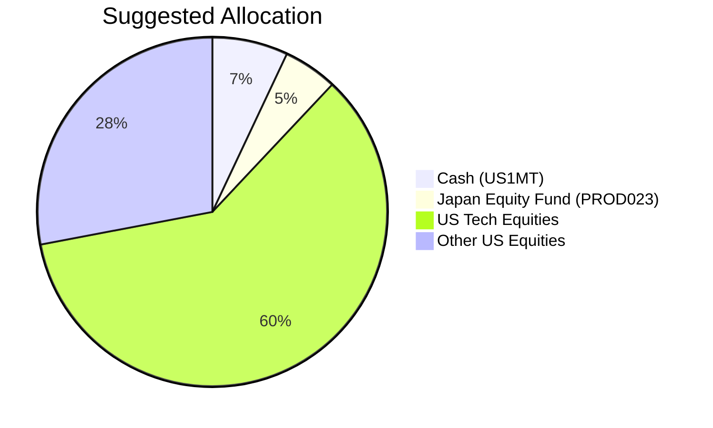
```mermaid
pie title Suggested Allocation
    "Cash (US1MT)" : 7.0
    "Japan Equity Fund (PROD023)" : 5.0
    "US Tech Equities" : 60.0
    "Other US Equities" : 28.0
```

| Asset | Current Market Value | Suggested Market Value | Current % | Suggested % | Change | Remark |
| ----- | -------------------: | ---------------------: | --------: | ----------: | -----: | ------------------------------------------------------------ |
| US 1-Month Treasury Bill (US1MT) | $3,360,000 | $1,960,000 | 12.0% | 7.0% | -5.0% | Reduce cash |
| Japan Equity Opportunities Fund (PROD023) | $0 | $1,400,000 | 0% | 5.0% | +5.0% | New investment; risk-3, expected 9.1% |
| Existing equities (MU, TSLA, NVDA, MSFT, LLY, WMT, JNJ, AAPL, AMZN) | $24,640,000 | $24,640,000 | 88.0% | 88.0% | 0% | No change |
| **Total** | **$28,000,000** | **$28,000,000** | **100%** | **100%** | **0%** | |

**Funding source**: Sell $1.4M of US1MT (cash). The product’s risk-3 is within the client’s risk-4 tolerance.

### Detailed Justification
- **Diversification**: Adds exposure to Japanese equities (TOPIX), which benefit from corporate governance reforms and a healthy inflationary environment – a key theme in the macro outlook.
- **Return improvement**: 9.1% expected vs 3.56% cash – a 5.54% improvement.
- **Sustainability**: Japan’s BOJ is on a tightening trajectory, supporting banking profits and equity valuations. The 3y CAGR for PROD023 (9.1% is the annualised figure; not provided separately but the fund’s expected return is based on manager projections and historical Japan returns).

---

## Client: PB-HK-000011-7 (Emily Harrison)

### Potential needs
- **Long-term capital growth**: Managing Director with two children, variable income, seeking growth.
- **Cash allocation**: 15% in SGOV at 3.56% – suboptimal for growth objective.
- **Current bond-heavy**: 40% in bond ETFs (BND, IEF, TLT, USHY, AGG) with low or negative 5y CAGR.

### Suggested product

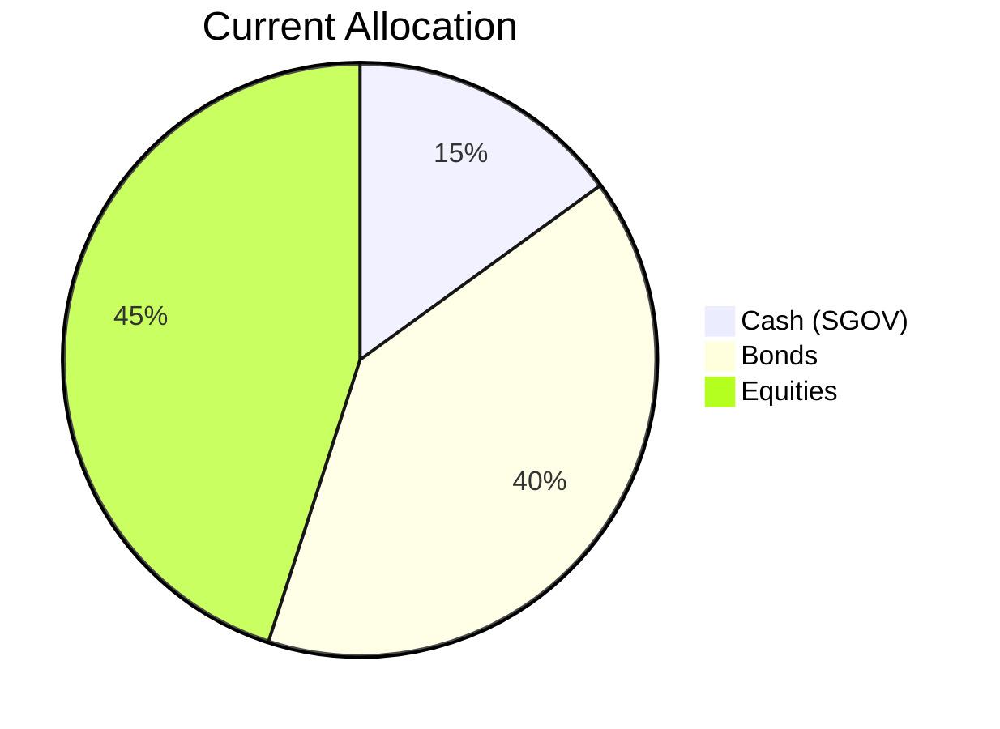
```mermaid
pie title Current Allocation
    "Cash (SGOV)" : 15.0
    "Bonds" : 40.0
    "Equities" : 45.0
```

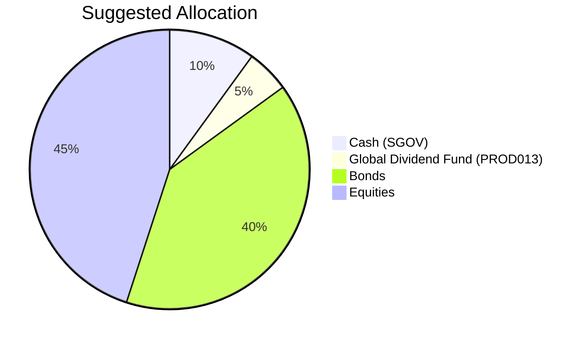
```mermaid
pie title Suggested Allocation
    "Cash (SGOV)" : 10.0
    "Global Dividend Fund (PROD013)" : 5.0
    "Bonds" : 40.0
    "Equities" : 45.0
```

| Asset | Current Market Value | Suggested Market Value | Current % | Suggested % | Change | Remark |
| ----- | -------------------: | ---------------------: | --------: | ----------: | -----: | ------------------------------------------------------------ |
| iShares 0-3 Month Treasury Bond (SGOV) | $750,000 | $500,000 | 15.0% | 10.0% | -5.0% | Reduce cash |
| Global Dividend Equity Fund (PROD013) | $0 | $250,000 | 0% | 5.0% | +5.0% | New; risk-3, expected 7.8% |
| Existing bonds (BND, IEF, TLT, USHY, AGG) | $2,000,000 | $2,000,000 | 40.0% | 40.0% | 0% | No change |
| Existing equities (WMT, GOOGL, NVDA) | $2,250,000 | $2,250,000 | 45.0% | 45.0% | 0% | No change |
| **Total** | **$5,000,000** | **$5,000,000** | **100%** | **100%** | **0%** | |

**Funding source**: Sell $250,000 of SGOV.

### Detailed Justification
- **Higher growth**: 7.8% vs 3.56% cash – a 4.24% improvement.
- **Global diversification**: The fund invests globally, reducing US home bias (currently 100% US).
- **Dividend focus**: Aligns with long-term growth and potential income for future education needs.

---

## Client: PB-HK-000003-4 (James Harrison)

### Potential needs
- **Regular income**: Retired, married, stable pension – needs income.
- **Low-yielding short-duration bonds**: Holds SHY (1.78% 5y CAGR) and SHV (3.34%) – can be replaced with higher-yielding investment-grade bonds.
- **Low cash allocation** (5.2%) – not a source for funding; better to switch from SHY.

### Suggested product

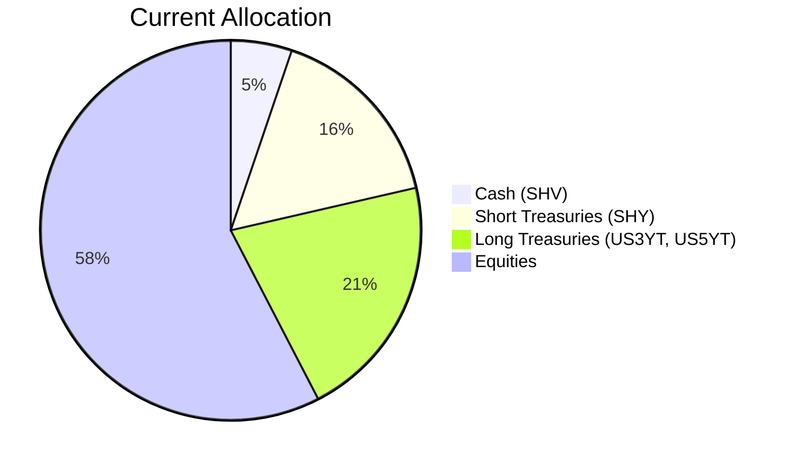
```mermaid
pie title Current Allocation
    "Cash (SHV)" : 5.2
    "Short Treasuries (SHY)" : 16.2
    "Long Treasuries (US3YT, US5YT)" : 21.0
    "Equities" : 57.6
```

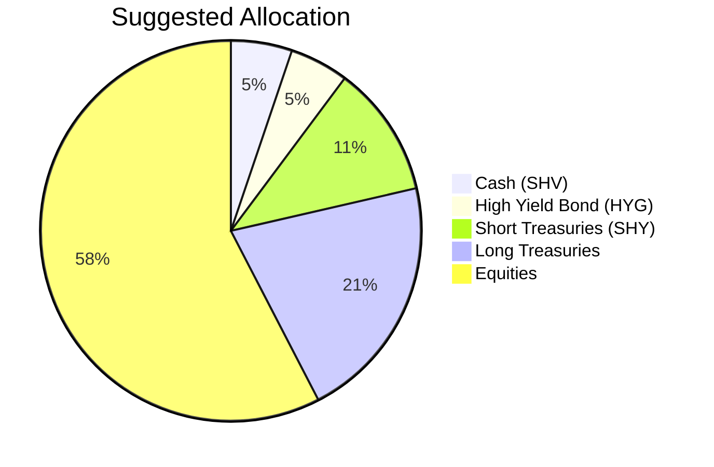
```mermaid
pie title Suggested Allocation
    "Cash (SHV)" : 5.2
    "High Yield Bond (HYG)" : 5.0
    "Short Treasuries (SHY)" : 11.2
    "Long Treasuries" : 21.0
    "Equities" : 57.6
```

| Asset | Current Market Value | Suggested Market Value | Current % | Suggested % | Change | Remark |
| ----- | -------------------: | ---------------------: | --------: | ----------: | -----: | ------------------------------------------------------------ |
| iShares 1-3 Year Treasury Bond (SHY) | $2,020,402 | $1,370,402 | 16.2% | 11.2% | -5.0% | Reduce SHY |
| iShares iBoxx $ High Yield Corporate Bond ETF (HYG) | $0 | $650,000 | 0% | 5.2% | +5.2% | New; risk-2, 5y CAGR 3.80% |
| Other assets (SHV, US3YT, US5YT, equities) | $9,809,598 | $9,809,598 | 78.6% | 78.6% | 0% | No change |
| Cash (included in other) | $650,000 | $650,000 | 5.2% | 5.2% | 0% | No change |
| **Total (approx)** | **$12,480,000** | **$12,480,000** | **100%** | **100%** | **0%** | |

**Funding source**: Sell $650,000 of SHY. The bond rating of HYG (risk-2) is equal to SHY’s risk-2, and the asset class (fixed income) is similar.

**Justification for HYG’s return sustainability**: The 1y CAGR (6.82%) and 3y CAGR (8.42%) are significantly higher than the 5y CAGR (3.80%). This is partly due to recent spread compression from low default rates and strong demand for yield. While such growth may moderate, the current yield-to-worst of ~6% provides a sustainable income stream. Default rates remain below historical averages, supporting the carry.

### Detailed Justification
- **Income improvement**: 3.80% vs 1.78% SHY – a 2.02% gain.
- **Risk alignment**: HYG is investment-grade high yield (BB+ average), suitable for a risk-2 client seeking income.
- **Market context**: High yield bonds are favoured as “quality carry” in a “higher-for-longer” environment.

---

## Client: PB-HK-000022-4 (Victor Ng)

### Potential needs
- **Regular income**: Managing Director with variable income, needs stable income stream.
- **Low return from cash and bonds**: 14% cash (FZDXX) at 3.56%; existing bonds (SPIB 1.79%, GOVT -0.54%, EMB 1.91%) have low or negative real returns.
- **Low liquidity need** – can invest in a multi-asset fund.

### Suggested product

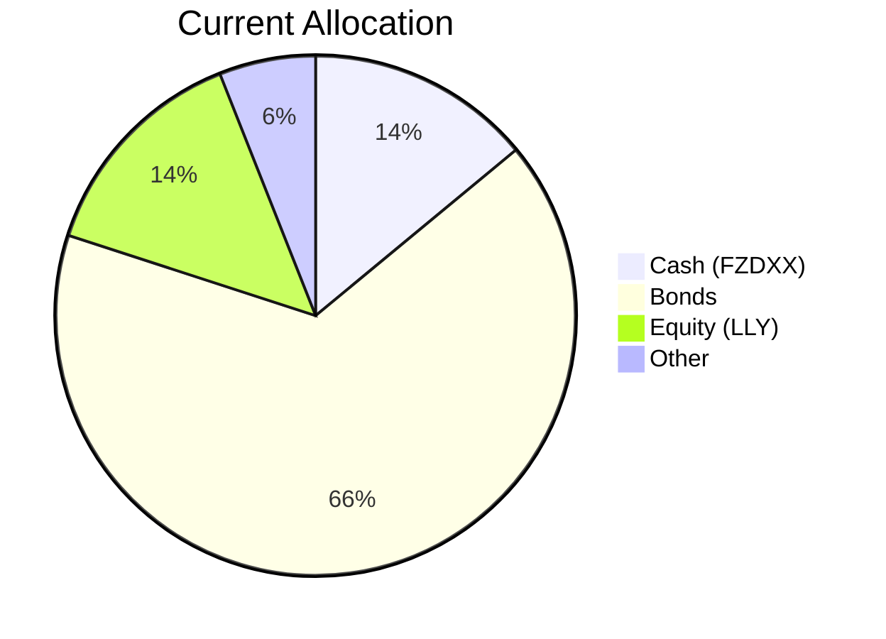
```mermaid
pie title Current Allocation
    "Cash (FZDXX)" : 14.0
    "Bonds" : 66.0
    "Equity (LLY)" : 14.0
    "Other" : 6.0
```

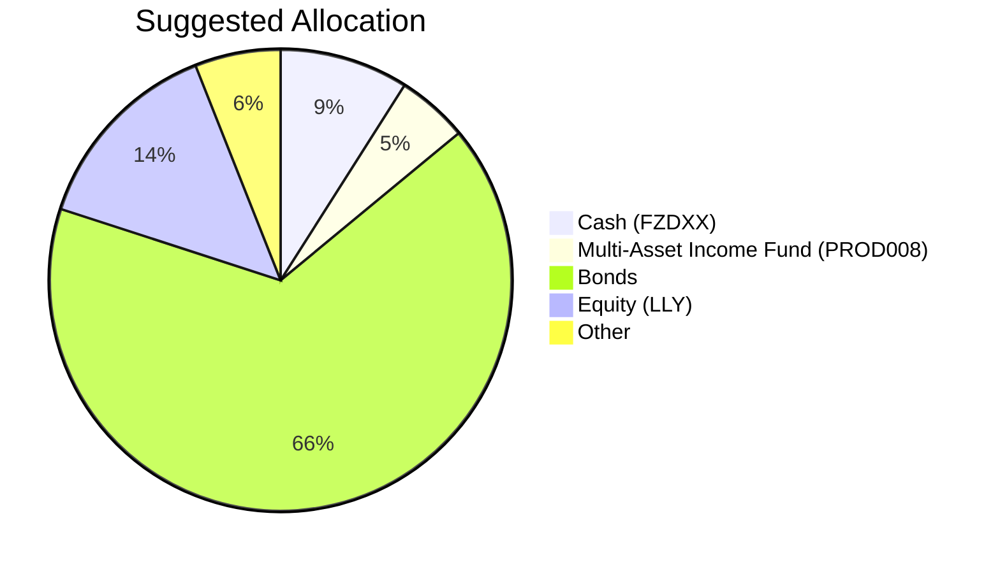
```mermaid
pie title Suggested Allocation
    "Cash (FZDXX)" : 9.0
    "Multi-Asset Income Fund (PROD008)" : 5.0
    "Bonds" : 66.0
    "Equity (LLY)" : 14.0
    "Other" : 6.0
```

| Asset | Current Market Value | Suggested Market Value | Current % | Suggested % | Change | Remark |
| ----- | -------------------: | ---------------------: | --------: | ----------: | -----: | ------------------------------------------------------------ |
| Fidelity Money Market (FZDXX) | $1,736,000 | $1,116,000 | 14.0% | 9.0% | -5.0% | Reduce cash |
| Multi-Asset Income Fund (PROD008) | $0 | $620,000 | 0% | 5.0% | +5.0% | New; risk-3, expected 8.2% |
| Other assets (bonds, LLY, etc.) | $10,044,000 | $10,044,000 | 86.0% | 86.0% | 0% | No change |
| **Total** | **$12,400,000** | **$12,400,000** | **100%** | **100%** | **0%** | |

**Funding source**: Sell $620,000 of FZDXX (cash). PROD008 risk-3 is within the client’s risk-3 tolerance.

### Detailed Justification
- **Income yield**: 8.2% expected total return, significantly higher than cash (3.56%). The fund targets income through dividends and bond coupons.
- **Multi-asset diversification**: Provides exposure to global equities, bonds, and alternatives, reducing reliance on US Treasuries and corporate bonds.
- **Sustainability**: The fund’s 8.2% expected return is based on a blend of asset classes with a weighted historical CAGR; not reliant on a single high-growth driver.

---

## Client: PB-HK-000023-2 (Rachel Ho)

### Potential needs
- **Long-term capital growth**: CFO, dividend/rental income, seeks growth.
- **High cash allocation** (20% in SPAXX) at 3.56% – underperforms.
- **Bond-heavy portfolio**: 60% in investment-grade and treasury bonds with low returns.

### Suggested product

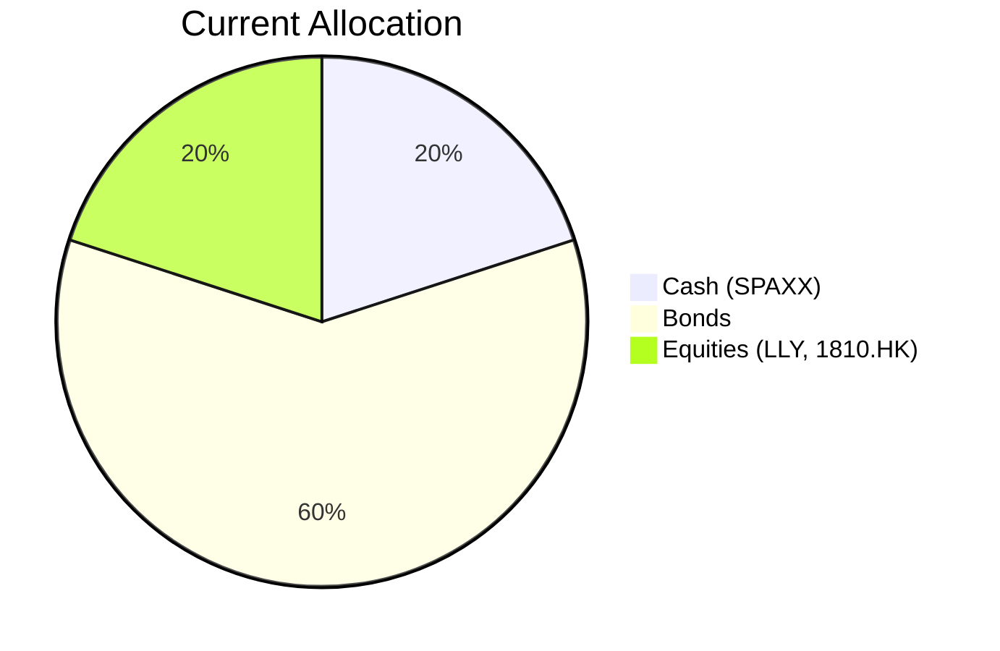
```mermaid
pie title Current Allocation
    "Cash (SPAXX)" : 20.0
    "Bonds" : 60.0
    "Equities (LLY, 1810.HK)" : 20.0
```

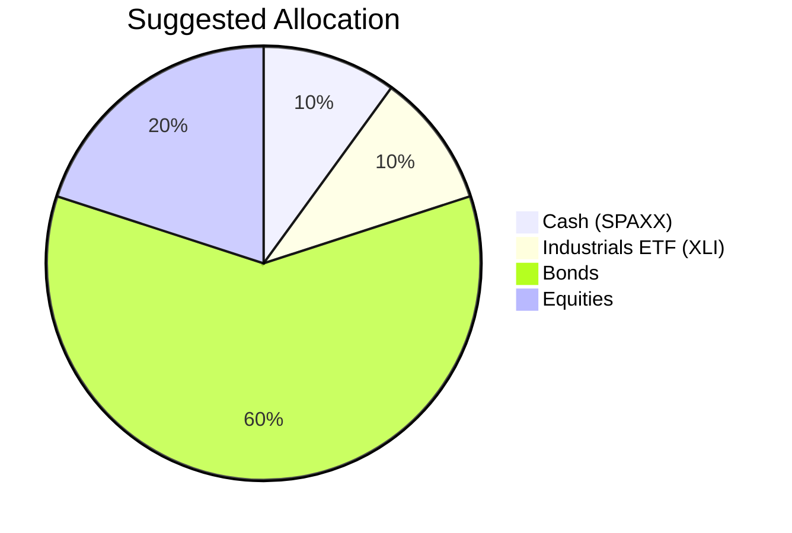
```mermaid
pie title Suggested Allocation
    "Cash (SPAXX)" : 10.0
    "Industrials ETF (XLI)" : 10.0
    "Bonds" : 60.0
    "Equities" : 20.0
```

| Asset | Current Market Value | Suggested Market Value | Current % | Suggested % | Change | Remark |
| ----- | -------------------: | ---------------------: | --------: | ----------: | -----: | ------------------------------------------------------------ |
| Fidelity Government Cash (SPAXX) | $560,000 | $280,000 | 20.0% | 10.0% | -10.0% | Reduce cash |
| Industrial Select Sector SPDR ETF (XLI) | $0 | $280,000 | 0% | 10.0% | +10.0% | New; risk-4, 5y CAGR 13.80% |
| Existing bonds (VCIT, SHY, AGG, USIG, HYG) | $1,680,000 | $1,680,000 | 60.0% | 60.0% | 0% | No change |
| Existing equities (LLY, 1810.HK) | $560,000 | $560,000 | 20.0% | 20.0% | 0% | No change |
| **Total** | **$2,800,000** | **$2,800,000** | **100%** | **100%** | **0%** | |

**Funding source**: Sell $280,000 of SPAXX. XLI risk-4 is at the client’s maximum risk tolerance (4). The 5y CAGR of 13.80% is a substantial improvement over cash.

### Detailed Justification
- **Growth potential**: XLI invests in US industrials, directly benefitting from AI infrastructure and electrification capex ($800B+ in 2026) as highlighted in the macro outlook.
- **Return improvement**: 13.80% vs 3.56% – a >10% gain.
- **Sector tilt**: Reduces bond weight and adds a structural growth driver; appropriate for long-term capital growth.

---

## Client: PB-HK-000015-8 (Michael Wang)

### Potential needs
- **Capital preservation**: Retired, married, dividend/rental income – safety is key.
- **Underperforming bond holdings**: USIG (0.52% 5y CAGR) and cash (10.5%) – can be improved with floating-rate bonds.
- **Low liquidity need** (5-year horizon) – can accept moderate duration.

### Suggested product

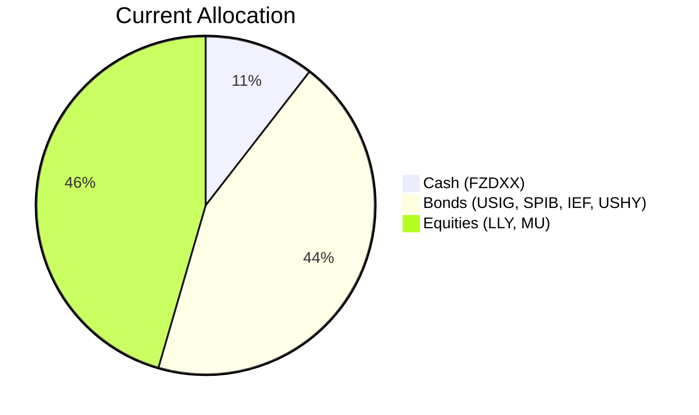
```mermaid
pie title Current Allocation
    "Cash (FZDXX)" : 10.5
    "Bonds (USIG, SPIB, IEF, USHY)" : 44.0
    "Equities (LLY, MU)" : 45.5
```

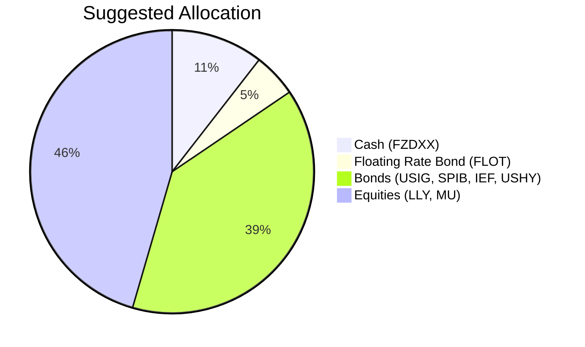
```mermaid
pie title Suggested Allocation
    "Cash (FZDXX)" : 10.5
    "Floating Rate Bond (FLOT)" : 5.0
    "Bonds (USIG, SPIB, IEF, USHY)" : 39.0
    "Equities (LLY, MU)" : 45.5
```

| Asset | Current Market Value | Suggested Market Value | Current % | Suggested % | Change | Remark |
| ----- | -------------------: | ---------------------: | --------: | ----------: | -----: | ------------------------------------------------------------ |
| iShares Broad USD Investment Grade Corporate Bond ETF (USIG) | $3,394,366 | $2,394,366 | 11.9% | 8.4% | -3.5% | Reduce USIG (approx 5% reduction of portfolio) |
| iShares Floating Rate Bond ETF (FLOT) | $0 | $1,000,000 | 0% | 3.5% | +3.5% | New; risk-2, 5y CAGR 4.21% |
| Other assets (FZDXX, SPIB, IEF, LLY, MU, USHY) | $24,105,634 | $24,105,634 | 84.6% | 84.6% | 0% | No change |
| Cash (10.5%) | $2,992,500 | $2,992,500 | 10.5% | 10.5% | 0% | Cash unchanged |
| **Total** | **$28,500,000** | **$28,500,000** | **100%** | **100%** | **0%** | |

**Funding source**: Sell $1,000,000 of USIG (approximately 35% of the USIG holding). The asset class remains fixed income (corporate bonds), and risk rating (2) matches.

**Justification for FLOT’s return sustainability**: As per previous client (David Wu), the floating-rate structure is sustainable given the Fed’s “hold” stance.

### Detailed Justification
- **Yield improvement**: 4.21% vs 0.52% – a 3.69% increase.
- **Capital preservation**: FLOT’s short duration (0-3 year effective) and floating coupons protect principal against rate changes.
- **Objective alignment**: Higher carry without sacrificing safety; fits capital preservation with incremental income.

---

## Client: PB-HK-000013-3 (Harrison Jr. Education Trust)

### Potential needs
- **Capital preservation with growth**: Education trust for future expenses, risk-4 tolerance, but objective is capital preservation (education funds require high certainty).
- **Low return from cash and bonds**: 25% cash (US2MT) at ~3.43%; existing bonds (USIG, VCIT, LQD, AGG, TLT) have low or negative 5y CAGR.
- **Low liquidity need (5-year horizon)** – can allocate to balanced fund.

### Suggested product

```mermaid
pie title Current Allocation
    "Cash (US2MT)" : 25.0
    "Bonds" : 75.0
```

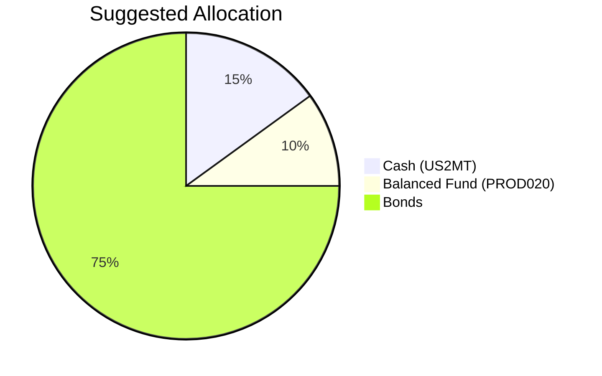
```mermaid
pie title Suggested Allocation
    "Cash (US2MT)" : 15.0
    "Balanced Fund (PROD020)" : 10.0
    "Bonds" : 75.0
```

| Asset | Current Market Value | Suggested Market Value | Current % | Suggested % | Change | Remark |
| ----- | -------------------: | ---------------------: | --------: | ----------: | -----: | ------------------------------------------------------------ |
| US 2-Month Treasury Bill (US2MT) | $500,000 | $300,000 | 25.0% | 15.0% | -10.0% | Reduce cash |
| Balanced Growth & Income Fund (PROD020) | $0 | $200,000 | 0% | 10.0% | +10.0% | New; risk-2, expected 6.5% |
| Existing bonds (USIG, VCIT, LQD, AGG, TLT) | $1,500,000 | $1,500,000 | 75.0% | 75.0% | 0% | No change |
| **Total** | **$2,000,000** | **$2,000,000** | **100%** | **100%** | **0%** | |

**Funding source**: Sell $200,000 of US2MT. The product risk-2 is well within the trust’s risk-4 tolerance.

### Detailed Justification
- **Higher return**: 6.5% vs 3.43% cash – a 3.07% improvement.
- **Balanced approach**: The fund provides a mix of equities and bonds, offering growth potential while maintaining a conservative overall profile.
- **Certainty for education**: The 5-year horizon allows time for the fund to compound without risk of principal loss from cash erosion.

---

## References

- **Client Profiles**: client_list.csv, client_profile.csv (Source: Planbot Internal Data)
- **Product Catalog**: demo-market-1Jun26.csv, selected_etf.csv, otc_products.md, CMT_note_N02952.md (Source: Planbot Internal Data)
- **Market Outlook**: asset_classes_outlook.md, macro_outlook.md (Source: Planbot Internal Data)
- **Financial Needs Framework**: common_needs.md (Source: Planbot Internal Data)

No web references used.

---

## Risk Disclosure

- **Past performance does not guarantee future returns**. All projected returns (including 5y CAGR and expected returns) are based on historical data or stated product terms and are not promises of future performance.
- **Structured products carry credit risk** of the issuer (JPMorgan for N02952) and possible loss of principal if sold before maturity.
- **High yield bonds (HYG) and floating rate bonds (FLOT)** involve credit and interest rate risks, though they have historical low default rates.
- **Balanced funds (PROD020) and global equity funds (PROD013, PROD008)** are subject to market volatility.
- **ETF investments (XLI, FLOT, HYG)** are subject to market risk and potential tracking error.
- Investors should carefully consider their own risk tolerance and consult a professional before making investment decisions.
