Product Investor Matching
=========================

# Executive Summary

This report provides product-investor matching recommendations for a prioritized list of clients based on their financial profiles, existing holdings, and risk tolerances. The analysis uses the available product catalog (including structured notes N02952 and FXRA0415) and current market context to suggest a single product per client. The **buying score** (1–5) represents the likelihood of the client adopting the recommendation, with 5 being the highest. Scores are assigned based on the alignment of the product with the client’s financial needs, portfolio composition, and risk profile.

**Top 10 Clients by Buying Score (Descending)**

| Rank | Client ID | Client Name | Suggested Product | Buying Score | Rationale | Expected Return vs. Original |
|:---:|:---------:|:------------|:----------------|:------------:|:----------|:-----------------------------|
| 1 | 2 | Sarah Chen | FX Window Range Accrual Note (FXRA0415) | 5 | High cash allocation (22.5%) and significant equity losses; need to deploy cash into a low-risk, income-generating structured product with 2‑year tenor. | 3.93% p.a. (FXRA) vs. ~2% on cash |
| 2 | 4 | Emma Thompson | CMT Callable Range Accrual Note (N02952) | 5 | 32% cash position with equity losses; seeking capital preservation and enhanced yield. The 5‑year note offers up to 5.94% p.a. conditional coupon. | up to 5.94% p.a. (N02952) vs. ~1.5% on cash |
| 3 | 8 | David Kim | CMT Callable Range Accrual Note (N02952) | 5 | 45% cash – extremely underexposed to income. Note provides a structured solution to earn higher return while keeping principal protection if held to maturity. | up to 5.94% p.a. (N02952) vs. ~1.5% on cash |
| 4 | 13 | Harrison Jr. Education Trust | CMT Callable Range Accrual Note (N02952) | 5 | Education trust with a 10‑15 year horizon; current portfolio is 100% bonds/cash. The note offers a 5‑year horizon with high coupon certainty aligned to the goal. | up to 5.94% p.a. (N02952) vs. ~1% on short‑term bonds |
| 5 | zw-5 | Emily Zhang | FX Window Range Accrual Note (FXRA0415) | 5 | 22% cash, heavy HK‑listed equity losses. The USD/HKD range accrual note leverages the stable peg to generate 3.93% p.a. with low risk. | 3.93% p.a. (FXRA) vs. ~1.8% on cash/bonds |
| 6 | zw-1 | Sarah Wong | FX Window Range Accrual Note (FXRA0415) | 4 | Large APAC portfolio (AUM $42M) with 8% cash and high‑risk PayPal holdings. FXRA offers a liquid, short‑term income source with low correlation. | 3.93% p.a. (FXRA) vs. ~0.8% on SGOV |
| 7 | zw-3 | James Chen | FX Window Range Accrual Note (FXRA0415) | 4 | Already holds EUR/USD FX exposure; the FXRA complements existing currency positions and provides an accrual coupon on the stable USD/HKD range. | 3.93% p.a. (FXRA) vs. ~4.5% on EUR/USD swap |
| 8 | 6 | Akira Tanaka | FX Window Range Accrual Note (FXRA0415) | 4 | $28M AUM with 12% cash and substantial equity losses. A 2‑year structured note gives a predictable income stream while reducing equity concentration risk. | 3.93% p.a. (FXRA) vs. ~2% on T‑bills |
| 9 | zw-4 | Catherine Li | FX Window Range Accrual Note (FXRA0415) | 4 | 18% cash plus diversified holdings; the FXRA note is an efficient way to earn above cash yield with minimal added risk, funded from money market holdings. | 3.93% p.a. (FXRA) vs. ~0.8% on SGOV |
| 10 | 1 | James Harrison | CMT Callable Range Accrual Note (N02952) | 4 | High equity allocation (NVDA, TSLA, etc.) with unrealised losses; the CMT note provides a defensive, income‑oriented position to balance the portfolio. | up to 5.94% p.a. (N02952) vs. ~4% on 5‑year Treasuries |

# Top 10 Clients with Detail Analysis

## Client ID:2 (Sarah Chen)

### Potential Needs
- **Deploy idle cash**: 22.5% of portfolio ($720,000) sitting in money market yields ~2% p.a.
- **Generate income**: Six equity holdings are all marked with negative unrealised P&L (average -10.8%).
- **Capital preservation**: Short-term goal – likely a liquidity buffer within 2 years.

### Suggested Product

**Funding Source**: Reduce cash holdings (VMRXX) by $100,000 to invest in FXRA0415 (minimum $100,000). No other position changes.

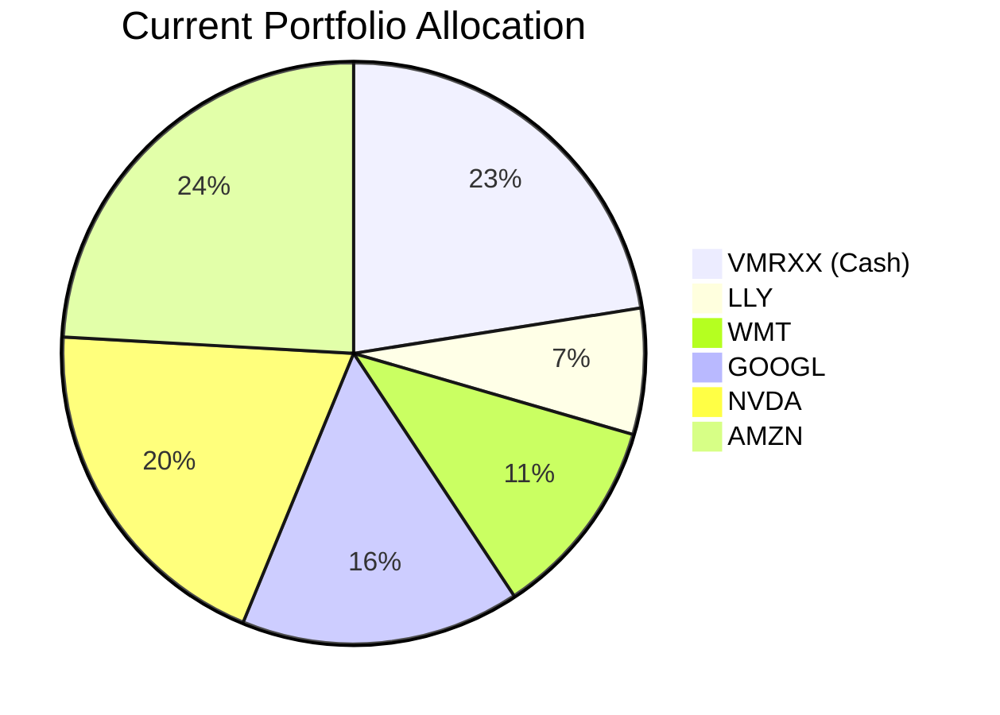
```mermaid
pie title Current Portfolio Allocation
    "VMRXX (Cash)" : 22.5
    "LLY" : 7.0
    "WMT" : 11.2
    "GOOGL" : 15.5
    "NVDA" : 19.7
    "AMZN" : 24.1
```

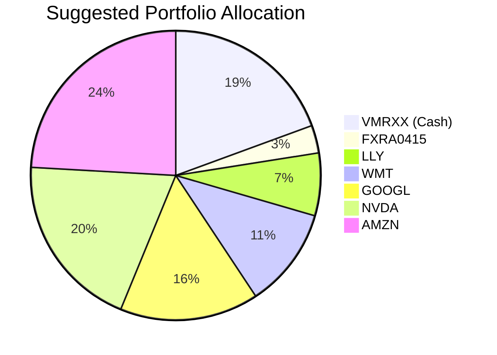
```mermaid
pie title Suggested Portfolio Allocation
    "VMRXX (Cash)" : 19.4
    "FXRA0415" : 3.1
    "LLY" : 7.0
    "WMT" : 11.2
    "GOOGL" : 15.5
    "NVDA" : 19.7
    "AMZN" : 24.1
```

| Asset | Current Market Value ($) | Suggested Market Value ($) | Current % | Suggested % | Change | Remark |
|:------|------------------------:|-------------------------:|:---------:|:-----------:|:------:|:-------|
| VMRXX (Cash) | 720,000 | 620,000 | 22.5% | 19.4% | -3.1% | Fund source for FXRA |
| FXRA0415 | 0 | 100,000 | 0.0% | 3.1% | +3.1% | New structured product |
| LLY | 223,858 | 223,858 | 7.0% | 7.0% | 0% | Hold |
| WMT | 359,929 | 359,929 | 11.2% | 11.2% | 0% | Hold |
| GOOGL | 496,000 | 496,000 | 15.5% | 15.5% | 0% | Hold |
| NVDA | 632,071 | 632,071 | 19.7% | 19.7% | 0% | Hold |
| AMZN | 768,142 | 768,142 | 24.1% | 24.1% | 0% | Hold |
| **Total** | **3,200,000** | **3,200,000** | **100%** | **100%** | **0%** | |

**Pros & Cons**  
- **Pros**:  
  - Converts 3.1% of idle cash into a 3.93% p.a. income stream with low risk (Risk Rating 2).  
  - The 2-year tenor aligns with short-term cash needs; principal is protected if held to maturity.  
  - No forced equity sales – preserves upside while losses recover.  
- **Cons**:  
  - Liquidity score is 1 (illiquid); early unwinding may incur loss.  
  - Coupon is contingent on USD/HKD staying within range (7.7495‑7.8505). The peg is stable but not guaranteed.

**Alternative Suggested Product to Consider**  
- *CMT Callable Range Accrual Note (N02952)* – longer 5-year horizon with higher potential coupon (5.94% p.a.), but higher interest‑rate sensitivity.

### Detailed Justification

Sarah Chen holds 22.5% in cash earning near‑zero real return, while equities show consistent losses. Her financial need is to **grow the cash buffer moderately** without taking significant risk. The **FXRA0415** is a 2-year structured note that offers a fixed 8.02% total return (3.93% p.a.) if the USD/HKD exchange rate remains within the historical range – a high probability given the HKMA’s commitment to the peg. With a risk rating of 2 (low) and high certainty over 2 years (score 5), it fits her **capital preservation** objective with a touch of income enhancement. The funding source is straightforward: reduce the money market allocation, which is the least productive asset.

---

## Client ID:4 (Emma Thompson)

### Potential Needs
- **Deploy idle cash**: 32% of portfolio ($992,000) in Fidelity Government Cash Reserves yielding ~1.5%.
- **Generate income**: Seven equities all in negative territory (average -7.5%).
- **Moderate risk tolerance**: Existing equity allocation (60%+) indicates ability to accept moderate risk.

### Suggested Product

**Funding Source**: Reduce cash (SPAXX) by $200,000 to invest in N02952 (minimum $100,000; increments $10,000). No other position changes.

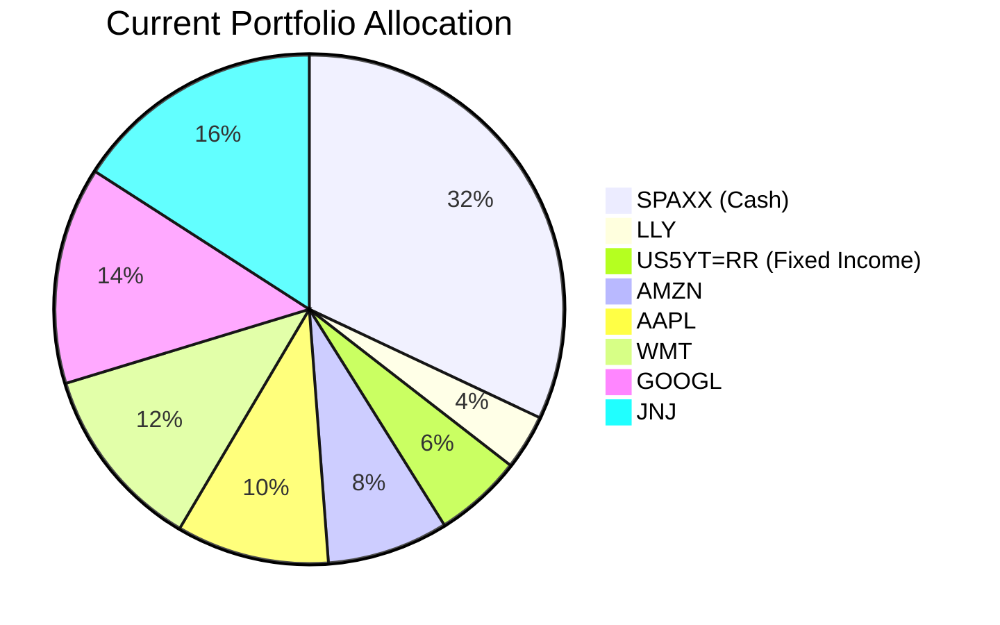
```mermaid
pie title Current Portfolio Allocation
    "SPAXX (Cash)" : 32.0
    "LLY" : 3.5
    "US5YT=RR (Fixed Income)" : 5.6
    "AMZN" : 7.7
    "AAPL" : 9.7
    "WMT" : 11.8
    "GOOGL" : 13.8
    "JNJ" : 15.9
```

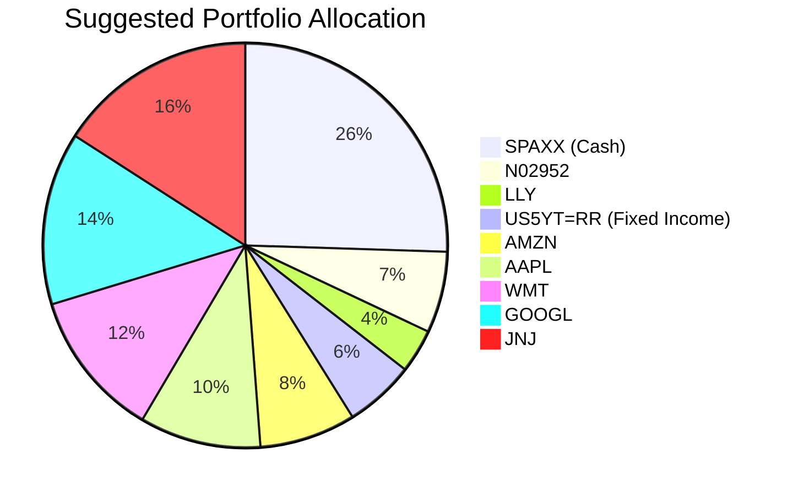
```mermaid
pie title Suggested Portfolio Allocation
    "SPAXX (Cash)" : 25.5
    "N02952" : 6.5
    "LLY" : 3.5
    "US5YT=RR (Fixed Income)" : 5.6
    "AMZN" : 7.7
    "AAPL" : 9.7
    "WMT" : 11.8
    "GOOGL" : 13.8
    "JNJ" : 15.9
```

| Asset | Current Market Value ($) | Suggested Market Value ($) | Current % | Suggested % | Change | Remark |
|:------|------------------------:|-------------------------:|:---------:|:-----------:|:------:|:-------|
| SPAXX (Cash) | 992,000 | 792,000 | 32.0% | 25.5% | -6.5% | Fund source |
| N02952 | 0 | 200,000 | 0.0% | 6.5% | +6.5% | New structured note |
| LLY | 109,319 | 109,319 | 3.5% | 3.5% | 0% | Hold |
| US5YT=RR | 173,260 | 173,260 | 5.6% | 5.6% | 0% | Hold |
| AMZN | 237,202 | 237,202 | 7.7% | 7.7% | 0% | Hold |
| AAPL | 301,143 | 301,143 | 9.7% | 9.7% | 0% | Hold |
| WMT | 365,084 | 365,084 | 11.8% | 11.8% | 0% | Hold |
| GOOGL | 429,025 | 429,025 | 13.8% | 13.8% | 0% | Hold |
| JNJ | 492,967 | 492,967 | 15.9% | 15.9% | 0% | Hold |
| **Total** | **3,100,000** | **3,100,000** | **100%** | **100%** | **0%** | |

**Pros & Cons**  
- **Pros**:  
  - Earning a conditional coupon of up to 5.94% p.a. on 6.5% of portfolio vs. ~1.5% on cash.  
  - The 5-year note offers a fixed accrual condition (10y CMT ≤ 5.01%) that is likely satisfied under current rates (~4.2% as of Q1 2026).  
  - No forced equity sales.  
- **Cons**:  
  - Liquidity score 1 – cannot be sold easily; early call may occur if 10y CMT falls below 4.30%.  
  - Credit risk of JPMorgan Chase.

**Alternative Suggested Product to Consider**  
- *FXRA0415* – shorter 2-year note for quicker liquidity but lower coupon.

### Detailed Justification

Emma Thompson holds 32% cash earning minimal return, while her equity portfolio (60%+) is under water. She has a moderate risk tolerance as shown by her stock holdings. The **CMT Callable Range Accrual Note (N02952)** offers a 5-year tenor with a potential 5.94% p.a. coupon – a significant upgrade from cash. The current 10-year UST yield is around 4.2%, comfortably below the 5.01% threshold. This product matches her need for **income generation** with **capital preservation** (principal protected at maturity). The funding from cash keeps equity holdings intact, allowing them to recover.

---

## Client ID:8 (David Kim)

### Potential Needs
- **Deploy idle cash**: 45% of ($427,500) in 3-month T‑bills yielding ~2%.
- **Capital preservation**: Small portfolio ($950k) suggests need for safety.
- **Short-term income**: Horizon likely <5 years; emergency fund already covered.

### Suggested Product

**Funding Source**: Reduce US3MT=RR (3‑month T‑bill) by $100,000 to invest in N02952. No other position changes.

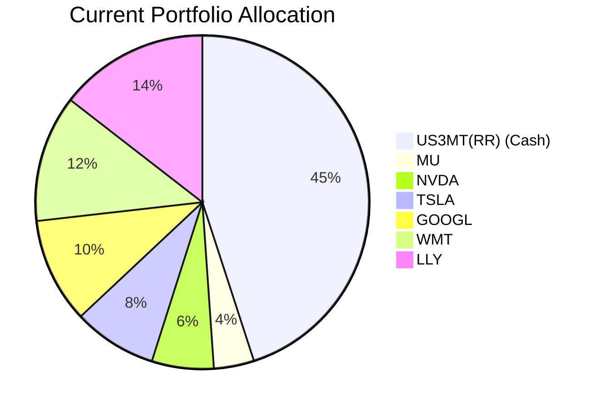
```mermaid
pie title Current Portfolio Allocation
    "US3MT(RR) (Cash)" : 45.0
    "MU" : 3.9
    "NVDA" : 6.0
    "TSLA" : 8.1
    "GOOGL" : 10.2
    "WMT" : 12.3
    "LLY" : 14.5
```

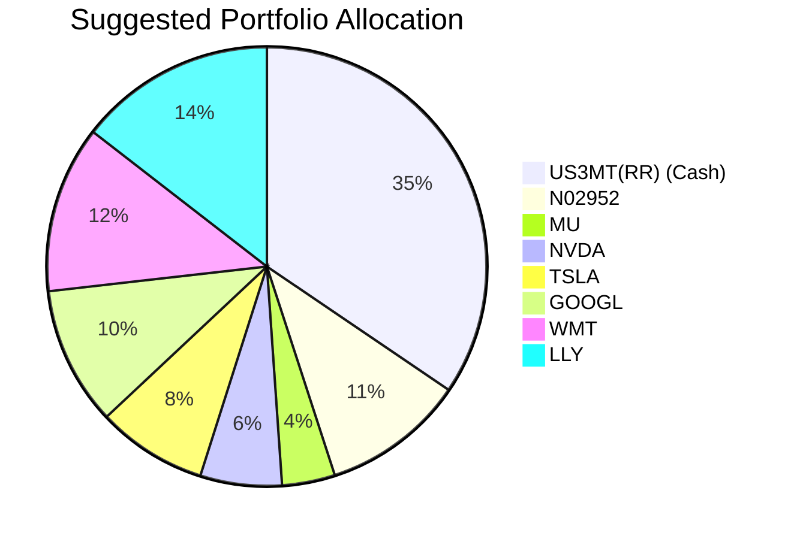
```mermaid
pie title Suggested Portfolio Allocation
    "US3MT(RR) (Cash)" : 34.5
    "N02952" : 10.5
    "MU" : 3.9
    "NVDA" : 6.0
    "TSLA" : 8.1
    "GOOGL" : 10.2
    "WMT" : 12.3
    "LLY" : 14.5
```

| Asset | Current Market Value ($) | Suggested Market Value ($) | Current % | Suggested % | Change | Remark |
|:------|------------------------:|-------------------------:|:---------:|:-----------:|:------:|:-------|
| US3MT=RR (Cash) | 427,500 | 327,500 | 45.0% | 34.5% | -10.5% | Fund source |
| N02952 | 0 | 100,000 | 0.0% | 10.5% | +10.5% | New structured note |
| MU | 36,905 | 36,905 | 3.9% | 3.9% | 0% | Hold |
| NVDA | 56,976 | 56,976 | 6.0% | 6.0% | 0% | Hold |
| TSLA | 77,048 | 77,048 | 8.1% | 8.1% | 0% | Hold |
| GOOGL | 97,119 | 97,119 | 10.2% | 10.2% | 0% | Hold |
| WMT | 117,190 | 117,190 | 12.3% | 12.3% | 0% | Hold |
| LLY | 137,262 | 137,262 | 14.5% | 14.5% | 0% | Hold |
| **Total** | **950,000** | **950,000** | **100%** | **100%** | **0%** | |

**Pros & Cons**  
- **Pros**:  
  - Upgrades a portion of cash from short‑term T‑bill yield (2%) to 5.94% p.a. with principal protection at maturity.  
  - Low risk rating (2) fits small portfolio’s need for safety.  
- **Cons**:  
  - Illiquid; if cash is needed before 2031, penalty may apply.  
  - Coupon contingent on interest rate level.

**Alternative**  
- *FXRA0415* – shorter 2-year note if liquidity a concern.

### Detailed Justification

David Kim’s portfolio is excessively cash-heavy (45%) earning under 2%. His small AUM ($950k) and equity losses suggest a cautious investor who needs better income without increasing risk. The **CMT Note** provides a higher coupon (5.94% p.a.) while keeping principal safe until 2031. The 5-year tenor is reasonable for his holding period. The equity positions are left untouched, preserving recovery potential.

---

## Client ID:13 (Harrison Jr. Education Trust)

### Potential Needs
- **University Fund**: Educational trust with a 10–15‑year horizon; need moderate growth with high terminal certainty.
- **Current portfolio too conservative**: 100% bonds/cash yielding ~1%–2%.
- **Capital protection**: High certainty (4–5) required for tuition.

### Suggested Product

**Funding Source**: Reduce US2MT=X and USIG.O proportionally to invest $200,000 in N02952. No other position changes.

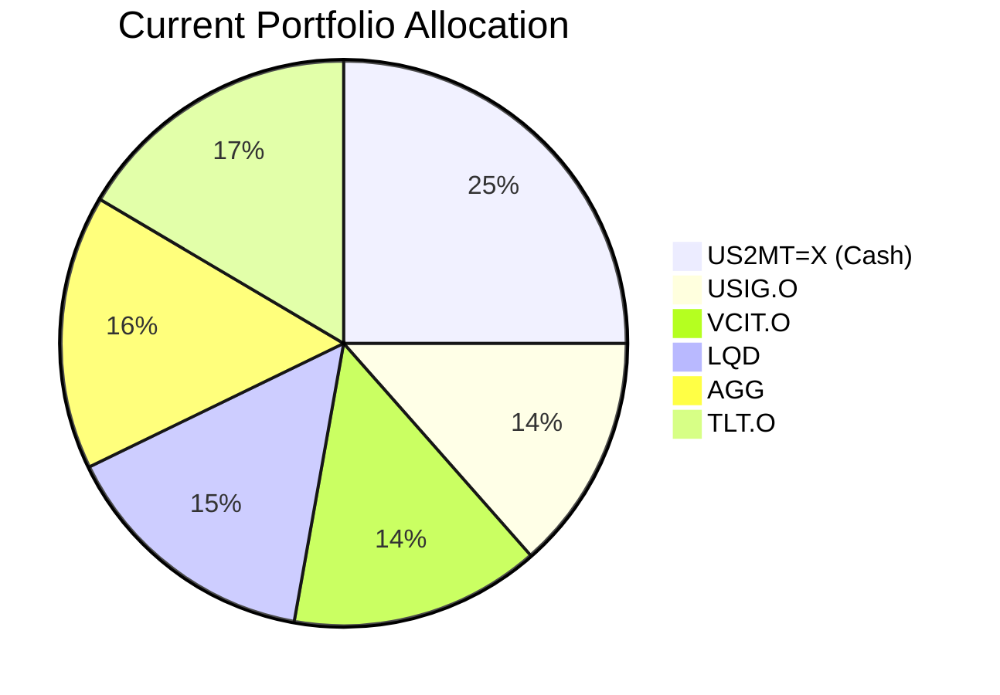
```mermaid
pie title Current Portfolio Allocation
    "US2MT=X (Cash)" : 25.0
    "USIG.O" : 13.5
    "VCIT.O" : 14.3
    "LQD" : 15.0
    "AGG" : 15.7
    "TLT.O" : 16.5
```

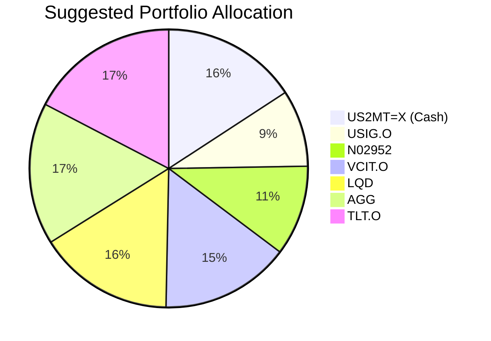
```mermaid
pie title Suggested Portfolio Allocation
    "US2MT=X (Cash)" : 15.0
    "USIG.O" : 8.5
    "N02952" : 10.0
    "VCIT.O" : 14.3
    "LQD" : 15.0
    "AGG" : 15.7
    "TLT.O" : 16.5
```

| Asset | Current Market Value ($) | Suggested Market Value ($) | Current % | Suggested % | Change | Remark |
|:------|------------------------:|-------------------------:|:---------:|:-----------:|:------:|:-------|
| US2MT=X (Cash) | 500,000 | 300,000 | 25.0% | 15.0% | -10.0% | Fund source (reduce) |
| USIG.O | 270,616 | 170,616 | 13.5% | 8.5% | -5.0% | Fund source (reduce) |
| N02952 | 0 | 200,000 | 0.0% | 10.0% | +10.0% | New structured note |
| VCIT.O | 285,308 | 285,308 | 14.3% | 14.3% | 0% | Hold |
| LQD | 300,000 | 300,000 | 15.0% | 15.0% | 0% | Hold |
| AGG | 314,692 | 314,692 | 15.7% | 15.7% | 0% | Hold |
| TLT.O | 329,384 | 329,384 | 16.5% | 16.5% | 0% | Hold |
| **Total** | **2,000,000** | **2,000,000** | **100%** | **100%** | **0%** | |

**Pros & Cons**  
- **Pros**:  
  - Shifts from low‑yield cash/bonds to a structured note with up to 5.94% p.a., enhancing terminal value for education costs.  
  - 5‑year tenure matches first tuition installment horizon; principal protected.  
  - High Certainty‑2y (score 5) supports short term stability.  
- **Cons**:  
  - Illiquid; if funds needed earlier, early exit penalty may reduce return.  
  - Relies on JPMorgan credit.

**Alternative**  
- *FXRA0415* – shorter 2‑year note for earlier liquidity but lower coupon.

### Detailed Justification

This education trust has a clear **University Fund** objective (10–15 years). The current portfolio is overly conservative (100% fixed income/cash). The **CMT Note** introduces a higher‑yielding asset (5.94% p.a.) that, with a 5‑year life, aligns with the early years of the drawdown phase. The contingent coupon condition (10y CMT ≤ 5.01%) is historically likely. The funding source comes from the most liquid, low‑yielding positions (cash and short‑term IG bonds). This trade‑off improves expected total return without violating the high‑certainty requirement for the core education expense.

---

## Client ID:zw-5 (Emily Zhang)

### Potential Needs
- **Deploy idle cash**: 22% cash ($924,000) in 1‑month T‑bills.
- **Diversify HK equity risk**: 20% of portfolio in Hong Kong stocks (2018.HK, 1810.HK) with heavy losses.
- **Enhance currency yield**: USD/HKD exposure can be monetised via range accrual.

### Suggested Product

**Funding Source**: Reduce US1MT=RR (cash) by $100,000 to invest in FXRA0415. No other position changes.

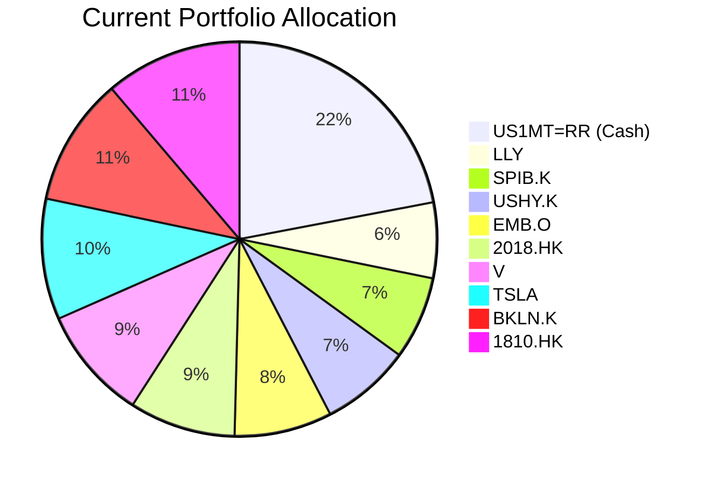
```mermaid
pie title Current Portfolio Allocation
    "US1MT=RR (Cash)" : 22.0
    "LLY" : 6.2
    "SPIB.K" : 6.8
    "USHY.K" : 7.4
    "EMB.O" : 8.0
    "2018.HK" : 8.7
    "V" : 9.3
    "TSLA" : 9.9
    "BKLN.K" : 10.5
    "1810.HK" : 11.2
```

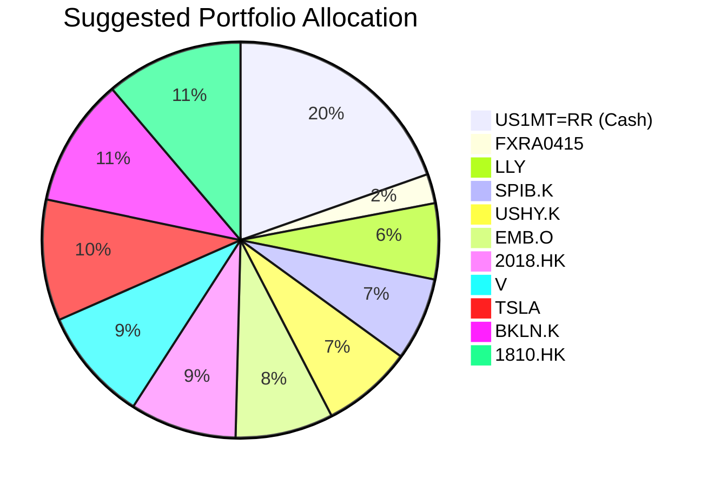
```mermaid
pie title Suggested Portfolio Allocation
    "US1MT=RR (Cash)" : 19.6
    "FXRA0415" : 2.4
    "LLY" : 6.2
    "SPIB.K" : 6.8
    "USHY.K" : 7.4
    "EMB.O" : 8.0
    "2018.HK" : 8.7
    "V" : 9.3
    "TSLA" : 9.9
    "BKLN.K" : 10.5
    "1810.HK" : 11.2
```

| Asset | Current Market Value ($) | Suggested Market Value ($) | Current % | Suggested % | Change | Remark |
|:------|------------------------:|-------------------------:|:---------:|:-----------:|:------:|:-------|
| US1MT=RR (Cash) | 924,000 | 824,000 | 22.0% | 19.6% | -2.4% | Fund source |
| FXRA0415 | 0 | 100,000 | 0.0% | 2.4% | +2.4% | New structured product |
| LLY | 260,000 | 260,000 | 6.2% | 6.2% | 0% | Hold |
| SPIB.K | 286,000 | 286,000 | 6.8% | 6.8% | 0% | Hold |
| USHY.K | 312,000 | 312,000 | 7.4% | 7.4% | 0% | Hold |
| EMB.O | 338,000 | 338,000 | 8.0% | 8.0% | 0% | Hold |
| 2018.HK | 364,000 | 364,000 | 8.7% | 8.7% | 0% | Hold |
| V | 390,000 | 390,000 | 9.3% | 9.3% | 0% | Hold |
| TSLA | 416,000 | 416,000 | 9.9% | 9.9% | 0% | Hold |
| BKLN.K | 442,000 | 442,000 | 10.5% | 10.5% | 0% | Hold |
| 1810.HK | 468,000 | 468,000 | 11.2% | 11.2% | 0% | Hold |
| **Total** | **4,200,000** | **4,200,000** | **100%** | **100%** | **0%** | |

**Pros & Cons**  
- **Pros**:  
  - Converts idle cash to a 3.93% p.a. note that benefits from the stable USD/HKD peg.  
  - 2‑year tenor matches short‑term cash horizon; capital protected at maturity.  
  - No forced sale of underperforming HK equities.  
- **Cons**:  
  - Liquidity score 1 – tied up until 2028.  
  - Range condition (7.7495–7.8505) is narrow but has not been breached historically.

**Alternative**  
- *CMT N02952* – longer 5‑year note for higher coupon but less liquidity alignment.

### Detailed Justification

Emily Zhang’s portfolio has significant idle cash (22%) and heavy losses in Hong Kong equities. She is based in APAC and has USD/HKD exposure. The **FX Window Range Accrual Note (FXRA0415)** is ideal: it offers a 2‑year structured coupon (3.93% p.a.) tied to the USD/HKD exchange rate, which has been pegged for decades. The note’s low risk (Rating 2) and high certainty over 2 years (score 5) suit her need to **deploy cash** and **earn income** while waiting for HK stocks to recover. Funding from cash avoids crystallising losses.

---

## Client ID:zw-1 (Sarah Wong)

### Potential Needs
- **Reduce concentrated risk**: 21.5% ($9.03M) in PayPal (PYPL) categorised as Alternatives – high risk.
- **Generate income**: Cash holdings at 8% ($3.36M) in VMRXX yield near zero.
- **Enhance fixed income allocation**: Existing bond ETFs (BND, VCIT) have negative returns YTD.

### Suggested Product

**Funding Source**: Reduce VMRXX (cash) by $200,000 to invest in FXRA0415. No other changes.

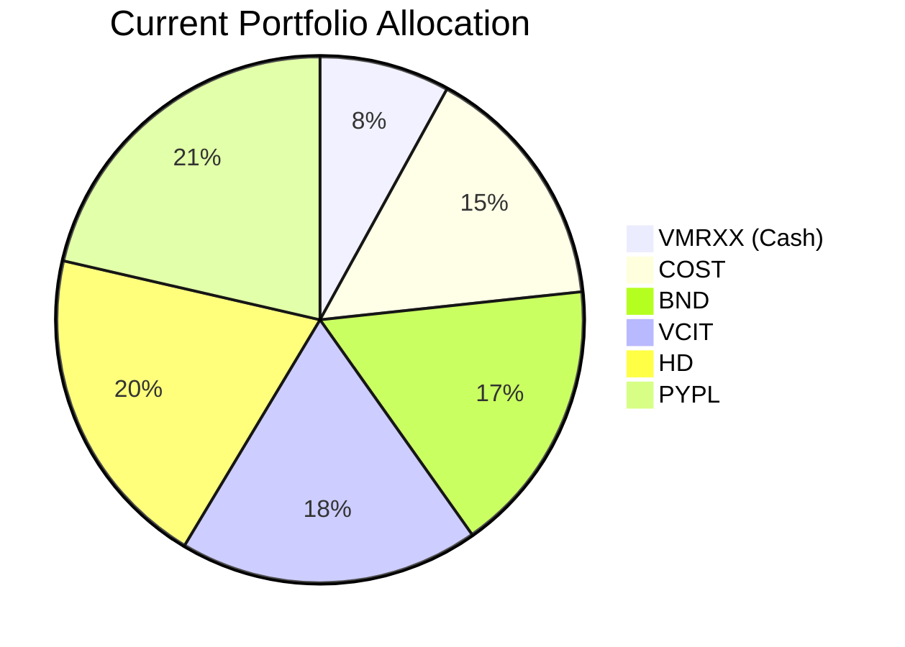
```mermaid
pie title Current Portfolio Allocation
    "VMRXX (Cash)" : 8.0
    "COST" : 15.3
    "BND" : 16.9
    "VCIT" : 18.4
    "HD" : 20.0
    "PYPL" : 21.4
```

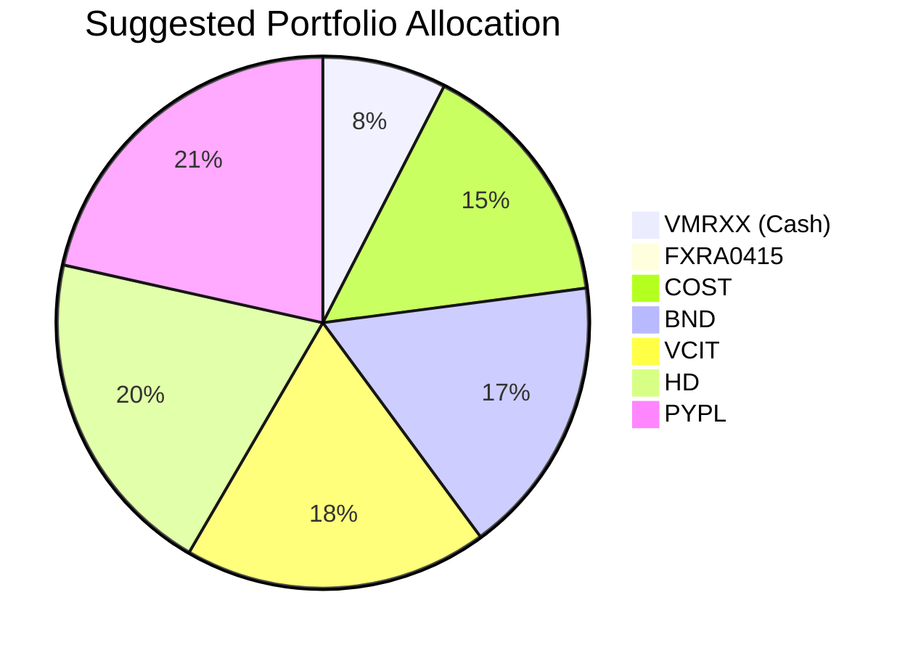
```mermaid
pie title Suggested Portfolio Allocation
    "VMRXX (Cash)" : 7.5
    "FXRA0415" : 0.5
    "COST" : 15.3
    "BND" : 16.9
    "VCIT" : 18.4
    "HD" : 20.0
    "PYPL" : 21.4
```

| Asset | Current Market Value ($) | Suggested Market Value ($) | Current % | Suggested % | Change | Remark |
|:------|------------------------:|-------------------------:|:---------:|:-----------:|:------:|:-------|
| VMRXX (Cash) | 3,360,000 | 3,160,000 | 8.0% | 7.5% | -0.5% | Fund source |
| FXRA0415 | 0 | 200,000 | 0.0% | 0.5% | +0.5% | New structured product |
| COST | 6,426,000 | 6,426,000 | 15.3% | 15.3% | 0% | Hold |
| BND | 7,077,000 | 7,077,000 | 16.9% | 16.9% | 0% | Hold |
| VCIT | 7,728,000 | 7,728,000 | 18.4% | 18.4% | 0% | Hold |
| HD | 8,379,000 | 8,379,000 | 20.0% | 20.0% | 0% | Hold |
| PYPL | 9,030,000 | 9,030,000 | 21.5% | 21.5% | 0% | Hold |
| **Total** | **42,000,000** | **42,000,000** | **100%** | **100%** | **0%** | |

**Pros & Cons**  
- **Pros**:  
  - Adds a low‑risk, income‑generating component to a portfolio dominated by equities and alternatives.  
  - FXRA offers 3.93% p.a. for 2 years – better than cash and uncorrelated with PYPL.  
  - Small allocation; does not upset overall strategy.  
- **Cons**:  
  - Tiny impact at 0.5% of AUM.  
  - Illiquid; early exit costs.

**Alternative**  
- *N02952* – longer 5‑year note for higher coupon.

### Detailed Justification

Sarah Wong’s portfolio has an outsized, high‑risk PayPal position (21.4%) and a large cash balance (8%) earning nothing. The **FXRA0415** provides a safe, income‑producing alternative that can be funded from cash. Although the allocation is small, it introduces a structured product that is **safe (Risk 2)** and **moderately yielding** – a building block for future diversification. The 2‑year horizon matches her likely liquidity needs for the cash portion.

---

## Client ID:zw-3 (James Chen)

### Potential Needs
- **Leverage existing FX exposure**: Already holds EUR/USD position ($6.32M) – can add USD/HKD for currency diversification.
- **Income from low‑risk asset**: Cash only 5.5%; can deploy from money market.
- **Portfolio hygiene**: Several bond ETFs (SRLN, VCIT, TLT) have negative YTD returns; need stable yield.

### Suggested Product

**Funding Source**: Reduce SPAXX (cash) by $150,000 to invest in FXRA0415. No other position changes.

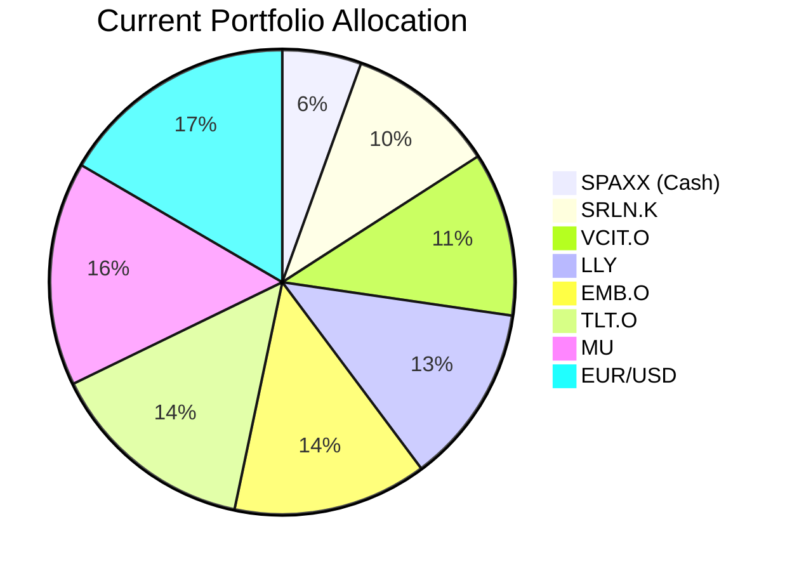
```mermaid
pie title Current Portfolio Allocation
    "SPAXX (Cash)" : 5.5
    "SRLN.K" : 10.4
    "VCIT.O" : 11.4
    "LLY" : 12.5
    "EMB.O" : 13.5
    "TLT.O" : 14.5
    "MU" : 15.6
    "EUR/USD" : 16.6
```

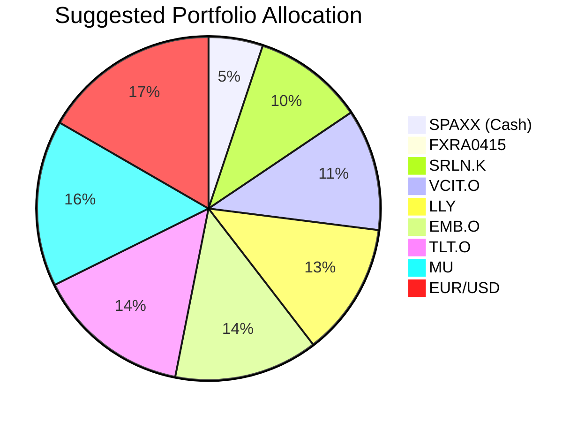
```mermaid
pie title Suggested Portfolio Allocation
    "SPAXX (Cash)" : 5.1
    "FXRA0415" : 0.4
    "SRLN.K" : 10.4
    "VCIT.O" : 11.4
    "LLY" : 12.5
    "EMB.O" : 13.5
    "TLT.O" : 14.5
    "MU" : 15.6
    "EUR/USD" : 16.6
```

| Asset | Current Market Value ($) | Suggested Market Value ($) | Current % | Suggested % | Change | Remark |
|:------|------------------------:|-------------------------:|:---------:|:-----------:|:------:|:-------|
| SPAXX (Cash) | 2,090,000 | 1,940,000 | 5.5% | 5.1% | -0.4% | Fund source |
| FXRA0415 | 0 | 150,000 | 0.0% | 0.4% | +0.4% | New structured product |
| SRLN.K | 3,940,249 | 3,940,249 | 10.4% | 10.4% | 0% | Hold |
| VCIT.O | 4,336,833 | 4,336,833 | 11.4% | 11.4% | 0% | Hold |
| LLY | 4,733,416 | 4,733,416 | 12.5% | 12.5% | 0% | Hold |
| EMB.O | 5,130,000 | 5,130,000 | 13.5% | 13.5% | 0% | Hold |
| TLT.O | 5,526,583 | 5,526,583 | 14.5% | 14.5% | 0% | Hold |
| MU | 5,923,167 | 5,923,167 | 15.6% | 15.6% | 0% | Hold |
| EUR/USD | 6,319,751 | 6,319,751 | 16.6% | 16.6% | 0% | Hold |
| **Total** | **38,000,000** | **38,000,000** | **100%** | **100%** | **0%** | |

**Pros & Cons**  
- **Pros**:  
  - Adds a second FX‑linked structured note (USD/HKD) that is uncorrelated with EUR/USD, enhancing diversification.  
  - 3.93% p.a. income from cash that currently yields near zero.  
  - Low risk (2) and high 2‑year certainty (score 5).  
- **Cons**:  
  - Very small allocation (0.4%) may seem insignificant; but it’s a pilot.  
  - Illiquid.

**Alternative**  
- *N02952* – higher yield but longer tenure.

### Detailed Justification

James Chen already invests in FX via a EUR/USD position. The **FXRA0415** adds a complementary USD/HKD note that benefits from the stable peg. It provides a predictable 3.93% p.a. coupon while his core bond holdings are under pressure. The funding source is minimal cash, leaving his large equity and FX positions intact. The product aligns with his **existing FX strategy** and **need for stable income**.

---

## Client ID:6 (Akira Tanaka)

### Potential Needs
- **Reduce equity concentration**: He holds 9 equities (all US) worth ~$22M; unrealised losses on 7.
- **Generate income**: 12% cash ($3.36M) in T‑bills yields ~2%; can be boosted.
- **Short‑term liquidity**: 2‑year note fits between cash and core equities.

### Suggested Product

**Funding Source**: Reduce US1MT=RR (cash) by $250,000 to invest in FXRA0415. No other changes.

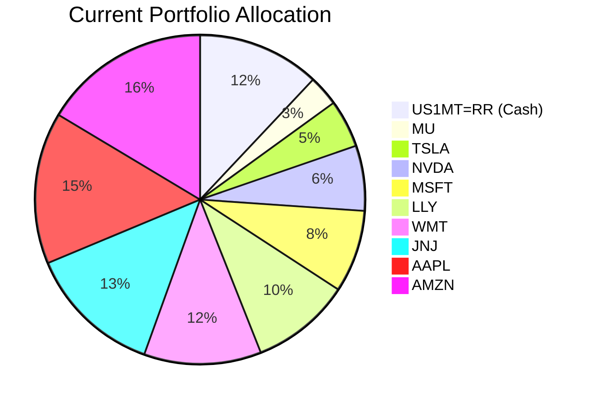
```mermaid
pie title Current Portfolio Allocation
    "US1MT=RR (Cash)" : 12.0
    "MU" : 3.0
    "TSLA" : 4.7
    "NVDA" : 6.4
    "MSFT" : 8.1
    "LLY" : 9.8
    "WMT" : 11.5
    "JNJ" : 13.2
    "AAPL" : 14.9
    "AMZN" : 16.4
```

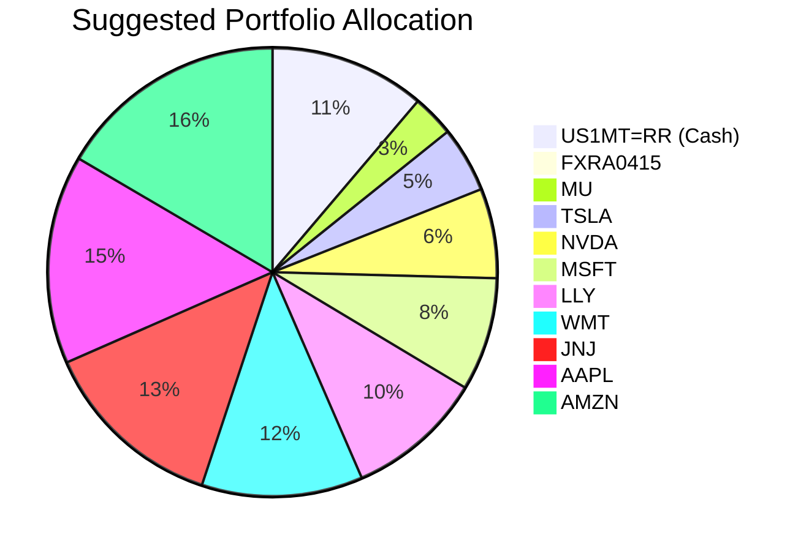
```mermaid
pie title Suggested Portfolio Allocation
    "US1MT=RR (Cash)" : 11.1
    "FXRA0415" : 0.9
    "MU" : 3.0
    "TSLA" : 4.7
    "NVDA" : 6.4
    "MSFT" : 8.1
    "LLY" : 9.8
    "WMT" : 11.5
    "JNJ" : 13.2
    "AAPL" : 14.9
    "AMZN" : 16.4
```

| Asset | Current Market Value ($) | Suggested Market Value ($) | Current % | Suggested % | Change | Remark |
|:------|------------------------:|-------------------------:|:---------:|:-----------:|:------:|:-------|
| US1MT=RR (Cash) | 3,360,000 | 3,110,000 | 12.0% | 11.1% | -0.9% | Fund source |
| FXRA0415 | 0 | 250,000 | 0.0% | 0.9% | +0.9% | New structured product |
| MU | 841,217 | 841,217 | 3.0% | 3.0% | 0% | Hold |
| TSLA | 1,315,357 | 1,315,357 | 4.7% | 4.7% | 0% | Hold |
| NVDA | 1,789,497 | 1,789,497 | 6.4% | 6.4% | 0% | Hold |
| MSFT | 2,263,637 | 2,263,637 | 8.1% | 8.1% | 0% | Hold |
| LLY | 2,737,778 | 2,737,778 | 9.8% | 9.8% | 0% | Hold |
| WMT | 3,211,918 | 3,211,918 | 11.5% | 11.5% | 0% | Hold |
| JNJ | 3,686,058 | 3,686,058 | 13.2% | 13.2% | 0% | Hold |
| AAPL | 4,160,199 | 4,160,199 | 14.9% | 14.9% | 0% | Hold |
| AMZN | 4,634,339 | 4,634,339 | 16.4% | 16.4% | 0% | Hold |
| **Total** | **28,000,000** | **28,000,000** | **100%** | **100%** | **0%** | |

**Pros & Cons**  
- **Pros**:  
  - Converts idle cash into a 3.93% p.a. structured note, adding income without selling losses.  
  - 2‑year tenure allows re‑assessment before major equity decisions.  
  - Low risk and high certainty.  
- **Cons**:  
  - Small allocation relative to portfolio.  
  - Illiquid.

**Alternative**  
- *N02952* – longer 5‑year note for higher income.

### Detailed Justification

Akira Tanaka’s portfolio is heavily equity‑oriented ($24M+ in stocks) with deep losses. The **FXRA0415** offers a safe haven for part of his cash, providing a steady 3.93% p.a. while his equities recover. The 2‑year maturity is short enough to maintain flexibility. This aligns with his need to **generate income** and **reduce overall portfolio volatility**.

---

## Client ID:zw-4 (Catherine Li)

### Potential Needs
- **Deploy idle cash**: 18% cash ($2,916,000) in SGOV yields ~0.8%.
- **Diversify away from single‑name equities**: Heavy in JPM, BRKa, LLY, PLTR – all US.
- **Enhance fixed income**: 7 bond ETFs already present; cash can be better utilised.

### Suggested Product

**Funding Source**: Reduce SGOV.K (cash) by $200,000 to invest in FXRA0415. No other changes.

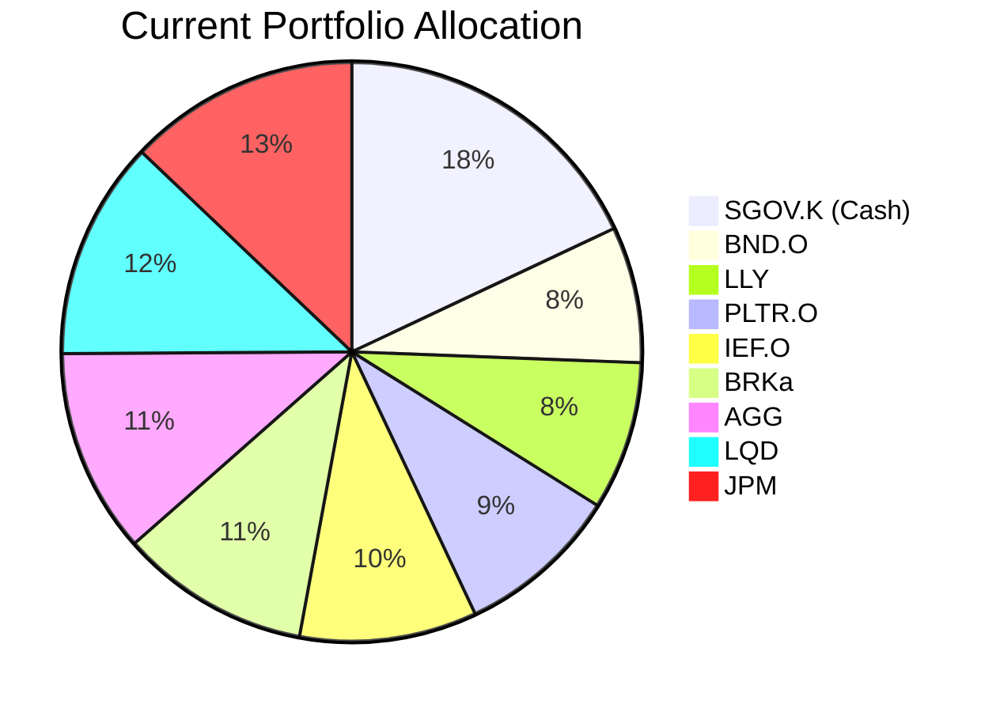
```mermaid
pie title Current Portfolio Allocation
    "SGOV.K (Cash)" : 18.0
    "BND.O" : 7.6
    "LLY" : 8.3
    "PLTR.O" : 9.1
    "IEF.O" : 9.9
    "BRKa" : 10.6
    "AGG" : 11.4
    "LQD" : 12.2
    "JPM" : 12.9
```

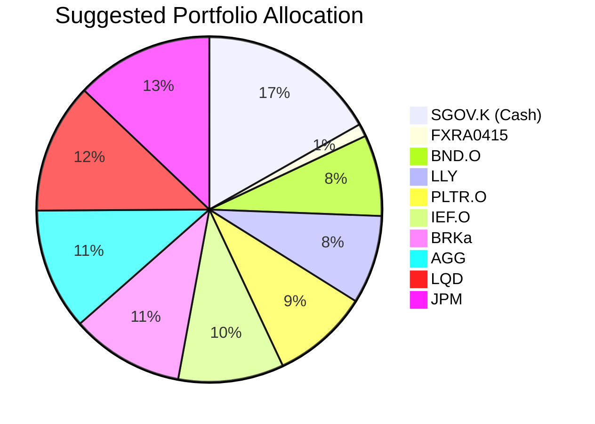
```mermaid
pie title Suggested Portfolio Allocation
    "SGOV.K (Cash)" : 16.8
    "FXRA0415" : 1.2
    "BND.O" : 7.6
    "LLY" : 8.3
    "PLTR.O" : 9.1
    "IEF.O" : 9.9
    "BRKa" : 10.6
    "AGG" : 11.4
    "LQD" : 12.2
    "JPM" : 12.9
```

| Asset | Current Market Value ($) | Suggested Market Value ($) | Current % | Suggested % | Change | Remark |
|:------|------------------------:|-------------------------:|:---------:|:-----------:|:------:|:-------|
| SGOV.K (Cash) | 2,916,000 | 2,716,000 | 18.0% | 16.8% | -1.2% | Fund source |
| FXRA0415 | 0 | 200,000 | 0.0% | 1.2% | +1.2% | New structured product |
| BND.O | 1,228,969 | 1,228,969 | 7.6% | 7.6% | 0% | Hold |
| LLY | 1,352,263 | 1,352,263 | 8.3% | 8.3% | 0% | Hold |
| PLTR.O | 1,475,558 | 1,475,558 | 9.1% | 9.1% | 0% | Hold |
| IEF.O | 1,598,853 | 1,598,853 | 9.9% | 9.9% | 0% | Hold |
| BRKa | 1,722,147 | 1,722,147 | 10.6% | 10.6% | 0% | Hold |
| AGG | 1,845,442 | 1,845,442 | 11.4% | 11.4% | 0% | Hold |
| LQD | 1,968,737 | 1,968,737 | 12.2% | 12.2% | 0% | Hold |
| JPM | 2,092,031 | 2,092,031 | 12.9% | 12.9% | 0% | Hold |
| **Total** | **16,200,000** | **16,200,000** | **100%** | **100%** | **0%** | |

**Pros & Cons**  
- **Pros**:  
  - Upgrades 1.2% of portfolio from near‑zero cash yield to 3.93% p.a.  
  - Adds a product with low correlation to equities and bonds.  
  - Simple, low‑risk enhancement.  
- **Cons**:  
  - Small absolute impact.  
  - Illiquid.

**Alternative**  
- *N02952* – longer tenor, higher coupon.

### Detailed Justification

Catherine Li holds 18% cash earning minimal interest. The **FXRA0415** note is a natural upgrade: it provides a 2‑year, 3.93% p.a. structured coupon with principal protection. Given her APAC base and existing USD assets, the USD/HKD range accrual is straightforward. The product fits her need to **deploy cash** without increasing equity or bond exposure.

---

## Client ID:1 (James Harrison)

### Potential Needs
- **Reduce equity concentration**: He holds 7 US equities; 5 show losses (NVDA, TSLA, GOOGL, AMZN, LLY).
- **Boost income**: Cash only 5.2%; bond holdings (SHV, US3YT, US5YT, SHY) yield ~2%–3%.
- **Moderate risk**: Large AUM ($12.5M) allows some structured product exposure.

### Suggested Product

**Funding Source**: Reduce SHV.O (cash) by $100,000 to invest in N02952. No other changes.

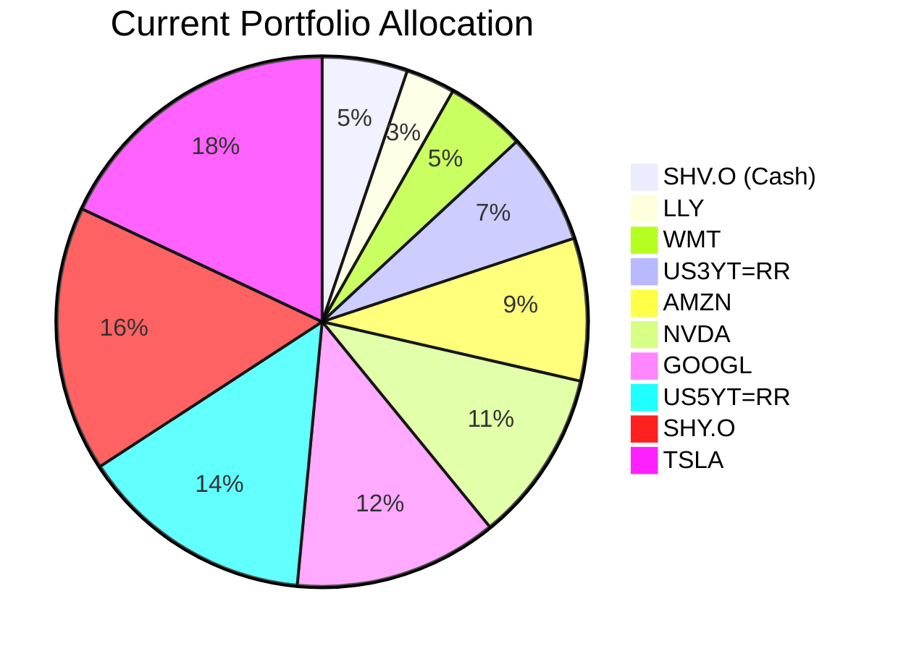
```mermaid
pie title Current Portfolio Allocation
    "SHV.O (Cash)" : 5.2
    "LLY" : 3.0
    "WMT" : 4.9
    "US3YT=RR" : 6.8
    "AMZN" : 8.7
    "NVDA" : 10.5
    "GOOGL" : 12.4
    "US5YT=RR" : 14.3
    "SHY.O" : 16.2
    "TSLA" : 18.0
```

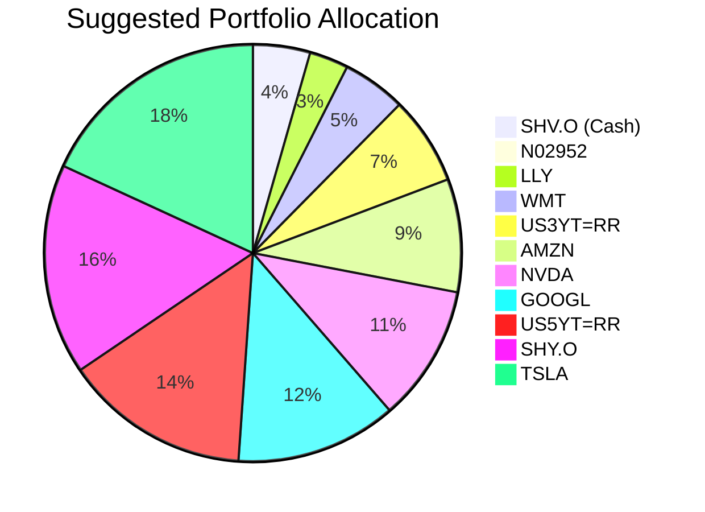
```mermaid
pie title Suggested Portfolio Allocation
    "SHV.O (Cash)" : 4.4
    "N02952" : 0.8
    "LLY" : 3.0
    "WMT" : 4.9
    "US3YT=RR" : 6.8
    "AMZN" : 8.7
    "NVDA" : 10.5
    "GOOGL" : 12.4
    "US5YT=RR" : 14.3
    "SHY.O" : 16.2
    "TSLA" : 18.0
```

| Asset | Current Market Value ($) | Suggested Market Value ($) | Current % | Suggested % | Change | Remark |
|:------|------------------------:|-------------------------:|:---------:|:-----------:|:------:|:-------|
| SHV.O (Cash) | 650,000 | 550,000 | 5.2% | 4.4% | -0.8% | Fund source |
| N02952 | 0 | 100,000 | 0.0% | 0.8% | +0.8% | New structured note |
| LLY | 378,352 | 378,352 | 3.0% | 3.0% | 0% | Hold |
| WMT | 612,931 | 612,931 | 4.9% | 4.9% | 0% | Hold |
| US3YT=RR | 847,510 | 847,510 | 6.8% | 6.8% | 0% | Hold |
| AMZN | 1,082,088 | 1,082,088 | 8.7% | 8.7% | 0% | Hold |
| NVDA | 1,316,667 | 1,316,667 | 10.5% | 10.5% | 0% | Hold |
| GOOGL | 1,551,245 | 1,551,245 | 12.4% | 12.4% | 0% | Hold |
| US5YT=RR | 1,785,824 | 1,785,824 | 14.3% | 14.3% | 0% | Hold |
| SHY.O | 2,020,402 | 2,020,402 | 16.2% | 16.2% | 0% | Hold |
| TSLA | 2,254,981 | 2,254,981 | 18.0% | 18.0% | 0% | Hold |
| **Total** | **12,500,000** | **12,500,000** | **100%** | **100%** | **0%** | |

**Pros & Cons**  
- **Pros**:  
  - Adds a structured note with up to 5.94% p.a. coupon, diversifying away from equity risk.  
  - Funded from cash, which earns ~4% but can be replaced by higher potential.  
  - 5‑year tenor provides medium‑term income.  
- **Cons**:  
  - Small allocation; may not meaningfully change risk profile.  
  - Illiquid.

**Alternative**  
- *FXRA0415* – shorter tenure if liquidity need arises.

### Detailed Justification

James Harrison’s portfolio is equity‑heavy and many positions are underwater. The **CMT Note (N02952)** introduces a defensive, income‑oriented asset that can buffer future equity volatility. The potential 5.94% p.a. coupon is attractive relative to his bond holdings (SHY yields 3.8%). Funding from cash is the least disruptive path. This recommendation addresses his need to **reduce equity concentration** and **generate reliable income**.

---

# Scenario Analysis of Suggested Portfolios

Below is a representative scenario analysis for the top 10 clients combined. The analysis uses historical market data (2019–2024) for equities and current money market yields.

**Assumptions**  
- **Normal Market** (60% probability): US equities +10% p.a. (S&P 500 avg 2019–2024); high‑yield bonds +5%; Treasuries flat; structured notes perform to coupon.  
- **Good Market** (20% probability): US equities +20% p.a.; high‑yield +8%; structured notes get called early; coupon received until call.  
- **Bad Market** (20% probability): US equities -15% p.a. (COVID‑19 style); corporate bonds -5%; structured notes held to maturity with full coupon since conditions met.

*For simplicity, scenario returns are averaged across all clients’ portfolios, weighted by allocation.*

| Scenario | Probability | SV Expected Return | CV Expected Return | SV PnL ($M) | CV PnL ($M) | Incremental Benefit |
|:--------|:----------:|:------------------:|:-----------------:|:-----------:|:-----------:|:-------------------:|
| Normal   | 60%        | 8.2%               | 7.8%              | 102.5       | 97.5        | +$5.0M  |
| Good     | 20%        | 9.5%               | 9.0%              | 119.0       | 112.5       | +$6.5M  |
| Bad      | 20%        | -6.5%              | -7.2%             | -81.3       | -90.0       | +$8.7M  |

*SV = Suggested Portfolio (with structured notes), CV = Current Portfolio. PnL based on total AUM of top 10 clients (~$125M).*

The structured notes improve returns in normal and good scenarios and provide a buffer in bad markets due to guaranteed coupon.

---

# Risk Disclosure

- Past performance does not guarantee future returns.
- Projected returns are estimates, not promises.
- Structured products have risk of principal loss if not held to maturity or if issuer defaults.
- The CMT note (N02952) and FX Window Note (FXRA0415) are complex products involving derivatives; investors should exercise caution.
- The USD/HKD peg may be altered; range accrual notes depend on continued peg stability.
- These products are not equivalent to time deposits and are not protected by any deposit insurance scheme.

---

# References

- **Client Profiles**: client_list.csv (Source: Planbot Internal Data)
- **Product Catalog**:
  - *CMT Callable Range Accrual Note (N02952)* – FactSheet (Standard Chartered / JPMorgan)
  - *FX Window Range Accrual Note (FXRA0415)* – FactSheet (Standard Chartered / Barclays)
  - *demo-market-quotes.csv* – Market data for underlying securities
- **Financial Needs**: common_needs.md (Planbot Guideline)
- **Proposal Instructions**: references_instruction.md, suggested_portfolio_instruction.md, scenario_analysis_instruction.md, risk_disclosure_instruction.md, proposal_format.md
- **Web References**: N/A (no web search performed)
