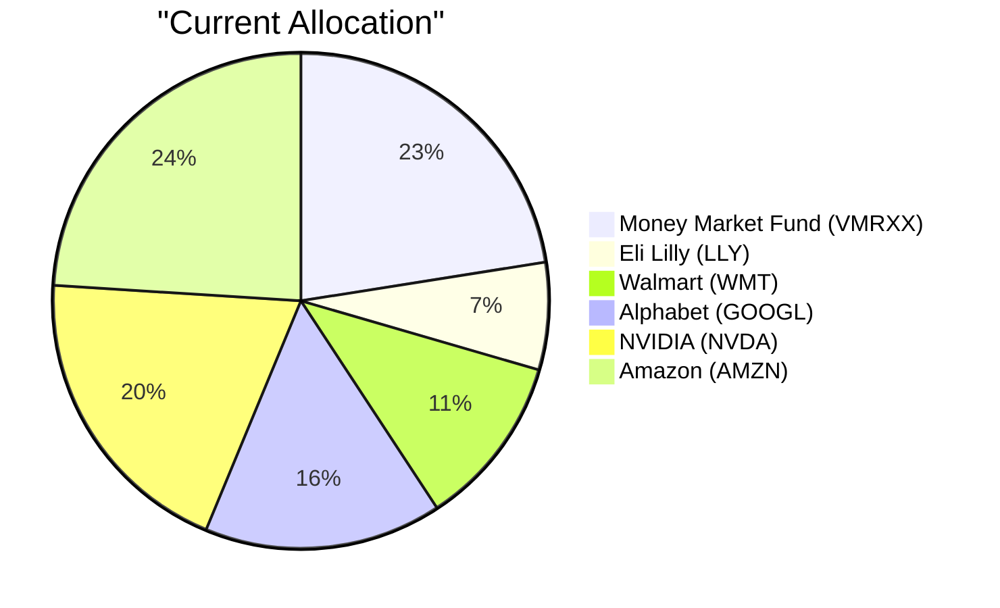
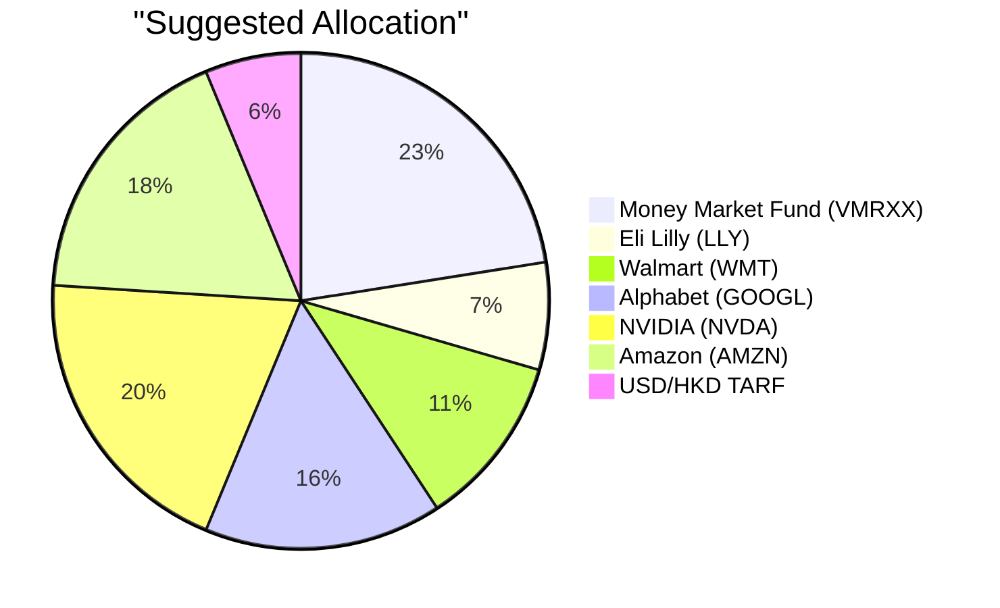

# Product Investor Matching

## Executive Summary

This report matches Sarah Chen (PB-HK-000002-6) to the investable product that best fits her risk profile, RM notes, financial needs, and the current market outlook, using the per-client Product Fitness Scores as the quantitative baseline.

| Client ID (Name) | Buying Score | Suggested Product & Position | Funding Source | Fitness Score | Expected Return – Suggested | Expected Return – Source | Key Rationale |
|---:|---:|---|---:|---:|---:|---|---|
| PB-HK-000002-6 (Sarah Chen) | 4 | FX-TARF-USDHKD-1Y-B – 1-Year USD/HKD Target Redemption Forward (Buying USD) – USD 200,000 | Sell STOCK-AMZN (Amazon.com, Inc.) – USD 200,000 | 5.87 | ~2.0% target return cap (no historical 5Y CAGR; structured product) | 6.47% (5Y CAGR) | RM note explicitly flags recurring USD/HKD settlement needs and openness to an FX TARF; client has Risk Rating 5 and high risk appetite; the switch trims a 24% single-stock AMZN position; the 4.47pp expected-return gap versus AMZN is within the 5pp threshold; cash remains 22.5% of the portfolio. |

## Top Clients with Detail Analysis

### PB-HK-000002-6 (Sarah Chen)

- **Investor Readiness:** Rank 1/1, Total Score 26.5/40. Concentration (10.0) and Life Stage (10.0) are the primary urgency drivers; Cash Drag (3.5) and Active Management (3.0) are moderate. This supports a **Buying Score of 4/5** — the client is highly likely to act, but product unfamiliarity and the 2x gearing warrant a clearly explained proposal.
- **Financial Need:** The client’s stated objective is regular income, but the RM note indicates a more immediate priority: recurring USD/HKD settlement needs and interest in alternative investments. The 1-Year USD/HKD TARF addresses this by accumulating USD daily at a strike below spot.
- **Key Factors:** Risk Rating 5 matches the client’s maximum risk appetite; the client is comfortable with concentrated equity and alternative positions; no immediate liquidity needs support a 1-year structure.
- **Market Outlook Support:** BANK Wise Q3 2026 sees the USD supported by rate-hike expectations while US equity valuations remain above long-term averages with elevated rotation risk. This supports reallocating a portion of single-stock Amazon exposure into a USD-accumulation structure.

**Product Fitness Score = 5.87 out of 10.** This is driven by very strong **Risk Match (10.0)** and **RM Note Similarity (10.0)**, moderate **Like (7.3)**, and weak **Diversification (0.0)**, **Experience (0.0)**, **Better Product (0.0)**, and **Holding Similarity (1.4)**. **Risk Match** is at the maximum because the product’s Risk Rating of 5 exactly equals the client’s risk rating, and the RM note confirms the client is comfortable with high-volatility, alternative-style positions. **RM Note Similarity** is at the maximum because the RM note states the client “has recurring USD/HKD settlement needs and is open to an FX TARF that accumulates USD against HKD at a strike below spot.” **Like (7.3)** reflects the client’s stated interest in alternative investments, which this structured product represents. **Comfort (5.0)** is neutral because no dislikes were recorded for this client, so the semantic-dislike signal is not meaningful. The weakest components are **Diversification (0.0)**, because this single currency-pair leveraged structure adds concentration rather than reducing it, and **Experience (0.0)**, because the client holds no existing FX TARF or structured derivative. **Better Product (0.0)** reflects that the capped ~2.0% target return does not outperform the 5Y CAGR of existing holdings, and **Holding Similarity (1.4)** confirms the client has nothing similar today. Overall, the product is a **conditional fit**: it strongly matches the RM-noted FX need and high risk appetite, but the zero diversification score means it should be positioned as a modest tactical allocation, not a core holding.

#### Product Summary

| Attribute | Value |
|---|---|
| Product ID | FX-TARF-USDHKD-1Y-B |
| Product Name | 1-Year USD/HKD Target Redemption Forward (Buying USD) |
| Product Type | Structured Product (FX TARF) |
| Asset Class | Foreign Exchange |
| Region | N/A (USD/HKD) |
| Sector | FX |
| Risk Rating | 5 |
| Expected Return (5Y CAGR) | N/A (target return cap ~2.0%; HKD 300,000) |
| Expense Ratio | N/A |
| Time to Maturity | 1 year |
| Coupon | N/A |
| Investment Note | USD/HKD TARF (buy, 1-year) suits investors with a longer USD funding horizon, accumulating USD at a deeper discount than the 6-month structure while a 2-month guaranteed period shields the early fixings. |

#### Performance Metrics Comparison

| Metric | FX-TARF-USDHKD-1Y-B | STOCK-AMZN |
|---|---|---|
| 1Y Return | Data unavailable | 12.47% |
| 3Y CAGR | Data unavailable | 23.88% |
| 5Y CAGR | Data unavailable | 6.47% |
| Max Drawdown | Data unavailable | -54.83% |
| Calmar Ratio | Data unavailable | 0.12 |

The TARF is a structured derivative with no historical performance series; its economics are defined by the strike discount (7.829), 2x gearing, and the HKD 300,000 target cap, so historical performance comparison is not available.

#### Risk Characteristics

The product carries Risk Rating 5, which matches the client’s maximum risk appetite and therefore does not increase the portfolio’s headline risk class. The key risks are structural: 2x notional applies if USD/HKD fixes below the strike of 7.829 after the first two months, the payout is capped at HKD 300,000, and the structure has no principal protection. Compared with selling Amazon, this swap removes equity and business risk but introduces leveraged FX and structured-product risk; the risk class is similar, but the risk profile is fundamentally different.

#### Alternative Suggestion

Two alternatives from the scored product catalog are considered; full details are provided under **Alternative Products to Consider** below.

- **FX-TARF-USDHKD-6M-B (Fitness 5.59)** — preferred if the client wants a shorter 6-month commitment and an earlier knockout before a possible Fed policy shift.
- **FX-TARF-AUDUSD-4M-S (Fitness 4.93)** — preferred if the client has AUD inflows or wants to diversify the FX exposure away from USD/HKD; less aligned with the RM note’s USD/HKD focus.

## Suggested Portfolio Allocation

### Current vs. Suggested Allocation

| Asset | Current Value (USD) | Suggested Value (USD) | Current % | Suggested % | Change % | Remark |
|---|---:|---:|---:|---:|---:|---|
| ETF-VMRXX — Vanguard Treasury Money Market Fund | 720,000 | 720,000 | 22.50% | 22.50% | 0.00% | No change; liquidity buffer remains above 5%. |
| STOCK-LLY — Eli Lilly and Company | 223,858 | 223,858 | 7.00% | 7.00% | 0.00% | No change. |
| STOCK-WMT — Walmart Inc. | 359,929 | 359,929 | 11.25% | 11.25% | 0.00% | No change. |
| STOCK-GOOGL — Alphabet Inc. | 496,000 | 496,000 | 15.50% | 15.50% | 0.00% | No change. |
| STOCK-NVDA — NVIDIA Corporation | 632,071 | 632,071 | 19.75% | 19.75% | 0.00% | No change. |
| STOCK-AMZN — Amazon.com, Inc. | 768,142 | 568,142 | 24.00% | 17.75% | -6.25% | Sold USD 200,000 to fund the TARF; reduces single-stock Amazon concentration. |
| FX-TARF-USDHKD-1Y-B — 1-Year USD/HKD TARF | 0 | 200,000 | 0% | 6.25% | +6.25% | New tactical USD/HKD accumulation structure aligned with RM note and strong-USD outlook. |
| **Total** | **3,200,000** | **3,200,000** | **100%** | **100%** | **0%** | |

### Advantages and Risks of the Suggested Investment

#### Advantages

- Directly addresses the RM note: the client has recurring USD/HKD settlement needs and is “open to an FX TARF that accumulates USD against HKD at a strike below spot, provided the 2x gearing risk is clearly explained.”
- Matches the client’s maximum Risk Rating (5) and stated comfort with alternative, concentrated, and high-volatility investments.
- Reduces single-stock Amazon concentration from 24.0% to 17.75%, trimming a US mega-cap equity overweight at a time when BANK Wise flags above-average valuations and rotation risk.
- Supported by the market outlook: BANK Wise Q3 2026 sees USD supported by rate-hike expectations, making USD accumulation at a strike below spot strategically sensible.
- The portfolio retains 22.5% in money market/cash equivalents, comfortably exceeding the 5% liquidity rule.

#### Risk

- The client gives up expected return: the TARF’s ~2.0% target cap compares with Amazon’s 6.47% 5Y CAGR, a 4.47pp gap on the switched USD 200,000.
- The 2x gearing introduces leveraged FX risk: if USD/HKD fixes below 7.829 after the two-month guaranteed period, the notional obligation doubles and losses can exceed the target profit.
- The product adds concentration rather than reducing it — the Fitness Score’s Diversification component is 0.0 — and it is a new, unfamiliar product type for this client (Experience = 0.0).

### Alternative Products to Consider

#### Alternative 1: FX-TARF-USDHKD-6M-B

| Attribute | Value |
|---|---|
| Product ID | FX-TARF-USDHKD-6M-B |
| Product Name | 6-Month USD/HKD Target Redemption Forward (Buying USD) |
| Product Type | Structured Product (FX TARF) |
| Asset Class | Foreign Exchange |
| Region | N/A (USD/HKD) |
| Sector | FX |
| Risk Rating | 5 |
| Expected Return (5Y CAGR) | N/A (target return cap ~1.0%; HKD 150,000) |
| Expense Ratio | N/A |
| Time to Maturity | 6 months |
| Coupon | N/A |
| Investment Note | USD/HKD TARF (buy) gives investors who need USD over time the chance to accumulate USD daily at a strike lower than spot; it knocks out once the target profit is reached, but 2x notional applies if spot falls below the strike. |

This alternative would be preferred when the client wants a shorter 6-month commitment and an earlier knockout before a potential Fed policy shift.

- Talking points: same USD/HKD accumulation logic as the primary; first-month guaranteed period (20 fixings) protects the early daily fixings; smaller HKD 150,000 target cap is consistent with a shorter horizon.
- Trade-off: the client sacrifices the deeper 1-year strike discount and the 2-month guaranteed period of the primary recommendation.

#### Alternative 2: FX-TARF-AUDUSD-4M-S

| Attribute | Value |
|---|---|
| Product ID | FX-TARF-AUDUSD-4M-S |
| Product Name | 4-Month AUD/USD Target Redemption Forward (Selling AUD) |
| Product Type | Structured Product (FX TARF) |
| Asset Class | Foreign Exchange |
| Region | N/A (AUD/USD) |
| Sector | FX |
| Risk Rating | 5 |
| Expected Return (5Y CAGR) | N/A (target gain USD 15,000 / 150 pips) |
| Expense Ratio | N/A |
| Time to Maturity | 4 months |
| Coupon | N/A |
| Investment Note | AUD/USD TARF (sell) gives investors who hold AUD and need USD the chance to sell AUD at an enhanced strike above spot, accruing gain while spot stays below the strike; 2x notional applies if spot rises above the strike. |

This alternative would be preferred when the client holds AUD or wants to diversify the FX-hedging exposure away from USD/HKD.

- Talking points: sells AUD at 0.7225, 58 pips above spot; monthly fixings with a 1-month guaranteed period; useful if the client generates AUD income or has AUD liabilities.
- Trade-off: it is less aligned with the RM note’s stated USD/HKD settlement need, and its Fitness Score is lower primarily because the RM Note Similarity is weaker — the RM note is specifically about USD/HKD, not AUD/USD.

## References

- Client Profile: api://client_profile (Planbot Internal Data)
- Product Catalog: api://product_catalog (Planbot Internal Data)
- Market Outlook: bank_research_1.md, bank_research_2.md, bank_research_3.md, bank_wise.md (Planbot Internal Data)
- Proposal Guidelines: proposal_format.md, product_summary_instruction.md, reference_instruction.md, suggested_portfolio_instruction.md (Planbot Internal Data)
- Web References: N/A (data sourced from internal repositories)
