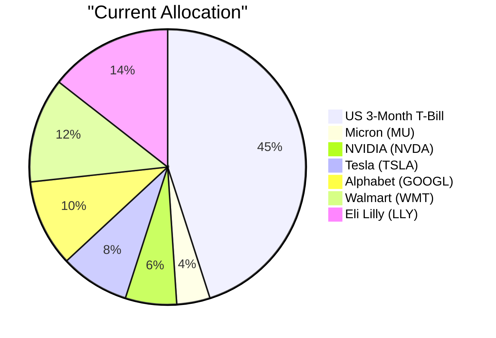
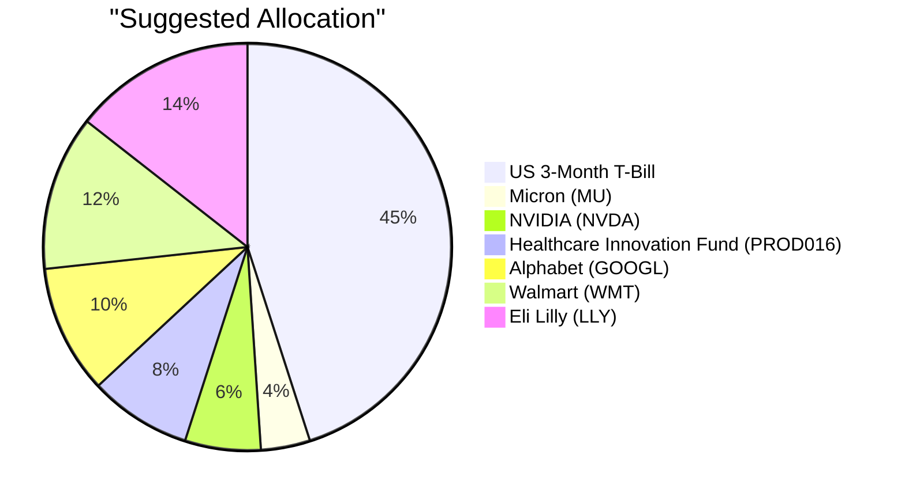

# Client Product-Fit Analysis: David Kim (PB-HK-000001-8)

---

## Executive Summary

David Kim should buy USD 77,048 of the PROD016 Healthcare Innovation Fund, representing approximately 8.1% of AUM, funded by selling USD 77,048 of STOCK-TSLA Tesla Inc. The trade replaces a high-volatility single-stock position with a diversified healthcare-growth fund that better matches his 4/5 risk tolerance and long-term capital-growth objective with controlled drawdown. It also supports the near-term university-funding priority without reducing the portfolio’s 45% cash liquidity buffer. The expected result is a more resilient, better-diversified portfolio with comparable upside participation and materially lower single-name drawdown risk.

---

## Recommended Product: Healthcare Innovation Fund (PROD016)

### Product Specifications

| Attribute | Value |
|---|---|
| Product ID | PROD016 |
| Product Name | Healthcare Innovation Fund |
| Product Type | Equity Fund (Mutual Fund) |
| Asset Class | Equities |
| Region | N/A |
| Sector | Healthcare |
| Risk Rating | 4 |
| Expected Return (5Y CAGR) | 13.8% |
| Expense Ratio | 1.7% (TER 0.017) |
| Time to Maturity | N/A — open-ended fund |
| Coupon | N/A |
| Investment Note | Equity exposure suits investors with a medium-to-long-term horizon. Diversify across regions and factors to manage concentration risk in an uncertain macro environment. Expected return ~13.8%. |

### Performance Metrics

| Metric | PROD016 | STOCK-TSLA |
|---|---|---|
| 1Y Return | Data unavailable | 24.94% |
| 3Y CAGR | Data unavailable | 15.98% |
| 5Y CAGR | Data unavailable | 14.36% |
| Max Drawdown | Data unavailable | -72.25% |
| Calmar Ratio | Data unavailable | 0.20 |

Historical performance data for PROD016 is not provided in the product catalog; only its 13.8% expected return is available, so the comparison is limited to the funding source.

### Risk Characteristics

PROD016 carries a 4/5 risk rating, consistent with David Kim’s stated 4/5 risk tolerance and implying moderate-to-high volatility but within an actively managed, diversified vehicle rather than single-name equity risk. Key risk factors include healthcare-sector concentration, partial overlap with the existing Eli Lilly (LLY) position, fund-management execution risk, and the lower liquidity of an OTC mutual fund. Relative to STOCK-TSLA, which has a 5/5 risk rating and a -72.25% historical maximum drawdown, PROD016 is expected to exhibit lower drawdown and more controlled volatility while retaining a comparable expected return of 13.8%.

### Detailed Justification

PROD016 directly addresses David Kim’s stated needs for long-term capital growth with controlled drawdown, a medium liquidity buffer, and education funding for two university-age children. With a 13.8% expected return and a 4/5 risk rating, the fund offers growth intensity aligned with his objective while avoiding the uncontrolled drawdown profile of a single 5/5-rated stock. Replacing Tesla reduces single-stock concentration from 8.11% to 0% and removes a position with a -72.25% historical maximum drawdown, consistent with the client’s stated preference for controlled drawdown.

The fitness score of 4.20 is the highest available for this client. The risk-match component of 10.0 reflects perfect alignment between PROD016’s 4/5 rating and the client’s 4/5 tolerance, whereas Tesla’s 5/5 rating overshoots the stated risk envelope. The diversification component of 0.0 signals that this fund does not add broad asset-class diversification — it remains an equity product and increases healthcare-sector overlap with existing LLY holdings; nonetheless, it diversifies away the idiosyncratic single-stock TSLA risk. The experience component of 6.0 reflects moderate client familiarity with packaged fund vehicles, and the better-product component of 0.0 acknowledges the small expected-return give-up versus Tesla’s 5Y CAGR (13.8% vs. 14.36%), a deliberate trade for reduced tail risk.

Funding the purchase from STOCK-TSLA is appropriate because Tesla is the portfolio’s highest-risk single-stock name, pays no dividend, and has historically suffered a -72.25% maximum drawdown; selling it removes the largest single-name drawdown source while leaving the 45% cash buffer intact. The current market outlook favors selective structural equity exposure over broad beta, and healthcare innovation offers pricing power and defensive growth in a “higher-for-longer” environment where single-stock momentum is less reliable. No tax or cost-basis data is available to quantify capital-gains implications, but the trade is size-neutral and keeps the portfolio fully invested.

---

## Suggested Portfolio

### Portfolio Allocation (Pie Charts)

### Current vs. Suggested Allocation

| Asset | Current Value (USD) | Suggested Value (USD) | Current % | Suggested % | Change % | Remark |
|---|---:|---:|---:|---:|---:|---|
| us3mt-rr — US 3-Month Treasury Bill | 427,500 | 427,500 | 45.00% | 45.00% | 0.00% | No change |
| STOCK-MU — Micron Technology | 36,905 | 36,905 | 3.88% | 3.88% | 0.00% | No change |
| STOCK-NVDA — NVIDIA | 56,976 | 56,976 | 6.00% | 6.00% | 0.00% | No change |
| STOCK-TSLA — Tesla | 77,048 | 0 | 8.11% | 0.00% | -8.11% | Sold to fund PROD016 purchase |
| STOCK-GOOGL — Alphabet | 97,119 | 97,119 | 10.22% | 10.22% | 0.00% | No change |
| STOCK-WMT — Walmart | 117,190 | 117,190 | 12.34% | 12.34% | 0.00% | No change |
| STOCK-LLY — Eli Lilly | 137,261 | 137,261 | 14.45% | 14.45% | 0.00% | No change |
| PROD016 — Healthcare Innovation Fund | 0 | 77,048 | 0.00% | 8.11% | +8.11% | New diversified healthcare-growth allocation |
| **Total** | **949,999** | **949,999** | **100.00%** | **100.00%** | **0.00%** |  |

### Pros and Cons of the Suggested Trade

#### Pros

- Reduces single-stock TSLA concentration from 8.11% to 0%, materially lowering single-name drawdown risk (TSLA historical max drawdown: -72.25%).
- Aligns with the client’s university-funding milestone by providing diversified healthcare-growth exposure with an expected return of ~13.8%.
- Maintains a large 45% cash buffer for liquidity and emergency needs while keeping the portfolio fully invested in equities.
- Adds an actively managed healthcare fund with a 4/5 risk rating, closer to the client’s 4/5 risk profile than Tesla’s 5/5 rating.
- Improves downside resilience versus single-stock TSLA while preserving meaningful upside participation.

#### Cons

- Gives up a small portion of expected return: STOCK-TSLA 5Y CAGR is 14.36% versus PROD016’s 13.8%.
- Adds healthcare-sector tilt that partially overlaps with the existing Eli Lilly (LLY) holding.
- PROD016 is an OTC mutual fund and may be less liquid than a directly traded large-cap stock; the TSLA sale may also trigger a taxable event, though cost-basis data is not available.

### Alternative Products to Consider

- **PROD001 Tech Leaders Equity Fund:** Preferred if the client wants to retain tech-cyclical upside; the trade-off is increased overlap with existing NVDA/GOOGL positions.
- **ETF-VOO Vanguard S&P 500 ETF:** Preferred if maximum broad-market diversification and lower-cost core equity exposure are the priority; the trade-off is a lower fitness score and less targeted healthcare/innovation exposure.

---

## Scenario Analysis

### Normal Market Condition

Markets perform in line with long-term historical averages: global equities deliver roughly 8–10%, healthcare-innovation equities deliver close to their expected return, and cash remains stable. This baseline is based on the S&P 500 average annual return over 2019–2024, using a conservative 9% for broad listed equities. Probability: 50%.

| Asset | Assumed Return % | Suggested Holding (USD) | Suggested P&L (USD) | Current Holding (USD) | Current P&L (USD) |
|---|---:|---:|---:|---:|---:|
| Money Market / Cash | 2.5% | 427,500 | 10,687.50 | 427,500 | 10,687.50 |
| Listed Equities (ex-TSLA / PROD016) | 9.0% | 445,451 | 40,090.59 | 445,451 | 40,090.59 |
| Tesla (TSLA) | 14.36% | 0 | 0.00 | 77,048 | 11,064.09 |
| Healthcare Innovation Fund (PROD016) | 13.8% | 77,048 | 10,632.62 | 0 | 0.00 |
| **Total** | — | **949,999** | **61,410.71** | **949,999** | **61,842.18** |

- Annual return of suggested portfolio vs. current: 6.46% vs. 6.51%
- Incremental benefit: -USD 431.47 (-0.05pp)

### Upside Market Condition

Markets significantly outperform, supported by strong AI-related capex, resilient earnings, and a post-COVID-recovery-like rally. Broad listed equities are assumed to return 18%, high-beta Tesla returns 30%, and the healthcare-innovation fund returns 20%. Probability: 25%.

| Asset | Assumed Return % | Suggested Holding (USD) | Suggested P&L (USD) | Current Holding (USD) | Current P&L (USD) |
|---|---:|---:|---:|---:|---:|
| Money Market / Cash | 2.5% | 427,500 | 10,687.50 | 427,500 | 10,687.50 |
| Listed Equities (ex-TSLA / PROD016) | 18.0% | 445,451 | 80,181.18 | 445,451 | 80,181.18 |
| Tesla (TSLA) | 30.0% | 0 | 0.00 | 77,048 | 23,114.40 |
| Healthcare Innovation Fund (PROD016) | 20.0% | 77,048 | 15,409.60 | 0 | 0.00 |
| **Total** | — | **949,999** | **106,278.28** | **949,999** | **113,983.08** |

- Annual return of suggested portfolio vs. current: 11.19% vs. 12.00%
- Incremental benefit: -USD 7,704.80 (-0.81pp)

### Downside Market Condition

Markets significantly underperform amid sticky inflation, higher-for-longer central bank policy, or geopolitical shocks, similar to the 2022 rate-hike selloff. Broad listed equities are assumed to return -20%, Tesla falls 40%, and the diversified healthcare-innovation fund falls only 12% as defensive growth. Cash benefits from a modest flight to quality. Probability: 25%.

| Asset | Assumed Return % | Suggested Holding (USD) | Suggested P&L (USD) | Current Holding (USD) | Current P&L (USD) |
|---|---:|---:|---:|---:|---:|
| Money Market / Cash | 1.5% | 427,500 | 6,412.50 | 427,500 | 6,412.50 |
| Listed Equities (ex-TSLA / PROD016) | -20.0% | 445,451 | -89,090.20 | 445,451 | -89,090.20 |
| Tesla (TSLA) | -40.0% | 0 | 0.00 | 77,048 | -30,819.20 |
| Healthcare Innovation Fund (PROD016) | -12.0% | 77,048 | -9,245.76 | 0 | 0.00 |
| **Total** | — | **949,999** | **-91,923.46** | **949,999** | **-113,496.90** |

- Annual return of suggested portfolio vs. current: -9.68% vs. -11.95%
- Incremental benefit: +USD 21,573.44 (+2.27pp improvement)

### Scenario Summary

| Scenario | Probability | Suggested Return | Current Return | Incremental Benefit |
|---|---|---|---|---|
| Normal | 50% | 6.46% | 6.51% | -USD 431 |
| Upside | 25% | 11.19% | 12.00% | -USD 7,705 |
| Downside | 25% | -9.68% | -11.95% | +USD 21,573 |

The probability-weighted expected incremental benefit is approximately +USD 3,251, reflecting meaningful downside protection that more than offsets the small expected-return give-up in normal and upside scenarios.

---

## Risk Disclosure

- Past performance does not guarantee future returns.
- Projected returns are estimates, not promises.
- Structured products have risk of principal loss.

---

## References

- Client Profile: PB-HK-000001-8 (David Kim), AUM USD 950,000
- Product Catalog: PROD016 Healthcare Innovation Fund; STOCK-TSLA Tesla Inc.
- Market Outlook: 24-Month Global Asset Allocation Outlook (2026–2028)
- Suggested Products and Rationale: PB-HK-000001-8

---

---** PROPOSAL_JSON **---
{
  "client_id": "PB-HK-000001-8",
  "product_id": "PROD016",
  "recommended_action": "buy",
  "amount_usd": 77048,
  "pct_of_aum": 8.11,
  "funding_source_product_id": "STOCK-TSLA",
  "fitness_score": 4.20,
  "fitness_components": {
    "risk_match": 10.0,
    "concentration": 0.0,
    "experience": 6.0,
    "better_product": 0.0
  },
  "scenario_returns": {
    "upside": {
      "suggested_pct": 11.19,
      "current_pct": 12.00,
      "probability_pct": 25
    },
    "normal": {
      "suggested_pct": 6.46,
      "current_pct": 6.51,
      "probability_pct": 50
    },
    "downside": {
      "suggested_pct": -9.68,
      "current_pct": -11.95,
      "probability_pct": 25
    }
  }
}
---** END_PROPOSAL_JSON **---
