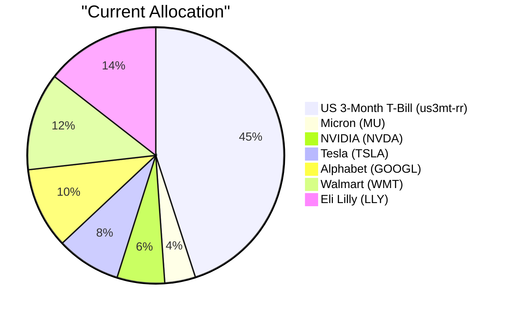
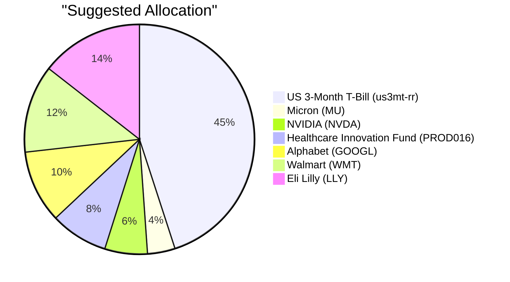

# Client Product-Fit Analysis: David Kim (PB-HK-000001-8)

---

## Executive Summary

Buy $77,048 of PROD016 Healthcare Innovation Fund, representing 8.1% of David Kim’s $950,000 AUM, funded by the full sale of STOCK-TSLA. The trade replaces a high-volatility single-stock Tesla position with a diversified healthcare innovation fund that matches David’s 4/5 risk profile and supports his stated objective of long-term capital growth with controlled drawdown. Because the transaction is an equity-for-equity swap, it preserves the 45% cash buffer required for his 12-month emergency reserve while reducing single-stock concentration. The expected outcome is a materially lower drawdown profile at a modest expected-return cost of roughly 0.56pp, better aligning the portfolio with controlled growth and the children’s upcoming university-funding needs.

---

## Recommended Product: Healthcare Innovation Fund (PROD016)

### Product Specifications

| Attribute | Value |
|---|---|
| Product ID | PROD016 |
| Product Name | Healthcare Innovation Fund |
| Product Type | Equity Fund |
| Asset Class | Equities |
| Region | N/A (not specified) |
| Sector | Healthcare |
| Risk Rating | 4 / 5 |
| Expected Return (5Y CAGR) | 13.8% (expected return; historical 5Y CAGR not published) |
| Expense Ratio | 1.7% |
| Time to Maturity | N/A (open-ended mutual fund) |
| Coupon | N/A (annual distributions) |
| Investment Note | Equity exposure suits investors with a medium-to-long-term horizon. Diversify across regions and factors to manage concentration risk in an uncertain macro environment. Expected return ~13.8%. |

### Performance Metrics

| Metric | PROD016 | STOCK-TSLA |
|---|---:|---:|
| 1Y Return | Data unavailable | 24.94% |
| 3Y CAGR | Data unavailable | 15.98% |
| 5Y CAGR | Data unavailable | 14.36% |
| Max Drawdown | Data unavailable | −72.25% |
| Calmar Ratio | Data unavailable | 0.20 |

PROD016 has no published performance history in the product catalog, so the comparison relies on Tesla’s historical figures and PROD016’s expected return of 13.8%.

### Risk Characteristics

PROD016 carries a 4/5 risk rating—one notch below Tesla—so replacing Tesla with the fund should reduce overall portfolio volatility while retaining meaningful equity upside. Key risk factors include healthcare-sector concentration, regulatory and drug-pricing pressure, clinical-trial outcomes, and the fund’s OTC mutual-fund structure with a 1.7% management fee; because it is a single-sector thematic fund, it does not eliminate sector risk. Relative to the funding source (STOCK-TSLA, risk 5/5 with a historical max drawdown of −72.25%), PROD016 offers materially lower single-stock and idiosyncratic drawdown risk, though it remains exposed to broad market and healthcare-specific drawdowns.

### Detailed Justification

David’s stated investment objective is long-term capital growth with controlled drawdown, and his medium liquidity need requires preserving a 12-month emergency buffer. PROD016 addresses the growth objective through healthcare innovation exposure, which benefits from structural demand and pricing power, while addressing the drawdown objective by replacing a risk-5 single stock with a professionally managed risk-4 equity fund. The trade also keeps the 45% cash/T-bill buffer intact, which is critical given his two children approaching university age and his concern about inflation eroding idle cash.

The overall fitness score of 4.20/10 is driven by a perfect risk match of 10.0, reflecting the alignment between David’s 4/5 risk profile and the fund’s 4/5 rating. The concentration component is 0.0 because, although the fund removes an 8.1% single-stock Tesla position, it adds a healthcare-sector tilt that overlaps with the existing Eli Lilly holding, increasing healthcare sector concentration. The experience score of 6.0 indicates only moderate familiarity with an OTC mutual-fund vehicle, and the better-product score of 0.0 reflects that PROD016’s 13.8% expected return is slightly below Tesla’s 5Y CAGR of 14.36%; this is a deliberate risk-reduction trade rather than a return-uplift trade.

Funding the purchase from the full sale of STOCK-TSLA is appropriate because Tesla is the highest-risk single-stock position in the portfolio (risk 5/5), pays no dividend, and has a −72.25% historical maximum drawdown. The opportunity cost is small: David gives up roughly 0.56pp of expected historical return in exchange for a diversified healthcare portfolio managed by professionals. Direct disposal of Tesla may crystallize a capital gain, though no cost-basis data is available to quantify the tax impact; the transaction does not reduce cash or liquidity. In the current market environment—characterized by “higher-for-longer” rates, sticky inflation, and selective risk-on positioning—rotating out of a high-beta auto name into a defensive-growth healthcare fund is a prudent way to keep equity exposure while reducing single-stock and sector-volatility risk.

---

## Suggested Portfolio

### Portfolio Allocation (Pie Charts)

### Current vs. Suggested Allocation

| Asset | Current Value (USD) | Suggested Value (USD) | Current % | Suggested % | Change % | Remark |
|---|---:|---:|---:|---:|---:|---|
| us3mt-rr — US 3-Month Treasury Bill Rate | 427,500 | 427,500 | 45.00% | 45.00% | 0.00% | No change. |
| STOCK-MU — Micron Technology Inc. | 36,905 | 36,905 | 3.88% | 3.88% | 0.00% | No change. |
| STOCK-NVDA — NVIDIA Corporation | 56,976 | 56,976 | 6.00% | 6.00% | 0.00% | No change. |
| STOCK-TSLA — Tesla, Inc. | 77,048 | 0 | 8.11% | 0.00% | −8.11% | Sold to fund PROD016 purchase. |
| STOCK-GOOGL — Alphabet Inc. Class A | 97,119 | 97,119 | 10.22% | 10.22% | 0.00% | No change. |
| STOCK-WMT — Walmart Inc. | 117,190 | 117,190 | 12.34% | 12.34% | 0.00% | No change. |
| STOCK-LLY — Eli Lilly and Company | 137,261 | 137,261 | 14.45% | 14.45% | 0.00% | No change. |
| PROD016 — Healthcare Innovation Fund | 0 | 77,048 | 0.00% | 8.11% | +8.11% | New healthcare fund allocation funded by the TSLA sale. |
| **Total** | **950,000** | **950,000** | **100.00%** | **100.00%** | **0.00%** | |

### Pros and Cons of the Suggested Trade

**Pros**

- The trade aligns with David’s stated goal of long-term capital growth with controlled drawdown by replacing a risk-5 single stock with a risk-4 diversified healthcare fund.
- It reduces single-stock concentration, cutting Tesla exposure from 8.1% of the portfolio to 0% and removing a position with a −72.25% historical max drawdown.
- It preserves the 45% cash/T-bill buffer, satisfying the medium liquidity need and the 12-month emergency reserve requirement.
- It adds professional healthcare-sector management, reducing reliance on the portfolio’s heavy technology and semiconductor single-stock positions.
- It improves the portfolio’s drawdown profile at only a modest expected-return cost of approximately 0.56pp versus Tesla’s 5Y CAGR.

**Cons**

- The client gives up Tesla’s upside potential in a strong EV/AI rally, since PROD016’s expected return of 13.8% is slightly below Tesla’s 5Y CAGR of 14.36%.
- The fund adds a healthcare sector tilt that overlaps with the existing Eli Lilly holding, increasing healthcare concentration to roughly 22.5% of the portfolio.
- Selling Tesla may crystallize a taxable capital gain, and the OTC mutual fund introduces a 1.7% management fee plus fund-specific liquidity and redemption terms.

### Alternative Products to Consider

- **PROD001 Tech Leaders Equity Fund** — Preferred if David wants to retain technology upside rather than moving into healthcare; the trade-off is that it would do less to reduce the portfolio’s existing technology and semiconductor concentration.
- **ETF-VOO (S&P 500 ETF)** — Preferred if he wants the broadest, most liquid US equity core with no single-sector bet; the trade-off is lower sector-specific healthcare upside and less differentiation from the current large-cap US equity holdings.

---

## Scenario Analysis

### Normal Market Condition

In a baseline scenario, global growth is near trend, inflation remains sticky but contained, and equities deliver close to their long-term historical averages. The reference period used is the S&P 500 average annual return over 2019–2024. Probability: 50%.

| Asset | Assumed Return % | Suggested Holding (USD) | Suggested P&L (USD) | Current Holding (USD) | Current P&L (USD) |
|---|---:|---:|---:|---:|---:|
| Cash / Money Market | 2.5 | 427,500 | 10,687.50 | 427,500 | 10,687.50 |
| Core Equities (MU, NVDA, GOOGL, WMT, LLY) | 9.0 | 445,451 | 40,090.59 | 445,451 | 40,090.59 |
| PROD016 — Healthcare Innovation Fund | 9.0 | 77,048 | 6,934.32 | 0 | 0 |
| Tesla (STOCK-TSLA) | 9.0 | 0 | 0 | 77,048 | 6,934.32 |
| **Total** | — | **950,000** | **57,712.41** | **950,000** | **57,712.41** |

Annual return of suggested portfolio vs. current: 6.07% vs. 6.07%. Incremental benefit: +USD 0.00 (+0.00% improvement).

### Upside Market Condition

In a bullish scenario, markets significantly outperform as AI-driven capex accelerates, energy price pressures fade, and risk appetite strengthens — similar to the 2020–2021 post-COVID recovery rally. Probability: 25%.

| Asset | Assumed Return % | Suggested Holding (USD) | Suggested P&L (USD) | Current Holding (USD) | Current P&L (USD) |
|---|---:|---:|---:|---:|---:|
| Cash / Money Market | 2.5 | 427,500 | 10,687.50 | 427,500 | 10,687.50 |
| Core Equities (MU, NVDA, GOOGL, WMT, LLY) | 18.0 | 445,451 | 80,181.18 | 445,451 | 80,181.18 |
| PROD016 — Healthcare Innovation Fund | 15.0 | 77,048 | 11,557.20 | 0 | 0 |
| Tesla (STOCK-TSLA) | 20.0 | 0 | 0 | 77,048 | 15,409.60 |
| **Total** | — | **950,000** | **102,425.88** | **950,000** | **106,278.28** |

Annual return of suggested portfolio vs. current: 10.78% vs. 11.19%. Incremental benefit: −USD 3,852.40 (−3.62% relative to the current portfolio).

### Downside Market Condition

In a bearish scenario, markets sell off sharply because of persistent inflation, “higher-for-longer” central-bank policy, and geopolitical/energy shocks such as the Strait of Hormuz disruption — comparable to the 2022 rate-hike selloff. Probability: 25%.

| Asset | Assumed Return % | Suggested Holding (USD) | Suggested P&L (USD) | Current Holding (USD) | Current P&L (USD) |
|---|---:|---:|---:|---:|---:|
| Cash / Money Market | 1.5 | 427,500 | 6,412.50 | 427,500 | 6,412.50 |
| Core Equities (MU, NVDA, GOOGL, WMT, LLY) | −20.0 | 445,451 | −89,090.20 | 445,451 | −89,090.20 |
| PROD016 — Healthcare Innovation Fund | −15.0 | 77,048 | −11,557.20 | 0 | 0 |
| Tesla (STOCK-TSLA) | −25.0 | 0 | 0 | 77,048 | −19,262.00 |
| **Total** | — | **950,000** | **−94,234.90** | **950,000** | **−101,939.70** |

Annual return of suggested portfolio vs. current: −9.92% vs. −10.73%. Incremental benefit: +USD 7,704.80 (+7.56% relative improvement).

### Scenario Summary

| Scenario | Probability | Suggested Return | Current Return | Incremental Benefit |
|---|---:|---:|---:|---:|
| Normal | 50% | 6.07% | 6.07% | +USD 0.00 |
| Upside | 25% | 10.78% | 11.19% | −USD 3,852.40 |
| Downside | 25% | −9.92% | −10.73% | +USD 7,704.80 |

The probability-weighted expected incremental benefit is approximately +USD 963 per year, driven primarily by the downside-protection benefit of replacing Tesla with the less-volatile healthcare fund.

---

## Risk Disclosure

- Past performance does not guarantee future returns.
- Projected returns are estimates, not promises.
- Structured products have risk of principal loss.

---

## References

- Client Profile: PB-HK-000001-8 David Kim (AUM $950,000; risk rating 4/5)
- Product Catalog: PROD016 Healthcare Innovation Fund and client holdings
- Market Outlook: 2026–2028 global asset allocation views and two-week macro update
- Matcher Analysis: Suggested Products and Rationale for PB-HK-000001-8

---

## Machine-Readable Proposal Data

---** PROPOSAL_JSON **---
{
  "client_id": "PB-HK-000001-8",
  "product_id": "PROD016",
  "recommended_action": "buy",
  "amount_usd": 77048,
  "pct_of_aum": 8.11,
  "funding_source_product_id": "STOCK-TSLA",
  "fitness_score": 4.20,
  "fitness_components": {
    "risk_match": 10.0,
    "concentration": 0.0,
    "experience": 6.0,
    "better_product": 0.0
  },
  "scenario_returns": {
    "upside": {
      "suggested_pct": 10.78,
      "current_pct": 11.19,
      "probability_pct": 25
    },
    "normal": {
      "suggested_pct": 6.07,
      "current_pct": 6.07,
      "probability_pct": 50
    },
    "downside": {
      "suggested_pct": -9.92,
      "current_pct": -10.73,
      "probability_pct": 25
    }
  }
}
---** END_PROPOSAL_JSON **---
