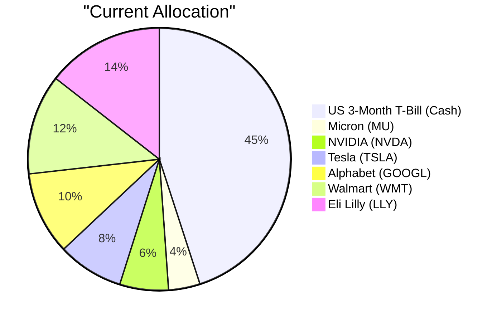
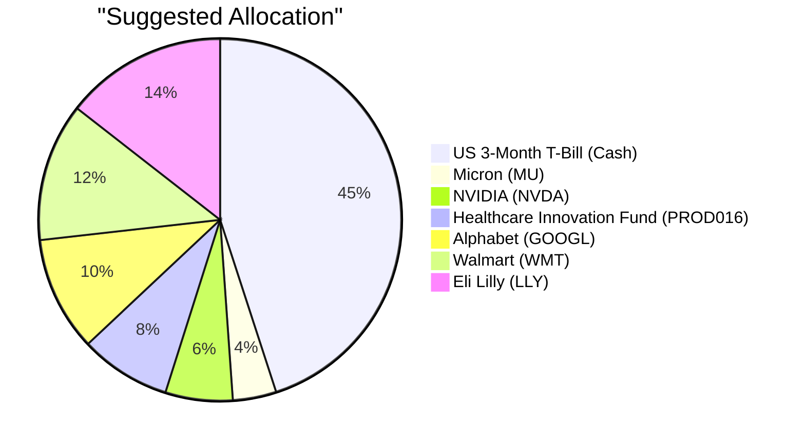

# Client Product-Fit Analysis: David Kim (PB-HK-000001-8)

---

## Executive Summary

Buy PROD016 Healthcare Innovation Fund for USD 77,048, representing 8.1% of AUM, funded by selling STOCK-TSLA Tesla Inc. for the same amount. This trade replaces an undiversified, high-volatility single stock with a diversified healthcare innovation fund that matches David Kim’s risk rating 4 and supports his stated objective of long-term capital growth with controlled drawdown. It also preserves the 45% cash buffer that already satisfies his 12-month emergency liquidity need. The expected outcome is reduced drawdown risk and improved risk-adjusted returns, with only a modest 2.18pp expected-return give-up versus TSLA.

---

## Recommended Product: Healthcare Innovation Fund (PROD016)

### Product Specifications

| Attribute | Value |
|---|---|
| Product ID | PROD016 |
| Product Name | Healthcare Innovation Fund |
| Product Type | Equity Fund |
| Asset Class | Equities |
| Region | N/A |
| Sector | Healthcare |
| Risk Rating | 4 |
| Expected Return (5Y CAGR) | 13.8% |
| Expense Ratio | 1.7% |
| Time to Maturity | N/A |
| Coupon | N/A |
| Investment Note | Equity exposure suits investors with a medium-to-long-term horizon. Diversify across regions and factors to manage concentration risk in an uncertain macro environment. Expected return ~13.8%. |

### Performance Metrics

| Metric | PROD016 | STOCK-TSLA |
|---|---|---|
| 1Y Return | Data unavailable | 24.94% |
| 3Y CAGR | Data unavailable | 15.98% |
| 5Y CAGR | Data unavailable | 14.36% |
| Max Drawdown | Data unavailable | −72.25% |
| Calmar Ratio | Data unavailable | 0.20 |

Historical performance for PROD016 is not available in the product catalog; the fund’s 13.8% expected return is a forward-looking estimate rather than a back-tested return.

### Risk Characteristics

PROD016 carries a risk rating of 4, implying moderate-to-high volatility that is consistent with David’s own risk tolerance and portfolio objective. Key risk factors include healthcare sector concentration, regulatory and drug-pricing policy risk, clinical-trial outcomes, and active fund-management risk. Compared with the funding-source product, STOCK-TSLA — a risk-rating-5 single stock with historical volatility around 57% and a maximum drawdown of −72% — PROD016 is expected to offer lower idiosyncratic volatility and a shallower drawdown profile, though it retains general equity-market beta.

### Detailed Justification

PROD016 directly addresses David’s stated needs of long-term capital growth with controlled drawdown. With two children approaching university age, a diversified healthcare innovation fund provides a medium-to-long-horizon growth engine while dampening the tail risk of a single-stock position. The existing 45% cash allocation already covers the 12-month emergency buffer, so the trade improves the equity sleeve’s risk efficiency rather than adding further liquidity.

The overall fitness score is 3.00, with Risk Match 10.0, Concentration 0.0, Experience 0.0, and Better Product 0.0. Risk Match is excellent because PROD016’s risk rating exactly matches David’s risk rating of 4. Concentration is the key weakness: adding a healthcare fund increases sector concentration from roughly 14.4% LLY-only to about 22.5% LLY + PROD016, so the benefit is fund-level diversification rather than asset-class diversification. Experience is low because David has not previously held this fund family, and Better Product is neutral-to-low because PROD016’s 13.8% expected return is below TSLA’s 15.98%; this is therefore a risk-efficiency trade, not a return-maximization trade.

Selling TSLA is justified because it is the least efficient holding in the equity sleeve: risk rating 5, extreme volatility, a historical max drawdown of −72%, no dividend, and heavy overlap with the existing AI/semiconductor exposure in NVDA and MU. The opportunity cost is only 2.18pp of expected return, which is a reasonable price for removing single-stock event risk. Market context supports the rotation: the institutional outlook favors selective risk-on with structural tilts, and healthcare innovation — driven by aging demographics, GLP-1 therapies, and AI-enabled drug discovery — is a more sustainable long-horizon theme than EV/auto momentum, which faces pricing pressure and tariff-related uncertainty.

---

## Suggested Portfolio

### Portfolio Allocation (Pie Charts)

### Current vs. Suggested Allocation

| Asset | Current Value (USD) | Suggested Value (USD) | Current % | Suggested % | Change % | Remark |
|---|---|---|---:|---:|---:|---|
| US 3-Month T-Bill (us3mt-rr) | 427,500.00 | 427,500.00 | 45.00% | 45.00% | 0.00% | No change |
| Micron Technology (STOCK-MU) | 36,905.00 | 36,905.00 | 3.88% | 3.88% | 0.00% | No change |
| NVIDIA (STOCK-NVDA) | 56,976.00 | 56,976.00 | 6.00% | 6.00% | 0.00% | No change |
| Tesla (STOCK-TSLA) | 77,048.00 | 0.00 | 8.11% | 0.00% | −8.11% | Sold to fund PROD016 purchase |
| Alphabet (STOCK-GOOGL) | 97,119.00 | 97,119.00 | 10.22% | 10.22% | 0.00% | No change |
| Walmart (STOCK-WMT) | 117,190.00 | 117,190.00 | 12.34% | 12.34% | 0.00% | No change |
| Eli Lilly (STOCK-LLY) | 137,261.00 | 137,261.00 | 14.45% | 14.45% | 0.00% | No change |
| Healthcare Innovation Fund (PROD016) | 0.00 | 77,048.00 | 0.00% | 8.11% | +8.11% | New healthcare sector allocation |
| **Total** | **950,000.00** | **950,000.00** | **100.00%** | **100.00%** | **0.00%** | |

### Pros and Cons of the Suggested Trade

#### Pros
- Replaces a single high-volatility EV stock with a diversified healthcare innovation fund, directly supporting David’s “controlled drawdown” objective.
- Eliminates 8.1% single-stock TSLA exposure, reducing idiosyncratic risk and overlap with the existing AI/semiconductor positions.
- Adds exposure to structural healthcare tailwinds such as aging demographics, GLP-1 therapies, and AI-enabled drug discovery.
- Improves downside resilience relative to TSLA’s historical maximum drawdown of −72%.
- Preserves the 45% cash buffer, so David’s 12-month emergency liquidity need remains fully covered.

#### Cons
- Gives up TSLA’s upside optionality; PROD016’s 13.8% expected return is 2.18pp below TSLA’s 15.98%.
- Increases healthcare sector concentration: LLY + PROD016 rises to roughly 22.5% of AUM, adding regulatory, pricing, and clinical-trial risk.
- Selling TSLA may trigger capital gains taxes, and the new fund carries a 1.7% management fee; exact transaction costs are not disclosed in the available data.

### Alternative Products to Consider

- **PROD001 Tech Leaders Equity Fund** — Preferred if David wants to stay in the technology/AI theme while diversifying away from a single stock; the trade-off is that it retains a tech-sector tilt that overlaps with his existing NVDA, MU, and GOOGL holdings.
- **ETF-VOO (S&P 500 ETF)** — Preferred if he wants broad U.S. market exposure with lower single-name and sector concentration; the trade-off is a lower fitness score and less targeted healthcare innovation upside than PROD016.

---

## Scenario Analysis

### Normal Market Condition

A baseline scenario in which markets perform in line with long-term historical averages. Probability: 50%. Return assumptions use the 2019–2024 S&P 500 average annual return for global equities (8–10%), with money market/cash at 2–3%.

| Asset | Assumed Return % | Suggested Holding (USD) | Suggested P&L (USD) | Current Holding (USD) | Current P&L (USD) |
|---|---|---:|---:|---:|---:|
| US 3-Month T-Bill (us3mt-rr) | 2.5% | 427,500.00 | 10,687.50 | 427,500.00 | 10,687.50 |
| Micron Technology (STOCK-MU) | 10.0% | 36,905.00 | 3,690.50 | 36,905.00 | 3,690.50 |
| NVIDIA (STOCK-NVDA) | 9.0% | 56,976.00 | 5,127.84 | 56,976.00 | 5,127.84 |
| Healthcare Innovation Fund (PROD016) | 9.0% | 77,048.00 | 6,934.32 | 0.00 | 0.00 |
| Tesla (STOCK-TSLA) | 8.0% | 0.00 | 0.00 | 77,048.00 | 6,163.84 |
| Alphabet (STOCK-GOOGL) | 9.0% | 97,119.00 | 8,740.71 | 97,119.00 | 8,740.71 |
| Walmart (STOCK-WMT) | 8.0% | 117,190.00 | 9,375.20 | 117,190.00 | 9,375.20 |
| Eli Lilly (STOCK-LLY) | 10.0% | 137,261.00 | 13,726.10 | 137,261.00 | 13,726.10 |
| **Total** | — | **950,000.00** | **58,282.17** | **950,000.00** | **57,511.69** |

- Annual return of suggested portfolio vs. current: 6.13% vs. 6.05%
- Incremental benefit: +USD 770.48 (+1.3% improvement)

### Upside Market Condition

A bullish scenario in which markets significantly outperform, consistent with the 2020–2021 post-COVID recovery rally. Probability: 25%. Return assumptions: global equities 15–20%, fixed income 5–7%, and money market/cash 2–3%.

| Asset | Assumed Return % | Suggested Holding (USD) | Suggested P&L (USD) | Current Holding (USD) | Current P&L (USD) |
|---|---|---:|---:|---:|---:|
| US 3-Month T-Bill (us3mt-rr) | 2.5% | 427,500.00 | 10,687.50 | 427,500.00 | 10,687.50 |
| Micron Technology (STOCK-MU) | 20.0% | 36,905.00 | 7,381.00 | 36,905.00 | 7,381.00 |
| NVIDIA (STOCK-NVDA) | 20.0% | 56,976.00 | 11,395.20 | 56,976.00 | 11,395.20 |
| Healthcare Innovation Fund (PROD016) | 12.0% | 77,048.00 | 9,245.76 | 0.00 | 0.00 |
| Tesla (STOCK-TSLA) | 20.0% | 0.00 | 0.00 | 77,048.00 | 15,409.60 |
| Alphabet (STOCK-GOOGL) | 18.0% | 97,119.00 | 17,481.42 | 97,119.00 | 17,481.42 |
| Walmart (STOCK-WMT) | 12.0% | 117,190.00 | 14,062.80 | 117,190.00 | 14,062.80 |
| Eli Lilly (STOCK-LLY) | 18.0% | 137,261.00 | 24,706.98 | 137,261.00 | 24,706.98 |
| **Total** | — | **950,000.00** | **94,960.66** | **950,000.00** | **101,124.50** |

- Annual return of suggested portfolio vs. current: 10.00% vs. 10.64%
- Incremental benefit: −USD 6,163.84 (−6.1% vs. current)

### Downside Market Condition

A bearish scenario in which markets significantly underperform, consistent with the 2022 rate-hike selloff or the 2020 COVID-19 crash. Probability: 25%. Return assumptions: global equities −15% to −25%, fixed income 0–3%, and money market/cash 1–2%.

| Asset | Assumed Return % | Suggested Holding (USD) | Suggested P&L (USD) | Current Holding (USD) | Current P&L (USD) |
|---|---|---:|---:|---:|---:|
| US 3-Month T-Bill (us3mt-rr) | 1.5% | 427,500.00 | 6,412.50 | 427,500.00 | 6,412.50 |
| Micron Technology (STOCK-MU) | −25.0% | 36,905.00 | −9,226.25 | 36,905.00 | −9,226.25 |
| NVIDIA (STOCK-NVDA) | −20.0% | 56,976.00 | −11,395.20 | 56,976.00 | −11,395.20 |
| Healthcare Innovation Fund (PROD016) | −10.0% | 77,048.00 | −7,704.80 | 0.00 | 0.00 |
| Tesla (STOCK-TSLA) | −30.0% | 0.00 | 0.00 | 77,048.00 | −23,114.40 |
| Alphabet (STOCK-GOOGL) | −18.0% | 97,119.00 | −17,481.42 | 97,119.00 | −17,481.42 |
| Walmart (STOCK-WMT) | −8.0% | 117,190.00 | −9,375.20 | 117,190.00 | −9,375.20 |
| Eli Lilly (STOCK-LLY) | −15.0% | 137,261.00 | −20,589.15 | 137,261.00 | −20,589.15 |
| **Total** | — | **950,000.00** | **−69,359.52** | **950,000.00** | **−84,769.12** |

- Annual return of suggested portfolio vs. current: −7.30% vs. −8.92%
- Incremental benefit: +USD 15,409.60 (loss reduced by 18.2% vs. current)

### Scenario Summary

| Scenario | Probability | Suggested Return | Current Return | Incremental Benefit |
|---|---|---:|---:|---:|
| Normal | 50% | 6.13% | 6.05% | +USD 770.48 |
| Upside | 25% | 10.00% | 10.64% | −USD 6,163.84 |
| Downside | 25% | −7.30% | −8.92% | +USD 15,409.60 |

The probability-weighted expected incremental benefit is approximately +USD 2,696.68, driven primarily by the downside-protection advantage of replacing TSLA with PROD016.

---

## Risk Disclosure

- Past performance does not guarantee future returns.
- Projected returns are estimates, not promises.
- Structured products have risk of principal loss.

---

## References

- Client Profile: PB-HK-000001-8 (David Kim)
- Product Catalog: PROD016 Healthcare Innovation Fund and existing holdings
- Suggested Products and Rationale: PB-HK-000001-8
- Market Outlook: 24-Month Global Macro Outlook (2026–2028)
- Proposal Format and Section Instructions

---

## Machine-Readable Proposal Data

---** PROPOSAL_JSON **---
{
  "client_id": "PB-HK-000001-8",
  "product_id": "PROD016",
  "recommended_action": "buy",
  "amount_usd": 77048,
  "pct_of_aum": 8.1,
  "funding_source_product_id": "STOCK-TSLA",
  "fitness_score": 3.0,
  "fitness_components": {
    "risk_match": 10.0,
    "concentration": 0.0,
    "experience": 0.0,
    "better_product": 0.0
  },
  "scenario_returns": {
    "upside": {
      "suggested_pct": 10.0,
      "current_pct": 10.64,
      "probability_pct": 25
    },
    "normal": {
      "suggested_pct": 6.13,
      "current_pct": 6.05,
      "probability_pct": 50
    },
    "downside": {
      "suggested_pct": -7.3,
      "current_pct": -8.92,
      "probability_pct": 25
    }
  }
}
---** END_PROPOSAL_JSON **---
