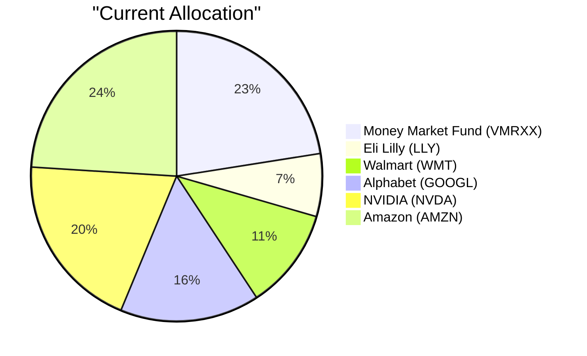
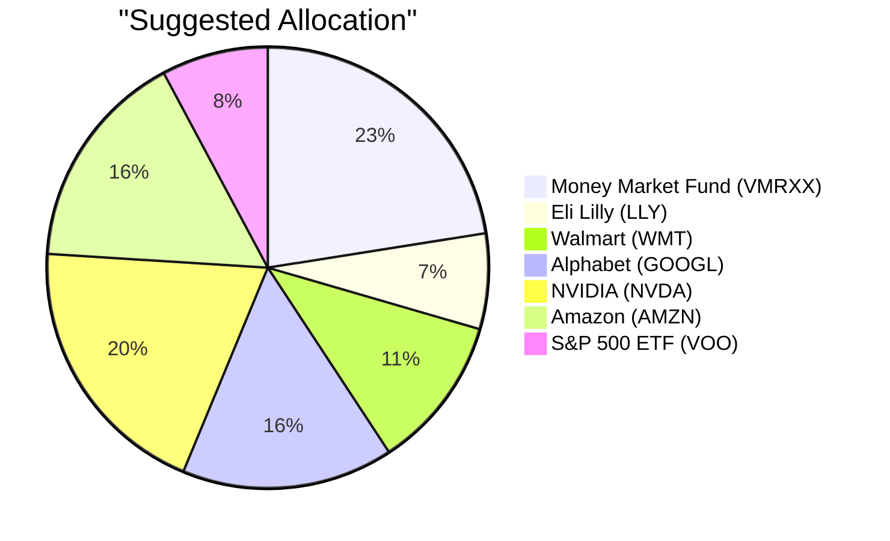

# Client Product-Fit Analysis: Sarah Chen (PB-HK-000002-6)

---

## Executive Summary

Buy $250,000 of the Vanguard S&P 500 ETF (ETF-VOO), representing 7.8% of AUM, funded by a partial sale of Amazon.com, Inc. (STOCK-AMZN). This trade addresses Sarah Chen’s regular-income objective and 5/5 risk appetite by replacing a non-dividend-paying single stock with a broad S&P 500 ETF that pays quarterly distributions. It also reduces AMZN concentration from 24.0% to 16.2% while preserving US large-cap equity exposure and improving the portfolio’s risk-adjusted return potential.

---

## Recommended Product: Vanguard S&P 500 ETF (ETF-VOO)

### Product Specifications

| Attribute | Value |
|---|---|
| Product ID | ETF-VOO |
| Product Name | Vanguard S&P 500 ETF |
| Product Type | Equity fund (ETF) |
| Asset Class | Equities |
| Region | US |
| Sector | Large Blend |
| Risk Rating | 5 |
| Expected Return (5Y CAGR) | 13.85% |
| Expense Ratio | N/A (not disclosed) |
| Time to Maturity | N/A |
| Coupon | N/A |
| Investment Note | US equities are supported by resilient earnings and AI-driven productivity gains, but valuations are above long-term averages. Broad-based US exposure provides growth exposure. Sector rotation risk is elevated — active management or factor tilts may add value in this environment. Expected return ~20.55%. |

### Performance Metrics

| Metric | ETF-VOO | STOCK-AMZN |
|---|---|---|
| 1Y Return | 25.76% | 12.47% |
| 3Y CAGR | 20.55% | 23.88% |
| 5Y CAGR | 13.85% | 6.47% |
| Max Drawdown (5Y) | −24.24% | −54.83% |
| Calmar Ratio | 0.57 | 0.12 |

Calmar ratio is computed as 5Y CAGR divided by the absolute value of the 5Y maximum drawdown.

### Risk Characteristics

With a risk rating of 5, ETF-VOO is a high-volatility equity product that matches Sarah’s 5/5 risk tolerance; adding it will keep portfolio volatility elevated while reducing the extreme single-name swings of the AMZN position sold. Key risk factors include broad US market valuation risk, interest-rate sensitivity, and the S&P 500’s heavy weighting toward large-cap technology and communication-services names, which can amplify losses during sector rotation. Relative to AMZN, VOO has much lower idiosyncratic risk and a materially shallower historical maximum drawdown, but it still carries full exposure to US equity market corrections.

### Detailed Justification

Sarah’s stated investment objective is regular income with a 5-year horizon and low liquidity needs. VOO is a distributing S&P 500 ETF that pays quarterly dividends, converting a non-dividend-paying AMZN position into income-generating exposure. The product’s risk rating of 5 aligns with her 5/5 risk appetite and comfort with concentrated equity, while the index structure reduces the single-stock blow-up risk created by a 24% AMZN position.

VOO’s overall fitness score of 4.20 is anchored by a perfect risk match of 10.0, because both VOO and Sarah are rated 5. The concentration component of 0.0 reflects that VOO does not diversify the portfolio’s already-heavy US large-cap equity bias at the asset-class level; rather, it reduces single-name concentration. The experience score of 6.0 reflects Sarah’s deep familiarity with US equities but no existing ETF position. The better-product score of 0.0 is driven by the catalog’s headline expected returns — VOO at 20.55% versus AMZN at 23.88% — even though VOO’s 5Y CAGR of 13.85% exceeds AMZN’s 6.47% with far smaller drawdown, which is the basis for this trade.

Funding the purchase from a partial sale of AMZN is logical: AMZN is the largest holding, has the weakest 5Y CAGR among the major equity names, pays no dividend, and carries the deepest 5Y drawdown. Redeploying $250,000 into VOO preserves US large-cap growth exposure while improving liquidity and cutting idiosyncratic risk. The market outlook supports a selective risk-on posture with resilient earnings and AI-driven capex, but also cautions that valuations are above historical averages; VOO offers a low-cost core US equity holding without extrapolating recent AI momentum indefinitely.

---

## Suggested Portfolio

### Portfolio Allocation (Pie Charts)

### Current vs. Suggested Allocation

| Asset | Current Value (USD) | Suggested Value (USD) | Current % | Suggested % | Change % | Remark |
|---|---:|---:|---:|---:|---:|---|
| ETF-VMRXX | 720,000 | 720,000 | 22.50% | 22.50% | 0.00% | No change. |
| STOCK-LLY | 223,858 | 223,858 | 7.00% | 7.00% | 0.00% | No change. |
| STOCK-WMT | 359,929 | 359,929 | 11.25% | 11.25% | 0.00% | No change. |
| STOCK-GOOGL | 496,000 | 496,000 | 15.50% | 15.50% | 0.00% | No change. |
| STOCK-NVDA | 632,071 | 632,071 | 19.75% | 19.75% | 0.00% | No change. |
| STOCK-AMZN | 768,142 | 518,142 | 24.00% | 16.19% | −7.81% | Sold $250,000 to fund the ETF-VOO purchase; reduces single-stock concentration. |
| ETF-VOO | 0 | 250,000 | 0.00% | 7.81% | +7.81% | New S&P 500 ETF position; provides broad US large-cap exposure and quarterly distributions. |
| **Total** | **3,200,000** | **3,200,000** | **100.00%** | **100.00%** | **0.00%** |  |

### Pros and Cons of the Suggested Trade

#### Pros

- Aligns with Sarah Chen’s stated regular-income objective because VOO pays quarterly distributions, while the sold AMZN shares pay no dividend.
- Reduces single-stock AMZN concentration from 24.00% to 16.19%, lowering idiosyncratic event risk in the portfolio’s largest position.
- Diversifies the concentrated direct-equity sleeve across the 500 constituents of the S&P 500 while maintaining US large-cap growth exposure.
- Adds an exchange-traded vehicle with intraday liquidity, matching her low liquidity-need profile and 5-year time horizon.

#### Cons

- Gives up the potential outsized upside of a concentrated AMZN holding; VOO’s headline expected return of 20.55% is below AMZN’s 23.88%.
- Keeps the portfolio heavily exposed to US large-cap equity beta and the S&P 500’s technology-heavy sector concentration, so a broad market correction would still be painful.
- The partial AMZN sale may trigger capital gains tax; cost-basis data are not provided, so the exact tax impact cannot be quantified.

### Alternative Products to Consider

- **PROD014 Emerging Markets Fund** — Prefer this if Sarah wants direct Asia-Pacific/emerging-markets exposure to complement her frequent China travel and the market outlook’s EM overweight; the trade-off is higher EM-specific volatility and currency risk instead of core US beta.
- **PROD016 Healthcare Innovation Fund** — Prefer this if she wants a healthcare/innovation tilt that aligns with her ESG interest and existing familiarity with Eli Lilly; the trade-off is greater sector concentration and less broad-market diversification than VOO.

---

## Scenario Analysis

### Normal Market Condition

Equities and cash perform in line with long-term averages, using the S&P 500’s 2019–2024 average return as a reference; broad-market VOO is assumed to return 9.0%, direct single-stock positions are discounted by 100 bps to 8.0%, and cash earns 2.5%. Probability: 50%.

| Asset | Assumed Return % | Suggested Holding (USD) | Suggested P&L (USD) | Current Holding (USD) | Current P&L (USD) |
|---|---:|---:|---:|---:|---:|
| Money Market / Cash | 2.5% | 720,000 | 18,000 | 720,000 | 18,000 |
| Fixed Income / Bonds | 4.0% | 0 | 0 | 0 | 0 |
| Global Equities – ETF-VOO | 9.0% | 250,000 | 22,500 | 0 | 0 |
| Global Equities – Direct Stock Positions | 8.0% | 2,230,000 | 178,400 | 2,480,000 | 198,400 |
| **Total** | — | **3,200,000** | **218,900** | **3,200,000** | **216,400** |

Annual return of suggested portfolio vs. current: 6.84% vs. 6.76%.  
Incremental benefit: +USD 2,500 (+1.16% improvement).

### Upside Market Condition

A bullish scenario similar to the 2020–2021 post-COVID recovery rally: global equities return 15–20%, cash earns 2–3%, and fixed income earns 5–7%; we apply 18.0% to VOO and 17.0% to direct single stocks. Probability: 25%.

| Asset | Assumed Return % | Suggested Holding (USD) | Suggested P&L (USD) | Current Holding (USD) | Current P&L (USD) |
|---|---:|---:|---:|---:|---:|
| Money Market / Cash | 2.5% | 720,000 | 18,000 | 720,000 | 18,000 |
| Fixed Income / Bonds | 6.0% | 0 | 0 | 0 | 0 |
| Global Equities – ETF-VOO | 18.0% | 250,000 | 45,000 | 0 | 0 |
| Global Equities – Direct Stock Positions | 17.0% | 2,230,000 | 379,100 | 2,480,000 | 421,600 |
| **Total** | — | **3,200,000** | **442,100** | **3,200,000** | **439,600** |

Annual return of suggested portfolio vs. current: 13.82% vs. 13.74%.  
Incremental benefit: +USD 2,500 (+0.57% improvement).

### Downside Market Condition

A bearish scenario similar to the 2022 rate-hike selloff: global equities fall 15–25%, cash earns 1–2%, and fixed income provides a modest flight-to-quality buffer; we apply −20.0% to VOO and −23.0% to direct single stocks. Probability: 25%.

| Asset | Assumed Return % | Suggested Holding (USD) | Suggested P&L (USD) | Current Holding (USD) | Current P&L (USD) |
|---|---:|---:|---:|---:|---:|
| Money Market / Cash | 1.5% | 720,000 | 10,800 | 720,000 | 10,800 |
| Fixed Income / Bonds | 1.5% | 0 | 0 | 0 | 0 |
| Global Equities – ETF-VOO | −20.0% | 250,000 | −50,000 | 0 | 0 |
| Global Equities – Direct Stock Positions | −23.0% | 2,230,000 | −512,900 | 2,480,000 | −570,400 |
| **Total** | — | **3,200,000** | **−552,100** | **3,200,000** | **−559,600** |

Annual return of suggested portfolio vs. current: −17.25% vs. −17.49%.  
Incremental benefit: +USD 7,500 (loss reduced by 1.34% relative to the current portfolio).

### Scenario Summary

| Scenario | Probability | Suggested Return | Current Return | Incremental Benefit |
|---|---:|---:|---:|---:|
| Normal | 50% | 6.84% | 6.76% | +USD 2,500 |
| Upside | 25% | 13.82% | 13.74% | +USD 2,500 |
| Downside | 25% | −17.25% | −17.49% | +USD 7,500 |

The probability-weighted expected incremental benefit of the suggested trade is +USD 3,750.

---

## Risk Disclosure

- Past performance does not guarantee future returns.
- Projected returns are estimates, not promises.
- Structured products have risk of principal loss.

---

## References

- Client Profile: PB-HK-000002-6 (Sarah Chen), RM notes, and holdings as of valuation date.
- Product Catalog: ETF-VOO; holdings ETF-VMRXX, STOCK-LLY, STOCK-WMT, STOCK-GOOGL, STOCK-NVDA, STOCK-AMZN.
- Matcher Analysis: Suggested product, fitness scores, funding source, and recommendation rationale.
- Market Outlook: 2026–2028 macro outlook and near-term market update.

---

## Machine-Readable Proposal Data

---** PROPOSAL_JSON **---
{
  "client_id": "PB-HK-000002-6",
  "product_id": "ETF-VOO",
  "recommended_action": "buy",
  "amount_usd": 250000,
  "pct_of_aum": 7.8125,
  "funding_source_product_id": "STOCK-AMZN",
  "fitness_score": 4.2,
  "fitness_components": {
    "risk_match": 10.0,
    "concentration": 0.0,
    "experience": 6.0,
    "better_product": 0.0
  },
  "scenario_returns": {
    "upside": {
      "suggested_pct": 13.82,
      "current_pct": 13.74,
      "probability_pct": 25
    },
    "normal": {
      "suggested_pct": 6.84,
      "current_pct": 6.76,
      "probability_pct": 50
    },
    "downside": {
      "suggested_pct": -17.25,
      "current_pct": -17.49,
      "probability_pct": 25
    }
  }
}
---** END_PROPOSAL_JSON **---
