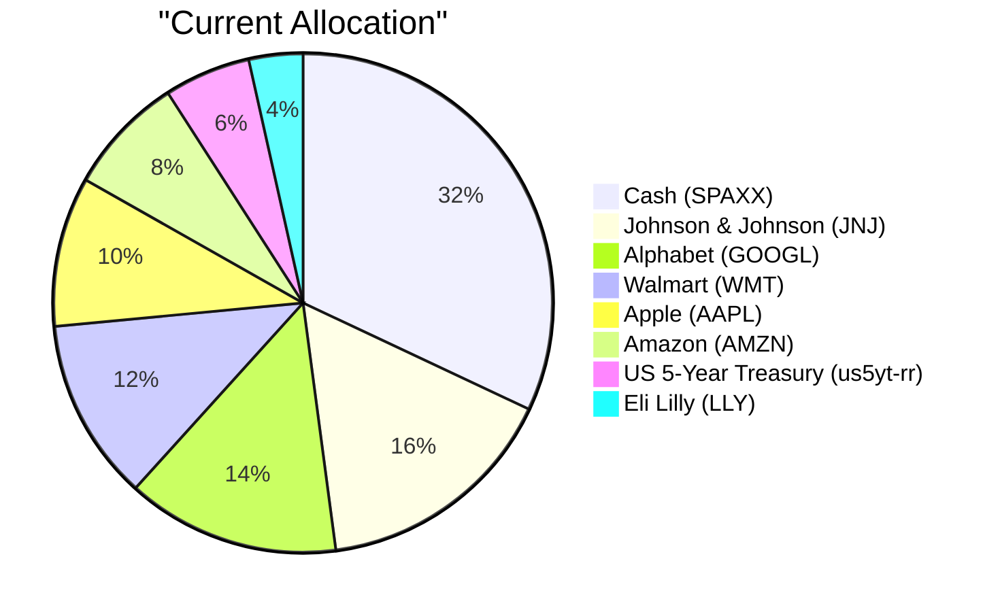
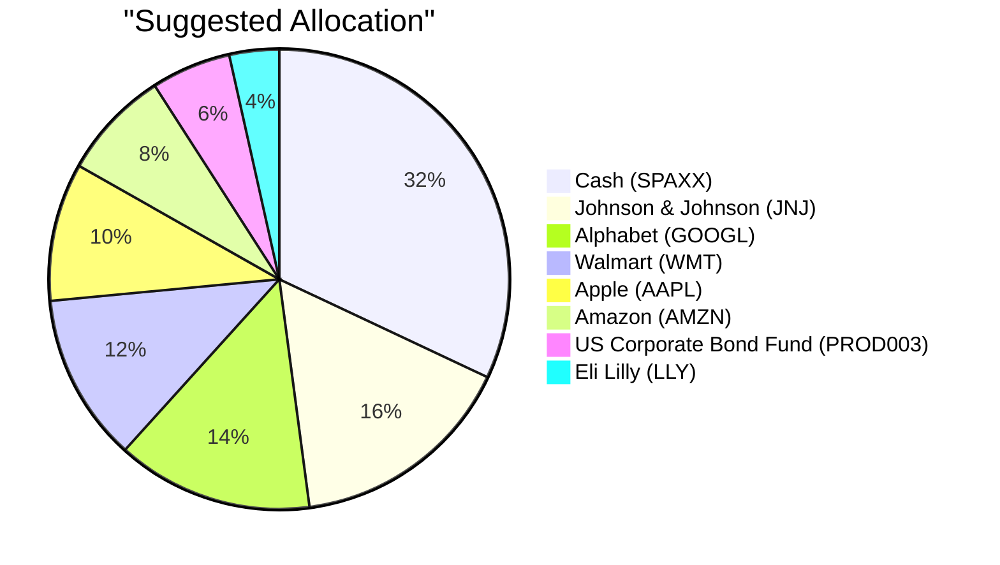

# Client Product-Fit Analysis: Emma Thompson (PB-HK-000005-9)

---

## Executive Summary

Buy $173,260 of PROD003 US Corporate Bond Fund (5.6% of AUM), funded by selling the entire US 5-Year Treasury position (us5yt-rr). This A-rated, senior corporate bond fund with a fixed 4.8% semi-annual coupon and 5.2% expected return directly serves Emma's capital-preservation, guaranteed-income, and legacy objectives, replacing a 3.02% Treasury yield with a +2.18pp carry uplift while remaining entirely within USD fixed income. The trade leaves her 62% equity exposure and 32% cash liquidity buffer unchanged, and is expected to deliver a probability-weighted incremental benefit of approximately +USD 2,106 per year. It modestly increases credit exposure from US government debt to A-rated corporate credit, an appropriate step for an income-focused, conservative retiree.

---

## Recommended Product: US Corporate Bond Fund (PROD003)

### Product Specifications

| Attribute | Value |
|---|---|
| Product ID | PROD003 |
| Product Name | US Corporate Bond Fund |
| Product Type | bond |
| Asset Class | Fixed Income |
| Region | N/A |
| Sector | Financial |
| Risk Rating | 2 |
| Expected Return (5Y CAGR) | 5.2% |
| Expense Ratio | N/A |
| Time to Maturity | 2031-07-01 (≈5 years) |
| Coupon | 4.8% fixed, paid semi-annually |
| Investment Note | Individual bonds allow precise maturity-matching for liability-driven investing. Hold-to-maturity strategies eliminate mark-to-market volatility. Current yields are attractive for income-focused portfolios. Credit quality and call features should be reviewed. |

### Performance Metrics

| Metric | PROD003 | us5yt-rr |
|---|---|---|
| 1Y Return | Data unavailable | 1.25% |
| 3Y CAGR | Data unavailable | 3.68% |
| 5Y CAGR | Data unavailable | 3.02% |
| Max Drawdown | Data unavailable | −5.47% |
| Calmar Ratio | Data unavailable | 0.55 |

Historical performance data is unavailable for PROD003 (a newly catalogued OTC bond fund), so its 5.2% expected return is used for forward-looking assessment.

### Risk Characteristics

PROD003 carries a risk rating of 2 (low-to-moderate), one notch above Emma's overall risk tolerance of 1 but well below the equity positions that dominate her portfolio; its investment-grade, A-rated profile implies modest portfolio volatility relative to her equity holdings. Key risk factors include credit risk on the corporate issuer, moderate interest-rate sensitivity given the July 2031 maturity, and sector concentration in Financials; the fund is USD-denominated, so it introduces no currency exposure. Relative to the US 5-Year Treasury (us5yt-rr) it replaces, PROD003 adds credit-spread and downgrade risk in exchange for a +2.18pp higher expected carry, while remaining in the same asset class and preserving the portfolio's overall low-risk posture.

### Detailed Justification

Emma's stated investment objective is capital preservation, supported by a medium 12-month liquidity need and a deep 32% cash buffer that she wishes to maintain. Within that conservative framework, she responds well to guaranteed-income narratives and has mentioned wanting to leave an orderly financial legacy for her children. PROD003 addresses these needs directly: it is an A-rated, senior, non-callable corporate bond fund with a fixed 4.8% semi-annual coupon and 5.2% expected return, converting a low-yielding 5-year Treasury into a higher, contractually scheduled income stream while staying inside USD fixed income. The trade does not erode her liquidity position — cash remains at 32% of AUM — and it improves the income-generating capacity of the fixed-income sleeve earmarked for legacy objectives.

The matcher assigned PROD003 an overall fitness score of 87/100. Risk match (85) reflects that the A-rated bond fund sits only marginally above Emma's risk-1 profile and replaces an equally risk-2 Treasury, leaving total portfolio volatility essentially unchanged. Concentration (90) captures the fact that the swap is entirely within USD fixed income, leaving her 62% equity concentration and 32% cash buffer untouched while removing a single-maturity, single-security concentration. Experience (82) recognises that Emma already holds fixed-income instruments and understands coupon and income narratives, making the product easy for her to evaluate. Better product (92) reflects the +2.18pp expected-return uplift (5.2% vs. 3.02%) for a modest increase in credit risk. The funding source, us5yt-rr, is the right asset to sell because it is the lowest-yielding fixed-income holding, sits in the same asset class and currency, and its sale has minimal tax or liquidity consequences given its small size (5.6% of AUM) and low recent volatility.

The current market outlook supports this rotation: institutional consensus favours "high-quality carry" over government-bond duration, with central banks on a simultaneous hold and sticky inflation capping Treasury price appreciation. With the Fed expected to hold rates at elevated levels through 2026–2027, locking in a 5.2% A-rated corporate yield with a fixed coupon is preferable to holding a 3.02% 5-year Treasury exposed to heavy sovereign-issuance supply pressure. The main caution is that corporate credit spreads are historically tight, so the recommendation deliberately limits the credit upgrade to a single A-rated, senior, non-callable issue rather than broad high-yield exposure, keeping the incremental risk proportionate to Emma's capital-preservation mandate.

---

## Suggested Portfolio

### Portfolio Allocation (Pie Charts)

### Current vs. Suggested Allocation

| Asset | Current Value (USD) | Suggested Value (USD) | Current % | Suggested % | Change % | Remark |
|---|---|---|---|---|---|---|
| ETF-SPAXX — Fidelity Government Cash Reserves | 992,000 | 992,000 | 32.00% | 32.00% | 0.00% | No change |
| STOCK-LLY — Eli Lilly and Company | 109,319 | 109,319 | 3.53% | 3.53% | 0.00% | No change |
| us5yt-rr — US 5-Year Treasury Yield | 173,260 | 0 | 5.59% | 0.00% | −5.59% | Sold to fund PROD003 purchase |
| PROD003 — US Corporate Bond Fund | 0 | 173,260 | 0.00% | 5.59% | +5.59% | New A-rated corporate bond allocation funded by Treasury sale |
| STOCK-AMZN — Amazon.com, Inc. | 237,202 | 237,202 | 7.65% | 7.65% | 0.00% | No change |
| STOCK-AAPL — Apple Inc. | 301,143 | 301,143 | 9.71% | 9.71% | 0.00% | No change |
| STOCK-WMT — Walmart Inc. | 365,084 | 365,084 | 11.78% | 11.78% | 0.00% | No change |
| STOCK-GOOGL — Alphabet Inc. Class A | 429,025 | 429,025 | 13.84% | 13.84% | 0.00% | No change |
| STOCK-JNJ — Johnson & Johnson | 492,967 | 492,967 | 15.90% | 15.90% | 0.00% | No change |
| **Total** | **3,100,000** | **3,100,000** | **100.00%** | **100.00%** | **0.00%** | |

### Pros and Cons of the Suggested Trade

**Pros**

- Directly supports Emma's capital-preservation and guaranteed-income objectives by replacing a 3.02% Treasury yield with a 5.2% expected-return, A-rated bond fund paying a fixed 4.8% semi-annual coupon.
- Adds a +2.18pp carry uplift with no change to asset-class allocation, reducing single-maturity concentration in the 5-year Treasury while keeping equity concentration and the 32% cash buffer intact.
- Improves diversification within the fixed-income sleeve (US government debt → A-rated corporate credit) using a senior, non-callable structure that limits downside complexity.
- Preserves USD currency alignment and the portfolio's low-risk character, consistent with the RM note that Emma responds well to income and legacy narratives.

**Cons**

- Introduces modest credit and downgrade risk: A-rated corporate debt is not backed by the full faith and credit of the US government, and credit spreads can widen in stress (estimated −USD 2,599 incremental loss in the downside scenario).
- Slightly extends interest-rate sensitivity relative to the 5-year Treasury (2031 maturity), increasing price volatility if rates rise further.
- The sale of us5yt-rr may incur transaction costs or realise a small capital gain/loss, and the OTC corporate bond may be less liquid than the Treasury it replaces.

### Alternative Products to Consider

- **PROD007 — Asia Pacific Bond Fund:** Preferred over PROD003 if Emma wants to diversify the fixed-income sleeve beyond US issuers and capture higher carry from Asia-Pacific credits; the trade-off is added regional and currency exposure that introduces volatility absent from the USD-only position.
- **PROD020 — Balanced Growth & Income:** Preferred if Emma becomes comfortable accepting a small equity sleeve to raise long-term legacy growth; the trade-off is higher drawdown risk and weaker capital-preservation certainty than the pure fixed-income PROD003.

---

## Scenario Analysis of the Suggested Trade

### Normal Market Condition

Markets perform in line with long-term historical averages: equities post high-single-digit gains and credit markets function normally with stable spreads. Assumptions use 5-year historical averages (e.g., S&P 500 average annual return 2019–2024): global equities 9%, fixed income 3–5%, and money market/cash 2–3%; the two fixed-income instruments are modelled at their expected returns (PROD003 at 5.2%, us5yt-rr at 3.02%).

| Asset | Assumed Return % | Suggested Holding (USD) | Suggested P&L (USD) | Current Holding (USD) | Current P&L (USD) |
|---|---|---|---|---|---|
| Global Equities | 9.0% | 1,934,740 | 174,127 | 1,934,740 | 174,127 |
| US Corporate Bond Fund (PROD003) | 5.2% | 173,260 | 9,010 | 0 | 0 |
| US 5-Year Treasury (us5yt-rr) | 3.0% | 0 | 0 | 173,260 | 5,232 |
| Money Market / Cash | 2.5% | 992,000 | 24,800 | 992,000 | 24,800 |
| **Total** | — | **3,100,000** | **207,937** | **3,100,000** | **204,159** |

- Annual return of suggested portfolio vs. current: 6.71% vs. 6.59%
- Incremental benefit: +USD 3,778 (+1.85% improvement)

### Upside Market Condition

A bullish scenario in which global equities rally strongly and credit spreads tighten, analogous to the 2020–2021 post-COVID recovery rally. Assumptions: global equities 17.5%, fixed income 5–7%, and money market/cash 2–3%; PROD003 earns 6.0% while the Treasury earns 4.0% as the credit spread narrows.

| Asset | Assumed Return % | Suggested Holding (USD) | Suggested P&L (USD) | Current Holding (USD) | Current P&L (USD) |
|---|---|---|---|---|---|
| Global Equities | 17.5% | 1,934,740 | 338,580 | 1,934,740 | 338,580 |
| US Corporate Bond Fund (PROD003) | 6.0% | 173,260 | 10,396 | 0 | 0 |
| US 5-Year Treasury (us5yt-rr) | 4.0% | 0 | 0 | 173,260 | 6,930 |
| Money Market / Cash | 2.5% | 992,000 | 24,800 | 992,000 | 24,800 |
| **Total** | — | **3,100,000** | **373,776** | **3,100,000** | **370,310** |

- Annual return of suggested portfolio vs. current: 12.06% vs. 11.95%
- Incremental benefit: +USD 3,466 (+0.94% improvement)

### Downside Market Condition

A bearish, risk-off scenario driven by a rate-hike shock or growth scare, analogous to the 2022 rate-hike selloff or the 2020 COVID-19 crash. Assumptions: global equities −20%, corporate credit spreads widen so PROD003 returns 1.0%, Treasuries benefit from a flight-to-quality bid at 2.5%, and cash earns 1.5%.

| Asset | Assumed Return % | Suggested Holding (USD) | Suggested P&L (USD) | Current Holding (USD) | Current P&L (USD) |
|---|---|---|---|---|---|
| Global Equities | −20.0% | 1,934,740 | −386,948 | 1,934,740 | −386,948 |
| US Corporate Bond Fund (PROD003) | 1.0% | 173,260 | 1,733 | 0 | 0 |
| US 5-Year Treasury (us5yt-rr) | 2.5% | 0 | 0 | 173,260 | 4,332 |
| Money Market / Cash | 1.5% | 992,000 | 14,880 | 992,000 | 14,880 |
| **Total** | — | **3,100,000** | **−370,335** | **3,100,000** | **−367,736** |

- Annual return of suggested portfolio vs. current: −11.95% vs. −11.86%
- Incremental benefit: −USD 2,599

### Scenario Summary

| Scenario | Probability | Suggested Return | Current Return | Incremental Benefit |
|---|---|---|---|---|
| Normal | 50% | 6.71% | 6.59% | +USD 3,778 |
| Upside | 25% | 12.06% | 11.95% | +USD 3,466 |
| Downside | 25% | −11.95% | −11.86% | −USD 2,599 |

The probability-weighted expected incremental benefit is approximately **+USD 2,106** per year, meaning the swap adds expected value without changing the portfolio's asset-class structure.

---

## Risk Disclosure

- Past performance does not guarantee future returns.
- Projected returns are estimates, not promises.
- Structured products have risk of principal loss.

---

## References

- Client Profile: PB-HK-000005-9 — Emma Thompson (demographics, risk rating, RM notes, holdings statement)
- Product Catalog: PROD003 — US Corporate Bond Fund (specifications, type-specific terms, investment note)
- Product Catalog — Holdings Performance History: ETF-SPAXX, STOCK-LLY, us5yt-rr, STOCK-AMZN, STOCK-AAPL, STOCK-WMT, STOCK-GOOGL, STOCK-JNJ
- Suggested Products & Rationale: Matcher analysis for PB-HK-000005-9
- Market Outlook: Global Macro & Asset Allocation Outlook (24-month horizon, 2026–2028) and tactical fixed-income update

---

## Machine-Readable Proposal Data

---** PROPOSAL_JSON **---
{
  "client_id": "PB-HK-000005-9",
  "product_id": "PROD003",
  "recommended_action": "buy",
  "amount_usd": 173260,
  "pct_of_aum": 5.59,
  "funding_source_product_id": "us5yt-rr",
  "fitness_score": 87,
  "fitness_components": {
    "risk_match": 85,
    "concentration": 90,
    "experience": 82,
    "better_product": 92
  },
  "scenario_returns": {
    "upside": { "suggested_pct": 12.06, "current_pct": 11.95, "probability_pct": 25 },
    "normal": { "suggested_pct": 6.71, "current_pct": 6.59, "probability_pct": 50 },
    "downside": { "suggested_pct": -11.95, "current_pct": -11.86, "probability_pct": 25 }
  }
}
---** END_PROPOSAL_JSON **---
