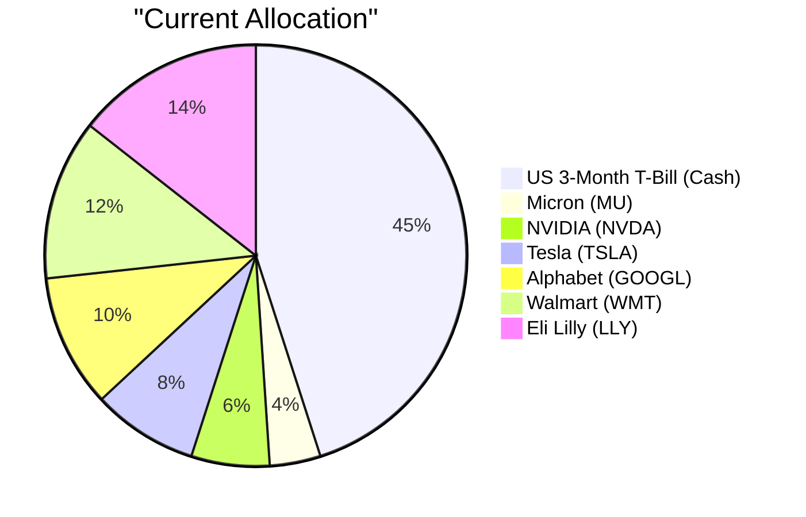
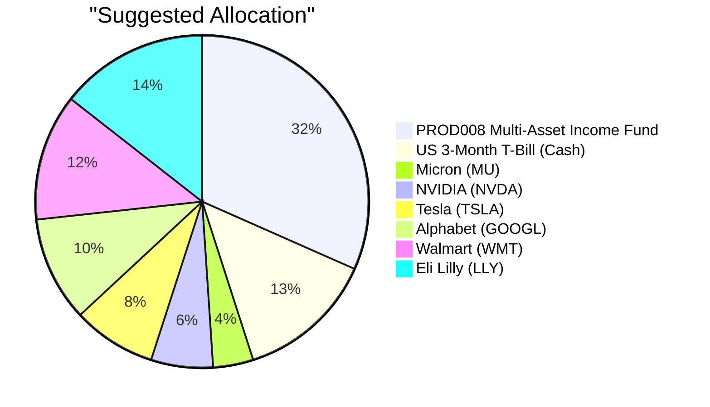

# Investment Advisory Proposal for:
David Kim (PB-HK-000001-8)
Prepared by: Louis Ng
Date: September 9, 2026

---

## Executive Summary

We recommend purchasing USD 300,000 (31.6% of AUM) of PROD008 Multi-Asset Income Fund, funded by selling USD 300,000 of the US 3-Month Treasury Bill Rate position. The fund’s 65% fixed-income / 25% equity balanced structure directly addresses David Kim’s inflation erosion concern, education-funding priority, and controlled-drawdown objective while earning an expected return of 8.2% versus 4.4% on the T-Bill cash being replaced. The trade improves portfolio income and diversification, reduces cash drag, and leaves the 12-month emergency buffer intact at 13.4% of AUM.

---

## Recommended Product: Multi-Asset Income Fund (PROD008)

### Product Summary

| Attribute | Value |
|---|---|
| Product ID | PROD008 |
| Product Name | Multi-Asset Income Fund |
| Product Type | balanced_fund |
| Asset Class | Balanced |
| Region | N/A |
| Sector | Multi-Asset |
| Risk Rating | 3 |
| Expected Return (5Y CAGR) | 8.2% |
| Expense Ratio | N/A |
| Time to Maturity | N/A |
| Coupon | N/A |
| Investment Note | Conservative multi-asset allocation emphasises income generation and capital preservation. In the current elevated-rate environment, the fixed-income sleeve provides attractive carry while equity exposure captures modest upside. Suitable for risk-averse investors seeking inflation-protected returns. |

### Performance Metrics Comparison

| Metric | PROD008 | us3mt-rr |
|---|---|---|
| 1Y Return | Data unavailable | 3.65% |
| 3Y CAGR | Data unavailable | 4.53% |
| 5Y CAGR | Data unavailable | 4.40% |
| Max Drawdown | Data unavailable | −0.03% |
| Calmar Ratio | Data unavailable | Data unavailable |

PROD008 has no published historical performance data; the 8.2% is an expected/target return, so a full historical comparison cannot be completed.

### Risk Characteristics

PROD008 carries a risk rating of 3, one notch below the client’s risk capacity of 4, implying lower portfolio volatility than the existing equity-heavy holdings and better alignment with his “long-term capital growth with controlled drawdown” objective. The key risk factors are interest-rate and credit risk embedded in the 65% fixed-income sleeve, plus moderate equity-market sensitivity from the 25% equity sleeve; there is no single-name or sector concentration in technology. Relative to the US T-Bill funding source, the fund introduces market and credit risk, but it also raises expected return from 4.4% to 8.2% and diversifies away from pure cash.

### Detailed Justification (For Bank Internal)

- **Evaluated products and selection:** Candidate products considered included PROD008 Multi-Asset Income Fund (fitness 5.81), PROD019 Asia Real Estate Fund (5.73), PROD013 Global Dividend Equity Fund (5.70), PROD047 Emerging Market Bond (5.61), PROD020 Balanced Growth & Income (5.18), and ETF-EMB (4.24). PROD008 ranked first overall and was selected because it is the only product that simultaneously combines a conservative multi-asset structure, income generation, 65% fixed-income downside cushion, and the strongest alignment with the RM note (8.6). PROD019 and PROD013 scored well on familiarity but are pure equity funds with high similarity to the existing equity book, so they would not reduce drawdown risk. PROD020 is too conservative (risk 2, 6.5% expected return) and scored lower on risk match. ETF-EMB ranked lowest and adds emerging-market credit and currency risk that the client does not need.
- **Client-need alignment:** PROD008 addresses three explicit needs from the profile: (1) deploying idle cash — 45% of the portfolio sits in T-Bills earning 4.4%; (2) education funding — two children approaching university age, a near-term, high-certainty goal that benefits from income stability and reduced drawdown; and (3) controlled drawdown — the 65% fixed-income allocation is a structural volatility dampener relative to the current 55% equity concentration.
- **Fitness-score interpretation:** The 5.81 fitness score is driven by Risk Match (7.5), RM Note Similarity (8.6), Like (8.0), and Comfort (7.7). Risk Match of 7.5 confirms the risk-3 fund is appropriate for a risk-4 client with a controlled-drawdown objective. RM Note Similarity of 8.6 is the strongest signal: the product directly matches the RM’s comments on inflation eroding idle cash and education funding as a near-term priority. Like (8.0) and Comfort (7.7) confirm the income-oriented balanced profile fits the client’s stated interest in inflation protection and does not resemble any disclosed dislike. The weak components are Diversification (0.0) and Experience (0.0): the model flags the reduction in the cash buffer, not an increase in concentration risk, and the client has no existing balanced-fund holding. Both are mitigated by the retained 13.4% cash buffer and the RM note that the client is an active, evidence-based investor open to new vehicles. Better Product (0.0) is neutral because the client holds no comparable balanced fund; the relevant uplift is the +3.8pp expected-return improvement over the T-Bill funding source.
- **Funding rationale:** Selling USD 300,000 of us3mt-rr is the correct funding source because the T-Bill position is oversized relative to the stated 12-month emergency buffer. The trade lowers cash from 45.0% to 13.4% of AUM, which still exceeds the emergency liquidity requirement, while redeploying capital into a product with +3.8pp higher expected return. The opportunity cost of keeping the cash is the forgone income and inflation protection; the T-Bill is also highly liquid and can be sold without material transaction costs or capital-gains frictions.
- **Market context:** The Bank Wise Q3 2026 outlook keeps Fixed Income Neutral with a short-to-intermediate duration bias and global IG yields near 5.0%, which supports the fund’s 65% fixed-income carry. US equities remain supported by resilient earnings and AI-driven productivity gains, but valuations are above long-term averages; a balanced fund avoids adding further single-stock or tech-sector concentration at this point in the cycle. The product investment note similarly states that in the elevated-rate environment, the fixed-income sleeve provides attractive carry while the equity sleeve captures modest upside.

---

## Suggested Portfolio Allocation

### Portfolio Allocation (Pie Charts)

### Current vs Suggested Allocation

| Asset | Current Value (USD) | Suggested Value (USD) | Current % | Suggested % | Change % | Remark |
|---|---:|---:|---:|---:|---:|---|
| us3mt-rr — US 3-Month Treasury Bill Rate | 427,500 | 127,500 | 45.0% | 13.4% | −31.6% | Sold USD 300,000 to fund the PROD008 purchase. |
| PROD008 — Multi-Asset Income Fund | 0 | 300,000 | 0.0% | 31.6% | +31.6% | New balanced multi-asset income allocation. |
| STOCK-MU — Micron Technology, Inc. | 36,905 | 36,905 | 3.9% | 3.9% | 0.0% | No change. |
| STOCK-NVDA — NVIDIA Corporation | 56,976 | 56,976 | 6.0% | 6.0% | 0.0% | No change. |
| STOCK-TSLA — Tesla, Inc. | 77,048 | 77,048 | 8.1% | 8.1% | 0.0% | No change. |
| STOCK-GOOGL — Alphabet Inc. Class A | 97,119 | 97,119 | 10.2% | 10.2% | 0.0% | No change. |
| STOCK-WMT — Walmart Inc. | 117,190 | 117,190 | 12.3% | 12.3% | 0.0% | No change. |
| STOCK-LLY — Eli Lilly and Company | 137,261 | 137,261 | 14.4% | 14.4% | 0.0% | No change. |
| **Total** | **949,999** | **949,999** | **100.0%** | **100.0%** | **0.0%** | |

### Advantages and Risks of the Suggested Investment

#### Advantages

- The trade deploys USD 300,000 of idle cash earning 4.4% into a balanced fund with an 8.2% expected return, directly addressing the RM note’s concern about inflation eroding idle cash.
- The 65% fixed-income sleeve introduces a new asset class and reduces the portfolio’s effective equity concentration without adding single-stock or technology-sector risk.
- The fund’s risk rating of 3, below the client’s risk capacity of 4, supports his stated objective of long-term capital growth with controlled drawdown.
- The income-oriented, distributing design aligns with the near-term education-funding priority while the retained 13.4% cash buffer keeps the 12-month emergency fund fully intact.
- The trade improves the portfolio’s risk-adjusted return potential by replacing a zero-duration cash asset with a diversified income-producing multi-asset vehicle.

#### Risk

- The client gives up the guaranteed principal and immediate liquidity of T-Bills; PROD008 can experience mark-to-market losses in both its equity and fixed-income sleeves.
- The 65% fixed-income sleeve introduces interest-rate and credit risk, so a sharp rise in yields or widening of credit spreads could reduce the fund’s NAV.
- PROD008 has no historical performance track record in the catalog, so the 8.2% expected return is a target rather than a demonstrated result.

### Alternative Products to Consider

#### Alternative 1: PROD013 — Global Dividend Equity Fund

| Attribute | Value |
|---|---|
| Product ID | PROD013 |
| Product Name | Global Dividend Equity Fund |
| Product Type | equity_fund |
| Asset Class | Equity |
| Region | N/A |
| Sector | N/A |
| Risk Rating | 3 |
| Expected Return (5Y CAGR) | 7.8% |
| Expense Ratio | N/A |
| Time to Maturity | N/A |
| Coupon | N/A |
| Investment Note | Equity exposure suits investors with a medium-to-long-term horizon. Diversify across regions and factors to manage concentration risk in an uncertain macro environment. Expected return ~7.8%. |

This alternative would be preferred if the client decides he can tolerate higher equity volatility in exchange for dividend growth and is less concerned about the fixed-income cushion.  
Talking points for the relationship manager:

- Fitness score of 5.70 with strong risk match (7.5) and high familiarity with equity exposure.
- Global dividend strategy provides an inflation-hedging income stream through growing dividends.
- Product is a pure equity fund and does not provide the 65% fixed-income drawdown protection of PROD008.
- Holding similarity of 10.0 means it overlaps the client’s existing equity book rather than diversifying away from it.

Trade-off: The client sacrifices the fixed-income stability and capital-preservation feature that are central to his education-funding and controlled-drawdown needs.

#### Alternative 2: PROD019 — Asia Real Estate Fund

| Attribute | Value |
|---|---|
| Product ID | PROD019 |
| Product Name | Asia Real Estate Fund |
| Product Type | equity_fund |
| Asset Class | Equity |
| Region | Asia |
| Sector | Real Estate |
| Risk Rating | 3 |
| Expected Return (5Y CAGR) | 8.7% |
| Expense Ratio | N/A |
| Time to Maturity | N/A |
| Coupon | N/A |
| Investment Note | Equity exposure suits investors with a medium-to-long-term horizon. Diversify across regions and factors to manage concentration risk in an uncertain macro environment. Expected return ~8.7%. |

This alternative would be preferred if the client wants a higher expected return and geographic diversification into Asian real estate rather than a balanced income solution.  
Talking points for the relationship manager:

- Fitness score of 5.73, the second-highest among evaluated candidates, with a strong risk match of 7.5.
- Adds a distinct regional and sector exposure outside the US mega-cap technology names.
- Very high Like (9.4), Comfort (10.0), and Holding Similarity (10.0) scores reflect strong familiarity and comfort.
- RM Note Similarity is only 4.6, so it does not directly address the education-funding and idle-cash concerns that drive the recommendation.
- Pure real-estate equity is cyclical and provides no fixed-income cushion in a downturn.

Trade-off: The client sacrifices the reliable income, fixed-income diversification, and controlled drawdown provided by PROD008.

---

## Scenario Analysis

### Normal Market Condition

In a normal environment, markets perform in line with long-term historical averages: global equities deliver mid-single-to-high-single-digit returns, bonds provide low-single-digit income, and cash yields remain around money-market levels. This scenario is consistent with the 2019–2024 historical averages for US equities, investment-grade bonds, and T-Bills.

| Asset | Assumed Return % | Suggested Holding (USD) | Suggested P&L (USD) | Current Holding (USD) | Current P&L (USD) |
|---|---:|---:|---:|---:|---:|
| Money Market / Cash (T-Bills) | 2.5% | 127,500 | 3,187.50 | 427,500 | 10,687.50 |
| US Equities (existing direct stocks) | 9.0% | 522,499 | 47,024.91 | 522,499 | 47,024.91 |
| Balanced Fund (PROD008) | 7.0% | 300,000 | 21,000.00 | 0 | 0.00 |
| **Total** | — | **949,999** | **71,212.41** | **949,999** | **57,712.41** |

- Annual return of suggested portfolio vs. current: 7.5% vs. 6.1%
- Incremental benefit: +USD 13,500 (+23.4% improvement)

### Upside Market Condition

In a bullish scenario, markets significantly outperform, driven by continued AI-driven capex, resilient corporate earnings, and a broad equity rally similar to the 2020–2021 post-COVID recovery period.

| Asset | Assumed Return % | Suggested Holding (USD) | Suggested P&L (USD) | Current Holding (USD) | Current P&L (USD) |
|---|---:|---:|---:|---:|---:|
| Money Market / Cash (T-Bills) | 2.5% | 127,500 | 3,187.50 | 427,500 | 10,687.50 |
| US Equities (existing direct stocks) | 17.0% | 522,499 | 88,824.83 | 522,499 | 88,824.83 |
| Balanced Fund (PROD008) | 11.0% | 300,000 | 33,000.00 | 0 | 0.00 |
| **Total** | — | **949,999** | **125,012.33** | **949,999** | **99,512.33** |

- Annual return of suggested portfolio vs. current: 13.2% vs. 10.5%
- Incremental benefit: +USD 25,500 (+25.6% improvement)

### Downside Market Condition

In a bearish scenario, markets significantly underperform, similar to the 2022 rate-hike selloff or the 2020 COVID-19 crash, with a flight-to-quality bid supporting cash and shorter-duration fixed income.

| Asset | Assumed Return % | Suggested Holding (USD) | Suggested P&L (USD) | Current Holding (USD) | Current P&L (USD) |
|---|---:|---:|---:|---:|---:|
| Money Market / Cash (T-Bills) | 1.5% | 127,500 | 1,912.50 | 427,500 | 6,412.50 |
| US Equities (existing direct stocks) | −20.0% | 522,499 | −104,499.80 | 522,499 | −104,499.80 |
| Balanced Fund (PROD008) | −6.0% | 300,000 | −18,000.00 | 0 | 0.00 |
| **Total** | — | **949,999** | **−120,587.30** | **949,999** | **−98,087.30** |

- Annual return of suggested portfolio vs. current: −12.7% vs. −10.3%
- Incremental benefit: −USD 22,500

### Scenario Summary

| Scenario | Probability | Suggested Return | Current Return | Incremental Benefit |
|---|---|---|---:|---:|
| Normal | 50% | 7.5% | 6.1% | +USD 13,500 |
| Upside | 25% | 13.2% | 10.5% | +USD 25,500 |
| Downside | 25% | −12.7% | −10.3% | −USD 22,500 |

The probability-weighted expected incremental benefit is +USD 7,500 per year.

---

## Risk Disclosure

- **Market risk:** The fund invests in both equities and fixed income, and its NAV will fluctuate with market conditions; the invested capital is not guaranteed.
- **Interest-rate risk:** The 65% fixed-income sleeve is sensitive to changes in interest rates; a rise in yields could reduce the value of bond holdings.
- **Credit risk:** The fixed-income sleeve is subject to the risk of issuer default or credit downgrade.
- **Equity risk:** The 25% equity sleeve can amplify losses in a broad equity market selloff.
- **Liquidity and product risk:** PROD008 is an OTC mutual fund; redemption or valuation terms may differ from exchange-traded instruments.
- **Expected-return risk:** The 8.2% expected return is a target, not a guarantee, and there is no historical performance track record for this product in the catalog.
- **Inflation risk:** Returns may not keep pace with inflation over shorter holding periods.
- **General advice disclaimer:** This proposal is for information purposes only and does not constitute tax, legal, or accounting advice. Investment involves risks. Past performance is not indicative of future results.

---

## References

- Client Profile: api://client_profile (Planbot Internal Data)
- Product Catalog: api://product_catalog (Planbot Internal Data)
- Suggested Products and Rationale: api://suggested_products_and_rationale (Planbot Internal Data)
- Market Outlook: bank_wise.md (Bank Wise Q3 2026 Market Outlook Summary), bank_research_1.md (FundWatch 投資卓見), bank_research_2.md (基金洞察 — AI 浪潮下的 HALO), bank_research_3.md (Economic Indicators Analysis) (Planbot Internal Data)
- Proposal Guidelines: proposal_format.md, product_summary_instruction.md, suggested_portfolio_instruction.md, scenario_analysis_instruction.md, reference_instruction.md (Planbot Internal Data)
