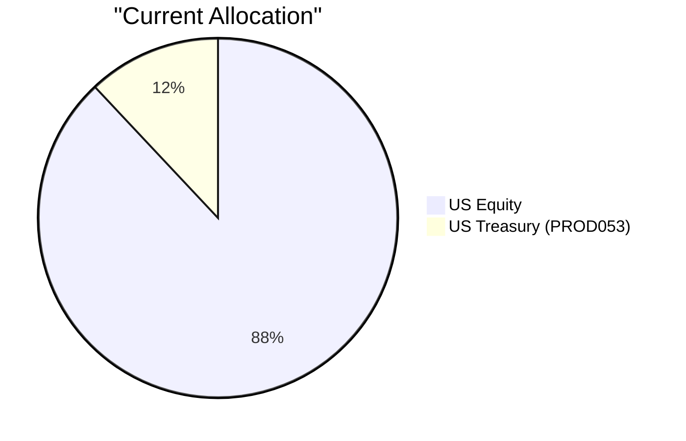
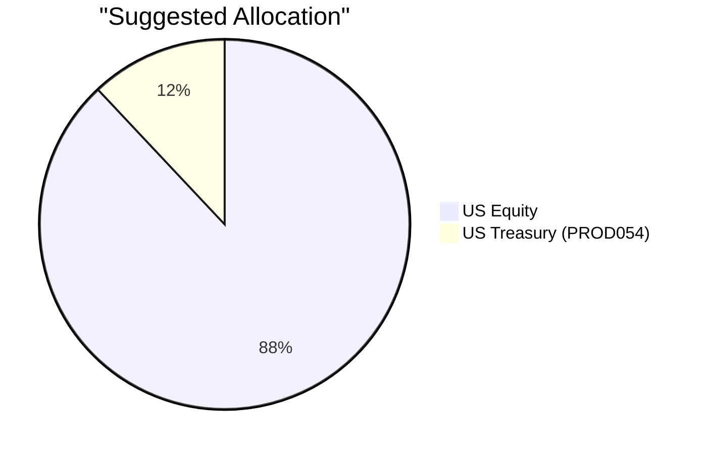

# Reinvestment Analysis: "Akira Tanaka"

# Executive Summary

Akira Tanaka's USD 3.36M US Treasury 4.375% 31Aug26 (PROD053) matures on 31 August 2026. We recommend reinvesting the released proceeds into US Treasury 3.75% 30Jun27 (PROD054), the highest-fit product in the available catalog (fit score 3.72) and a direct continuation of the same U.S. government credit quality. The recommendation keeps the reinvested sleeve at the same Risk Rating of 1 while improving the expected return slightly from 3.7% to 3.8%, and aligns with the current market advice to favor short-to-intermediate duration high-quality fixed income. This preserves a high-quality ballast in an equity-heavy portfolio and reduces the cash drag that would otherwise result from the maturing Treasury position.

# Recommended Product: US Treasury 3.75% 30Jun27

## Product Specifications

| Field | Detail |
|---|---|
| Product ID | PROD054 |
| Name | US Treasury 3.75% 30Jun27 |
| Type | Government bond |
| Vehicle | Direct |
| Trading Currency | USD |
| Region / Sector | US / Government |
| Issuer | U.S. Treasury |
| Coupon | 3.75% fixed, semi-annual |
| Maturity | 30 June 2027 |
| Credit Rating | AA+ |
| Seniority | Senior |
| Callable / Puttable / Convertible | No / No / No |
| Risk Rating | 1 / 5 |
| Expected Return | 3.8% |
| Product Fitness Score | 3.72 / 10 |

## Performance Metrics

The table below contrasts the historical performance of the recommended PROD054 against the maturing PROD053. Both are short-dated U.S. Treasury securities, so their historical return, drawdown, and volatility profiles are effectively identical; the slightly higher expected return of PROD054 is the relevant differentiator.

| Metric | PROD053 (Maturing) | PROD054 (Recommended) |
|---|---:|---:|
| 6-month return | 1.59% | 1.59% |
| 1-year return | 3.65% | 3.65% |
| 3-year cumulative return / CAGR | 14.22% / 4.53% | 14.22% / 4.53% |
| 5-year cumulative return / CAGR | 18.20% / 4.40% | 18.20% / 4.40% |
| Max drawdown (3-year) | -0.03% | -0.03% |
| Volatility (3-year) | 0.28% | 0.28% |
| Expected Return | 3.7% | 3.8% |

## Risk Characteristics

- **Credit risk is negligible:** The bond is a direct U.S. Treasury obligation rated AA+.
- **Interest-rate risk is low but present:** With a remaining maturity of about 10 months, price sensitivity to higher yields is modest; holding to maturity returns full principal.
- **Liquidity risk is low:** U.S. Treasuries are highly liquid instruments.
- **Reinvestment risk is limited:** The bond matures on 30 June 2027, after which proceeds are exposed to then-prevailing rates.
- **Inflation risk:** The fixed 3.75% coupon may lag future inflation, potentially producing a low or negative real return.

## Detailed Justification

- **Risk parity with the maturing product:** PROD054 carries the same Risk Rating (1/5) as PROD053, satisfying the requirement that the reinvestment product has a similar risk level.
- **Highest product fit in the catalog:** PROD054 has the highest fitness score (3.72) among available reinvestment alternatives and maximum experience and holding-similarity scores (10.0), reflecting the client's existing familiarity with U.S. Treasuries.
- **Small expected-return uplift:** Expected return is 3.8% versus 3.7% for the maturing note, providing a modest yield improvement without moving up the risk scale.
- **Market alignment:** The current Q3 2026 outlook favors short-to-intermediate duration and high-quality fixed income given sticky inflation and possible rate hikes; a Treasury maturing in June 2027 fits that guidance well.
- **Portfolio role:** The reinvestment preserves a 12% government-bond ballast in a portfolio that is roughly 88% U.S. equities, without increasing single-stock or sector concentration.
- **Downside protection:** A U.S. Treasury is among the highest-quality defensive assets and supports the client's stated preference for downside protection, while the rest of the portfolio continues to pursue long-term capital growth.

# Suggested Portfolio

If the USD 3.36M maturing proceeds were left uninvested, a 1% cash yield is assumed. The recommended trade redeploys the full maturity amount into PROD054, eliminating this cash drag.

## Current vs. Suggested Allocation

| Asset | Current Value (USD) | Suggested Value (USD) | Current % | Suggested % | Change % | Remark |
|---|---:|---:|---:|---:|---:|---|
| PROD053 — US Treasury 4.375% 31Aug26 | 3,360,000 | 0 | 12.000% | 0.000% | -12.000% | Matures on 31 Aug 2026; proceeds reinvested into PROD054 |
| STOCK-MU — Micron Technology Inc. | 841,217 | 841,217 | 3.004% | 3.004% | 0.000% | No change |
| STOCK-TSLA — Tesla Inc. | 1,315,357 | 1,315,357 | 4.698% | 4.698% | 0.000% | No change |
| STOCK-NVDA — NVIDIA Corporation | 1,789,497 | 1,789,497 | 6.391% | 6.391% | 0.000% | No change |
| STOCK-MSFT — Microsoft Corporation | 2,263,637 | 2,263,637 | 8.084% | 8.084% | 0.000% | No change |
| STOCK-LLY — Eli Lilly and Company | 2,737,778 | 2,737,778 | 9.778% | 9.778% | 0.000% | No change |
| STOCK-WMT — Walmart Inc. | 3,211,918 | 3,211,918 | 11.471% | 11.471% | 0.000% | No change |
| STOCK-JNJ — Johnson & Johnson | 3,686,058 | 3,686,058 | 13.165% | 13.165% | 0.000% | No change |
| STOCK-AAPL — Apple Inc. | 4,160,199 | 4,160,199 | 14.858% | 14.858% | 0.000% | No change |
| STOCK-AMZN — Amazon.com Inc. | 4,634,339 | 4,634,339 | 16.551% | 16.551% | 0.000% | No change |
| PROD054 — US Treasury 3.75% 30Jun27 | 0 | 3,360,000 | 0.000% | 12.000% | +12.000% | New purchase funded by PROD053 maturity proceeds |
| **Total** | **28,000,000** | **28,000,000** | **100.000%** | **100.000%** | **0.000%** |  |

## Advantages and Risks of the Suggested Investment

### Advantages

- Reinvesting in PROD054 keeps the maturing sleeve at Risk Level 1 while providing a slightly higher expected return (3.8%) than the maturing note (3.7%).
- It adds no new single-stock, sector, or style concentration and preserves a 12% U.S. government ballast against the portfolio's 88% equity exposure.
- The ~10-month maturity aligns with the current market view favoring short-to-intermediate duration, high-quality fixed income in an environment of sticky inflation and possible rate hikes.
- The client has maximum familiarity with U.S. Treasuries, making this a low-complexity, low-transaction-strain reinvestment.
- As a direct U.S. Treasury obligation, the position provides strong downside protection and high liquidity if capital is needed before maturity.

### Risk

- The client gives up the higher long-term growth potential of equity-like investments in this sleeve; the expected return is modest relative to the stated long-term capital growth objective.
- If U.S. yields rise materially before June 2027, the bond will experience a mark-to-market price decline, although holding to maturity returns full principal.
- The fixed 3.75% coupon may deliver a low or negative real return if inflation accelerates, and the proceeds must be reinvested at prevailing yields when the bond matures.

## Alternative Products to Consider

### Alternative 1: PROD044 — China Government Bond

**Product Summary:** Product ID: PROD044 | Type: Direct government bond | Risk Rating: 1 | Expected Return: 3.5% | Coupon: 3.2% fixed semi-annual | Maturity: 2036-07-01 | Credit Rating: A+.

This alternative would be preferred if the client wants to express his stated interest in Asian sovereign exposure and can accept much longer duration in exchange for a similarly risk-rated government bond.

- Direct China government credit, potentially aligned with the RM note on Asian real estate and infrastructure themes.
- Same headline risk rating (1/5) and senior fixed-coupon structure as the recommended Treasury.
- Longer maturity creates greater interest-rate sensitivity and regional concentration than PROD054.
- Fitness score of 3.58, the second-highest score in the catalog.

The main trade-off is a much longer duration, a lower expected return (3.5%), and increased China-specific concentration relative to the 10-month U.S. Treasury recommendation.

### Alternative 2: ETF-BIL — State Street SPDR Bloomberg 1-3 Month T-Bill ETF

**Product Summary:** Product ID: ETF-BIL | Type: Ultrashort government bond ETF | Risk Rating: 1 | Expected Return: 4.6% | Yield to Maturity: 4.6% | Distribution: Monthly.

This alternative would be preferred if the client prioritizes daily liquidity and the ability to redeploy capital quickly over locking in a fixed 10-month maturity.

- Higher expected return (4.6%) than PROD054 while maintaining Risk Rating 1.
- Daily ETF liquidity and monthly distributions provide flexibility.
- Minimal duration reduces mark-to-market losses if rates rise.
- Because the ETF rolls short-term T-bills monthly, the yield is not locked for an extended period.

The trade-off is that income is floating and reinvestment risk is continuous; the client gives up the certainty of a known 3.75% coupon held to June 2027.

# Scenario Analysis

The following scenarios compare the recommended PROD054 holding with the current PROD053 holding under the analytical assumption that the current holding is not maturing. Both are U.S. Treasuries, so the key difference is remaining duration: essentially zero for PROD053 versus roughly 10 months for PROD054.

| Scenario | Assumption | Impact on PROD053 (current, assumed not maturing) | Impact on PROD054 (suggested) |
|---|---|---:|---:|
| Base Case | Yields broadly unchanged; no credit-spread movement | Earns 4.375% coupon while outstanding and behaves like a near-maturity Treasury with minimal price movement | Earns 3.75% coupon; modest price stability; expected return approximately 3.8% |
| Rates Rally | 10-year U.S. Treasury yield falls 50 bps | Very limited price upside due to near-zero remaining duration; reinvestment yield at maturity would be lower | Slightly larger price gain due to ~10-month duration; locks in 3.75% coupon for a longer period |
| Rates Sell-off | 10-year U.S. Treasury yield rises 50 bps | Negligible price decline; proceeds could be reinvested at higher yields after maturity | Modest mark-to-market price decline; if held to maturity, principal is repaid and proceeds can be reinvested at higher yields |

Across all scenarios, both instruments are AA+ U.S. government obligations with minimal credit risk. The recommended PROD054 offers a small expected-return pickup and a slightly longer duration, which is consistent with maintaining a short-duration, high-quality ballast in the portfolio.

# Risk Disclosure

- Investing involves risk; past performance is not indicative of future results.
- The value of fixed-income securities may fall when interest rates rise; selling before maturity may result in a loss of principal.
- U.S. Treasury obligations are backed by the U.S. government but are not bank deposits and are not guaranteed by the bank or protected by deposit insurance.
- Expected return figures are forward-looking estimates and are not guaranteed.
- The product is denominated in USD; clients with non-USD base currencies may be exposed to currency movements.
- This recommendation is based on the client's stated profile and the specific maturity event; it may not be suitable for all investors or for different portfolio circumstances.

# References

- Client Profile: PB-HK-000007-5, Akira Tanaka
- Product Catalog and Product Fitness Scores
- Proposal Format Guide
- Suggested Portfolio Instruction
- BANK Wise Q3 2026 Market Outlook Summary
- BANK FundWatch Investment Insight — Issue 3 (2026)
- BANK Investment Products and Advisory — HALO Investment Strategy (August 2026)
- BANK Economic Indicators Analysis — Hong Kong Exports (26 August 2026)

---** PROPOSAL_JSON **---
{
  "executive_summary": "Akira Tanaka's USD 3.36M US Treasury 4.375% 31Aug26 (PROD053) matures on 31 August 2026. Reinvest the proceeds into US Treasury 3.75% 30Jun27 (PROD054), the highest-fit product in the catalog with a fitness score of 3.72. PROD054 maintains the same Risk Rating of 1 and U.S. government credit quality while improving expected return from 3.7% to 3.8%. The trade preserves a high-quality fixed-income ballast in an equity-heavy portfolio and aligns with the current short-to-intermediate duration fixed-income outlook.",
  "recommended_product": {
    "product_id": "PROD054",
    "product_name": "US Treasury 3.75% 30Jun27",
    "fitness_score": 3.72,
    "product_type": "bond",
    "risk_rating": 1,
    "expected_return": 0.038,
    "rationale": "Same risk level as the maturing product, highest product fitness score, maximum client familiarity, slight expected-return uplift, and alignment with the fixed-income outlook favoring short-to-intermediate duration high-quality government bonds."
  },
  "pros_and_cons": {
    "pros": [
      "Keeps the reinvested sleeve at Risk Level 1 with a slightly higher expected return of 3.8% versus 3.7% for the maturing Treasury.",
      "Adds no single-stock or sector concentration and preserves a 12% U.S. government ballast against the portfolio's 88% equity exposure.",
      "Approximately 10-month maturity aligns with the current market preference for short-to-intermediate duration high-quality fixed income.",
      "Client is highly familiar with U.S. Treasuries, making execution simple and consistent with existing holdings.",
      "Direct U.S. Treasury obligation provides strong downside protection and high liquidity."
    ],
    "cons": [
      "The sleeve sacrifices the higher long-term growth potential of equity alternatives relative to the client's overall capital growth objective.",
      "If U.S. yields rise before June 2027, the bond's mark-to-market value will decline, although holding to maturity returns full principal.",
      "The fixed 3.75% coupon may produce a low or negative real return if inflation accelerates, and proceeds face reinvestment risk at maturity."
    ]
  },
  "scenario_set": [
    {
      "id": "base_case",
      "label": "Base Case",
      "probability": "High",
      "assumptions": {
        "horizon": "Aug 2026 to Jun 2027",
        "yield_change_10y_bps": 0,
        "credit_spread_change_bps": 0,
        "holding_period": "to maturity"
      }
    },
    {
      "id": "rates_rally",
      "label": "Rates Rally",
      "probability": "Medium",
      "assumptions": {
        "horizon": "Aug 2026 to Jun 2027",
        "yield_change_10y_bps": -50,
        "credit_spread_change_bps": 0,
        "holding_period": "to maturity"
      }
    },
    {
      "id": "rates_sell_off",
      "label": "Rates Sell-off",
      "probability": "Medium",
      "assumptions": {
        "horizon": "Aug 2026 to Jun 2027",
        "yield_change_10y_bps": 50,
        "credit_spread_change_bps": 0,
        "holding_period": "to maturity"
      }
    }
  ],
  "references_used": [
    "client_profile",
    "product_catalog",
    "proposal_format",
    "suggested_portfolio_instruction",
    "bank_wise_q3_2026_market_outlook_summary",
    "bank_research_1_fundwatch_investment_insight",
    "bank_research_2_halo_investment_strategy",
    "bank_research_3_hong_kong_exports_analysis"
  ]
}
---** END_PROPOSAL_JSON **---
