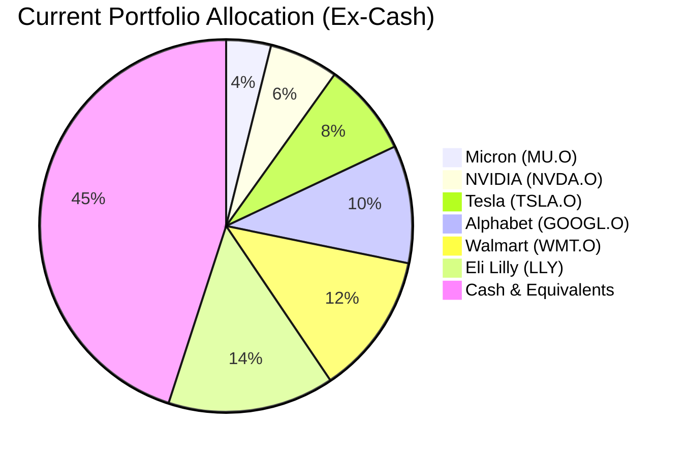
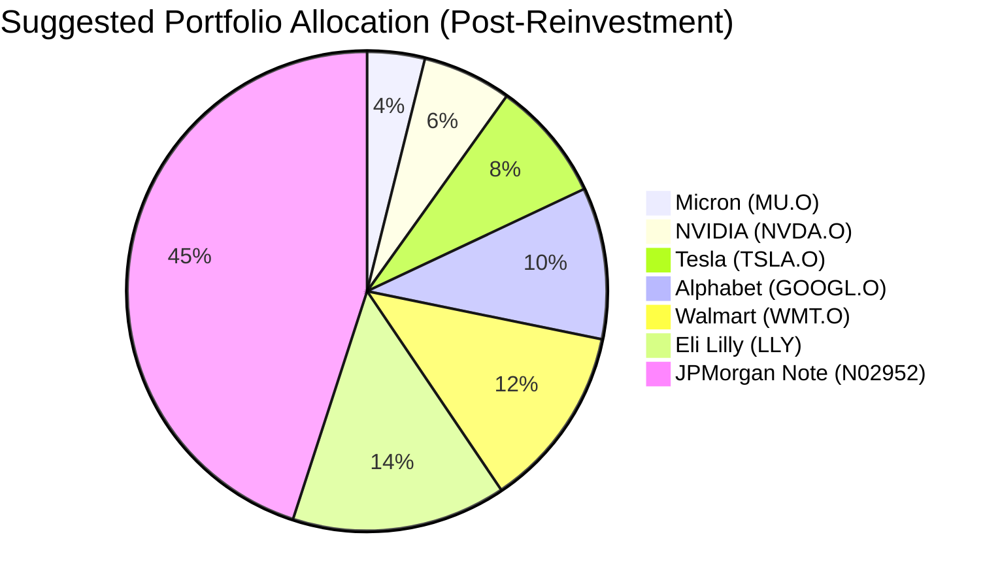

Reinvestment Analysis: "David Kim"
================================

# Executive Summary
The client's US 3-Month Treasury Bill (USD 427,500) is maturing in two weeks. We recommend reinvesting the proceeds into the **JPMorgan USD Callable Range Accrual Note (N02952)**. This product offers a significantly enhanced yield potential (5.94% p.a.) compared to short-term cash rates, while maintaining a comparable, low-risk profile through its link to the 10-Year Constant Maturity Treasury rate. This reinvestment strategy aims to improve portfolio income and total return over a 5-year horizon, aligning with the client's objective of long-term capital growth with controlled drawdown.

# Recommended Product: JPMorgan USD Callable Range Accrual Note (N02952)

## Product Specifications
*   **Issuer/Guarantor:** JPMorgan Chase Financial Company LLC / JPMorgan Chase & Co.
*   **Product ID:** N02952
*   **Currency:** USD
*   **Tenor:** 5 Years (Maturity: 08 May 2031)
*   **Minimum Investment:** USD 100,000
*   **Underlying Asset:** 10-Year Constant Maturity Treasury (CMT) Rate
*   **Accrual Coupon:** 5.94% per annum.
*   **Coupon Condition:** Coupon accrues daily only if the 10-Year CMT Rate is at or below 5.01%.
*   **Payment Frequency:** Quarterly.
*   **Call Feature:** The issuer can call the note quarterly starting 08 Nov 2026 if the 10-Year CMT Rate is at or below 4.30%.

## Performance Metrics
*   **Historical Contrast:** The maturing US 3-Month T-Bill provided a yield of approximately 4.0-4.5% with near-zero price volatility. The recommended note offers a higher potential annual coupon of 5.94%, contingent on the 10-Year CMT rate staying within a defined range. Historically, from 2019-2024, the 10-Year Treasury yield has traded within a 0.5%-4.3% band for a majority of the period, suggesting a high probability of coupon accrual under similar conditions.

## Risk Characteristics
*   **Risk Rating:** 2 (Low).
*   **Credit Risk:** Subject to the credit risk of JPMorgan Chase & Co. (AA- rated).
*   **Market Risk:** Principal is protected only if held to maturity. The primary risk is that the 10-Year CMT rate rises above 5.01%, causing coupons to stop accruing. In a worst-case scenario of sustained high rates, the investor could receive zero coupons but would still receive 100% of principal at maturity barring issuer default.
*   **Liquidity:** Low (Score 1). The product is intended to be held to maturity; early secondary market sales may result in significant loss of principal.
*   **Reinvestment Risk:** If the note is called early, the client faces reinvestment risk in a potentially lower-yield environment.

## Detailed Justification & Product-Fit Score
**Product-Fit Score: 9/10**

**Justification:**
1.  **Risk Alignment (10/10):** The maturing T-Bill has a Risk Rating of 3. The recommended note has a Risk Rating of 2, making it a suitable, like-for-low-risk replacement that aligns with the client's "Moderate" risk tolerance. Both products prioritize capital preservation.
2.  **Objective Alignment (9/10):** The client seeks "long-term capital growth with controlled drawdown." This 5-year note enhances portfolio yield significantly over cash, contributing to growth, while its structure inherently controls drawdown by protecting principal at maturity.
3.  **Income & Return Enhancement (9/10):** The 5.94% potential coupon offers a ~150-190 basis point premium over current short-term risk-free rates, directly improving the income and total return profile of the portfolio without increasing equity exposure.
4.  **Portfolio Hygiene:** Reinvesting a maturing cash holding into a product with a higher expected return improves the overall efficiency of the client's portfolio, which is currently heavily weighted toward individual US equities.

# Suggested Portfolio

| Asset | Current Market Value (USD) | Suggested Market Value (USD) | Current % | Suggested % | Change | Remark |
| :--- | :---: | :---: | :---: | :---: | :---: | :--- |
| US 3-Month Treasury Bill | 427,500 | 0 | 45.0% | 0.0% | -45.0% | Product maturing. Proceeds to be reinvested. |
| Micron Technology Inc. (MU.O) | 36,905 | 36,905 | 3.9% | 3.9% | 0.0% | No change. |
| NVIDIA Corporation (NVDA.O) | 56,976 | 56,976 | 6.0% | 6.0% | 0.0% | No change. |
| Tesla Inc. (TSLA.O) | 77,048 | 77,048 | 8.1% | 8.1% | 0.0% | No change. |
| Alphabet Inc. (GOOGL.O) | 97,119 | 97,119 | 10.2% | 10.2% | 0.0% | No change. |
| Walmart Inc. (WMT.O) | 117,190 | 117,190 | 12.3% | 12.3% | 0.0% | No change. |
| Eli Lilly and Company (LLY) | 137,261 | 137,261 | 14.5% | 14.5% | 0.0% | No change. |
| **JPMorgan Note (N02952)** | **0** | **427,500** | **0.0%** | **45.0%** | **+45.0%** | **Recommended reinvestment product.** |
| **Total** | **950,000** | **950,000** | **100%** | **100%** | **0%** | |

## Pros and cons of suggested portfolio

**Pros:**
*   **Enhanced Income & Total Return:** The portfolio's yield increases substantially by replacing a short-term T-Bill with the range accrual note, directly supporting long-term capital growth.
*   **Controlled Risk Profile:** The new holding maintains a low-risk profile (Rating 2) and provides principal protection at maturity, aligning with the need for controlled drawdown.
*   **Diversification:** Adds a structured income component to a portfolio currently concentrated in US growth equities, providing a different return driver (US interest rates vs. equity market performance).

**Cons:**
*   **Liquidity Reduction:** The client's liquidity decreases as the note is intended to be held for 5 years, unlike the maturing T-Bill. This is mitigated by the client's stable income and 12-month emergency buffer.
*   **Coupon Contingency Risk:** Returns are not guaranteed. If the 10-Year Treasury yield rises above 5.01% for extended periods, coupon payments will cease, though principal remains intact.
*   **Concentration in Financials:** The portfolio gains exposure to the credit of JPMorgan Chase & Co. Although highly rated, this is a new, concentrated credit exposure.

## Alternative suggested product to consider

1.  **Barclays FX Window Range Accrual Note (FXRA0415):** A 2-year note linked to the USD/HKD exchange rate offering an 8.02% total return (3.93% p.a.). **Justification:** Shorter duration (2 years) offers greater liquidity and less interest rate sensitivity. It is suitable if the client has a shorter time horizon or wishes to maintain more flexibility. The primary risk is a break in the USD/HKD peg, which is considered a low-probability event.
2.  **iShares 1-3 Year Treasury Bond ETF (SHY.O):** **Justification:** For a client preferring daily liquidity and transparency with minimal credit risk. With a Risk Rating of 3 and a yield of ~3.76%, it is a direct, liquid replacement for the maturing T-Bill but offers a lower return potential than the structured notes.

# Scenario Analysis
*Analysis assumes the current portfolio (with the maturing T-Bill) is held versus the suggested portfolio over a 1-year period.*

**Base Case Assumptions:** 10-Year CMT Rate averages 4.5% (within the accrual range). Equity returns based on long-term S&P 500 average of 10%. Probability: 60%.

**Upside Case Assumptions:** 10-Year CMT Rate declines to 3.8% (triggering autocall potential). Strong economic growth boosts equities by 20%. Probability: 25%.

**Downside Case Assumptions:** Recessionary fears cause 10-Year CMT Rate to spike to 5.5% (outside accrual range). Equity markets correct by -15%. Probability: 15%.

## Normal Market Condition
- Projected 10-Year CMT Rate: 4.5%. Within accrual range for JPMorgan Note.
- Projected equity returns: 10%. Based on S&P 500 long-term average (1990-2023).
- Projected cash returns (if held in T-Bill): 4.0%.

| Product | % Return | Suggested Holding (USD) | P&L (USD) | Current Holding (USD) | P&L (USD) |
| :--- | :---: | :---: | :---: | :---: | :---: |
| JPMorgan Note (N02952) | 5.94 | 427,500 | 25,394 | 0 | 0 |
| US 3-Month T-Bill | 4.00 | 0 | 0 | 427,500 | 17,100 |
| Equity Basket (Aggregate) | 10.00 | 522,500 | 52,250 | 522,500 | 52,250 |
| **Total** | **8.18%** | **950,000** | **77,644** | **950,000** | **69,350** |

*   Annual return of suggested portfolio vs current: **8.18% vs 7.30%**
*   Incremental benefit: **+USD 8,294 annually**

## Good Market Condition (Upside)
- Projected 10-Year CMT Rate: 3.8%. Triggers autocall; note redeemed at par after 1 year with accrued coupons.
- Projected equity returns: 20%. Based on strong bull market years (e.g., 2013, 2019).

| Product | % Return | Suggested Holding (USD) | P&L (USD) | Current Holding (USD) | P&L (USD) |
| :--- | :---: | :---: | :---: | :---: | :---: |
| JPMorgan Note (N02952) | 5.94 | 427,500 | 25,394 | 0 | 0 |
| US 3-Month T-Bill | 4.00 | 0 | 0 | 427,500 | 17,100 |
| Equity Basket (Aggregate) | 20.00 | 522,500 | 104,500 | 522,500 | 104,500 |
| **Total** | **13.67%** | **950,000** | **129,894** | **950,000** | **121,600** |

*   Annual return of suggested portfolio vs current: **13.67% vs 12.80%**
*   Incremental benefit: **+USD 8,294 annually** (Note: Benefit is identical to Normal case as note pays full coupon; upside is captured in equities).

## Bad Market Condition (Downside)
- Projected 10-Year CMT Rate: 5.5%. Outside accrual range, note pays **0%** coupon.
- Projected equity returns: -15%. Similar to moderate corrections (e.g., Q4 2018, Q1 2022).

| Product | % Return | Suggested Holding (USD) | P&L (USD) | Current Holding (USD) | P&L (USD) |
| :--- | :---: | :---: | :---: | :---: | :---: |
| JPMorgan Note (N02952) | 0.00 | 427,500 | 0 | 0 | 0 |
| US 3-Month T-Bill | 4.00 | 0 | 0 | 427,500 | 17,100 |
| Equity Basket (Aggregate) | -15.00 | 522,500 | -78,375 | 522,500 | -78,375 |
| **Total** | **-8.25%** | **950,000** | **-78,375** | **950,000** | **-61,275** |

*   Annual return of suggested portfolio vs current: **-8.25% vs -6.45%**
*   Incremental cost: **-USD 17,100 annually** (Represents the forgone T-Bill income in a scenario where the note pays zero).

# Risk disclosures
- **Past performance does not guarantee future returns.** The historical behavior of interest rates is not a reliable indicator of the future performance of the range accrual note.
- **Projected returns are estimates, not promises.** The 5.94% p.a. coupon is contingent on the underlying rate staying within a specified range. Scenarios where the coupon is not paid are possible.
- **Structured products have risk of principal loss.** The JPMorgan Note is principal protected only if held to maturity. Early sale or issuer default could result in a loss of some or all of the invested capital.

# References
- **Client Profile:** David-client_profile.md, client_list.csv
- **Product Catalog:** CMT_note_N02952.md, FXRA0415.md, demo-market-quotes.csv
- **Web References:** N/A
