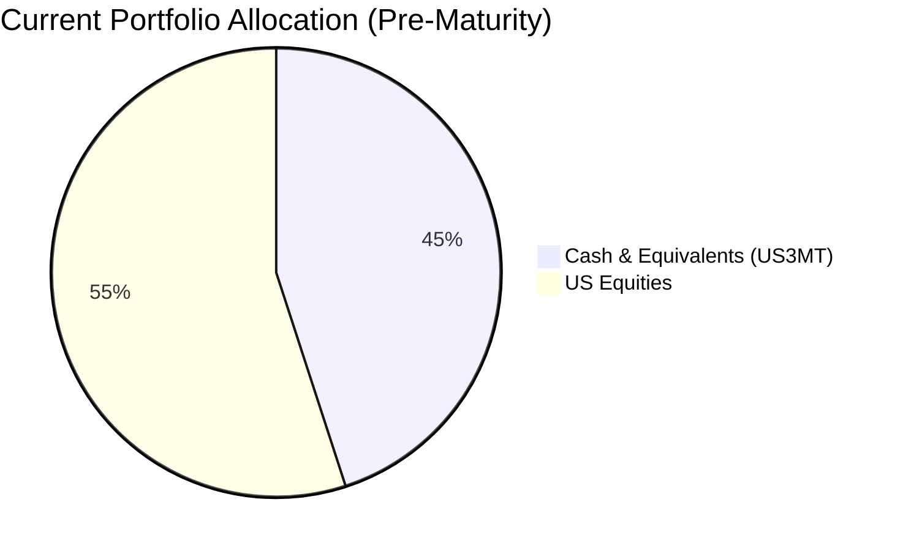
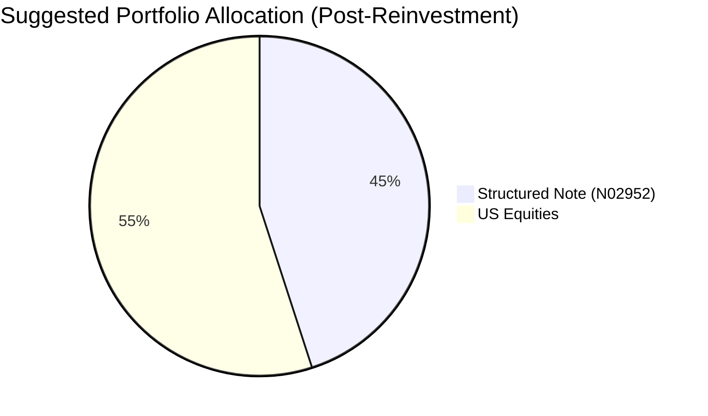

Reinvestment Analysis: "David Kim"
================================

# Executive Summary
The client's US 3-Month Treasury Bill is maturing in two weeks, releasing approximately $427,500. To maintain a moderate risk profile while enhancing long-term capital growth potential, we recommend reinvesting the proceeds into the **JPMorgan USD Callable Range Accrual Note (N02952)**. This structured product offers an attractive annualized coupon of 5.94% with a risk profile similar to the maturing Treasury Bill. This recommendation aims to improve portfolio yield and provide a stable income stream, aligning with the client's objective of long-term growth with controlled drawdown.

# Recommended Product: JPMorgan USD Callable Range Accrual Note (N02952)

**Product Specifications**
*   **Issuer/Guarantor:** JPMorgan Chase Financial Company LLC / JPMorgan Chase & Co.
*   **Product Type:** Callable Range Accrual Note
*   **Tenor:** 5 Years
*   **Currency:** USD
*   **Minimum Investment:** USD 100,000
*   **Underlying Asset:** 10-year Constant Maturity Treasury (CMT) rate
*   **Accrual Coupon:** 5.94% p.a., paid quarterly
*   **Coupon Condition:** Coupon accrues daily if the 10y CMT rate is at or below 5.01%.
*   **Autocall Feature:** The note may be automatically called quarterly starting from 08 Nov 2026 if the 10y CMT rate is at or below 4.30%, returning principal and any accrued coupon.

**Performance Metrics**
*   **Projected Annual Return:** 5.94% (if accrual condition is met).
*   **Historical Comparison:** The maturing US 3-Month Treasury Bill provided a yield of approximately 4.0-4.5% over the past year. The recommended note offers a potential yield premium of 140-190 basis points for assuming the range accrual risk, while maintaining a similar low-volatility profile.

**Risk Characteristics**
*   **Risk Rating:** 2 (Low)
*   **Principal Risk:** Principal is protected only if held to maturity. Early termination or issuer default could result in loss of principal.
*   **Credit Risk:** Subject to the credit risk of JPMorgan Chase & Co. (AA- rated).
*   **Market Risk:** Returns are contingent on the 10y US Treasury rate staying within a defined range. No coupon accrues on days the rate is above 5.01%.
*   **Liquidity:** Low (structured product, not traded on an exchange).

**Detailed Justification & Product-Fit Score**
*   **Product-Fit Score: 8.5/10**
*   **Risk Alignment:** The product's Risk Rating of 2 aligns perfectly with the client's "Moderate" risk tolerance and is similar to the maturing Treasury Bill (Rating 3), ensuring no unintended increase in portfolio risk.
*   **Return Enhancement:** Offers a significantly higher potential yield than the maturing cash instrument or short-term government bonds, directly supporting the "long-term capital growth" objective.
*   **Income Stability:** The quarterly potential coupon payments can provide a stable income stream, adding a defensive component to a portfolio currently concentrated in US equities.
*   **Time Horizon Fit:** The 5-year tenor matches the client's long-term investment horizon (child's education ~10 years away, retirement >20 years away).
*   **Portfolio Role:** Effectively redeploys cash into a yield-generating asset, reducing the portfolio's cash allocation from an elevated level while maintaining high credit quality and capital preservation focus.

# Suggested Portfolio

| Asset | Current Market Value (USD) | Suggested Market Value (USD) | Current % | Suggested % | Change | Remark |
| :--- | :---: | :---: | :---: | :---: | :---: | :--- |
| **US 3-Month Treasury Bill** | 427,500 | 0 | 45.0% | 0.0% | -45.0% | Product matured. Proceeds to be reinvested. |
| **Micron Technology Inc. (MU.O)** | 36,905 | 36,905 | 3.9% | 3.9% | 0.0% | Maintain holding. |
| **NVIDIA Corporation (NVDA.O)** | 56,976 | 56,976 | 6.0% | 6.0% | 0.0% | Maintain holding. |
| **Tesla Inc. (TSLA.O)** | 77,048 | 77,048 | 8.1% | 8.1% | 0.0% | Maintain holding. |
| **Alphabet Inc. (GOOGL.O)** | 97,119 | 97,119 | 10.2% | 10.2% | 0.0% | Maintain holding. |
| **Walmart Inc. (WMT.O)** | 117,190 | 117,190 | 12.3% | 12.3% | 0.0% | Maintain holding. |
| **Eli Lilly and Company (LLY)** | 137,261 | 137,261 | 14.5% | 14.5% | 0.0% | Maintain holding. |
| **JPMorgan Callable Accrual Note (N02952)** | 0 | **427,500** | 0.0% | **45.0%** | +45.0% | **Recommended reinvestment.** |
| **Total** | **950,000** | **950,000** | **100.0%** | **100.0%** | **0.0%** | |

## Pros and cons of suggested portfolio

**Pros:**
1.  **Enhanced Yield with Managed Risk:** The portfolio's overall yield is projected to increase significantly by replacing a low-yielding Treasury Bill with the structured note, without materially increasing the portfolio's risk rating.
2.  **Improved Asset Allocation:** Reduces the oversized cash allocation (45%) to a more strategic level, deploying idle capital into a productive, income-generating asset.
3.  **Defensive Income Stream:** Introduces a source of quarterly potential income, providing a buffer during periods of equity market volatility, which aligns with the need for "controlled drawdown."
4.  **High-Quality Credit Exposure:** Maintains exposure to a top-tier global financial institution (JPMorgan Chase & Co.), preserving credit quality.

**Cons:**
1.  **Concentration in US Assets:** The entire portfolio remains denominated in USD and heavily exposed to the US economy (equities and now a note linked to US rates). This introduces geographic concentration risk.
2.  **Reduced Liquidity:** The structured note is illiquid compared to the maturing Treasury Bill. The capital will be locked for up to 5 years unless an early autocall event occurs.
3.  **Conditional Returns:** The note's attractive coupon is not guaranteed; it depends on the 10y US Treasury rate remaining below 5.01%. In a rapidly rising rate environment, coupon accrual could be minimal or zero.
4.  **Complexity:** The product has derivative-based features (range accrual, autocall) which are more complex than a plain vanilla bond or ETF.

## Alternative suggested product to consider

1.  **iShares Core U.S. Aggregate Bond ETF (AGG):** This ETF provides broad exposure to the US investment-grade bond market. It offers high liquidity (daily trading), a current yield of ~3.83%, and a risk rating of 3. It is a simpler, more liquid alternative for maintaining fixed income exposure, though with a lower yield potential than the structured note.
2.  **FX Window Range Accrual Note (FXRA0415):** A 2-year structured note linked to the USD/HKD exchange rate, offering an 8.02% total return (3.93% p.a.). Its shorter tenor and different underlying (FX vs. rates) provide diversification. However, it introduces Hong Kong peg risk and has a similar liquidity profile to the recommended note.

# Scenario Analysis
*Analysis assumes the current portfolio is not maturing for comparison. The maturing Treasury Bill is assumed to have a 0% return in future scenarios as it is being redeemed at par.*

**Scenario Probabilities & Asset Assumptions:**
*   **Normal (50% Probability):** 10y US Treasury rates remain range-bound between 4.0% and 5.0%. This is based on the current market consensus and the Federal Reserve's projected policy path.
*   **Upside (30% Probability):** Economic growth slows, prompting the Fed to cut rates. The 10y CMT rate falls and stays below 4.30%, triggering an early autocall of the note. Assumes equity markets rise +15% (historical average during rate-cut cycles).
*   **Downside (20% Probability):** Persistent inflation forces the Fed to hike rates further. The 10y CMT rate rises above 5.01% for the majority of the observation period. Assumes equity markets correct -15% (similar to 2018 Fed tightening cycle).

## Normal Market Condition
- Projected 10y CMT Rate: 4.65% (within accrual range)
- Projected Note Return: 5.94% p.a. (full coupon accrual)
- Projected Equity Returns: 8% p.a. (5-year historical average for a broad US equity basket)

| Product | % Return | Suggested Holding | Return (USD) | Current Holding | Return (USD) |
| :--- | :---: | :---: | :---: | :---: | :---: |
| **N02952 (Note)** | 5.94% | 427,500 | 25,394 | 0 | 0 |
| **Equity Basket** | 8.00% | 522,500 | 41,800 | 522,500 | 41,800 |
| **US 3-Month T-Bill** | 0.00% | 0 | 0 | 427,500 | 0 |
| **Total** | **7.07%** | **950,000** | **67,194** | **950,000** | **41,800** |

*   **Annual return of the suggested portfolio vs current:** 7.07% vs 4.40%
*   **Incremental benefit:** +USD 25,394 annually (+61% improvement in income)

## Good Market Condition (Autocall Triggered in Year 2)
- Projected 10y CMT Rate: 4.00% (triggers autocall)
- Projected Note Return: 5.94% p.a. for 2 years, then principal returned.
- Projected Equity Returns: +15% in Year 1, +10% in Year 2.

| Product | 2-Yr Return | Suggested Holding | Return (USD) | Current Holding | Return (USD) |
| :--- | :---: | :---: | :---: | :---: | :---: |
| **N02952 (Note)** | 12.18%* | 427,500 | 52,070 | 0 | 0 |
| **Equity Basket** | 26.50% | 522,500 | 138,463 | 522,500 | 138,463 |
| **US 3-Month T-Bill** | 0.00% | 0 | 0 | 427,500 | 0 |
| **Total** | **20.06%** | **950,000** | **190,533** | **950,000** | **138,463** |
*\*5.94% annualized return for 2 years, plus returned principal.*

*   **Two-year return of the suggested portfolio vs current:** 20.06% vs 14.58%
*   **Incremental benefit:** +USD 52,070 total return (+38% improvement). Client receives principal back early for reinvestment.

## Bad Market Condition (High Rates, Equity Correction)
- Projected 10y CMT Rate: 5.50% (above accrual range)
- Projected Note Return: 0.00% p.a. (no coupon accrual).
- Projected Equity Returns: -15% p.a.

| Product | % Return | Suggested Holding | Return (USD) | Current Holding | Return (USD) |
| :--- | :---: | :---: | :---: | :---: | :---: |
| **N02952 (Note)** | 0.00% | 427,500 | 0 | 0 | 0 |
| **Equity Basket** | -15.00% | 522,500 | -78,375 | 522,500 | -78,375 |
| **US 3-Month T-Bill** | 0.00% | 0 | 0 | 427,500 | 0 |
| **Total** | **-8.25%** | **950,000** | **-78,375** | **950,000** | **-78,375** |

*   **Annual return of the suggested portfolio vs current:** -8.25% vs -8.25%
*   **Analysis:** In the downside scenario, the structured note provides no income, but the principal remains protected until maturity (barring issuer default). The portfolio loss is identical to the current portfolio because the equity component drives the negative performance, and the cash/T-bill component yields zero. The note does not amplify losses.

# Risk disclosures
- **Past performance does not guarantee future returns.** The historical performance of the underlying asset or similar products is not indicative of the future performance of this structured note.
- **Projected returns are estimates, not promises.** The 5.94% p.a. coupon is contingent on the daily observation of the 10y CMT rate. It is possible to receive little or no coupon if the rate remains above the specified range.
- **Structured products have risk of principal loss.** This product is not capital guaranteed until maturity. Early redemption, secondary market sale, or issuer default may result in a loss of part or all of the invested principal.

# References
- **Client Profile:** David-client_profile.md, client_list.csv
- **Product Catalog:** CMT_note_N02952.md, demo-market-quotes.csv
- **Web References:** N/A
