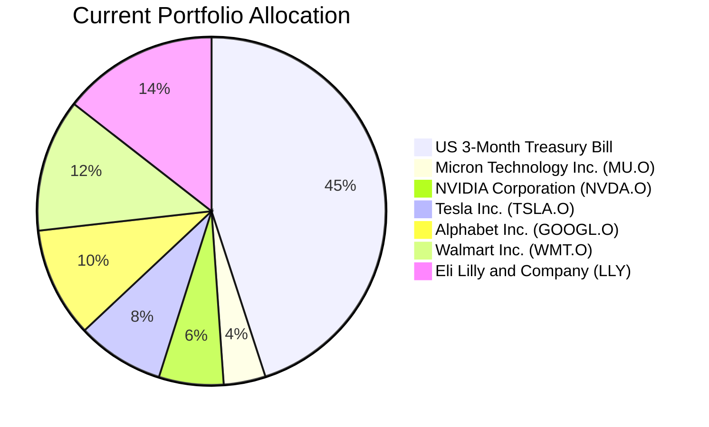
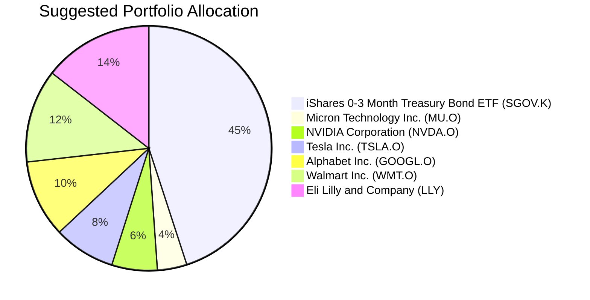

Reinvestment Analysis: "David Kim"
================================

# Executive Summary
The client's US 3-Month Treasury Bill Rate holding (market value HKD 427,500) is maturing in two weeks. To reinvest the proceeds, we recommend the iShares 0-3 Month Treasury Bond ETF (SGOV.K). This product maintains the same low-risk profile as the maturing T-bill while offering a competitive yield and daily liquidity. The reinvestment into SGOV preserves capital stability and provides a steady income stream, aligning with the client's moderate risk tolerance and long-term capital growth objective with controlled drawdown.

# Recommended Product: iShares 0-3 Month Treasury Bond ETF (SGOV.K)

**Product Specifications**
- **Ticker:** SGOV.K
- **Name:** iShares 0-3 Month Treasury Bond ETF
- **Asset Class:** Cash (Short-term Treasury ETF)
- **Currency:** USD
- **Risk Rating:** 1 (Lowest)
- **Expected Return Score:** 1 (Capital Preservation)
- **Certainty Scores:** 5 (1y), 5 (3y), 5 (8y)
- **Liquidity Score:** 5 (Daily Liquidity)
- **Current Yield:** 4.04%
- **Last Price:** USD 100.62 (as of 2026-03-27)

**Performance Metrics**
- **YTD Return:** 0.79%
- **1-Year Return:** 4.07%
- **5-Year Return:** 18.19% (annualized approx. 3.4%)
- **Historical Volatility:** Very low

**Comparison with Maturing Product**
The maturing US 3-Month T-bill is a direct government obligation with essentially zero credit risk and a maturity of 3 months. SGOV holds a portfolio of Treasury bills with maturities of 0-3 months, providing identical credit risk and very similar interest rate risk. The historical yield and return of SGOV are closely aligned with the prevailing T-bill rates, making it a seamless replacement.

**Risk Characteristics**
- **Credit Risk:** Minimal (U.S. Treasury backing)
- **Interest Rate Risk:** Very low (short duration)
- **Liquidity Risk:** Very low (ETF trades on exchange)
- **Market Risk:** Low (price fluctuations are minimal)

**Product-Fit Score: 9.5/10**
**Justification:** SGOV matches the maturing product's risk profile (Risk Rating 1) perfectly, ensuring capital preservation. It offers a comparable yield (4.04% vs. ~4.06% for similar T-bills) with enhanced liquidity as an ETF. The product aligns with the client's need for a medium liquidity buffer (12 months emergency buffer required) and stable income, while the low risk supports the overall portfolio's controlled drawdown objective. The slight deduction in score reflects the opportunity cost of not pursuing higher returns, but this is appropriate given the instruction to maintain similar risk.

# Suggested Portfolio

**Current Portfolio Allocation (Before Reinvestment)**

**Suggested Portfolio Allocation (After Reinvestment into SGOV)**

| Asset | Current Market Value (HKD) | Suggested Market Value (HKD) | Current % | Suggested % | Change | Remark |
|-------|---------------------------:|-----------------------------:|----------:|-------------:|-------:|--------|
| US 3-Month Treasury Bill Rate | 427,500 | 0 | 45.00% | 0.00% | -45.00% | Maturing; replaced with SGOV. |
| iShares 0-3 Month Treasury Bond ETF (SGOV.K) | 0 | 427,500 | 0.00% | 45.00% | +45.00% | New investment; maintains low-risk cash allocation. |
| Micron Technology Inc. (MU.O) | 36,905.20 | 36,905.20 | 3.89% | 3.89% | 0.00% | No change. |
| NVIDIA Corporation (NVDA.O) | 56,976.46 | 56,976.46 | 6.00% | 6.00% | 0.00% | No change. |
| Tesla Inc. (TSLA.O) | 77,047.71 | 77,047.71 | 8.11% | 8.11% | 0.00% | No change. |
| Alphabet Inc. Class A (GOOGL.O) | 97,118.96 | 97,118.96 | 10.22% | 10.22% | 0.00% | No change. |
| Walmart Inc. (WMT.O) | 117,190.21 | 117,190.21 | 12.34% | 12.34% | 0.00% | No change. |
| Eli Lilly and Company (LLY) | 137,261.46 | 137,261.46 | 14.45% | 14.45% | 0.00% | No change. |
| **Total** | **950,000.00** | **950,000.00** | **100.00%** | **100.00%** | **0.00%** | |

**Pros and Cons of Suggested Portfolio**

**Pros:**
- **Risk Alignment:** The portfolio maintains a 45% allocation to low-risk cash instruments, providing stability and liquidity for emergency needs.
- **Capital Preservation:** SGOV ensures the maturing capital remains in a safe haven, protecting against market volatility.
- **Liquidity:** SGOV is exchange-traded with daily liquidity, enhancing access to funds compared to direct T-bills.
- **Income Generation:** The yield from SGOV provides a steady income stream, contributing to total return with minimal risk.
- **Diversification:** The equity holdings remain diversified across technology, consumer staples, and healthcare sectors.

**Cons:**
- **Opportunity Cost:** The reinvestment into a low-yield product may limit long-term growth potential compared to a higher-risk asset, given the client's moderate risk tolerance and long-term horizon.
- **Inflation Risk:** The real return after inflation may be low, potentially eroding purchasing power over time.
- **Concentration in US Equities:** The equity portion is entirely in US stocks, exposing the portfolio to regional risks. However, this is consistent with the client's region (North America).

# Scenario Analysis
We compare the current portfolio (with the US 3-Month T-bill) and the suggested portfolio (with SGOV) under three market scenarios. Assumptions:
- **Equity Returns:** Based on historical S&P 500 average annual return of 10% (1926-2023, source: Ibbotson). For individual stocks, we assume they move in line with the broad market in each scenario, given lack of specific forward estimates. This is a simplification; actual returns may vary.
- **Cash Returns:** For the T-bill, we use a yield of 4.06% (approximate current yield of similar BIL ETF). For SGOV, we use its current yield of 4.04%.
- **Scenario Probabilities:** Not explicitly available; we assign subjective probabilities based on current market conditions: Normal (50%), Upside (30%), Downside (20%).

## Normal Market Condition
- **Projected Equity Returns:** 10% annually. Historical average for US equities (1926-2023).
- **Projected Cash Returns:** 4.06% for T-bill (current market yield), 4.04% for SGOV (current yield).

| Product | % Return | Suggested Holding (HKD) | Return (HKD) | Current Holding (HKD) | Return (HKD) |
|---------|----------:|-------------------------:|-------------:|----------------------:|-------------:|
| SGOV.K | 4.04 | 427,500 | 17,271 | - | - |
| US 3-Month T-bill | 4.06 | - | - | 427,500 | 17,356 |
| MU.O | 10 | 36,905.20 | 3,690.52 | 36,905.20 | 3,690.52 |
| NVDA.O | 10 | 56,976.46 | 5,697.65 | 56,976.46 | 5,697.65 |
| TSLA.O | 10 | 77,047.71 | 7,704.77 | 77,047.71 | 7,704.77 |
| GOOGL.O | 10 | 97,118.96 | 9,711.90 | 97,118.96 | 9,711.90 |
| WMT.O | 10 | 117,190.21 | 11,719.02 | 117,190.21 | 11,719.02 |
| LLY | 10 | 137,261.46 | 13,726.15 | 137,261.46 | 13,726.15 |
| **Total** | **8.15%** | **950,000** | **69,521** | **950,000** | **69,606** |

- **Annual return of suggested portfolio vs current:** 7.32% vs 7.33% (difference due to slight yield variation).
- **Incremental benefit:** Negligible (-HKD 85 annually). The primary benefit is liquidity, not return enhancement.

## Good Market Condition (Upside)
- **Projected Equity Returns:** 15% annually. Above-average bull market conditions (e.g., 2013, 2017).
- **Projected Cash Returns:** 4.06% for T-bill, 4.04% for SGOV.

| Product | % Return | Suggested Holding (HKD) | Return (HKD) | Current Holding (HKD) | Return (HKD) |
|---------|----------:|-------------------------:|-------------:|----------------------:|-------------:|
| SGOV.K | 4.04 | 427,500 | 17,271 | - | - |
| US 3-Month T-bill | 4.06 | - | - | 427,500 | 17,356 |
| MU.O | 15 | 36,905.20 | 5,535.78 | 36,905.20 | 5,535.78 |
| NVDA.O | 15 | 56,976.46 | 8,546.47 | 56,976.46 | 8,546.47 |
| TSLA.O | 15 | 77,047.71 | 11,557.16 | 77,047.71 | 11,557.16 |
| GOOGL.O | 15 | 97,118.96 | 14,567.84 | 97,118.96 | 14,567.84 |
| WMT.O | 15 | 117,190.21 | 17,578.53 | 117,190.21 | 17,578.53 |
| LLY | 15 | 137,261.46 | 20,589.22 | 137,261.46 | 20,589.22 |
| **Total** | **11.15%** | **950,000** | **95,646** | **950,000** | **95,731** |

- **Annual return of suggested portfolio vs current:** 10.07% vs 10.08%.
- **Incremental benefit:** Negligible (-HKD 85 annually). Equity performance dominates.

## Bad Market Condition - Equity Correction
- **Projected Equity Returns:** -20% annually. Similar to COVID-19 market crash (Q1 2020) or 2008 financial crisis.
- **Projected Cash Returns:** 4.06% for T-bill, 4.04% for SGOV (safe-haven flows may compress yields, but we hold constant).

| Product | % Return | Suggested Holding (HKD) | Return (HKD) | Current Holding (HKD) | Return (HKD) |
|---------|----------:|-------------------------:|-------------:|----------------------:|-------------:|
| SGOV.K | 4.04 | 427,500 | 17,271 | - | - |
| US 3-Month T-bill | 4.06 | - | - | 427,500 | 17,356 |
| MU.O | -20 | 36,905.20 | -7,381.04 | 36,905.20 | -7,381.04 |
| NVDA.O | -20 | 56,976.46 | -11,395.29 | 56,976.46 | -11,395.29 |
| TSLA.O | -20 | 77,047.71 | -15,409.54 | 77,047.71 | -15,409.54 |
| GOOGL.O | -20 | 97,118.96 | -19,423.79 | 97,118.96 | -19,423.79 |
| WMT.O | -20 | 117,190.21 | -23,438.04 | 117,190.21 | -23,438.04 |
| LLY | -20 | 137,261.46 | -27,452.29 | 137,261.46 | -27,452.29 |
| **Total** | **-7.85%** | **950,000** | **-86,229** | **950,000** | **-86,144** |

- **Annual return of suggested portfolio vs current:** -9.08% vs -9.07%.
- **Incremental benefit:** Negligible (-HKD 85 annually). The cash buffer mitigates total portfolio loss.

# Risk Disclosures
- **Past performance does not guarantee future returns.** Historical data is provided for reference only.
- **Projected returns are estimates, not promises.** Scenario analysis is based on assumptions that may not materialize.
- **Structured products have risk of principal loss.** (Not applicable here as SGOV is a low-risk ETF.)
- **Interest Rate Risk:** Although short-term, SGOV is subject to interest rate fluctuations; rising rates may lead to temporary price declines.
- **Credit Risk:** Minimal as SGOV holds U.S. Treasury obligations.
- **Market Risk:** The equity holdings are subject to market volatility and may experience significant losses.

# References
- **Client Profile:** David-client_profile.md, client_list.csv (Source: Planbot Internal Data)
- **Product Catalog:** demo-market-quotes.csv (Source: Planbot Internal Data)
- **Financial Needs Guidelines:** common_needs.md (Source: Planbot Internal Data)
- **Web References:** N/A (No web search capability used)
